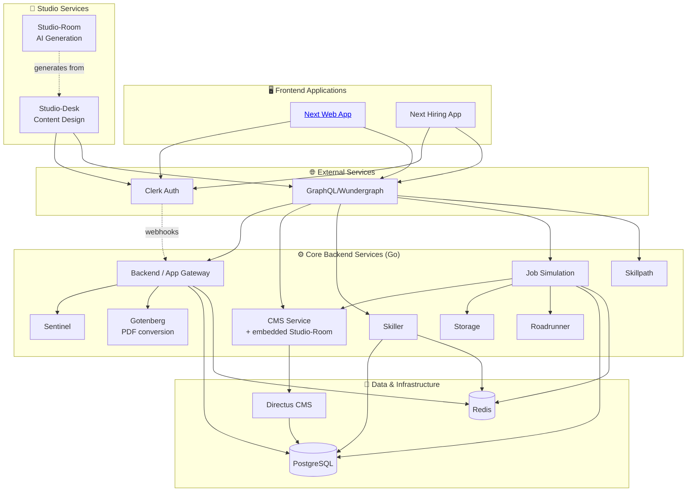

# Anthropos Architecture Overview

This document provides a high-level overview of the Anthropos platform architecture.

## High-Level Summary (For PMs & Non-Engineers)

Anthropos is a B2B SaaS skills intelligence platform that helps companies **map, verify, and develop skills** using AI-powered workplace simulations. It is composed of **three tiers of services**:

*   **Core Backend Services**: A collection of specialized Go microservices that handle the business logic. The set below is the **local `graphql` profile** — what runs after a normal `make up`. See [Service Taxonomy](./service_taxonomy.md) for the full picture (other profiles, archived services, production-only services).
    *   **Backend/App**: Main API gateway, user and organization management; also hosts the **AI-readiness** workforce subsystem (org-level AI-capability diagnostics — see [`../services/ai-readiness.md`](../services/ai-readiness.md))
    *   **Sentinel**: Security and access control (the bouncer)
    *   **Skiller/Skillpath**: Managing user skills, taxonomy (60K skills), learning-path *progress*, and vector embeddings (RAG). (Skillpath tracks per-user progression *state*; the learning-path *content* lives in CMS — see the content-vs-runtime note below.)
    *   **Jobsimulation**: Running realistic AI-powered job scenarios with voice, chat, code, and document tasks. (It *runs* the simulation; the simulation *definition* is content owned by CMS.)
    *   **CMS**: **The content layer** — owns the authored content & definitions (skill paths, simulation blueprints, the library) by wrapping Directus, plus the embedded Studio-Room AI content generation pipeline (Python, in the same container)
    *   **Storage**: File/blob storage
    *   **Roadrunner**: Code execution proxy (via Judge0 sandbox)
    *   **Gotenberg**: Office-doc → PDF conversion (used by `app`)

    Off by default (opt-in via Docker profile): **Messenger** (Brevo email), **CustomerIO Sync**.
    Archived (removed from local orchestration): Chronos, Intelligence.
    Production-only: **db-backup** (scheduled PostgreSQL backups).
*   **Studio Services**: Specialized tools for content creation:
    *   **Studio-Desk**: Web app where creators design job simulations
    *   **Studio-Room**: AI pipeline that generates content from those designs. **Embedded inside the CMS container** as `cms/studio/` (cloned via `cd cms && make init-studio`) — not a standalone deployment anymore.
*   **Standalone Internal Apps**: Independent products that reuse platform identity (Clerk) but do not depend on the backend services:
    *   **Ant Academy** (`ant-academy`): Internal learning portal (Next.js 16 + Expo mobile) for `@anthropos.work` employees. Deployed on Vercel.
*   **Frontend**: Next.js 15 applications deployed on Vercel
*   **External Services**: Third-party integrations:
    *   **Clerk**: User authentication (SaaS)
    *   **Directus**: Content storage (self-hosted)
    *   **GraphQL/Cosmo Router**: API federation gateway
    *   **AI Providers**: OpenAI, Anthropic, Mistral (EU-first routing)
    *   **LiveKit**: Real-time voice engine for simulations
    *   **AWS Chime**: Video/audio recording
    *   **PostgreSQL & Redis**: Data infrastructure

## Technical Deep Dive (For Engineers)

The Anthropos platform follows a **three-tier microservices architecture** with clear separation of concerns. See [Service Taxonomy](./service_taxonomy.md) for detailed categorization.

**Tech Stack**:
- **Backend**: Go microservices (primary), Python for AI content, TypeScript/Node.js for Studio-Desk
- **Frontend**: Next.js 15 + React 19 + TypeScript on Vercel
- **Database**: PostgreSQL RDS (Multi-AZ) with Ent ORM; each service has its own schema
- **Cache/Streams**: Redis ElastiCache (caching, pub/sub, job queues via Watermill)
- **APIs**: GraphQL Federation v2 (WunderGraph Cosmo Router), gRPC/Connect-RPC (internal), Protocol Buffers
- **Auth**: Clerk (identity) + Casbin (authorization with RBAC/ABAC via Sentinel)
- **CMS**: Directus (self-hosted, headless)
- **Infrastructure**: AWS ECS EC2 (EU-West-1 primary), Terraform IaC, Vercel (frontend)
- **CI/CD**: GitHub Actions with self-hosted EU runners; Tailscale VPN for private access
- **Monitoring**: CloudWatch, Better Stack, Sentry, PostHog

**Service Tiers** (local development reality, default `graphql` profile):
1. **Core Backend Services**: 9 Go microservices (Backend/App, Sentinel, CMS, Skiller, Skillpath, Jobsimulation, Storage, Roadrunner, Messenger when opted in) + Gotenberg (third-party PDF service) + Cosmo Router. Dockerized.
2. **Studio Services**: Studio-Desk (TypeScript, runs natively or in `studio-desk` profile); Studio-Room is now embedded in the CMS container.
3. **External Services**: Clerk, Directus, GraphQL, AI providers, LiveKit, AWS Chime
4. **Shared Libraries**: colony, authn, proto, ai, taxonomy (not deployed, imported by services)
5. **Production-only / not in local compose**: db-backup, archived Chronos/Intelligence

Services communicate via **Connect-RPC/HTTP** for synchronous operations and **Redis Streams** (via Watermill) for asynchronous messaging.



### Service Inventory

> [!NOTE]
> For detailed service categorization and deployment models, see [Service Taxonomy](./service_taxonomy.md).

#### Core Backend Services (Tier 1)

Default local development set (started by `make up`, profile `graphql`):

| Service Name | Technology | Responsibility | Documentation |
| :--- | :--- | :--- | :--- |
| **Backend** (`app`) | Go | Main API Gateway / User Backend | [→](../services/backend.md) |
| **CMS** | Go + embedded Python (studio-room) | **Content layer** — owns content & definitions (skill paths, simulation blueprints, library) via Directus + AI generation pipeline | [→](../services/cms.md) |
| **Sentinel** | Go | Authorization (Casbin RBAC/ABAC) | [→](../services/sentinel.md) |
| **Jobsimulation** | Go | **Runtime** — runs simulation *sessions*; the simulation *definition* comes from CMS by ID | [→](../services/jobsimulation.md) |
| **Skiller** | Go | Skill management, assessment, vector embeddings (RAG) | [→](../services/skiller.md) |
| **Skillpath** | Go | **Runtime** — tracks per-user progression *state*; the skill-path *content* lives in CMS | [→](../services/skillpath.md) |
| **Storage** | Go | File/Blob storage management | [→](../services/storage.md) |
| **Roadrunner** | Go | Code execution proxy to Judge0 sandbox | [→](../services/roadrunner.md) |
| **Gotenberg** | Third-party (Go) | Office-doc → PDF conversion | [→](../services/gotenberg.md) |

> [!IMPORTANT]
> **Content vs. runtime state — a split-ownership model.** The platform separates the **content layer** (CMS, which wraps Directus) from the **per-domain runtime/session services**. They are easy to conflate because two services share a name with their content:
> - **CMS owns CONTENT / DEFINITIONS** — the authored, versioned, published artifacts: skill paths (title, cover, curators, library categories, **chapters → steps**, skills-to-verify, settings), job-simulation *blueprints* (the `simulations` Directus collection + the Studio `StudioDocument`/`StudioTask` authoring model), and the content **library**. Served via CMS GraphQL/RPC (Frontend/Studio → CMS GraphQL → business logic → Redis cache → Directus → Postgres).
> - **`skillpath` and `jobsimulation` own RUNTIME / SESSION / PROGRESS STATE** and reference CMS content **by ID only** — they hold no content. `skillpath` tracks `SkillPathSession → ChapterSession → StepSession` (it fetches the path structure from CMS via `CMS_RPC_ADDR`); `jobsimulation` runs the interactive session and emits completion events (it fetches the simulation definition from CMS via `cms.GetSimulation` Connect-RPC).
>
> So **"skillpath" the service ≠ skill-path content; "jobsimulation" the service ≠ simulation content.** Content = CMS/Directus; the like-named service = the runtime state machine over that content. See [CMS](../services/cms.md), [Skillpath](../services/skillpath.md), and [Jobsimulation](../services/jobsimulation.md).

Available but off by default (opt-in via Docker profile):

| Service Name | Profile | Responsibility | Documentation |
| :--- | :--- | :--- | :--- |
| **Messenger** | `messenger` | Email notifications via Brevo (Sendinblue) | [→](../services/messenger.md) |
| **CustomerIO Sync** | `customerio-sync` | Background data sync to Customer.io | [→](../services/customerio-sync.md) |

Production-only (deployed but not in local docker-compose):

| Service Name | Technology | Responsibility | Documentation |
| :--- | :--- | :--- | :--- |
| **db-backup** | Go | Scheduled PostgreSQL backups (every 6h) to S3, Azure, Hetzner | [→](../services/db-backup.md) |

Archived (removed from local orchestration; repos still exist):

| Service Name | Status | Documentation |
| :--- | :--- | :--- |
| **Chronos** | Removed via platform commit `045857c` | [→](../services/chronos.md) |
| **Intelligence** | Removed via platform commit `fdfa189` | [→](../services/intelligence.md) |

#### Shared Libraries (Not Deployed)

> Imported as private Go modules — **not** cloned by `make init`. Full reference: [Shared Libraries](./shared_libraries.md).

| Library | Purpose |
| :--- | :--- |
| **colony** | Platform framework: logging+Sentry, DB/Redis helpers, GraphQL/RPC servers, middleware, pub/sub (Watermill); also contains `authn` |
| **proto** | Protobuf definitions (single source of truth for RPC contracts) + hand-written domain types |
| **ai** | AI provider wrapper behind one `ai.AI` interface (OpenAI, Azure, Anthropic, **Bedrock**, Mistral). Cost tracking & EU-first routing live in the **consumers**, not this lib |
| **authn** | Clerk JWT authentication — now shipped **inside colony** as `colony/authn` (standalone repo is legacy) |
| **taxonomy** | **node-id library** (`NodeID` type + ID generation/validation) — **not** a dataset; the 60K-skill/18K-role data lives in skiller |

#### Studio Services (Tier 2)

| Service Name | Technology | Responsibility | Documentation |
| :--- | :--- | :--- | :--- |
| **Studio-Desk** | TypeScript, Vite, Express | Content design tool for creating simulation blueprints | [→](../services/studio-desk.md) |
| **Studio-Room** | Python, Asyncio | AI-powered content generation pipeline | [→](../services/studio-room.md) |

#### External Services (Tier 3)

| Service Name | Type | Responsibility | Documentation |
| :--- | :--- | :--- | :--- |
| **Clerk** | SaaS | User authentication & organization management | [→](../services/clerk-integration.md) |
| **Directus** | Docker (self-hosted) | Headless CMS for content storage | [→](./external_services.md#directus-headless-cms) |
| **GraphQL/Cosmo Router** | Docker (configured) | Apollo Federation v2 gateway (5 subgraphs: app, skiller, jobsimulation, cms, skillpath) | [→](../services/graphql-wundergraph.md) |

#### Frontend Applications

| Application | Technology | Purpose | Documentation |
| :--- | :--- | :--- | :--- |
| **Next Web App** | Next.js 15 | Main user-facing application (Workforce + Hiring) | [→](../services/next-web-app.md) |
| **Hiring App** | Next.js | Recruiting & hiring workflows | [→](./frontend_architecture.md) |
| **Mobile App** | Expo/React Native | Mobile experience | [→](./frontend_architecture.md) |
| **Ant Academy** | Next.js 16 + Expo | Internal learning portal for `@anthropos.work` employees (standalone, Vercel-deployed) | [→](../services/ant-academy.md) |

### Communication Patterns

#### Core Services ↔ Core Services
*   **Synchronous**: Connect-RPC/HTTP endpoints (configured via `*_RPC_ADDR` env vars)
*   **Asynchronous**: Redis Streams for event-driven messaging (via Watermill pub/sub library)

#### Frontend/Studio → Backend
*   **Primary**: GraphQL via Cosmo Router (Apollo Federation v2 with 5 subgraphs)
*   **Direct**: Some services expose REST endpoints for specific use cases

#### External Service Integration
*   **Clerk**: SDK-based (frontend) + JWT middleware (backend via `authn` library)
*   **Directus**: Proxied via CMS service (business logic layer)
*   **GraphQL**: Cosmo Router aggregates 5 subgraph services (app, skiller, jobsimulation, cms, skillpath) into federated schema
*   **AI Providers**: EU-first routing — Azure OpenAI (EU) → AWS Bedrock (EU) → Mistral (EU) → OpenAI Direct (US fallback)

For detailed integration patterns, see [External Services](./external_services.md).

### Request Flow

A typical API request follows this path:

```
User → Vercel (Next.js) → Clerk (JWT) → ALB → Cosmo Router (port 5050)
  → Subgraph service (app/skiller/jobsim/cms/skillpath)
    → gRPC to internal services (sentinel, storage, roadrunner, ...)
    → Redis Streams for async events
```

### Multi-Tenancy

The platform uses **shared database, shared schema** with `organization_id` on every table. Data isolation is enforced at three layers:

1. **Database**: `organization_id` foreign key on all tables; Ent ORM policies auto-filter queries
2. **Authorization**: Sentinel (Casbin RBAC/ABAC) validates every API request
3. **Identity**: Clerk JWT includes org context; sessions are org-scoped

For detailed integration patterns, see [External Services](./external_services.md).

### Data Architecture & Schema Management

The platform uses a **Code-First** approach to data management, relying on strictly typed schemas in Go.

#### 1. Data Modeling (Ent)
*   **ORM**: We use [Ent](https://entgo.io/) as our Entity Framework.
*   **Definition**: Schemas are defined in Go code within `internal/data/ent/schema` or `internal/ent/schema`.
*   **Source of Truth**: The Go code is the single source of truth for the database structure.

#### 2. Schema Management (Atlas)
*   **Tooling**: We use [Atlas](https://atlasgo.io/) to manage database migrations.
*   **Workflow**:
    1.  **Define**: Engineers modify Ent schemas in Go.
    2.  **Generate**: `make gen` runs Ent codegen to update the Go client.
    3.  **Migration Diff**: Atlas compares the Go schema against the migration directory to create a new `.sql` migration plan.
    4.  **Apply**: `atlas migrate apply` executes pending migrations against the target database.

#### 3. Database Separation
Although all services may share a physical PostgreSQL instance (in dev/docker), they are logically separated by **PostgreSQL Schemas** (source: `platform/repos.yml` `schema:` field for services with `migrations: true`):
*   `backend` service → `public` schema
*   `cms` service → `cms` schema
*   `jobsimulation` service → `jobsimulation` schema
*   `skiller` service → `skiller` schema
*   `skillpath` service → `skillpath` schema
*   `sentinel` service → `sentinel` schema (created manually during setup; sentinel does not run migrations)
*   `extensions` schema → houses `pgvector` extension (required by skiller embeddings)

> [!IMPORTANT]
> **Manual Setup Required**: The platform does *not* automatically apply migrations on startup (to prevent accidental production overrides). Developers must run `atlas migrate apply` manually when setting up a fresh environment or pulling schema changes.

### Infrastructure & Deployment

*   **Cloud**: AWS ECS EC2 (EU-West-1 primary); Vercel for frontend
*   **Networking**: VPC (10.0.0.0/16) with Multi-AZ; public subnets (ALB, Cosmo Router), private subnets (all microservices)
*   **IaC**: Terraform for all infrastructure provisioning
*   **CI/CD**: GitHub Actions with self-hosted EU runners; Tailscale VPN for private subnet access; Git tags trigger deployments
*   **Monitoring**: CloudWatch (metrics, dashboards, alarms), Sentry (errors, performance, cron monitoring), PostHog (analytics), Better Stack (incident escalation, uptime)
*   **Backups**: Full DB backups every 6 hours to S3, Azure, and Hetzner (Germany); RDS point-in-time recovery
*   **Health**: ECS health checks every 30 seconds with automated rollback on failure

For security, compliance, and data protection details, see [Security & Compliance](./security_compliance.md).
For AI model inventory, provider routing, and voice/recording architecture, see [AI Architecture](./ai_architecture.md).
