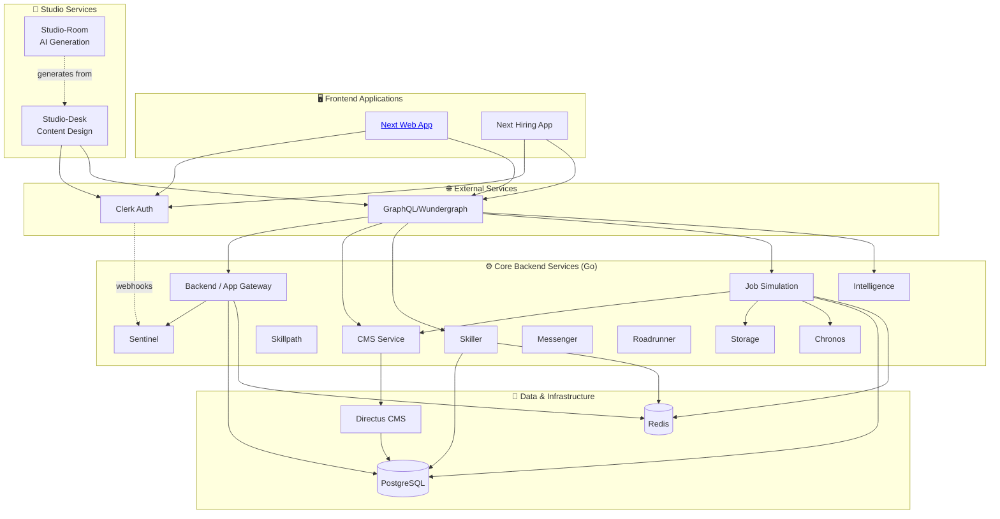

# Anthropos Architecture Overview

This document provides a high-level overview of the Anthropos platform architecture.

## High-Level Summary (For PMs & Non-Engineers)

Anthropos is a B2B SaaS skills intelligence platform that helps companies **map, verify, and develop skills** using AI-powered workplace simulations. It is composed of **three tiers of services**:

*   **Core Backend Services**: A collection of specialized Go microservices that handle the business logic:
    *   **Backend/App**: Main API gateway, user and organization management
    *   **Sentinel**: Security and access control (the bouncer)
    *   **Skiller/Skillpath**: Managing user skills, taxonomy (60K skills), and learning paths
    *   **Jobsimulation**: Running realistic AI-powered job scenarios with voice, chat, code, and document tasks
    *   **CMS**: Content management and Directus integration
    *   **Chronos**: Timer scheduling and delayed events
    *   **Storage**: File/blob storage
    *   **Intelligence**: Background data sync between services
    *   **Messenger**: Email notifications (via Brevo/Sendinblue)
    *   **Roadrunner**: Code execution proxy (via Judge0 sandbox)
    *   **db-backup**: Scheduled PostgreSQL backups
*   **Studio Services**: Specialized tools for content creation:
    *   **Studio-Desk**: Web app where creators design job simulations
    *   **Studio-Room**: AI pipeline that generates content from those designs
*   **Frontend**: Next.js 14 applications deployed on Vercel
*   **External Services**: Third-party integrations:
    *   **Clerk**: User authentication (SaaS)
    *   **Directus**: Content storage (self-hosted)
    *   **GraphQL/Cosmo Router**: API federation gateway
    *   **AI Providers**: OpenAI, Anthropic, Mistral (EU-first routing)
    *   **LiveKit**: Real-time voice engine for simulations
    *   **AWS Chime**: Video/audio recording
    *   **PostgreSQL & Redis**: Data infrastructure

## Technical Deep Dive (For Engineers)

The Anthropos platform follows a **three-tier microservices architecture** with clear separation of concerns. See [Service Taxonomy](./service_taxonomy.md) for detailed categorization.

**Tech Stack**:
- **Backend**: Go microservices (primary), Python for AI content, TypeScript/Node.js for Studio-Desk
- **Frontend**: Next.js 14 + TypeScript on Vercel
- **Database**: PostgreSQL RDS (Multi-AZ) with Ent ORM; each service has its own schema
- **Cache/Streams**: Redis ElastiCache (caching, pub/sub, job queues via Watermill)
- **APIs**: GraphQL Federation v2 (WunderGraph Cosmo Router), gRPC/Connect-RPC (internal), Protocol Buffers
- **Auth**: Clerk (identity) + Casbin (authorization with RBAC/ABAC via Sentinel)
- **CMS**: Directus (self-hosted, headless)
- **Infrastructure**: AWS ECS EC2 (EU-West-1 primary), Terraform IaC, Vercel (frontend)
- **CI/CD**: GitHub Actions with self-hosted EU runners; Tailscale VPN for private access
- **Monitoring**: CloudWatch, Better Stack, Sentry, PostHog

**Service Tiers**:
1. **Core Backend Services**: 12 Go microservices (dockerized)
2. **Studio Services**: 2 custom applications for content creation (TypeScript + Python)
3. **External Services**: Clerk, Directus, GraphQL, AI providers, LiveKit, AWS Chime
4. **Shared Libraries**: colony, authn, proto, ai, taxonomy (not deployed, imported by services)

Services communicate via **Connect-RPC/HTTP** for synchronous operations and **Redis Streams** (via Watermill) for asynchronous messaging.



### Service Inventory

> [!NOTE]
> For detailed service categorization and deployment models, see [Service Taxonomy](./service_taxonomy.md).

#### Core Backend Services (Tier 1)

| Service Name | Technology | Responsibility | Documentation |
| :--- | :--- | :--- | :--- |
| **Backend** (`app`) | Go | Main API Gateway / User Backend | [→](../services/backend.md) |
| **CMS** | Go | Content Management / Directus Proxy | [→](../services/cms.md) |
| **Sentinel** | Go | Authorization & Authentication | [→](../services/sentinel.md) |
| **Jobsimulation** | Go | Job environments & task simulation | [→](../services/jobsimulation.md) |
| **Skiller** | Go | Skill management & assessment | [→](../services/skiller.md) |
| **Skillpath** | Go | Skill progression paths | [→](../services/skillpath.md) |
| **Storage** | Go | File/Blob storage management | [→](../services/storage.md) |
| **Chronos** | Go | Scheduling & time-based events | [→](../services/chronos.md) |
| **Intelligence** | Go | Background data sync between backend and skiller schemas | [→](../services/intelligence.md) |
| **Messenger** | Go | Email notifications via Brevo (Sendinblue) | [→](../services/messenger.md) |
| **Roadrunner** | Go | Code execution proxy to Judge0 sandbox | [→](../services/roadrunner.md) |
| **db-backup** | Go | Scheduled PostgreSQL backups (every 6h) to S3, Azure, Hetzner | [→](../services/db-backup.md) |

#### Shared Libraries (Not Deployed)

| Library | Purpose |
| :--- | :--- |
| **colony** | Platform framework: logging, DB/Redis helpers, middleware, pub/sub (Watermill) |
| **authn** | Clerk JWT authentication middleware |
| **proto** | Protobuf definitions (single source of truth for RPC contracts) |
| **ai** | Unified AI provider wrapper (OpenAI, Anthropic, Mistral, Azure) with cost tracking |
| **taxonomy** | Skills taxonomy data (60K skills, 18K roles) |

#### Studio Services (Tier 2)

| Service Name | Technology | Responsibility | Documentation |
| :--- | :--- | :--- | :--- |
| **Studio-Desk** | TypeScript, Vite, Express | Content design tool for creating simulation blueprints | [→](../services/studio-desk.md) |
| **Studio-Room** | Python, Asyncio | AI-powered content generation pipeline | [→](../services/studio-room.md) |

#### External Services (Tier 3)

| Service Name | Type | Responsibility | Documentation |
| :--- | :--- | :--- | :--- |
| **Clerk** | SaaS | User authentication & organization management | [→](./external_services.md#clerk-authentication-service) |
| **Directus** | Docker (self-hosted) | Headless CMS for content storage | [→](./external_services.md#directus-headless-cms) |
| **GraphQL/Cosmo Router** | Docker (configured) | Apollo Federation v2 gateway (5 subgraphs: app, skiller, jobsimulation, cms, skillpath) | [→](./external_services.md#graphqlwundergraph-api-gateway) |

#### Frontend Applications

| Application | Technology | Purpose | Documentation |
| :--- | :--- | :--- | :--- |
| **Next Web App** | Next.js | Main user-facing application | [→](./frontend_architecture.md) |
| **Hiring App** | Next.js | Recruiting & hiring workflows | [→](./frontend_architecture.md) |
| **Mobile App** | Expo/React Native | Mobile experience | [→](./frontend_architecture.md) |

### Communication Patterns

#### Core Services ↔ Core Services
*   **Synchronous**: Connect-RPC/HTTP endpoints (configured via `*_RPC_ADDR` env vars)
*   **Asynchronous**: Redis Streams for event-driven messaging (via Watermill pub/sub library)

#### Frontend/Studio → Backend
*   **Primary**: GraphQL via Cosmo Router (Apollo Federation v2 with 5 subgraphs)
*   **Direct**: Some services expose REST endpoints for specific use cases

#### External Service Integration
*   **Clerk**: SDK-based (frontend) + JWT middleware (backend via `authn` library)
*   **Directus**: Proxied via CMS service (business logic layer)
*   **GraphQL**: Cosmo Router aggregates 5 subgraph services (app, skiller, jobsimulation, cms, skillpath) into federated schema
*   **AI Providers**: EU-first routing — Azure OpenAI (EU) → AWS Bedrock (EU) → Mistral (EU) → OpenAI Direct (US fallback)

For detailed integration patterns, see [External Services](./external_services.md).

### Request Flow

A typical API request follows this path:

```
User → Vercel (Next.js) → Clerk (JWT) → ALB → Cosmo Router (port 5050)
  → Subgraph service (app/skiller/jobsim/cms/skillpath)
    → gRPC to internal services (sentinel, chronos, storage, messenger, roadrunner)
    → Redis Streams for async events
```

### Multi-Tenancy

The platform uses **shared database, shared schema** with `organization_id` on every table. Data isolation is enforced at three layers:

1. **Database**: `organization_id` foreign key on all tables; Ent ORM policies auto-filter queries
2. **Authorization**: Sentinel (Casbin RBAC/ABAC) validates every API request
3. **Identity**: Clerk JWT includes org context; sessions are org-scoped

For detailed integration patterns, see [External Services](./external_services.md).

### Data Architecture & Schema Management

The platform uses a **Code-First** approach to data management, relying on strictly typed schemas in Go.

#### 1. Data Modeling (Ent)
*   **ORM**: We use [Ent](https://entgo.io/) as our Entity Framework.
*   **Definition**: Schemas are defined in Go code within `internal/data/ent/schema` or `internal/ent/schema`.
*   **Source of Truth**: The Go code is the single source of truth for the database structure.

#### 2. Schema Management (Atlas)
*   **Tooling**: We use [Atlas](https://atlasgo.io/) to manage database migrations.
*   **Workflow**:
    1.  **Define**: Engineers modify Ent schemas in Go.
    2.  **Generate**: `make gen` runs Ent codegen to update the Go client.
    3.  **Migration Diff**: Atlas compares the Go schema against the migration directory to create a new `.sql` migration plan.
    4.  **Apply**: `atlas migrate apply` executes pending migrations against the target database.

#### 3. Database Separation
Although all services may share a physical PostgreSQL instance (in dev/docker), they are logically separated by **PostgreSQL Schemas**:
*   `backend` service → `public` schema
*   `cms` service → `cms` schema
*   `jobsimulation` service → `jobsimulation` schema
*   `skiller` service → `skiller` schema
*   `skillpath` service → `skillpath` schema
*   `sentinel` service → `sentinel` schema
*   `chronos` service → `chronos` schema

> [!IMPORTANT]
> **Manual Setup Required**: The platform does *not* automatically apply migrations on startup (to prevent accidental production overrides). Developers must run `atlas migrate apply` manually when setting up a fresh environment or pulling schema changes.

### Infrastructure & Deployment

*   **Cloud**: AWS ECS EC2 (EU-West-1 primary); Vercel for frontend
*   **Networking**: VPC (10.0.0.0/16) with Multi-AZ; public subnets (ALB, Cosmo Router), private subnets (all microservices)
*   **IaC**: Terraform for all infrastructure provisioning
*   **CI/CD**: GitHub Actions with self-hosted EU runners; Tailscale VPN for private subnet access; Git tags trigger deployments
*   **Monitoring**: CloudWatch (metrics, dashboards, alarms), Sentry (errors, performance, cron monitoring), PostHog (analytics), Better Stack (incident escalation, uptime)
*   **Backups**: Full DB backups every 6 hours to S3, Azure, and Hetzner (Germany); RDS point-in-time recovery
*   **Health**: ECS health checks every 30 seconds with automated rollback on failure

For security, compliance, and data protection details, see [Security & Compliance](./security_compliance.md).
For AI model inventory, provider routing, and voice/recording architecture, see [AI Architecture](./ai_architecture.md).
