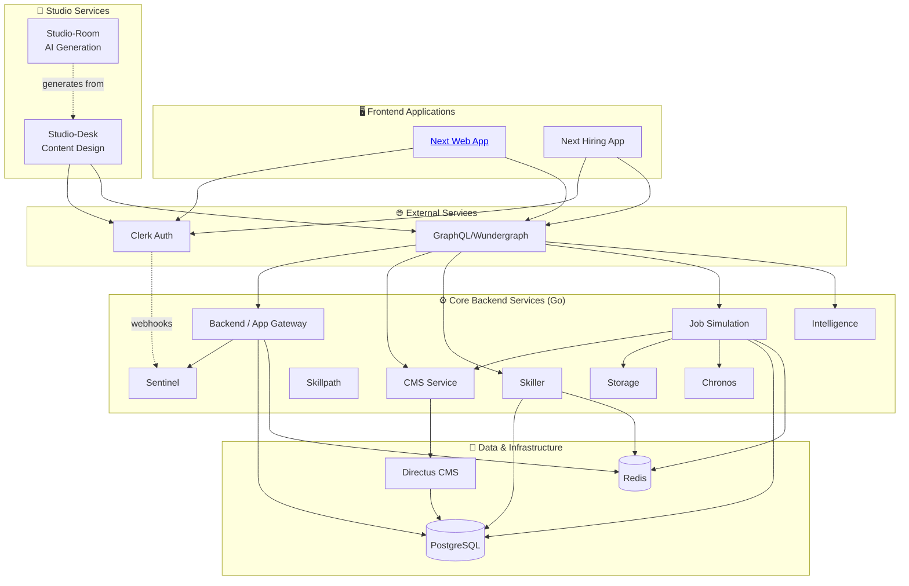

# Anthropos Architecture Overview

This document provides a high-level overview of the Anthropos platform architecture, reversed engineered from the codebase and configuration files.

## High-Level Summary (For PMs & Non-Engineers)

Anthropos is a comprehensive platform composed of **three tiers of services**:

*   **Core Backend Services**: A collection of specialized Go microservices that handle the business logic:
    *   **Sentinel**: Security and access control (the bouncer)
    *   **Skiller/Skillpath**: Managing user skills and learning paths
    *   **Jobsimulation**: Running realistic job scenarios
    *   **CMS**: Content management and Directus integration
    *   **Intelligence**: AI/ML capabilities
*   **Studio Services**: Specialized tools for content creation:
    *   **Studio-Desk**: Web app where creators design job simulations
    *   **Studio-Room**: AI pipeline that generates content from those designs
*   **Frontend**: Next.js applications providing the user interface
*   **External Services**: Third-party integrations:
    *   **Clerk**: User authentication (SaaS)
    *   **Directus**: Content storage (self-hosted)
    *   **PostgreSQL & Redis**: Data infrastructure

## Technical Deep Dive (For Engineers)

The Anthropos platform follows a **three-tier microservices architecture** with clear separation of concerns. See [Service Taxonomy](./service_taxonomy.md) for detailed categorization.

**Service Tiers**:
1. **Core Backend Services**: 9 Go microservices (dockerized)
2. **Studio Services**: 2 custom applications for content creation (TypeScript + Python)
3. **External Services**: 3 integrations (Clerk, Directus, GraphQL)

Services communicate via **RPC/HTTP** for synchronous operations and **Redis Streams** for asynchronous messaging.

### Service Inventory

> [!NOTE]
> For detailed service categorization and deployment models, see [Service Taxonomy](./service_taxonomy.md).

#### Core Backend Services (Tier 1)

| Service Name | Technology | Responsibility | Documentation |
| :--- | :--- | :--- | :--- |
| **Backend** (`app`) | Go | Main API Gateway / User Backend | [→](../services/backend.md) |
| **CMS** | Go | Content Management / Directus Proxy | [→](../services/cms.md) |
| **Sentinel** | Go | Authorization & Authentication | [→](../services/sentinel.md) |
| **Jobsimulation** | Go | Job environments & task simulation | [→](../services/jobsimulation.md) |
| **Skiller** | Go | Skill management & assessment | [→](../services/skiller.md) |
| **Skillpath** | Go | Skill progression paths | [→](../services/skillpath.md) |
| **Storage** | Go | File/Blob storage management | [→](../services/storage.md) |
| **Chronos** | Go | Scheduling & time-based events | [→](../services/chronos.md) |
| **Intelligence** | Go | AI/ML integration layer | [→](../services/intelligence.md) |

#### Studio Services (Tier 2)

| Service Name | Technology | Responsibility | Documentation |
| :--- | :--- | :--- | :--- |
| **Studio-Desk** | TypeScript, Vite, Express | Content design tool for creating simulation blueprints | [→](../services/studio-desk.md) |
| **Studio-Room** | Python, Asyncio | AI-powered content generation pipeline | [→](../services/studio-room.md) |

#### External Services (Tier 3)

| Service Name | Type | Responsibility | Documentation |
| :--- | :--- | :--- | :--- |
| **Clerk** | SaaS | User authentication & organization management | [→](./external_services.md#clerk-authentication-service) |
| **Directus** | Docker (self-hosted) | Headless CMS for content storage | [→](./external_services.md#directus-headless-cms) |
| **GraphQL/Wundergraph** | Docker (configured) | API gateway & GraphQL federation | [→](./external_services.md#graphqlwundergraph-api-gateway) |

#### Frontend Applications

| Application | Technology | Purpose | Documentation |
| :--- | :--- | :--- | :--- |
| **Next Web App** | Next.js | Main user-facing application | [→](./frontend_architecture.md) |
| **Hiring App** | Next.js | Recruiting & hiring workflows | [→](./frontend_architecture.md) |
| **Mobile App** | Expo/React Native | Mobile experience | [→](./frontend_architecture.md) |

### Communication Patterns

#### Core Services ↔ Core Services
*   **Synchronous**: HTTP/RPC endpoints (configured via `*_RPC_ADDR` env vars)
*   **Asynchronous**: Redis Streams for event-driven messaging (via `REDIS_STREAM` configurations)

#### Frontend/Studio → Backend
*   **Primary**: GraphQL via Wundergraph (unified API gateway)
*   **Direct**: Some services expose REST endpoints for specific use cases

#### External Service Integration
*   **Clerk**: SDK-based (frontend) + middleware (backend)
*   **Directus**: Proxied via CMS service (business logic layer)
*   **GraphQL**: Aggregates all core services into federated schema

For detailed integration patterns, see [External Services](./external_services.md).

### Data Architecture & Schema Management

The platform uses a **Code-First** approach to data management, relying on strictly typed schemas in Go.

#### 1. Data Modeling (Ent)
*   **ORM**: We use [Ent](https://entgo.io/) as our Entity Framework.
*   **Definition**: Schemas are defined in Go code within `internal/data/ent/schema` or `internal/ent/schema`.
*   **Source of Truth**: The Go code is the single source of truth for the database structure.

#### 2. Schema Management (Atlas)
*   **Tooling**: We use [Atlas](https://atlasgo.io/) to manage database migrations.
*   **Workflow**:
    1.  **Define**: Engineers modify Ent schemas in Go.
    2.  **Generate**: `make gen` runs Ent codegen to update the Go client.
    3.  **Migration Diff**: Atlas compares the Go schema against the migration directory to create a new `.sql` migration plan.
    4.  **Apply**: `atlas migrate apply` executes pending migrations against the target database.

#### 3. Database Separation
Although all services may share a physical PostgreSQL instance (in dev/docker), they are logically separated by **PostgreSQL Schemas**:
*   `backend` service → `public` schema
*   `cms` service → `cms` schema
*   `jobsimulation` service → `jobsimulation` schema
*   `skiller` service → `skiller` schema

> [!IMPORTANT]
> **Manual Setup Required**: The platform does *not* automatically apply migrations on startup (to prevent accidental production overrides). Developers must run `atlas migrate apply` manually when setting up a fresh environment or pulling schema changes.
