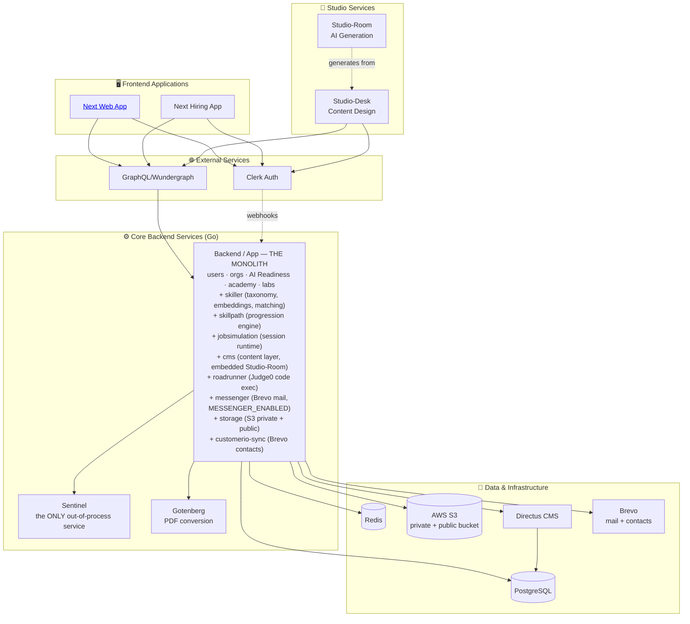

# Anthropos Architecture Overview

This document provides a high-level overview of the Anthropos platform architecture.

## High-Level Summary (For PMs & Non-Engineers)

Anthropos is a B2B SaaS skills intelligence platform that helps companies **map, verify, and develop skills** using AI-powered workplace simulations. It is composed of **three tiers of services**:

*   **Core Backend Services**: The set below is the **local `core` profile** — what runs after a normal `make up`. (`core` is the Makefile default; it was called `graphql` until platform `0dab54d` renamed it.) See [Service Taxonomy](./service_taxonomy.md) for the full picture (other profiles, archived services, production-only services).
    *   **Backend/App**: **The monolith.** Main API gateway, user and organization management; also hosts the **AI-readiness** workforce subsystem (org-level AI-capability diagnostics — see [`../services/ai-readiness.md`](../services/ai-readiness.md)), the **skill-path progression engine** (per-user `SkillPathSession` state — merged in from the former standalone skillpath service, "skillpath-in-app", platform M502→M507), the **skills taxonomy domain** since the **skiller-in-app merge (July 2026)** — 60K+ skills graph, vector embeddings (RAG), AI skill matching — the **simulation runtime** (merged jobsimulation), the **content layer + Studio** (merged cms), **Judge0 code execution** (merged roadrunner), and since **v9.0 "support-in-app"** (2026-08-04) **transactional email** (merged messenger), **S3 object storage** (merged storage) and the **Brevo marketing-contact sync** (merged customerio-sync) — plus the newer app-owned domains (course-builder, AI Labs + credits, ask-engine/Talk-to-Data, the academy store)
    *   **Sentinel**: Security and access control (the bouncer). **The only Anthropos service still running in its own process**
    *   **Gotenberg**: Office-doc → PDF conversion (used by `app`; third-party image)

    Off by default, and all three now **frozen rollback paths rather than live services** — each was folded into Backend/App at v9.0: **Storage** (`storage-legacy` profile), **Messenger** (`messenger` profile), **CustomerIO Sync** (`customerio-sync`, and still in `all`).
    Archived / merged (removed from local orchestration): Chronos, Intelligence, Skiller, Skillpath, Roadrunner, Jobsimulation, CMS.
    Production-only: **db-backup** (scheduled PostgreSQL backups).
*   **Studio Services**: Specialized tools for content creation:
    *   **Studio-Desk**: Web app where creators design job simulations
    *   **Studio-Room**: AI pipeline that generates content from those designs. **Embedded inside the `app` (backend) image** since cms-in-app — it rode in the cms container before that, and was never a standalone deployment.
*   **Standalone Internal Apps**: Independent products that reuse platform identity (Clerk) but do not depend on the backend services:
    *   **Ant Academy** (`ant-academy`): Internal learning portal (Next.js 16 + Expo mobile) for `@anthropos.work` employees. Deployed on Vercel.
*   **Frontend**: Next.js 15 applications deployed on Vercel
*   **External Services**: Third-party integrations:
    *   **Clerk**: User authentication (SaaS)
    *   **Directus**: Content storage (self-hosted)
    *   **AI Providers**: OpenAI, Anthropic, Mistral (EU-first routing)
    *   **LiveKit**: Real-time voice engine for simulations
    *   **AWS Chime**: Video/audio recording
    *   **PostgreSQL & Redis**: Data infrastructure

## Technical Deep Dive (For Engineers)

The Anthropos platform follows a **three-tier microservices architecture** with clear separation of concerns. See [Service Taxonomy](./service_taxonomy.md) for detailed categorization.

**Tech Stack**:
- **Backend**: Go microservices (primary), Python for AI content, TypeScript/Node.js for Studio-Desk
- **Frontend**: Next.js 15 + React 19 + TypeScript on Vercel
- **Database**: PostgreSQL RDS (Multi-AZ) with Ent ORM; each service has its own schema
- **Cache/Streams**: Redis ElastiCache (caching, pub/sub, job queues via Watermill)
- **APIs**: GraphQL served by `backend` itself (gqlgen — no federation, no gateway since the router's retirement on 2026-07-31), gRPC/Connect-RPC (internal), Protocol Buffers
- **Auth**: Clerk (identity) + Casbin (authorization with RBAC/ABAC via Sentinel)
- **CMS**: Directus (self-hosted, headless)
- **Infrastructure**: AWS ECS EC2 (EU-West-1 primary), Terraform IaC, Vercel (frontend)
- **CI/CD**: GitHub Actions with self-hosted EU runners; Tailscale VPN for private access
- **Monitoring**: CloudWatch, Better Stack, Sentry, PostHog

**Service Tiers** (local development reality, default `core` profile):
1. **Core Backend Services**: Backend/App (the monolith) and Sentinel + Gotenberg (third-party PDF service). Dockerized. **Five containers** — there is no GraphQL gateway container; `backend` serves GraphQL at `:8082/graphql/query`.

   **Eight** former microservices now run **inside** Backend/App: **skiller** (July 2026), **skillpath**
   ("skillpath-in-app", M502→M507), **roadrunner**, **jobsimulation** ("jobsim-in-app"), **cms**
   ("cms-in-app v8.0", app v1.360.0), and **messenger** + **storage** + **customerio-sync**
   (v9.0 "support-in-app", 2026-08-04). The federation is down to a **single subgraph**, and
   **`sentinel` is the only remaining out-of-process Anthropos service**. `chronos` and `intelligence`
   are retired.

   The v9.0 three added no GraphQL surface — they are side-effect subsystems, and both outbound ones
   are behind explicit switches (`MESSENGER_ENABLED`, `CUSTOMERIO_SYNC_ENABLED`) that are **off unless
   set by name** on a developer machine and a **boot failure if unset in a deployed environment**.
2. **Studio Services**: Studio-Desk (TypeScript, runs natively or in `studio-desk` profile); Studio-Room is now embedded in the CMS container.
3. **External Services**: Clerk, Directus, GraphQL, AI providers, LiveKit, AWS Chime
4. **Shared Libraries**: colony, authn, proto, ai, taxonomy (not deployed, imported by services)
5. **Production-only / not in local compose**: db-backup, archived Chronos/Intelligence

Services communicate via **Connect-RPC/HTTP** for synchronous operations and **Redis Streams** (via Watermill) for asynchronous messaging.


```mermaid
graph TD
    subgraph External["🌐 External Services"]
        Clerk[Clerk Auth]
        GraphQL[GraphQL/Wundergraph]
    end
    
    subgraph Frontend["🖥️ Frontend Applications"]
        Web[<a href='./frontend_architecture.md'>Next Web App</a>]
        Hiring[Next Hiring App]
    end
    
    subgraph Studio["🎨 Studio Services"]
        Desk[Studio-Desk<br/>Content Design]
        Room[Studio-Room<br/>AI Generation]
    end

    subgraph Core["⚙️ Core Backend Services (Go)"]
        Gateway["Backend / App — THE MONOLITH<br/>users · orgs · AI Readiness · academy · labs<br/>+ skiller (taxonomy, embeddings, matching)<br/>+ skillpath (progression engine)<br/>+ jobsimulation (session runtime)<br/>+ cms (content layer, embedded Studio-Room)<br/>+ roadrunner (Judge0 code exec)<br/>+ messenger (Brevo mail, MESSENGER_ENABLED)<br/>+ storage (S3 private + public)<br/>+ customerio-sync (Brevo contacts)"]
        Sentinel["Sentinel<br/>the ONLY out-of-process service"]
        Gotenberg[Gotenberg<br/>PDF conversion]
    end

    subgraph Data["💾 Data & Infrastructure"]
        Postgres[(PostgreSQL)]
        Redis[(Redis)]
        S3[(AWS S3<br/>private + public bucket)]
        Directus[Directus CMS]
        Brevo[Brevo<br/>mail + contacts]
    end
    
    %% Frontend connections
    Web --> Clerk
    Hiring --> Clerk
    Web --> GraphQL
    Hiring --> GraphQL
    
    %% Studio connections
    Desk --> Clerk
    Desk --> GraphQL
    Room -.->|generates from| Desk
    
    %% GraphQL aggregation (ONE subgraph: backend)
    GraphQL --> Gateway

    %% Core service dependencies — one inter-process edge left
    Gateway --> Sentinel
    Gateway --> Gotenberg
    Gateway --> Directus

    %% Data connections
    Gateway --> Postgres
    Gateway --> Redis
    Gateway --> S3
    Gateway --> Brevo
    Directus --> Postgres
    
    %% Clerk integration
    Clerk -.->|webhooks| Gateway
```

### Service Inventory

> [!NOTE]
> For detailed service categorization and deployment models, see [Service Taxonomy](./service_taxonomy.md).

#### Core Backend Services (Tier 1)

Default local development set (started by `make up`, profile `core` — renamed from `graphql` at platform `0dab54d`):

| Service Name | Technology | Responsibility | Documentation |
| :--- | :--- | :--- | :--- |
| **Backend** (`app`) | Go + embedded Python (studio-room) | Main API Gateway / User Backend; also owns the skills taxonomy, embeddings (RAG), and AI skill matching (merged skiller domain, July 2026) | [→](../services/backend.md) |
| **CMS** *(a domain in `app`)* | — | **Content layer** — owns content & definitions (skill paths, simulation blueprints, library) via Directus + AI generation pipeline | [→](../services/cms.md) |
| **Jobsimulation** *(a domain in `app`)* | — | **Runtime** — runs simulation *sessions*; the simulation *definition* comes from the cms domain by ID | [→](../services/jobsimulation.md) |
| **Roadrunner** *(a domain in `app`)* | — | Code execution, Judge0 called directly via `JUDGE0_BASE_URL` | [→](../services/roadrunner.md) |
| **Messenger** *(a domain in `app`)* | — | Transactional email via Brevo + the 24 event handlers, on its **own** Redis consumer group. Gated by `MESSENGER_ENABLED` | [→](../services/messenger.md) |
| **Storage** *(a domain in `app`)* | — | S3 object read/write, private + public bucket (`STORAGE_S3_BUCKET` / `STORAGE_S3_PUBLIC_BUCKET`) | [→](../services/storage.md) |
| **CustomerIO Sync** *(a domain in `app`)* | — | The 10-minute Brevo marketing-contact push, on the asynq scheduler. Gated by `CUSTOMERIO_SYNC_ENABLED` | [→](../services/customerio-sync.md) |
| **Sentinel** | Go | Authorization (Casbin RBAC/ABAC). **The only Anthropos service in its own process** | [→](../services/sentinel.md) |
| **Gotenberg** | Third-party (Go) | Office-doc → PDF conversion | [→](../services/gotenberg.md) |

> [!IMPORTANT]
> **Content vs. runtime state — a split-ownership model that SURVIVED the merge.** The platform separates the **content layer** (the cms domain, which wraps Directus) from the **runtime/session engines**. Since cms-in-app all of them live in the same process, but the ownership split is unchanged — the boundary is now a package boundary, not a network one:
> - **The cms domain owns CONTENT / DEFINITIONS** — the authored, versioned, published artifacts: skill paths (title, cover, curators, library categories, **chapters → steps**, skills-to-verify, settings), job-simulation *blueprints* (the `simulations` Directus collection + the Studio `StudioDocument`/`StudioTask` authoring model), and the content **library**. Served from `app/internal/cms/` (Frontend/Studio → backend GraphQL → business logic → Redis cache → Directus → Postgres). **Directus stays external** at `content.anthropos.work`.
> - **The skill-path and jobsimulation engines own RUNTIME / SESSION / PROGRESS STATE** and reference cms content **by ID only** — they hold no content. The **skill-path engine** tracks `SkillPathSession → ChapterSession → StepSession` (state in `public.skill_path_sessions`). **jobsimulation** runs the interactive session and emits completion events; its 23 run-state tables are in `public` too. Both fetch definitions from the cms domain **in-process** — the old `CMS_RPC_ADDR` / `cms.GetSimulation` Connect-RPC hops are gone.
>
> So **skill-path *content* ≠ the skill-path *engine*; "jobsimulation" ≠ simulation content.** Content = the cms domain/Directus; the engine/runtime = the state machine over that content. All of it now lives in `app`. See [CMS](../services/cms.md), [Skillpath](../services/skillpath.md), and [Jobsimulation](../services/jobsimulation.md).

Available but off by default (opt-in via Docker profile) — since v9.0 all three are **frozen standalone
binaries kept as rollback comparisons**, not live services. Their domains run inside `backend`:

| Service Name | Profile | Responsibility | Documentation |
| :--- | :--- | :--- | :--- |
| **Storage** | `storage-legacy` | The pre-fold standalone. Running it alongside `backend` = **two writers on one bucket** | [→](../services/storage.md) |
| **Messenger** | `messenger` | The pre-fold standalone. Dropped from `all`; running it alongside a `MESSENGER_ENABLED=true` backend = **two consumers on one Redis group** | [→](../services/messenger.md) |
| **CustomerIO Sync** | `customerio-sync`, `all` | The pre-fold standalone. Still in `all`; has **no** terraform rollback path left | [→](../services/customerio-sync.md) |

Production-only (deployed but not in local docker-compose):

| Service Name | Technology | Responsibility | Documentation |
| :--- | :--- | :--- | :--- |
| **db-backup** | Go | Scheduled PostgreSQL backups (every 6h) to S3, Azure, Hetzner | [→](../services/db-backup.md) |

Archived / merged (removed from local orchestration; repos still exist):

| Service Name | Status | Documentation |
| :--- | :--- | :--- |
| **Chronos** | Removed via platform commit `045857c` | [→](../services/chronos.md) |
| **Intelligence** | Removed via platform commit `fdfa189` | [→](../services/intelligence.md) |
| **Skiller** | Merged into Backend/App (July 2026) — repo legacy/decommissioned | [→](../services/skiller.md) |
| **Jobsimulation** | Merged into Backend/App ("jobsim-in-app") — session engine runs in `app`; the 23 run-state tables moved to `public`; ECS module kept as the rollback path, teardown **M810** | [→](../services/jobsimulation.md) |
| **CMS** | Merged into Backend/App ("cms-in-app v8.0", app v1.360.0) — content layer + Studio run in `app`; similarity/studio tables moved to `public`; supergraph 2→1, which left the router with nothing to federate (it was retired 2026-07-31); ECS module kept as the rollback path, teardown **M810** | [→](../services/cms.md) |
| **Roadrunner** | Merged into Backend/App with jobsim-in-app — `backend` calls Judge0 directly via `JUDGE0_BASE_URL` | [→](../services/roadrunner.md) |
| **Skillpath** | Merged into Backend/App then decommissioned ("skillpath-in-app", platform M502→M507) — the skill-path progression engine now runs in `app`; session state moved to `public.skill_path_sessions`; no skillpath container or subgraph | [→](../services/skillpath.md) |
| **Messenger** | Merged into Backend/App (v9.0 "support-in-app", 2026-08-04) — the mailer + its 24 handlers run in `app` behind `MESSENGER_ENABLED`, on messenger's **own** Redis consumer group. ECS module deleted; ECR repo preserved and now unmanaged in AWS. Still startable from the `messenger` compose profile as the rollback path | [→](../services/messenger.md) |
| **Storage** | Merged into Backend/App (v9.0) — `backend` reads/writes both S3 buckets directly; `STORAGE_RPC_ADDR` is gone. ECS service gone, but **`module.storage-service_euwest1` is deliberately kept**: it owns the buckets, CloudFront + OAI and the `media.anthropos.work` CNAME. Still startable from `storage-legacy` | [→](../services/storage.md) |
| **CustomerIO Sync** | Merged into Backend/App (v9.0) — the 10-minute **Brevo** contact push runs on `app`'s asynq scheduler behind `CUSTOMERIO_SYNC_ENABLED`. Terraform module deleted, ECR destroyed — **no rollback path**. Its compose entry survives (and is still in `all`) | [→](../services/customerio-sync.md) |

#### Shared Libraries (Not Deployed)

> Imported as private Go modules — **not** cloned by `make init`. Full reference: [Shared Libraries](./shared_libraries.md).

| Library | Purpose |
| :--- | :--- |
| **colony** | Platform framework: logging+Sentry, DB/Redis helpers, GraphQL/RPC servers, middleware, pub/sub (Watermill); also contains `authn` |
| **proto** | Protobuf definitions (single source of truth for RPC contracts) + hand-written domain types |
| **ai** | AI provider wrapper behind one `ai.AI` interface (OpenAI, Azure, Anthropic, **Bedrock**, Mistral). Cost tracking & EU-first routing live in the **consumers**, not this lib |
| **authn** | Clerk JWT authentication — now shipped **inside colony** as `colony/authn` (standalone repo is legacy) |
| **taxonomy** | **node-id library** (`NodeID` type + ID generation/validation) — **not** a dataset; the 60K-skill/18K-role data lives in `app`'s `public` schema (former skiller service) |

#### Studio Services (Tier 2)

| Service Name | Technology | Responsibility | Documentation |
| :--- | :--- | :--- | :--- |
| **Studio-Desk** | TypeScript, Vite, Express | Content design tool for creating simulation blueprints | [→](../services/studio-desk.md) |
| **Studio-Room** | Python, Asyncio | AI-powered content generation pipeline | [→](../services/studio-room.md) |

#### External Services (Tier 3)

| Service Name | Type | Responsibility | Documentation |
| :--- | :--- | :--- | :--- |
| **Clerk** | SaaS | User authentication & organization management | [→](../services/clerk-integration.md) |
| **Directus** | Docker (self-hosted) | Headless CMS for content storage | [→](./external_services.md#directus-headless-cms) |
| ~~**GraphQL/Cosmo Router**~~ | — | **Retired 2026-07-31.** Not an external service any more: `backend` serves GraphQL itself at `gql.anthropos.work/graphql/query` (local `:8082/graphql/query`). ECS service, target group and `wundergraph.anthropos.work` alias destroyed; repo archived; `:5050` free | [→](../services/graphql-wundergraph.md) |

#### Frontend Applications

| Application | Technology | Purpose | Documentation |
| :--- | :--- | :--- | :--- |
| **Next Web App** | Next.js 15 | Main user-facing application (Workforce + Hiring) | [→](../services/next-web-app.md) |
| **Hiring App** | Next.js | Recruiting & hiring workflows | [→](./frontend_architecture.md) |
| **Mobile App** | Expo/React Native | Mobile experience | [→](./frontend_architecture.md) |
| **Ant Academy** | Next.js 16 + Expo | Internal learning portal for `@anthropos.work` employees (standalone, Vercel-deployed) | [→](../services/ant-academy.md) |

### Communication Patterns

#### Core Services ↔ Core Services
*   **Synchronous**: Connect-RPC/HTTP endpoints (configured via `*_RPC_ADDR` env vars)
*   **Asynchronous**: Redis Streams for event-driven messaging (via Watermill pub/sub library)

#### Frontend/Studio → Backend
*   **Primary**: GraphQL straight to `backend` — `https://gql.anthropos.work/graphql/query` (local `http://localhost:8082/graphql/query`). No gateway, no supergraph
*   **Direct**: Some services expose REST endpoints for specific use cases

#### External Service Integration
*   **Clerk**: SDK-based (frontend) + JWT middleware (backend via `authn` library)
*   **Directus**: Proxied via CMS service (business logic layer)
*   **GraphQL**: `backend`'s own gqlgen endpoint. The jobsimulation and cms subgraphs were folded into it, leaving one subgraph — at which point the federation router became a pure extra hop and was **retired 2026-07-31**
*   **AI Providers**: EU-first routing — Azure OpenAI (EU) → AWS Bedrock (EU) → Mistral (EU) → OpenAI Direct (US fallback)

For detailed integration patterns, see [External Services](./external_services.md).

### Request Flow

A typical API request follows this path:

```
User → Vercel (Next.js) → Clerk (JWT) → ALB (gql.anthropos.work, priority-100 rule)
  → backend  — /graphql/query, gqlgen, served in-process (no gateway hop)
    → Connect-RPC to sentinel — the ONE remaining inter-process hop
    → in-process calls into the folded domains (cms, jobsimulation, skiller,
      skillpath, roadrunner, messenger, storage, customerio-sync)
    → direct AWS S3, Directus, Judge0, Brevo, LiveKit/Chime, AI providers
    → Redis Streams for async events; Redis/asynq for scheduled work
```

### Multi-Tenancy

The platform uses **shared database, shared schema** with `organization_id` on every table. Data isolation is enforced at three layers:

1. **Database**: `organization_id` foreign key on all tables; Ent ORM policies auto-filter queries
2. **Authorization**: Sentinel (Casbin RBAC/ABAC) validates every API request
3. **Identity**: Clerk JWT includes org context; sessions are org-scoped

For detailed integration patterns, see [External Services](./external_services.md).

### Data Architecture & Schema Management

The platform uses a **Code-First** approach to data management, relying on strictly typed schemas in Go.

#### 1. Data Modeling (Ent)
*   **ORM**: We use [Ent](https://entgo.io/) as our Entity Framework.
*   **Definition**: Schemas are defined in Go code within `internal/data/ent/schema` or `internal/ent/schema`.
*   **Source of Truth**: The Go code is the single source of truth for the database structure.

#### 2. Schema Management (Atlas)
*   **Tooling**: We use [Atlas](https://atlasgo.io/) to manage database migrations.
*   **Workflow**:
    1.  **Define**: Engineers modify Ent schemas in Go.
    2.  **Generate**: `make gen` runs Ent codegen to update the Go client.
    3.  **Migration Diff**: Atlas compares the Go schema against the migration directory to create a new `.sql` migration plan.
    4.  **Apply**: `atlas migrate apply` executes pending migrations against the target database.

#### 3. Database Separation
Although all services may share a physical PostgreSQL instance (in dev/docker), they are logically separated by **PostgreSQL Schemas** (source: `platform/repos.yml` `schema:` field for services with `migrations: true`):
*   `backend` service → `public` schema (including the skills taxonomy + embeddings ported from the old `skiller` schema, and the skill-path runtime state in `public.skill_path_sessions` ported from the old `skillpath` schema; the legacy `skiller` + `skillpath` schemas are no longer authoritative)
*   *(legacy)* `cms` schema → non-authoritative; the similarity + Studio tables moved to `public` with cms-in-app v8.0
*   *(legacy)* `jobsimulation` schema → non-authoritative; the 23 session/run tables moved to `public` with jobsim-in-app
*   *(decommissioned)* `skillpath` schema → an empty legacy husk; the skill-path runtime state moved to `public.skill_path_sessions` when the skillpath service merged into `app` (M502→M507)
*   `sentinel` service → `sentinel` schema (created manually during setup; sentinel does not run migrations)
*   `extensions` schema → houses `pgvector` extension (required by the skill/job-role embeddings, now owned by `backend`)

> [!IMPORTANT]
> **Manual Setup Required**: The platform does *not* automatically apply migrations on startup (to prevent accidental production overrides). Developers must run `atlas migrate apply` manually when setting up a fresh environment or pulling schema changes.

### Infrastructure & Deployment

*   **Cloud**: AWS ECS EC2 (EU-West-1 primary); Vercel for frontend
*   **Networking**: VPC (10.0.0.0/16) with Multi-AZ; public subnets (ALB), private subnets (all services). The Cosmo Router that used to sit in the public subnet was retired 2026-07-31
*   **IaC**: Terraform for all infrastructure provisioning
*   **CI/CD**: GitHub Actions with self-hosted EU runners; Tailscale VPN for private subnet access; Git tags trigger deployments
*   **Monitoring**: CloudWatch (metrics, dashboards, alarms), Sentry (errors, performance, cron monitoring), PostHog (analytics), Better Stack (incident escalation, uptime)
*   **Backups**: Full DB backups every 6 hours to S3, Azure, and Hetzner (Germany); RDS point-in-time recovery
*   **Health**: ECS health checks every 30 seconds with automated rollback on failure

For security, compliance, and data protection details, see [Security & Compliance](./security_compliance.md).
For AI model inventory, provider routing, and voice/recording architecture, see [AI Architecture](./ai_architecture.md).
