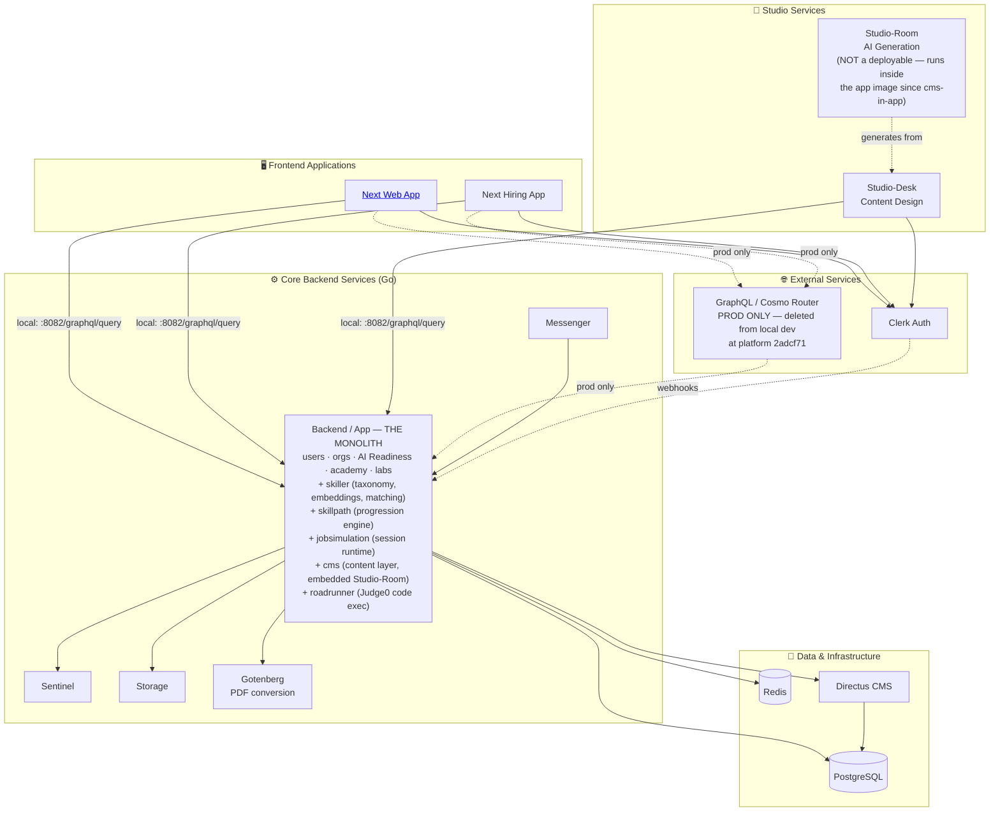

# Anthropos Architecture Overview

> **⚠️ Router status, two states (v2.8 M257x).** Platform `b56d731`+`360efd4` (merged **`2adcf71`**, 2026-07-31) **deleted the Cosmo Router from local dev** — no `graphql` compose service, no `repos.yml` entry — and re-pointed the frontends at **`backend` directly, `http://localhost:8082/graphql/query`**. **There is no `:5050` on a local stack.** In *production* the router is still declared (`graphql-wundergraph/terraform/main.tf:20` `= 1`), though **the repo is ARCHIVED on GitHub (2026-07-30)**. And the supergraph is **ONE** subgraph — `backend` — since `915da06` (2026-07-29). The fenced source of truth is [`platform-migration-status.md`](./platform-migration-status.md).


This document provides a high-level overview of the Anthropos platform architecture.

## High-Level Summary (For PMs & Non-Engineers)

Anthropos is a B2B SaaS skills intelligence platform that helps companies **map, verify, and develop skills** using AI-powered workplace simulations. It is composed of **three tiers of services**:

*   **Core Backend Services**: A collection of specialized Go microservices that handle the business logic. The set below is the **local `graphql` profile** — what runs after a normal `make up`. See [Service Taxonomy](./service_taxonomy.md) for the full picture (other profiles, archived services, production-only services).
    *   **Backend/App**: Main API gateway, user and organization management; also hosts the **AI-readiness** workforce subsystem (org-level AI-capability diagnostics — see [`../services/ai-readiness.md`](../services/ai-readiness.md)), the **skill-path progression engine** (per-user `SkillPathSession` state — merged in from the former standalone skillpath service, "skillpath-in-app", platform M502→M507), the **skills taxonomy domain** since the **skiller-in-app merge (July 2026)** — 60K+ skills graph, vector embeddings (RAG), AI skill matching — plus the newer app-owned domains (course-builder, AI Labs + credits, ask-engine/Talk-to-Data, the academy store)
    *   **Sentinel**: Security and access control (the bouncer)
    *   **Jobsimulation**: Running realistic AI-powered job scenarios with voice, chat, code, and document tasks. (It *runs* the simulation; the simulation *definition* is content owned by the cms domain. **Merged into `app`** — "jobsim-in-app"; the repo is ARCHIVED (2026-07-31) and prod desired_count is `0`. **But a standalone container still starts here:** `docker-compose.yml:83` puts it in this very `graphql` profile as an unfederated husk, until **M810**.)
    *   **CMS**: **The content layer** — owns the authored content & definitions (skill paths, simulation blueprints, the library) by wrapping Directus, plus the embedded Studio-Room AI content generation pipeline (Python — pulled into the **`app`** image by CI since cms-in-app; it rode in the cms container before the merge)
    *   **Storage**: File/blob storage
    *   **Roadrunner**: **orphaned husk** — the container still starts, but nothing calls it;
        `backend` reaches Judge0 directly (`app/internal/jobsimwiring/wiring.go:118`)
    *   **Gotenberg**: Office-doc → PDF conversion (used by `app`)

    Off by default (opt-in via Docker profile): **Messenger** (Brevo email), **CustomerIO Sync**.
    Archived (removed from local orchestration): Chronos, Intelligence.
    Production-only: **db-backup** (scheduled PostgreSQL backups).
*   **Studio Services**: Specialized tools for content creation:
    *   **Studio-Desk**: Web app where creators design job simulations
    *   **Studio-Room**: AI pipeline that generates content from those designs. **Embedded inside the `app` (backend) image** since cms-in-app — it rode in the cms container before that, and was never a standalone deployment.
*   **Standalone Internal Apps**: Independent products that reuse platform identity (Clerk) but do not depend on the backend services:
    *   **Ant Academy** (`ant-academy`): Internal learning portal (Next.js 16 + Expo mobile) for `@anthropos.work` employees. Deployed on Vercel.
*   **Frontend**: Next.js **16** applications deployed on Vercel
*   **External Services**: Third-party integrations:
    *   **Clerk**: User authentication (SaaS)
    *   **Directus**: Content storage (self-hosted)
    *   **GraphQL/Cosmo Router**: API federation gateway **(prod only — deleted from local dev at
        platform `2adcf71`)**
    *   **AI Providers**: OpenAI, Anthropic, Mistral (EU-first routing)
    *   **LiveKit**: Real-time voice engine for simulations
    *   **AWS Chime**: Video/audio recording
    *   **PostgreSQL & Redis**: Data infrastructure

## Technical Deep Dive (For Engineers)

The Anthropos platform follows a **three-tier microservices architecture** with clear separation of concerns. See [Service Taxonomy](./service_taxonomy.md) for detailed categorization.

**Tech Stack**:
- **Backend**: Go microservices (primary), Python for AI content, TypeScript/Node.js for Studio-Desk
- **Frontend**: Next.js **16** + React 19 + TypeScript on Vercel (`next: ^16.2.7` across all four apps)
- **Database**: PostgreSQL RDS (Multi-AZ) with Ent ORM. **Not a schema per service** — `app` owns `public` and is the only repo with migrations; `sentinel` keeps its own schema; `cms`/`jobsimulation`/`skillpath` are legacy husks (see the Database Separation section below)
- **Cache/Streams**: Redis ElastiCache (caching, pub/sub, job queues via Watermill)
- **APIs**: GraphQL Federation v2 (WunderGraph Cosmo Router — **prod only**; local dev talks to
  `backend` directly), gRPC/Connect-RPC (internal), Protocol Buffers
- **Auth**: Clerk (identity) + Casbin (authorization with RBAC/ABAC via Sentinel)
- **CMS**: Directus (self-hosted, headless)
- **Infrastructure**: AWS ECS EC2 (EU-West-1 primary), Terraform IaC, Vercel (frontend)
- **CI/CD**: GitHub Actions with self-hosted EU runners; Tailscale VPN for private access
- **Monitoring**: CloudWatch, Better Stack, Sentry, PostHog

**Service Tiers** (local development reality, default `graphql` profile):
1. **Core Backend Services**: Backend/App (the monolith), Sentinel, Storage + Gotenberg (third-party PDF service) — **plus the three unfederated husks the default profile still starts**: `jobsimulation` (`docker-compose.yml:83`), `cms` (`:144`) and `roadrunner` (`:281`). Messenger when opted in. Dockerized. **The Cosmo Router is no longer among them locally** — platform `2adcf71` deleted the service; it survives in production only. So a bare `make up` gives you **six Go services**, not three.

   Five former microservices now run **inside** Backend/App: **skiller** (July 2026), **skillpath**
   ("skillpath-in-app", M502→M507), **roadrunner**, **jobsimulation** ("jobsim-in-app") and **cms**
   ("cms-in-app v8.0", app v1.360.0). The federation is down to a **single subgraph**. `chronos` and
   `intelligence` are retired.
2. **Studio Services**: Studio-Desk (TypeScript, runs natively or in `studio-desk` profile); Studio-Room is embedded in the **`app` (backend) image** since cms-in-app — it was in the cms container before the merge.
3. **External Services**: Clerk, Directus, GraphQL (**prod only**), AI providers, LiveKit, AWS Chime
4. **Shared Libraries**: colony, authn, proto, ai, taxonomy (not deployed, imported by services)
5. **Production-only / not in local compose**: db-backup, archived Chronos/Intelligence

Services communicate via **Connect-RPC/HTTP** for synchronous operations and **Redis Streams** (via Watermill) for asynchronous messaging.


```mermaid
graph TD
    subgraph External["🌐 External Services"]
        Clerk[Clerk Auth]
        GraphQL["GraphQL / Cosmo Router<br/>PROD ONLY — deleted from local dev<br/>at platform 2adcf71"]
    end
    
    subgraph Frontend["🖥️ Frontend Applications"]
        Web[<a href='./frontend_architecture.md'>Next Web App</a>]
        Hiring[Next Hiring App]
    end
    
    subgraph Studio["🎨 Studio Services"]
        Desk[Studio-Desk<br/>Content Design]
        Room["Studio-Room<br/>AI Generation<br/>(NOT a deployable — runs inside<br/>the app image since cms-in-app)"]
    end

    subgraph Core["⚙️ Core Backend Services (Go)"]
        Gateway["Backend / App — THE MONOLITH<br/>users · orgs · AI Readiness · academy · labs<br/>+ skiller (taxonomy, embeddings, matching)<br/>+ skillpath (progression engine)<br/>+ jobsimulation (session runtime)<br/>+ cms (content layer, embedded Studio-Room)<br/>+ roadrunner (Judge0 code exec)"]
        Sentinel[Sentinel]
        Storage[Storage]
        Messenger[Messenger]
        Gotenberg[Gotenberg<br/>PDF conversion]
    end

    subgraph Data["💾 Data & Infrastructure"]
        Postgres[(PostgreSQL)]
        Redis[(Redis)]
        Directus[Directus CMS]
    end
    
    %% Frontend connections
    Web --> Clerk
    Hiring --> Clerk
    Web -.->|prod only| GraphQL
    Hiring -.->|prod only| GraphQL
    Web -->|local: :8082/graphql/query| Gateway
    Hiring -->|local: :8082/graphql/query| Gateway
    
    %% Studio connections
    Desk --> Clerk
    Desk -->|local: :8082/graphql/query| Gateway
    Room -.->|generates from| Desk
    
    %% Router aggregation — PROD ONLY. ONE subgraph: backend (cms folded in at 915da06, jobsimulation earlier).
    %% Locally there is no router at all: the frontends and studio-desk hit Gateway directly (edges above).
    GraphQL -.->|prod only| Gateway

    %% Core service dependencies
    Gateway --> Sentinel
    Gateway --> Gotenberg
    Gateway --> Storage
    Gateway --> Directus
    Messenger --> Gateway

    %% Data connections
    Gateway --> Postgres
    Gateway --> Redis
    Directus --> Postgres
    
    %% Clerk integration
    Clerk -.->|webhooks| Gateway
```

### Service Inventory

> [!NOTE]
> For detailed service categorization and deployment models, see [Service Taxonomy](./service_taxonomy.md).

#### Core Backend Services (Tier 1)

Default local development set (started by `make up`, profile `graphql`):

| Service Name | Technology | Responsibility | Documentation |
| :--- | :--- | :--- | :--- |
| **Backend** (`app`) | Go | Main API Gateway / User Backend; also owns the skills taxonomy, embeddings (RAG), and AI skill matching (merged skiller domain, July 2026) | [→](../services/backend.md) |
| **CMS** *(now a domain in `app`)* | Go + embedded Python (studio-room) | **Content layer** — owns content & definitions (skill paths, simulation blueprints, library) via Directus + AI generation pipeline | [→](../services/cms.md) |
| **Sentinel** | Go | Authorization (Casbin RBAC/ABAC) | [→](../services/sentinel.md) |
| **Jobsimulation** *(now a domain in `app`)* | Go | **Runtime** — runs simulation *sessions*; the simulation *definition* comes from the cms domain by ID | [→](../services/jobsimulation.md) |
| **Storage** | Go | File/Blob storage management | [→](../services/storage.md) |
| **Roadrunner** | Go | Code execution proxy to Judge0 sandbox | [→](../services/roadrunner.md) |
| **Gotenberg** | Third-party (Go) | Office-doc → PDF conversion | [→](../services/gotenberg.md) |

> [!IMPORTANT]
> **Content vs. runtime state — a split-ownership model that SURVIVED the merge.** The platform separates the **content layer** (the cms domain, which wraps Directus) from the **runtime/session engines**. Since cms-in-app all of them live in the same process, but the ownership split is unchanged — the boundary is now a package boundary, not a network one:
> - **The cms domain owns CONTENT / DEFINITIONS** — the authored, versioned, published artifacts: skill paths (title, cover, curators, library categories, **chapters → steps**, skills-to-verify, settings), job-simulation *blueprints* (the `simulations` Directus collection + the Studio `StudioDocument`/`StudioTask` authoring model), and the content **library**. Served from `app/internal/cms/` (Frontend/Studio → backend GraphQL → business logic → Redis cache → Directus → Postgres). **Directus stays external** at `content.anthropos.work`.
> - **The skill-path and jobsimulation engines own RUNTIME / SESSION / PROGRESS STATE** and reference cms content **by ID only** — they hold no content. The **skill-path engine** tracks `SkillPathSession → ChapterSession → StepSession` (state in `public.skill_path_sessions`). **jobsimulation** runs the interactive session and emits completion events; its 23 run-state tables are in `public` too. Both fetch definitions from the cms domain **in-process** — the old `CMS_RPC_ADDR` / `cms.GetSimulation` Connect-RPC hops are gone.
>
> So **skill-path *content* ≠ the skill-path *engine*; "jobsimulation" ≠ simulation content.** Content = the cms domain/Directus; the engine/runtime = the state machine over that content. All of it now lives in `app`. See [CMS](../services/cms.md), [Skillpath](../services/skillpath.md), and [Jobsimulation](../services/jobsimulation.md).

Available but off by default (opt-in via Docker profile):

| Service Name | Profile | Responsibility | Documentation |
| :--- | :--- | :--- | :--- |
| **Messenger** | `messenger` | Email notifications via Brevo (Sendinblue) | [→](../services/messenger.md) |
| **CustomerIO Sync** | `customerio-sync` | Background data sync to Customer.io | [→](../services/customerio-sync.md) |

Production-only (deployed but not in local docker-compose):

| Service Name | Technology | Responsibility | Documentation |
| :--- | :--- | :--- | :--- |
| **db-backup** | Go | Scheduled PostgreSQL backups (every 6h) to S3, Azure, Hetzner | [→](../services/db-backup.md) |

Archived / merged — **but three of these still start locally** (repos still exist):

> **⚠️ This table and the *Default local development set* table above overlap by design, and the overlap is
> the point.** CMS, Jobsimulation and Roadrunner appear in **both**: they are merged into `app` (no
> subgraph, prod desired_count `0`) **and** still started by the default `graphql` profile as unfederated
> husks. Only Chronos, Intelligence, Skiller and Skillpath are genuinely out of local orchestration.

| Service Name | Status | Documentation |
| :--- | :--- | :--- |
| **Chronos** | Removed via platform commit `045857c` | [→](../services/chronos.md) |
| **Intelligence** | Removed via platform commit `fdfa189` | [→](../services/intelligence.md) |
| **Skiller** | Merged into Backend/App (July 2026) — repo legacy/decommissioned | [→](../services/skiller.md) |
| **Jobsimulation** | Merged into Backend/App ("jobsim-in-app") — session engine runs in `app`; the 23 run-state tables moved to `public`; ECS module kept as the rollback path. **Container still starts locally** (`docker-compose.yml:83`, default profile) as an unfederated husk; teardown **M810** | [→](../services/jobsimulation.md) |
| **CMS** | Merged into Backend/App ("cms-in-app v8.0", app v1.360.0) — content layer + Studio run in `app`; similarity/studio tables moved to `public`; supergraph 2→1; ECS module kept as the rollback path. **Container still starts locally** (`docker-compose.yml:144`, default profile) and still answers `messenger`'s `CMS_RPC_ADDR` until **M809**; teardown **M810** | [→](../services/cms.md) |
| **Roadrunner** | Merged into Backend/App with jobsim-in-app — `backend` calls Judge0 directly via `JUDGE0_BASE_URL`. **Orphaned, not absent:** the container still starts locally (`docker-compose.yml:281`) and prod terraform still reads `= 1` | [→](../services/roadrunner.md) |
| **Skillpath** | Merged into Backend/App then decommissioned ("skillpath-in-app", platform M502→M507) — the skill-path progression engine now runs in `app`; session state moved to `public.skill_path_sessions`; no skillpath container or subgraph | [→](../services/skillpath.md) |

#### Shared Libraries (Not Deployed)

> Imported as private Go modules — **not** cloned by `make init`. Full reference: [Shared Libraries](./shared_libraries.md).

| Library | Purpose |
| :--- | :--- |
| **colony** | Platform framework: logging+Sentry, DB/Redis helpers, GraphQL/RPC servers, middleware, pub/sub (Watermill); also contains `authn` |
| **proto** | Protobuf definitions (single source of truth for RPC contracts) + hand-written domain types |
| **ai** | AI provider wrapper behind one `ai.AI` interface (OpenAI, Azure, Anthropic, **Bedrock**, Mistral). Cost tracking & EU-first routing live in the **consumers**, not this lib |
| **authn** | Clerk JWT authentication — now shipped **inside colony** as `colony/authn` (standalone repo is legacy) |
| **taxonomy** | **node-id library** (`NodeID` type + ID generation/validation) — **not** a dataset; the 60K-skill/18K-role data lives in `app`'s `public` schema (former skiller service) |

#### Studio Services (Tier 2)

| Service Name | Technology | Responsibility | Documentation |
| :--- | :--- | :--- | :--- |
| **Studio-Desk** | TypeScript, Vite, Express | Content design tool for creating simulation blueprints | [→](../services/studio-desk.md) |
| **Studio-Room** | Python, Asyncio | AI-powered content generation pipeline | [→](../services/studio-room.md) |

#### External Services (Tier 3)

| Service Name | Type | Responsibility | Documentation |
| :--- | :--- | :--- | :--- |
| **Clerk** | SaaS | User authentication & organization management | [→](../services/clerk-integration.md) |
| **Directus** | Docker (self-hosted) | Headless CMS for content storage | [→](./external_services.md#directus-headless-cms) |
| **GraphQL/Cosmo Router** | **prod only** — deleted from compose at platform `2adcf71` | Apollo Federation v2 gateway, **ONE** subgraph (`backend`) since `915da06` | [→](../services/graphql-wundergraph.md) |

#### Frontend Applications

| Application | Technology | Purpose | Documentation |
| :--- | :--- | :--- | :--- |
| **Next Web App** | Next.js 16 | Main user-facing application (Workforce + Hiring) | [→](../services/next-web-app.md) |
| **Hiring App** | Next.js | Recruiting & hiring workflows | [→](./frontend_architecture.md) |
| **Mobile App** | Expo/React Native | Mobile experience | [→](./frontend_architecture.md) |
| **Ant Academy** | Next.js 16 + Expo | Internal learning portal for `@anthropos.work` employees (standalone, Vercel-deployed) | [→](../services/ant-academy.md) |

### Communication Patterns

#### Core Services ↔ Core Services
*   **Synchronous**: Connect-RPC/HTTP endpoints (configured via `*_RPC_ADDR` env vars)
*   **Asynchronous**: Redis Streams for event-driven messaging (via Watermill pub/sub library)

#### Frontend/Studio → Backend
*   **Primary**: GraphQL — **`backend` directly on a local stack** (`:8082/graphql/query`), via the Cosmo Router in prod. Apollo Federation v2 with **one** subgraph
*   **Direct**: Some services expose REST endpoints for specific use cases

#### External Service Integration
*   **Clerk**: SDK-based (frontend) + JWT middleware (backend via `authn` library)
*   **Directus**: Proxied via the cms **domain** inside `backend` (business logic layer)
*   **GraphQL**: the supergraph is **one** subgraph — `backend` — since `915da06` folded cms in (jobsimulation went earlier). Nothing is aggregated any more
*   **AI Providers**: EU-first routing — **Azure OpenAI EU → Azure OpenAI US → direct OpenAI**. Measured at
    `app/internal/jobsimulation/ai/ai.go`: `getClient` defaults to `azureClientEu` and swaps to
    `azureClientUs` when the PostHog flag **`flag_use_azure_us`** is on (`:262-276`); direct OpenAI is the
    retry target on HTTP 429 (`isThrottlingError` at `:129`, applied at `:166` and `:325`). **⚠️ "EU-first"
    is not "EU-only" — one feature flag routes traffic to the US.** AWS Bedrock is a *per-call vendor*
    (`AnthropicAws`, pinned to `eu-west-1` at `:85-88`), never a fallback tier. **Mistral is not part of this
    routing chain** — but it *is* live in `app`: `internal/cms/studio/markdownManager.go:11,19` builds a
    Mistral client from `MISTRAL_API_KEY` for **Studio document OCR** (called from `studioManager.go:583`).
    It is a separate, single-purpose provider, not a tier in the simulation cascade

For detailed integration patterns, see [External Services](./external_services.md).

### Request Flow

A typical API request follows this path:

**In production** (the router still exists there — `graphql-wundergraph/terraform/main.tf:20` `= 1`):

```
User → Vercel (Next.js) → Clerk (JWT) → ALB → Cosmo Router (port 8080)
  → backend (the sole subgraph)
    → Connect-RPC to internal services (sentinel, storage)
    → Redis Streams for async events
```

**On a local stack** (platform `2adcf71` deleted the router — **there is no `:5050`**):

```
Browser → Clerk (JWT) → backend :8082/graphql/query   (no router hop)
  → Connect-RPC to sentinel, storage
  → Judge0 directly via JUDGE0_BASE_URL   (roadrunner is folded into app — no RPC hop)
  → Redis Streams for async events
```

> `roadrunner` is **not** a gRPC hop from `backend` in either column — it was folded in with jobsim-in-app and
> `backend` calls Judge0 directly. See [`roadrunner.md`](../services/roadrunner.md) and
> [`platform-migration-status.md`](./platform-migration-status.md).

### Multi-Tenancy

The platform uses **shared database, shared schema**, with `organization_id` on **org-scoped** tables
(**not** on every table — the taxonomy and other global reference data carry none by design). Data
isolation is enforced at three layers:

1. **Database**: `organization_id` on org-scoped tables; Ent privacy policies auto-filter by organization on
   **only 31 of 135 schemas** (the 30 using `OrganizationMixin{}`, plus `Membership`, which declares its
   own). **16 schemas carry an `organization_id` with no policy at all** — see
   [Security & Compliance → Layer 1](./security_compliance.md#layer-1-database) for the measured split and
   the derivation
2. **Authorization**: Sentinel (Casbin RBAC/ABAC) validates every API request
3. **Identity**: Clerk JWT includes org context; sessions are org-scoped

For detailed integration patterns, see [External Services](./external_services.md).

### Data Architecture & Schema Management

The platform uses a **Code-First** approach to data management, relying on strictly typed schemas in Go.

#### 1. Data Modeling (Ent)
*   **ORM**: We use [Ent](https://entgo.io/) as our Entity Framework.
*   **Definition**: Schemas are defined in Go code within `internal/data/ent/schema` or `internal/ent/schema`.
*   **Source of Truth**: The Go code is the single source of truth for the database structure.

#### 2. Schema Management (Atlas)
*   **Tooling**: We use [Atlas](https://atlasgo.io/) to manage database migrations.
*   **Workflow**:
    1.  **Define**: Engineers modify Ent schemas in Go.
    2.  **Generate**: `make gen` runs Ent codegen to update the Go client.
    3.  **Migration Diff**: Atlas compares the Go schema against the migration directory to create a new `.sql` migration plan.
    4.  **Apply**: `atlas migrate apply` executes pending migrations against the target database.

#### 3. Database Separation
Although all services may share a physical PostgreSQL instance (in dev/docker), they are logically separated by **PostgreSQL Schemas** (source: `platform/repos.yml` `schema:` field for services with `migrations: true`):
*   `backend` service → `public` schema (including the skills taxonomy + embeddings ported from the old `skiller` schema, and the skill-path runtime state in `public.skill_path_sessions` ported from the old `skillpath` schema; the legacy `skiller` + `skillpath` schemas are no longer authoritative)
*   *(legacy)* `cms` schema → non-authoritative; the similarity + Studio tables moved to `public` with cms-in-app v8.0
*   *(legacy)* `jobsimulation` schema → non-authoritative; the 23 session/run tables moved to `public` with jobsim-in-app
*   *(decommissioned)* `skillpath` schema → an empty legacy husk; the skill-path runtime state moved to `public.skill_path_sessions` when the skillpath service merged into `app` (M502→M507)
*   `sentinel` service → `sentinel` schema (created manually during setup; sentinel does not run migrations)
*   `extensions` schema → houses `pgvector` extension (required by the skill/job-role embeddings, now owned by `backend`)

> [!IMPORTANT]
> **Manual Setup Required**: The platform does *not* automatically apply migrations on startup (to prevent accidental production overrides). Developers must run `atlas migrate apply` manually when setting up a fresh environment or pulling schema changes.

### Infrastructure & Deployment

*   **Cloud**: AWS ECS EC2 (EU-West-1 primary); Vercel for frontend
*   **Networking**: VPC (10.0.0.0/16) with Multi-AZ; public subnets (ALB, Cosmo Router), private subnets (all microservices)
*   **IaC**: Terraform for all infrastructure provisioning
*   **CI/CD**: GitHub Actions with self-hosted EU runners; Tailscale VPN for private subnet access; Git tags trigger deployments
*   **Monitoring**: CloudWatch (metrics, dashboards, alarms), Sentry (errors, performance, cron monitoring), PostHog (analytics), Better Stack (incident escalation, uptime)
*   **Backups**: Full DB backups every 6 hours to S3, Azure, and Hetzner (Germany); RDS point-in-time recovery
*   **Health**: ECS health checks every 30 seconds with automated rollback on failure

For security, compliance, and data protection details, see [Security & Compliance](./security_compliance.md).
For AI model inventory, provider routing, and voice/recording architecture, see [AI Architecture](./ai_architecture.md).
