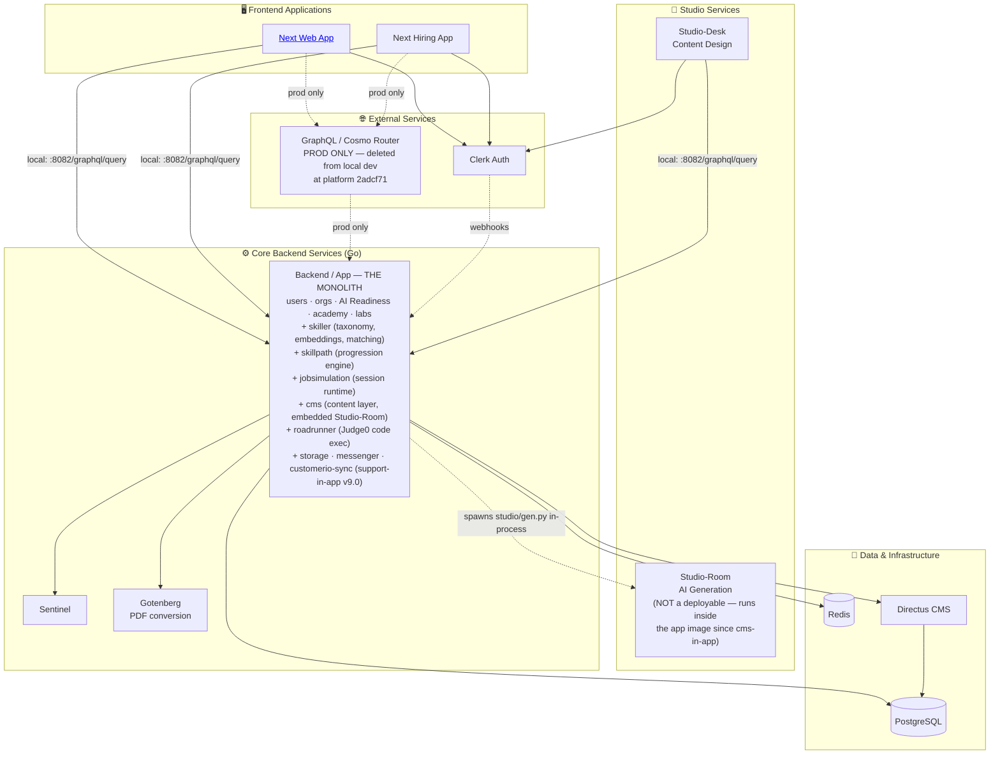

# Anthropos Architecture Overview

> **⚠️ Router status, two states (v2.8 M257x).** Platform `b56d731`+`360efd4` (merged **`2adcf71`**, 2026-07-31) **deleted the Cosmo Router from local dev** — no `graphql` compose service, no `repos.yml` entry — and re-pointed the frontends at **`backend` directly, `http://localhost:8082/graphql/query`**. **There is no `:5050` on a local stack.** In *production* the router is still declared (`graphql-wundergraph/terraform/main.tf:20` `= 1`), though **the repo is ARCHIVED on GitHub (2026-07-30)**. And the supergraph is **ONE** subgraph — `backend` — since `915da06` (2026-07-29). The fenced source of truth is [`platform-migration-status.md`](./platform-migration-status.md).


This document provides a high-level overview of the Anthropos platform architecture.

## High-Level Summary (For PMs & Non-Engineers)

Anthropos is a B2B SaaS skills intelligence platform that helps companies **map, verify, and develop skills** using AI-powered workplace simulations. It is composed of **three tiers of services**:

*   **Core Backend Services**: A collection of specialized Go microservices that handle the business logic. The **local `core` profile** (renamed from `graphql` at platform `0dab54d`) — what a normal `make up` selects — starts **five containers**: `backend` and `gotenberg`, plus the always-on floor (`postgresql`, `redis`, `sentinel`), which declare no `profiles:` key and are therefore in every selection. Two of the five are Go services of ours: `backend` and `sentinel`. See [Service Taxonomy](./service_taxonomy.md) for the full picture (other profiles, archived services, production-only services).
    *   **Backend/App**: Main API gateway, user and organization management; also hosts the **AI-readiness** workforce subsystem (org-level AI-capability diagnostics — see [`../services/ai-readiness.md`](../services/ai-readiness.md)), the **skill-path progression engine** (per-user `SkillPathSession` state — merged in from the former standalone skillpath service, "skillpath-in-app", platform M502→M507), the **skills taxonomy domain** since the **skiller-in-app merge (July 2026)** — a graph of **≥42,790 skills** across **≥22,470 job roles** (the measured *public* subset; see [Shared Libraries → the "60K / 18K" figures](./shared_libraries.md#taxonomy-figures)), vector embeddings (RAG), AI skill matching — plus the newer app-owned domains (course-builder, AI Labs + credits, ask-engine/Talk-to-Data, the academy store)
    *   **Sentinel**: Security and access control (the bouncer)
    *   **Gotenberg**: Office-doc → PDF conversion (used by `app`)

    **Domains inside Backend/App, not services.** At platform `0dab54d` none of the three has a compose
    service, a container, a port or a `repos.yml` entry — `d11a403` (2026-08-03) deleted all three from
    both files in one commit:
    *   **Jobsimulation**: runs realistic AI-powered job scenarios with voice, chat, code, and document tasks. (It *runs* the simulation; the simulation *definition* is content owned by the cms domain. **Merged into `app`** — "jobsim-in-app"; **the repo's archive state is not visible to this corpus** — this line asserted a GitHub archive on 2026-07-31, which `origin/main`'s four **2026-08-04** commits (merged PR #439 among them) contradict, an archived GitHub repo being read-only; report both, assert neither — and **M810 has landed for the production ECS service**: `6092c6d2` deleted the `module "jobsimulation"` block outright, destroying the ECS service, task definition and ECR repository, so `service_desired_count` no longer appears in the file at all (`jobsimulation/terraform/main.tf:15-22`). What survives is the module's *other* ownership — the LiveKit and Chime recording buckets `backend` reads by literal name, the `/production/jobsimulation/*` SSM parameters and the atlas tracker; dropping the legacy `jobsimulation` schema is a separate, still-pending M810 step (`:24-40`).)
    *   **CMS**: **The content layer** — owns the authored content & definitions (skill paths, simulation blueprints, the library) by wrapping Directus, plus the embedded Studio-Room AI content generation pipeline (Python — pulled into the **`app`** image by CI since cms-in-app; it rode in the cms container before the merge)
    *   **Roadrunner**: Judge0 code execution — `backend` reaches Judge0 directly
        (`app/internal/jobsimwiring/wiring.go:118` @ `app` `b948604`), so there is no hop and nothing left to start

    **Also domains inside Backend/App, and no longer even opt-in:** **Storage**, **Messenger** (Brevo
    email) and **CustomerIO Sync**. Platform `838d907` (merged **`0c91421`**, 2026-08-05) **deleted all
    three compose services**, with their ports and `depends_on` edges, and dropped `storage` +
    `messenger` from `repos.yml`. The `storage-legacy` / `messenger` / `customerio-sync` profiles are gone
    with them, and asking for one now exits 0 and starts only the always-on floor. `app`
    serves object storage in-process; messenger and customerio-sync ride in the same container but stay
    **OFF** on a developer machine behind `MESSENGER_ENABLED` / `CUSTOMERIO_SYNC_ENABLED`, which compose
    deliberately does not set (`docker-compose.yml:84-92` says why). Up to that commit the first two were
    kept startable "for rollback comparison"; that escape hatch is gone.
    Archived (removed from local orchestration): Chronos, Intelligence.
    Production-only: **db-backup** (scheduled PostgreSQL backups).
*   **Studio Services**: Specialized tools for content creation:
    *   **Studio-Desk**: Web app where creators design job simulations
    *   **Studio-Room**: AI pipeline that generates content from those designs. **Embedded inside the `app` (backend) image** since cms-in-app — it rode in the cms container before that, and was never a standalone deployment.
*   **Standalone Internal Apps**: Separately deployed products that reuse platform identity (Clerk) — **but not independent of the backend**:
    *   **Ant Academy** (`ant-academy`): Internal learning portal (Next.js 16 + Expo mobile) for `@anthropos.work` employees. Deployed on Vercel. Its course catalog is **DB-authoritative**, read over GraphQL from the platform's **`backend`** subgraph — **there is no separate "academy subgraph"**; the academy types are one SDL file (`academy.graphqls`) inside it — so the catalog degrades to an empty grid without the backend (see [`../services/ant-academy.md`](../services/ant-academy.md)).
*   **Frontend**: Next.js **16** applications deployed on Vercel
*   **External Services**: Third-party integrations:
    *   **Clerk**: User authentication (SaaS)
    *   **Directus**: Content storage (self-hosted)
    *   **GraphQL/Cosmo Router**: API federation gateway **(prod only — deleted from local dev at
        platform `2adcf71`)**
    *   **AI Providers**: OpenAI, Anthropic, Mistral — EU-resident clients by default, **not** an EU-first
        fallback ladder (see [AI Providers](#ai-providers) below)
    *   **LiveKit**: Real-time voice engine for simulations
    *   **AWS Chime**: Video/audio recording
    *   **PostgreSQL & Redis**: Data infrastructure

## Technical Deep Dive (For Engineers)

The Anthropos platform follows a **three-tier microservices architecture** with clear separation of concerns. See [Service Taxonomy](./service_taxonomy.md) for detailed categorization.

**Tech Stack**:
- **Backend**: Go microservices (primary), Python for AI content, TypeScript/Node.js for Studio-Desk
- **Frontend**: Next.js **16** + React 19 + TypeScript on Vercel (`next: ~16.2.12` — a tilde range, not a caret — in the four `apps/*` that declare it: `web`, `hiring`, `integration`, `maintenance`; `apps/mobile` declares no `next`. Lockfile resolves `16.2.12`, at `next-web-app` `8297c684`)
- **Database**: PostgreSQL RDS (Multi-AZ) with Ent ORM. **Not a schema per service** — `app` owns `public` and is the only repo with migrations; `sentinel` keeps its own schema; the `cms`/`jobsimulation`/`skillpath` **schemas** are legacy husks — non-authoritative leftovers, not services (see the Database Separation section below)
- **Cache/Streams**: Redis ElastiCache (caching, pub/sub, job queues via Watermill)
- **APIs**: GraphQL Federation v2 (WunderGraph Cosmo Router — **prod only**; local dev talks to
  `backend` directly), gRPC/Connect-RPC (internal), Protocol Buffers
- **Auth**: Clerk (identity) + Casbin (authorization with RBAC/ABAC via Sentinel)
- **CMS**: Directus (self-hosted, headless)
- **Infrastructure**: AWS ECS EC2 (EU-West-1 primary), Terraform IaC, Vercel (frontend)
- **CI/CD**: GitHub Actions with self-hosted EU runners; Tailscale VPN for private access
- **Monitoring**: CloudWatch, Better Stack, Sentry, PostHog

**Service Tiers** (local development reality, default `core` profile):
1. **Core Backend Services**: Backend/App (the monolith) and Sentinel, plus Gotenberg (third-party PDF service). Dockerized. **`jobsimulation`, `cms` and `roadrunner` are not among them** — platform `d11a403` deleted all three compose services outright (and their `repos.yml` entries); their domains run in-process inside `app`, so there is nothing to start and nothing unfederated left over. **`Storage`, `Messenger` and `CustomerIO Sync` are not among them either** — platform `838d907` (merged `0c91421`, 2026-08-05) deleted all three compose services outright, so there is no longer even a profile to opt into; all three are served in-process by `backend`. **The Cosmo Router is no longer among them locally** — platform `2adcf71` deleted the service; it survives in production only. So a bare `make up` gives you **five containers** — `backend`, `gotenberg` and the always-on `postgresql`/`redis`/`sentinel` floor — of which **two are our Go services**, not six.

   **Eight** former microservices now run **inside** Backend/App: **skiller** (July 2026), **skillpath**
   ("skillpath-in-app", M502→M507), **roadrunner**, **jobsimulation** ("jobsim-in-app"), **cms**
   ("cms-in-app v8.0", app v1.360.0) and — the v9.0 "support-in-app" trio, whose containers `838d907`
   deleted — **storage**, **messenger** and **customerio-sync**. The federation is down to a **single
   subgraph**. `chronos` and `intelligence` are retired.
2. **Studio Services**: Studio-Desk (TypeScript, runs natively or in `studio-desk` profile); Studio-Room is embedded in the **`app` (backend) image** since cms-in-app — it was in the cms container before the merge.
3. **External Services**: Clerk, Directus, GraphQL (**prod only**), AI providers, LiveKit, AWS Chime
4. **Shared Libraries**: **four** imported private modules — colony, proto, ai, taxonomy (not deployed; pulled at Docker build). **`authn` is not a fifth**: it ships inside colony as `colony/authn`, and no service's `go.mod` requires the standalone module — 0 hits for `github.com/anthropos-work/authn` across all seven Go clones, against a positive control of `colony` required by all seven
5. **Production-only / not in local compose**: db-backup, archived Chronos/Intelligence

Services communicate via **Connect-RPC/HTTP** for synchronous operations and **Redis Streams** (via Watermill) for asynchronous messaging.


```mermaid
graph TD
    subgraph External["🌐 External Services"]
        Clerk[Clerk Auth]
        GraphQL["GraphQL / Cosmo Router<br/>PROD ONLY — deleted from local dev<br/>at platform 2adcf71"]
    end
    
    subgraph Frontend["🖥️ Frontend Applications"]
        Web[<a href='./frontend_architecture.md'>Next Web App</a>]
        Hiring[Next Hiring App]
    end
    
    subgraph Studio["🎨 Studio Services"]
        Desk[Studio-Desk<br/>Content Design]
        Room["Studio-Room<br/>AI Generation<br/>(NOT a deployable — runs inside<br/>the app image since cms-in-app)"]
    end

    subgraph Core["⚙️ Core Backend Services (Go)"]
        Gateway["Backend / App — THE MONOLITH<br/>users · orgs · AI Readiness · academy · labs<br/>+ skiller (taxonomy, embeddings, matching)<br/>+ skillpath (progression engine)<br/>+ jobsimulation (session runtime)<br/>+ cms (content layer, embedded Studio-Room)<br/>+ roadrunner (Judge0 code exec)<br/>+ storage · messenger · customerio-sync (support-in-app v9.0)"]
        Sentinel[Sentinel]
        Gotenberg[Gotenberg<br/>PDF conversion]
        %% Storage and Messenger had nodes here until 838d907 (merged 0c91421, 2026-08-05)
        %% deleted the storage, messenger and customerio-sync compose services and their
        %% storage-legacy / messenger / customerio-sync profiles. They are domains in Gateway now.
    end

    subgraph Data["💾 Data & Infrastructure"]
        Postgres[(PostgreSQL)]
        Redis[(Redis)]
        Directus[Directus CMS]
    end
    
    %% Frontend connections
    Web --> Clerk
    Hiring --> Clerk
    Web -.->|prod only| GraphQL
    Hiring -.->|prod only| GraphQL
    Web -->|local: :8082/graphql/query| Gateway
    Hiring -->|local: :8082/graphql/query| Gateway
    
    %% Studio connections
    Desk --> Clerk
    Desk -->|local: :8082/graphql/query| Gateway
    Gateway -.->|spawns studio/gen.py in-process| Room
    
    %% Router aggregation — PROD ONLY. ONE subgraph: backend. 915da06 deleted the cms AND jobsimulation
    %% entries in one commit (a 3 → 1 step) — the jobsimulation subgraph outlived jobsim-in-app.
    %% Locally there is no router at all: the frontends and studio-desk hit Gateway directly (edges above).
    GraphQL -.->|prod only| Gateway

    %% Core service dependencies
    Gateway --> Sentinel
    Gateway --> Gotenberg
    Gateway --> Directus

    %% Data connections
    Gateway --> Postgres
    Gateway --> Redis
    Directus --> Postgres
    
    %% Clerk integration
    Clerk -.->|webhooks| Gateway
```

### Service Inventory

> [!NOTE]
> For detailed service categorization and deployment models, see [Service Taxonomy](./service_taxonomy.md).

#### Core Backend Services (Tier 1)

Default local development set (started by `make up` — profile `core`, `Makefile:10` `PROFILE ?= core`).
Five containers; the last three declare no `profiles:` key and are therefore in **every** selection:

| Service Name | Technology | Responsibility | Documentation |
| :--- | :--- | :--- | :--- |
| **Backend** (`app`) | Go | Main API Gateway / User Backend; also owns the skills taxonomy, embeddings (RAG), and AI skill matching (merged skiller domain, July 2026), plus the **cms**, **jobsimulation** and **roadrunner** domains | [→](../services/backend.md) |
| **Gotenberg** | Third-party (Go) | Office-doc → PDF conversion | [→](../services/gotenberg.md) |
| **Sentinel** *(always on)* | Go | Authorization (Casbin RBAC/ABAC) | [→](../services/sentinel.md) |
| **PostgreSQL** *(always on)* | Third-party image | Data store (custom image with `pgvector`) | — |
| **Redis** *(always on)* | Third-party image | Cache, pub/sub, job queues | — |

> **What used to be in this table and no longer is.** **CMS**, **Jobsimulation** and **Roadrunner** each had a
> row here as a container; platform `d11a403` deleted all three compose services — they are **domains inside
> `app`** now, with no service, port or `repos.yml` entry (docs: [cms](../services/cms.md),
> [jobsimulation](../services/jobsimulation.md), [roadrunner](../services/roadrunner.md)). **Storage**,
> **Messenger** and **CustomerIO Sync** had rows too — first here, then in an *opt-in profiles* table below,
> and now nowhere: platform `838d907` (merged `0c91421`, 2026-08-05) deleted all three compose services and
> their profiles (docs: [storage](../services/storage.md), [messenger](../services/messenger.md),
> [customerio-sync](../services/customerio-sync.md)).

> [!IMPORTANT]
> **Content vs. runtime state — a split-ownership model that SURVIVED the merge.** The platform separates the **content layer** (the cms domain, which wraps Directus) from the **runtime/session engines**. Since cms-in-app all of them live in the same process, but the ownership split is unchanged — the boundary is now a package boundary, not a network one:
> - **The cms domain owns CONTENT / DEFINITIONS** — the authored, versioned, published artifacts: skill paths (title, cover, curators, library categories, **chapters → steps**, skills-to-verify, settings), job-simulation *blueprints* (the `simulations` Directus collection + the Studio `StudioDocument`/`StudioTask` authoring model), and the content **library**. Served from `app/internal/cms/` (Frontend/Studio → backend GraphQL → business logic → Redis cache → Directus → Postgres). **Directus stays external** at `content.anthropos.work`.
> - **The skill-path and jobsimulation engines own RUNTIME / SESSION / PROGRESS STATE** and reference cms content **by ID only** — they hold no content. The **skill-path engine** tracks `SkillPathSession → ChapterSession → StepSession` (state in `public.skill_path_sessions`). **jobsimulation** runs the interactive session and emits completion events; its 23 run-state tables are in `public` too. Both fetch definitions from the cms domain **in-process** — the old `CMS_RPC_ADDR` / `cms.GetSimulation` Connect-RPC hops are gone.
>
> So **skill-path *content* ≠ the skill-path *engine*; "jobsimulation" ≠ simulation content.** Content = the cms domain/Directus; the engine/runtime = the state machine over that content. All of it now lives in `app`. See [CMS](../services/cms.md), [Skillpath](../services/skillpath.md), and [Jobsimulation](../services/jobsimulation.md).

Available but off by default (opt-in via Docker profile): the two containerized frontends, and nothing
else — **Next Web App** (`frontend`, `all`) and **Studio-Desk** (`studio-desk`, `all`). Neither profile
is usable on its own: both services declare `depends_on: backend`, which those profiles do not select,
so compose exits 1 — stack them on `core`. See [Service Taxonomy](./service_taxonomy.md#profiles).

> **This used to be a table of three Go services — Storage (`storage-legacy`), Messenger (`messenger`)
> and CustomerIO Sync (`customerio-sync`) — and all three rows are gone.** Platform `838d907` (merged
> `0c91421`, 2026-08-05, *"drop the storage, messenger and customerio-sync containers"*) deleted the
> service definitions **and** the profiles; `storage` and `messenger` left `repos.yml` in the same
> commit, so `make init` no longer clones them. Asking for one of the retired tokens does **not** fail —
> it exits 0 and starts only the always-on floor, which is why none of them is written here in runnable
> form. Docs: [storage](../services/storage.md), [messenger](../services/messenger.md),
> [customerio-sync](../services/customerio-sync.md).

Production-only (deployed but not in local docker-compose):

| Service Name | Technology | Responsibility | Documentation |
| :--- | :--- | :--- | :--- |
| **db-backup** | Go | Scheduled PostgreSQL backups (every 6h) to S3, Azure, Hetzner | [→](../services/db-backup.md) |

Archived / merged — **and since platform `d11a403` every one of them is out of local orchestration** (repo dirs
may still exist on disk):

> **⚠️ This table and the *Default local development set* table above used to overlap by design, and that
> overlap has now closed.** CMS, Jobsimulation and Roadrunner appeared in **both**: merged into `app` (no
> subgraph) **and**, until platform **`d11a403`** (2026-08-03,
> *"chore(compose): drop roadrunner, prune dead env, repoint messenger"*), still started by the then-default
> profile as unfederated husks. `d11a403` deleted all three compose services **and** all three `repos.yml`
> entries in one commit — so at `0dab54d` none of them starts. (That commit's own message says roadrunner's
> *"repos.yml entry was already gone"*; its diff deletes `- name: cms`, `- name: jobsimulation` **and**
> `- name: roadrunner`. The diff is the fact.) Keep the *merged ≠ gone from compose* distinction in mind
> anyway: it is a **phase**, and the next fold will pass through it too.

| Service Name | Status | Documentation |
| :--- | :--- | :--- |
| **Chronos** | Removed via platform commit `045857c` | [→](../services/chronos.md) |
| **Intelligence** | Removed via platform commit `fdfa189` | [→](../services/intelligence.md) |
| **Skiller** | Merged into Backend/App (July 2026) — repo legacy/decommissioned | [→](../services/skiller.md) |
| **Jobsimulation** | Merged into Backend/App ("jobsim-in-app") — session engine runs in `app`; the 23 run-state tables moved to `public`. **No local container**: `d11a403` deleted the compose service and the `repos.yml` entry, so at `0dab54d` there is nothing to start. **Prod teardown — M810 has LANDED for the ECS service**: `6092c6d2` deleted the `module "jobsimulation"` block, so the ECS service, task definition and ECR repository are destroyed (`jobsimulation/terraform/main.tf:15-22`). The module file survives owning only the LiveKit/Chime buckets, the SSM parameters and the atlas tracker; the legacy-schema drop is a separate, still-pending M810 step. **Do not read this row onto CMS** | [→](../services/jobsimulation.md) |
| **CMS** | Merged into Backend/App ("cms-in-app v8.0", app v1.360.0) — content layer + Studio run in `app`; similarity/studio tables moved to `public`; supergraph **3→1** (the same commit, `915da06`, also deleted the `jobsimulation` subgraph — its own commit subject's "2→1" is wrong); the prod ECS module is **not** a settled rollback path — **report both, assert neither**: `cms/terraform/main.tf:39` still declares it at `service_desired_count = 0`, while `6efa1d5` (merged `f38c0c4`, 2026-08-04) deleted cms's build-production workflow under *"the cms ECR repository is decommissioned (M810)"*, naming M810's deletion of `module.cms_euwest1`. Whether that has been applied is **not visible to this corpus** — `infrastructure` has never been in any clone set. **No local container**: `d11a403` deleted the compose service and the `repos.yml` entry, and re-pointed `messenger`'s `CMS_RPC_ADDR` at `http://backend:8083` — **M809 has landed**. `838d907` (merged `0c91421`) then deleted the `messenger` service itself, so **no compose file sets `CMS_RPC_ADDR` at all** any more; prod teardown is **M810** | [→](../services/cms.md) |
| **Roadrunner** | Merged into Backend/App with jobsim-in-app — `backend` calls Judge0 directly via `JUDGE0_BASE_URL`. **Gone locally, orphaned in prod:** at platform `0c91421` there is **no `roadrunner` compose service at all** (deleted by `d11a403`; **5** services remain declared, 7 in the effective topology) while prod terraform still reads `= 1` | [→](../services/roadrunner.md) |
| **Skillpath** | Merged into Backend/App then decommissioned ("skillpath-in-app", platform M502→M507) — the skill-path progression engine now runs in `app`; session state moved to `public.skill_path_sessions`; no skillpath container or subgraph | [→](../services/skillpath.md) |

#### Shared Libraries (Not Deployed)

> Imported as private Go modules — **not** cloned by `make init`. Full reference: [Shared Libraries](./shared_libraries.md).

| Library | Purpose |
| :--- | :--- |
| **colony** | Platform framework: logging+Sentry, DB/Redis helpers, GraphQL/RPC servers, middleware, pub/sub (Watermill); also contains `authn` |
| **proto** | Protobuf definitions (single source of truth for RPC contracts) + hand-written domain types |
| **ai** | AI provider wrapper behind one `ai.AI` interface (OpenAI, Azure, Anthropic, **Bedrock**, Mistral). Cost tracking & **vendor selection** live in the **consumers**, not this lib — and that selection is a caller-supplied switch, **not** an EU-first fallback ladder ([no such ladder exists](./external_services.md#routing-what-is-actually-implemented)) |
| **authn** | Clerk JWT authentication — now shipped **inside colony** as `colony/authn` (standalone repo is legacy) |
| **taxonomy** | **node-id library** (`NodeID` type + ID generation/validation) — **not** a dataset; the skill/job-role data (**≥42,790 skills**, **≥22,470 job roles** — public subset, measured 2026-06-29) lives in `app`'s `public` schema (former skiller service). The long-quoted "60K skills / 18K roles" is not a measurement: [18K is refuted, 60K is unverified](./shared_libraries.md#taxonomy-figures) |

#### Studio Services (Tier 2)

| Service Name | Technology | Responsibility | Documentation |
| :--- | :--- | :--- | :--- |
| **Studio-Desk** | TypeScript, Vite, Express | Content design tool for creating simulation blueprints | [→](../services/studio-desk.md) |
| **Studio-Room** | Python, Asyncio | AI-powered content generation pipeline | [→](../services/studio-room.md) |

#### External Services (Tier 3)

| Service Name | Type | Responsibility | Documentation |
| :--- | :--- | :--- | :--- |
| **Clerk** | SaaS | User authentication & organization management | [→](../services/clerk-integration.md) |
| **Directus** | Docker (self-hosted) | Headless CMS for content storage | [→](./external_services.md#directus-headless-cms) |
| **GraphQL/Cosmo Router** | **prod only** — deleted from compose at platform `2adcf71` | Apollo Federation v2 gateway, **ONE** subgraph (`backend`) since `915da06` | [→](../services/graphql-wundergraph.md) |

#### Frontend Applications

| Application | Technology | Purpose | Documentation |
| :--- | :--- | :--- | :--- |
| **Next Web App** | Next.js 16 | Main user-facing application (Workforce + Hiring) | [→](../services/next-web-app.md) |
| **Hiring App** | Next.js | Recruiting & hiring workflows | [→](./frontend_architecture.md) |
| **Mobile App** | Expo/React Native | Mobile experience | [→](./frontend_architecture.md) |
| **Ant Academy** | Next.js 16 + Expo | Internal learning portal for `@anthropos.work` employees (standalone, Vercel-deployed) | [→](../services/ant-academy.md) |

### Communication Patterns

#### Core Services ↔ Core Services
*   **Synchronous**: Connect-RPC/HTTP endpoints — down to **one Connect-RPC edge on a local stack,
    `backend → sentinel`**. At platform `0c91421` that is the only cross-process **Connect-RPC** address,
    `AUTHORIZATION_ADDRESS=http://sentinel:8087`
    (`docker-compose.yml:48`), and there are **zero `*_RPC_ADDR` variables**. **It is NOT the only service
    address compose sets, and not the only cross-process edge** — this passage previously said *"compose
    sets exactly one service address"*, which **is false** and is retracted (corrected M257x iter-102).
    The same `backend` block also sets `GOTENBERG_URL=http://gotenberg:3200` (`docker-compose.yml:57` — a
    second container on the **default** `core` profile at `:183`, reached over **plain HTTP**, not
    Connect-RPC, at `app/internal/converter/gotenberg.go:31` @ `app` `ad9f3c49`), `JUDGE0_BASE_URL`
    (`docker-compose.yml:59`) and `REDIS_ADDR` (`docker-compose.yml:66`). **The correctly-scoped form is
    this document's own local-stack diagram below** — *"the only cross-process **RPC** edge out of backend
    on a core stack"* — which was right while this line was wrong, 55 lines apart in one file.
    On the `*_RPC_ADDR` half: the `messenger` block was the last thing
    that set any (`BACKEND_USERS_`, `CMS_`, `JOBSIMULATION_`, `SKILLER_`, all re-pointed at
    `http://backend:8083` by `d11a403`), and `838d907` deleted that service. The env-var *names* still exist
    in consumer code; no local compose file configures them
*   **Asynchronous**: Redis Streams for event-driven messaging (via Watermill pub/sub library)

#### Frontend/Studio → Backend
*   **Primary**: GraphQL — **`backend` directly on a local stack** (`:8082/graphql/query`), via the Cosmo Router in prod. Apollo Federation v2 with **one** subgraph
*   **Direct**: Some services expose REST endpoints for specific use cases

#### External Service Integration
*   **Clerk**: SDK-based (frontend) + JWT middleware (backend via `authn` library)
*   **Directus**: Proxied via the cms **domain** inside `backend` (business logic layer)
*   **GraphQL**: the supergraph is **one** subgraph — `backend` — since `915da06` folded cms in and deleted the `jobsimulation` entry in the same commit (**3 → 1**; the jobsimulation *subgraph* outlived the jobsim-in-app service merge). Nothing is aggregated any more
*   **AI Providers**: the default clients are EU-resident, and **there is no ordered EU-first fallback
    ladder** — the chain *"Azure OpenAI EU → Azure OpenAI US → direct OpenAI"* was retracted at
    [`external_services.md:579`](./external_services.md) and is corrected here (M257x iter-46). Inside the
    AI manager there are two US paths — a **feature flag** and a **429 retry target**, not fallback rungs —
    but **that is not the whole set**: [`external_services.md:602-607`](./external_services.md) enumerates
    **four live** ways a request leaves the EU, of which the two outside the manager are `ANTHROPIC_API_KEY`
    and **an authored sequence with `ai_vendor` unset** — the latter reaching direct US OpenAI
    *unconditionally, on the first attempt, with no flag and no 429*. A fifth arm, **Studio-Room's own
    `openai` `TARGET SERVICE`**, exists in code but is **selected by no shipped config** (all three
    `app/studio/configs/*.ini` pin `azure`). Scope corrected M257x iter-48, count corrected to five at
    iter-49 and to four-live-plus-one-latent at iter-52. Measured at
    `app/internal/jobsimulation/ai/ai.go`: `getClient` defaults to `azureClientEu` and swaps to
    `azureClientUs` when the PostHog flag **`flag_use_azure_us`** is on (`:262-276`); direct OpenAI is the
    retry target on HTTP 429 (`isThrottlingError` at `:129`, applied at `:166` and `:325`). **⚠️ "EU-first"
    is not "EU-only" — a feature flag routes traffic to the US, and an unset `ai_vendor` does so with no flag
    at all.** AWS Bedrock is a *per-call vendor*
    (`AnthropicAws`, pinned to `eu-west-1` at `:85-88`), never a fallback tier. **Mistral is not part of this
    routing chain** — but it *is* live in `app`: `internal/cms/studio/markdownManager.go:29-30` builds a
    Mistral OCR client (`mistralocr.New(aiKey)`) for **Studio document OCR**. **The key reaches it from the
    CALLER, not from the environment**: `studioManager.go:583` reads `os.Getenv("MISTRAL_API_KEY")` and
    passes it in. This sentence used to cite `:11,19` and say the constructor read the variable itself —
    `:11` is the closing paren of the import block and `:19` is a doc comment recording that that very
    `os.Getenv` read was **removed**, so the anchor named the fix as if it were the defect.
    It is a separate, single-purpose provider, not a tier in the simulation cascade

For detailed integration patterns, see [External Services](./external_services.md).

### Request Flow

A typical API request follows this path:

**In production** (the router still exists there — `graphql-wundergraph/terraform/main.tf:20` `= 1`):

```
User → Vercel (Next.js) → Clerk (JWT) → ALB → Cosmo Router (port 8080)
  → backend (the sole subgraph)
    → Connect-RPC to internal services (sentinel)
    → Redis Streams for async events
```

**On a local stack** (platform `2adcf71` deleted the router — **there is no `:5050`**):

```
Browser → Clerk (JWT) → backend :8082/graphql/query   (no router hop)
  → Connect-RPC to sentinel   (the only cross-process RPC edge out of backend on a core stack)
  → object storage in-process   (no storage container, no STORAGE_RPC_ADDR)
  → cms / jobsimulation / roadrunner domains in-process   (no containers, no hops)
  → Judge0 directly via JUDGE0_BASE_URL
  → Redis Streams for async events
```

> `roadrunner` is **not** a gRPC hop from `backend` in either column — it was folded in with jobsim-in-app and
> `backend` calls Judge0 directly. **Nor is `storage` one in EITHER column** — the production diagram above no
longer lists it, because the edge is dead there too: `storage`'s ECS service block is **gone from terraform
entirely**, and says so in-comment — at `9f8cb53` `storage/terraform/main.tf` is 18 lines (`:9-11`
*"The ECS service that used to live here is GONE (v9.0 'support-in-app')"*), the module kept only so the
buckets, CloudFront distribution and media DNS record keep their `prevent_destroy` guards (`:13-16`). It
read `service_desired_count = 0` at the intermediate `63bffc8`. And `STORAGE_RPC_ADDR` has **zero** reads
anywhere in `app`
(**3 hits in Go source** at `9d00a313`, every one a comment — `main.go:451`,
`internal/jobsimwiring/wiring.go:101`, `internal/storagens/callsites_test.go:189`. **Not 3 repo-wide**:
`git -C stack-demo/app grep -n STORAGE_RPC_ADDR 9d00a313` returns **29 lines across 18 files**, the rest
being CHANGELOG and `knowledge/*.md`. The Go scope is what carries the claim; the repo-wide form was a
mis-transcription of it). The earlier wording scoped this retraction to
*"locally"*, which left the prod edge affirmatively standing (corrected M257x iter-85). Platform
**`0dab54d`** ("storage-in-app,
> v9.0") deleted `STORAGE_RPC_ADDR` from `backend`'s env, dropped `storage` from `backend`'s `depends_on`
> — the replacement comment read *"storage removed at v9.0: served in-process by this container now"*
> — and moved the service to `profiles: [storage-legacy]`; **`838d907`
> (merged `0c91421`, 2026-08-05) then deleted the `storage` service and that profile outright**, so there
> is nothing left to opt into. The app side
> closed at **`app` `9d00a313`** (v1.367.0) and is still closed at `app` **origin/main**, where
> `STORAGE_RPC_ADDR` has **zero reads** and `main.go:504`
> says *"the standalone service takes no traffic and STORAGE_RPC_ADDR is gone."* That comment stood at
> `main.go:451` at `9d00a313`; **the line number moved without the code moving**, which is what a week of
> `app` commits costs an anchor (re-derived M257x iter-87). At the older `b948604`
> v1.366.0 the variable is still read — `internal/jobsimwiring/wiring.go:115` — so **state the ref you mean**. See
> [`roadrunner.md`](../services/roadrunner.md), [`storage.md`](../services/storage.md) and
> [`platform-migration-status.md`](./platform-migration-status.md).

### Multi-Tenancy

The platform uses **shared database, shared schema**, with `organization_id` on **org-scoped** tables
(**not** on every table — the taxonomy and other global reference data carry none by design). Data
isolation is enforced at three layers:

1. **Database**: `organization_id` on org-scoped tables; Ent privacy policies auto-filter by organization on
   **only 31 of 135 schemas** (the **29** live `OrganizationMixin{}` users — a 30th is commented out at
   `user_resource.go:22` — plus `Membership` and `Organization`, which each declare their own). An M257x
   iter-49 audit called this **32**; that was **refuted** at iter-52 by two independent readers and by
   re-measurement — the earlier 31 was right, but reached by two compensating errors.
   **23 schemas carry an `organization_id` with no policy at all** (16 is the *neither-mixin*
   subset of those 23, not the total) — see
   [Security & Compliance → Layer 1](./security_compliance.md#layer-1-database) for the measured split and
   the derivation
2. **Authorization**: Sentinel (Casbin RBAC/ABAC) validates every API request
3. **Identity**: Clerk JWT includes org context; sessions are org-scoped

For detailed integration patterns, see [External Services](./external_services.md).

### Data Architecture & Schema Management

The platform uses a **Code-First** approach to data management, relying on strictly typed schemas in Go.

#### 1. Data Modeling (Ent)
*   **ORM**: We use [Ent](https://entgo.io/) as our Entity Framework.
*   **Definition**: Schemas are defined in Go code within `internal/data/ent/schema` or `internal/ent/schema`.
*   **Source of Truth**: The Go code is the single source of truth for the database structure.

#### 2. Schema Management (Atlas)
*   **Tooling**: We use [Atlas](https://atlasgo.io/) to manage database migrations.
*   **Workflow**:
    1.  **Define**: Engineers modify Ent schemas in Go.
    2.  **Generate**: `make gen` runs Ent codegen to update the Go client.
    3.  **Migration Diff**: Atlas compares the Go schema against the migration directory to create a new `.sql` migration plan.
    4.  **Apply**: `atlas migrate apply` executes pending migrations against the target database.

#### 3. Database Separation
Although all services may share a physical PostgreSQL instance (in dev/docker), they are logically separated by **PostgreSQL Schemas** (source: `platform/repos.yml` `schema:` field for services with `migrations: true`):
*   `backend` service → `public` schema (including the skills taxonomy + embeddings ported from the old `skiller` schema, and the skill-path runtime state in `public.skill_path_sessions` ported from the old `skillpath` schema; the legacy `skiller` + `skillpath` schemas are no longer authoritative)
*   *(legacy)* `cms` schema → non-authoritative; the similarity + Studio tables moved to `public` with cms-in-app v8.0
*   *(legacy)* `jobsimulation` schema → non-authoritative; the 23 session/run tables moved to `public` with jobsim-in-app
*   *(decommissioned)* `skillpath` schema → an empty legacy husk; the skill-path runtime state moved to `public.skill_path_sessions` when the skillpath service merged into `app` (M502→M507)
*   `sentinel` service → `sentinel` schema (created manually during setup; sentinel does not run migrations)
*   `extensions` schema → houses `pgvector` extension (required by the skill/job-role embeddings, now owned by `backend`)

> [!IMPORTANT]
> **Manual Setup Required**: The platform does *not* automatically apply migrations on startup (to prevent accidental production overrides). Developers must run `atlas migrate apply` manually when setting up a fresh environment or pulling schema changes.

### Infrastructure & Deployment

*   **Cloud**: AWS ECS EC2 (EU-West-1 primary); Vercel for frontend
*   **Networking**: VPC (10.0.0.0/16) with Multi-AZ; public subnets (ALB, Cosmo Router), private subnets (all microservices)
*   **IaC**: Terraform for all infrastructure provisioning
*   **CI/CD**: GitHub Actions with self-hosted EU runners; Tailscale VPN for private subnet access; Git tags trigger deployments
*   **Monitoring**: CloudWatch (metrics, dashboards, alarms), Sentry (errors, performance, cron monitoring), PostHog (analytics), Better Stack (incident escalation, uptime)
*   **Backups**: Full DB backups every 6 hours to S3, Azure, and Hetzner (Germany); RDS point-in-time recovery
*   **Health**: ECS health checks every 30 seconds with automated rollback on failure

For security, compliance, and data protection details, see [Security & Compliance](./security_compliance.md).
For AI model inventory, provider routing, and voice/recording architecture, see [AI Architecture](./ai_architecture.md).
