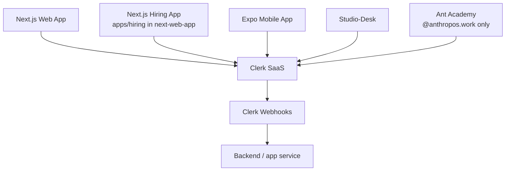
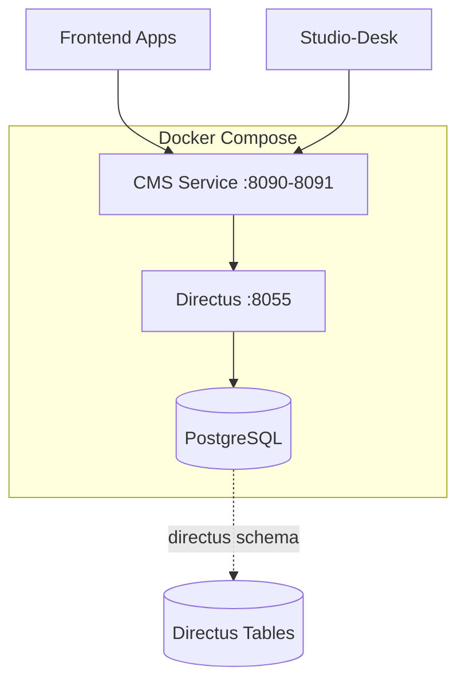
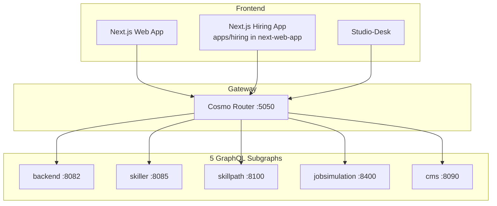

# External Services & Integrations

This document describes all external services and third-party integrations used by the Anthropos platform. These are services the platform **depends on** but does not directly maintain in the core codebase.

## High-Level Summary (For PMs & Non-Engineers)

The Anthropos platform integrates with **three key external services**:

1. **Clerk** - Handles all user authentication and organization management (SaaS)
2. **Directus** - Stores and manages platform content (self-hosted via Docker)
3. **GraphQL/Wundergraph** - Unifies all backend services into a single API
4. **AI Providers** - OpenAI, Anthropic, and Azure for intelligent features

These services allow us to focus on core features while leveraging best-in-class solutions for authentication, content management, and API orchestration.

---

## Clerk (Authentication Service)

### Overview

| Property | Value |
|:---------|:------|
| **Type** | External SaaS |
| **Purpose** | User authentication, session management, organization management |
| **Website** | [clerk.com](https://clerk.com) |
| **Pricing Model** | Freemium (pay per active user) |

> **Full integration picture** — what Clerk is used for (the authentication-vs-authorization split), how it's wired, which repos depend on it, and each one's SDK — lives in **[Clerk Integration](../services/clerk-integration.md)**. This section is the external-services-catalog overview.

### What Clerk Provides

- **Authentication**: Email/password, OAuth (Google, GitHub, etc.), magic links
- **Session Management**: Secure session handling, token refresh
- **Organizations**: Multi-tenant support with roles and permissions
- **User Management**: Profile management, user metadata
- **Security**: Built-in protection against common attacks
- **Webhooks**: Real-time sync of user events

### Integration Points

Clerk is integrated across **all user-facing applications**:



#### Per-application integration

Each app authenticates with its framework's Clerk SDK — `@clerk/nextjs` (next-web-app web/hiring/integration + ant-academy), `@clerk/clerk-expo` (mobile), `@clerk/clerk-js` + `@clerk/express` (studio-desk), and `colony/authn` + `clerk-sdk-go/v2` (Go services). The next-web-app `/enterprise` area, studio-desk admin tooling, and ant-academy content are additionally gated **directly** on Clerk `org:admin` / org membership. Per-repo SDKs and the auth/authz split: [Clerk Integration → Dependent Repos](../services/clerk-integration.md#dependent-repos--how-they-integrate).

#### Backend Services

**Sentinel Service**:
- Acts as the centralized **authorization** service (Casbin RBAC/ABAC)
- Does NOT perform authentication and does NOT validate Clerk tokens — JWT validation is done in each consuming service via the shared `authn` library (now `colony/authn`)
- Clerk user/org sync is handled by the `app`/backend service via Clerk webhooks (see [webhook_setup.md](../ops/webhook_setup.md)), not by Sentinel

**Other Backend Services**:
- Don't directly integrate with Clerk for sync (that's the backend's job)
- Call Sentinel via Connect-RPC for authorization decisions; authenticate independently via the `authn`/Clerk JWT middleware
- Trust Sentinel's authorization decisions

### Configuration

Credentials live in `platform/.env` (backend) and each app's own env: a backend `CLERK_SECRET_KEY` + `CLERK_WEBHOOK_SECRET`, plus a framework-prefixed publishable key per frontend (`NEXT_PUBLIC_` / `VITE_` / `EXPO_PUBLIC_CLERK_PUBLISHABLE_KEY`) and sign-in/up URLs. Full key list: [Clerk Integration → Configuration](../services/clerk-integration.md#configuration-keys). Get keys by creating an app at [clerk.com](https://clerk.com) (use **separate dev/prod apps**) and configuring webhooks for user/org sync.

### Development Workflow

#### Local Webhook Setup (For User/Org Sync)

Clerk webhooks sync user and organization data to your local database. Without working webhooks, users created in Clerk won't appear locally.

**Quick Start** (no account needed):
```bash
# Start a tunnel to expose localhost:8082
npx localtunnel --port 8082
```

Then configure the webhook URL in Clerk Dashboard pointing to `https://<your-url>/api/webhook/clerk`.

**For detailed setup instructions**, see the [Webhook Setup Guide](../ops/webhook_setup.md), which covers:
- Full localtunnel setup with Clerk configuration
- More reliable alternatives (ngrok, Tailscale Funnel)
- Troubleshooting common issues
- Security considerations

**Note**: This is only needed when you need user/org sync. For pure frontend development with existing test accounts, webhook setup can be skipped.

### Security Considerations

- **Never commit** secret keys to version control
- Use **different Clerk applications** for development and production
- Clerk handles **GDPR compliance** and secure password storage
- All tokens are **short-lived** and automatically refreshed

---

## Directus (Headless CMS)

### Overview

| Property | Value |
|:---------|:------|
| **Type** | Self-hosted via Docker |
| **Image** | `directus/directus:10.10.1` |
| **Purpose** | Content storage, media management, CMS |
| **Port** | 8055 |
| **Website** | [directus.io](https://directus.io) |

### What Directus Provides

- **Headless CMS**: Manage content via REST/GraphQL APIs
- **Database Abstraction**: Works directly with PostgreSQL
- **Media Management**: File uploads, image transformations
- **Content Versioning**: Track changes to content
- **Webhooks**: Real-time notifications on content changes
- **Admin UI**: User-friendly interface for content editors

### Architecture

Directus runs as a **Docker container** alongside core services:



### Integration Pattern

**The CMS Service acts as a smart proxy** between applications and Directus:

1. **Frontend/Studio-Desk** → GraphQL request
2. **CMS Service** → Translates to Directus API call
3. **Directus** → Queries PostgreSQL
4. **CMS Service** ← Adds business logic, caching
5. **Frontend/Studio-Desk** ← Returns enriched data

**Why the proxy pattern?**
- Add platform-specific business logic
- Cache frequently accessed content
- Abstract Directus implementation details
- Easier to migrate CMS in the future

### Docker Configuration

From `platform/docker-compose.yml`:

```yaml
directus:
  image: directus/directus:10.10.1
  ports:
    - 8055:8055
  volumes:
    - ./data/directus/uploads:/directus/uploads
    - $HOME/.aws/credentials:/home/node/.aws/credentials:ro
  environment:
    # Database
    - DB_CLIENT=pg
    - DB_CONNECTION_STRING=postgresql://postgres@postgresql:5432/postgres?sslmode=disable
    - DB_SEARCH_PATH=directus
    
    # Caching
    - REDIS=redis://redis/4
    - CACHE_STORE=redis
    - CACHE_AUTO_PURGE=true
    - CACHE_ENABLED=true
    
    # Storage
    - STORAGE_LOCATIONS=local
    - STORAGE_LOCAL_ROOT=/directus/uploads
    
    # Admin
    - PUBLIC_URL=https://localhost:8055
    - ADMIN_PASSWORD=password
    - TELEMETRY=false
```

### Data Storage

#### Database Schema

Directus uses a **dedicated PostgreSQL schema**:
```sql
-- Search path: directus
-- Contains Directus system tables + content collections
```

**Key Collections**:
- `directus_files`: Media and file metadata
- `directus_folders`: File organization
- `directus_users`: CMS admin users (separate from Clerk)
- Custom collections: Simulations, skills, skill paths, etc.

#### File Storage

**Local Development**:
```
platform/data/directus/uploads/
├── images/
├── documents/
└── media/
```

**Production**:
- Files stored in **S3** (AWS credentials mounted)
- Directus handles upload to S3 automatically
- CDN delivery for optimal performance

### CMS Service Integration

The CMS service connects to Directus via:

**Environment Variables**:
```bash
DIRECTUS_BASE_ADDR=https://content.anthropos.work
DIRECTUS_PUBLIC_BASE_ADDR=https://content.anthropos.work
```

**Code Integration** (from CMS service):
```go
// internal/directus/
// - Client initialization
// - Collection queries
// - File management
// - Webhook handlers
```

**Key Entities Managed**:
- Job simulations
- Skill definitions
- Skill paths
- Training content
- Media files

### Development Access

**Admin Interface**:
- **URL**: `http://localhost:8055`
- **Default User**: `admin@example.com`
- **Default Password**: `password` (from docker-compose)

**API Endpoints**:
- **REST**: `http://localhost:8055/items/{collection}`
- **GraphQL**: `http://localhost:8055/graphql`

### Webhooks

Directus can trigger webhooks on content changes:

**Use Cases**:
- Invalidate CMS service cache when content updates
- Trigger content regeneration in Studio-Room
- Sync content to search indexes

**Configuration**: Set up in Directus admin UI under Settings → Webhooks

---

## GraphQL Gateway — WunderGraph Cosmo Router

### Overview

| Property | Value |
|:---------|:------|
| **Type** | Configured third-party (Dockerized) |
| **Technology** | [WunderGraph Cosmo Router](https://cosmo-docs.wundergraph.com/router) (Go binary, image `ghcr.io/wundergraph/cosmo/router:0.275.0`) — Apollo Federation v2 |
| **Composition tool** | `wgc@0.104.0` (WunderGraph Cosmo CLI) — runs at Docker build time |
| **Port** | 5050 (host) → 8080 (container) |
| **Purpose** | Federated GraphQL API gateway over 5 subgraphs |
| **Repository** | `git@github.com:anthropos-work/graphql-wundergraph` |

### What the gateway provides

- **Federation v2**: Composes five subgraphs (`backend`, `skiller`, `jobsimulation`, `cms`, `skillpath`) into one supergraph
- **Subscriptions** for `jobsimulation` over SSE POST (`subscription.protocol: sse_post`)
- **Apollo-compatibility flags** enabled for stricter validation behavior
- **Playground** at `/graphql` for local development
- **Introspection** enabled in dev mode

### Architecture



### Service Dependencies

From `docker-compose.yml`, the gateway `depends_on`:
- backend
- skiller
- jobsimulation
- cms
- skillpath
- storage

It starts after these services have reported "started" (not necessarily healthy — there are no per-subgraph healthchecks). The composed `config.json` is generated at image build time, so adding a new subgraph means rebuilding the gateway.

### Build-time composition

The gateway's `Dockerfile.dev` does multi-stage composition with the WunderGraph CLI:

```dockerfile
RUN npm install -g wgc@0.104.0
COPY graphql-wundergraph/supergraph-config-compose.yaml ./supergraph-config.yaml
COPY graphql-wundergraph/config.compose.yaml ./config.yaml
COPY app/internal/web/backend/graphql/graph/schemas/ /tmp/schemas/backend/
COPY skiller/graph/schemas/schema.graphqls ./schemas/skiller.graphqls
COPY cms/internal/graph/schemas/ /tmp/schemas/cms/
COPY jobsimulation/internal/graph/schemas/ /tmp/schemas/jobsimulation/
COPY skillpath/internal/graph/schemas/ /tmp/schemas/skillpath/
RUN awk ... /tmp/schemas/backend/* > ./schemas/backend.graphqls && ...
RUN wgc router compose -i supergraph-config.yaml -o config.json
```

In other words: **the gateway image is built from the platform's monorepo context with all subgraph repos as siblings**. This is why `make up` rebuilds gateway whenever any subgraph schema changes.

The composed `config.json` is then served by the Cosmo router binary at runtime.

### Subgraph routing URLs

From `graphql-wundergraph/supergraph-config-compose.yaml`:

| Subgraph | URL (Docker network) |
|----------|----------------------|
| backend | `http://backend:8082/graphql/query` |
| skiller | `http://skiller:8085/query` |
| jobsimulation | `http://jobsimulation:8400/query` (SSE POST for subscriptions) |
| cms | `http://cms:8090/query` |
| skillpath | `http://skillpath:8100/query` |

### Configuration

**Environment**:
```bash
ENVIRONMENT=compose  # or production
ENVIRONMENT_CONFIG=compose
```

**Build Context**: the platform monorepo (`context: ..`) — not the upstream repo. This was changed from the old "git+url" build because the composition needs sibling repos. Composition is **build-time and static** (the supergraph `config.json` is baked into the image; the router does not live-introspect subgraphs), so adding/changing a subgraph requires a rebuild + restart.

> **Developer/code map**: see the [GraphQL Gateway service doc](../services/graphql-wundergraph.md) for the two Dockerfiles, per-environment routing URLs, version pins, and compose profiles.

### Development Usage

#### Frontend Integration

**Next.js Apps**:
```typescript
// Generated client from Wundergraph
import { createClient } from '@/lib/graphql/client'

const client = createClient({
  endpoint: process.env.NEXT_PUBLIC_GRAPHQL_ENDPOINT
})

// Type-safe queries
const user = await client.query({
  operationName: 'GetUser',
  variables: { id: '123' }
})
```

**Studio-Desk**:
```typescript
// GraphQL Code Generator approach
// Queries in app/graphql/*.graphql
// Types in app/__generated__/

// Environment
VITE_GRAPHQL_ENDPOINT=http://localhost:5050/graphql
```

#### Playground

Access GraphQL playground at:
```
http://localhost:5050/
```

**Features**:
- Schema exploration
- Query testing
- Subscription testing
- Auto-complete and validation

### Schema Updates

When backend services add new GraphQL types or operations:

1. **Backend service** updates its GraphQL schema
2. **Restart Wundergraph**: `docker compose restart graphql`
3. **Studio-Desk**: Run `npm run codegen` to regenerate types
4. **Next.js apps**: Regenerate clients as needed

---

## AI Providers (External Intelligence)

The platform relies on multiple AI providers across backend services, Studio tools, and the simulation engine. All Go services access AI through the shared `ai` library, which provides **unified provider access** behind one `ai.AI` interface (OpenAI, Azure, Anthropic, Bedrock, Mistral). **EU-first routing and cost tracking are implemented in the consuming services, not in the `ai` library itself** — see [Shared Libraries → ai](./shared_libraries.md#ai).

For full details on models, routing, voice engines, and recording architecture, see [AI Architecture](./ai_architecture.md).

### Supported Providers

| Provider | Routing | Integration Points | Purpose |
|:---|:---|:---|:---|
| **Azure OpenAI (EU)** | Primary | Jobsimulation, Skiller, CMS, Studio | GPT-5.x, GPT-4.1 for simulations and content |
| **AWS Bedrock (EU)** | Primary | Jobsimulation, Skiller | Claude 4.5/4 Sonnet for simulations |
| **Mistral (EU)** | Primary | CMS | OCR and specialized tasks |
| **OpenAI Direct (US)** | Fallback | All services | Fallback when EU unavailable |
| **Anthropic Direct (US)** | Fallback | Studio-Room | Fallback for analytical tasks |

### EU-First Routing

AI requests follow a strict EU-first policy for data residency compliance:
1. Azure OpenAI (EU-West) → 2. AWS Bedrock (EU) → 3. Mistral (EU) → 4. OpenAI Direct (US) → 5. Anthropic Direct (US)

### Configuration

AI services are configured via environment variables in `platform/.env`:

```bash
# OpenAI
OPENAI_API_KEY=sk-proj-xxxxx
OPENAI_ORG_ID=org-xxxxx

# Anthropic
ANTHROPIC_API_KEY=sk-ant-xxxxx

# Azure OpenAI
AZURE_OPENAI_KEY=xxxxx
AZURE_OPENAI_ENDPOINT=https://resource.openai.azure.com/
AZURE_OPENAI_DEPLOYMENT=deployment-name
```

### Usage Patterns

1. **Simulation Engine** (Jobsimulation):
   - AI-powered conversations (voice + chat) with configurable model per simulation
   - Voice calls via **LiveKit + GPT Realtime** agents
   - Document analysis and code evaluation

2. **Skills Matching** (Skiller):
   - Embeddings (Text Embedding 3 Small) for 60K skills + 18K roles
   - RAG for job role matching

3. **Studio-Desk Copilot**:
   - Uses a configurable multi-provider chain (Azure OpenAI / OpenAI / Anthropic) via backend proxy, with tier-based model selection and circuit-breaker failover (`AI_PROVIDER_CHAIN`, default `azure-openai,openai`)
   - Supports streaming responses for real-time interaction
   - Default models: `gpt-5.2` (OpenAI/Azure) or `claude-sonnet-4-5` / `claude-opus-4-5` (Anthropic)

4. **Studio-Room Pipeline**:
   - Uses abstract **AI Service Layer** (`services/ai.py`)
   - Configurable model slots (FAST, STRICT, EXECUTION, CREATIVE, REASONING)
   - Configured in `studio-room/configs/*.ini`

---

## LiveKit (Voice Engine)

| Property | Value |
|:---------|:------|
| **Type** | External SaaS |
| **Purpose** | Real-time voice conversations in AI Simulations |
| **Integration** | Jobsimulation service |

LiveKit provides the real-time voice infrastructure for simulation voice calls. The platform runs **GPT Realtime agents** (`anthropos-agent-eu` / `anthropos-agent-us`) inside LiveKit rooms, enabling AI actors to hold voice conversations with players.

- **Audio**: Recorded as MP3
- **Transcripts**: Generated from conversation events
- **Coexists with ElevenLabs**: LiveKit + OpenAI Realtime powers new sessions (gated by `flag_use_realtime_openai`); ElevenLabs remains the active default for the call/reply pipeline and transcript improvement

---

## AWS Chime SDK (Recording)

| Property | Value |
|:---------|:------|
| **Type** | AWS Service |
| **Purpose** | Video/audio recording of simulation sessions |
| **Integration** | Jobsimulation service |

AWS Chime SDK captures the full simulation session (camera, screensharing, microphone) as a composited MP4 grid view. This runs in parallel with LiveKit's audio-only recording.

---

## Development Setup Summary

### Required Accounts
- **Clerk**: `clerk.com` (free tier available)

### Required Services (via Docker)
```bash
cd platform
docker compose up -d directus graphql
```

### Environment Variables Checklist

**For Next.js Apps**:
```bash
NEXT_PUBLIC_CLERK_PUBLISHABLE_KEY=pk_test_xxxxx
CLERK_SECRET_KEY=sk_test_xxxxx
NEXT_PUBLIC_GRAPHQL_ENDPOINT=http://localhost:5050/graphql
```

**For Studio-Desk**:
```bash
VITE_CLERK_PUBLISHABLE_KEY=pk_test_xxxxx
CLERK_SECRET_KEY=sk_test_xxxxx
VITE_GRAPHQL_ENDPOINT=http://localhost:5050/graphql
```

**For CMS Service**:
```bash
DIRECTUS_BASE_ADDR=https://content.anthropos.work
DIRECTUS_PUBLIC_BASE_ADDR=https://content.anthropos.work
```

---

## Production Deployment

### Clerk
- Use **production Clerk application** (separate from dev)
- Configure production URLs in Clerk dashboard
- Set up webhooks to production Sentinel endpoint

### Directus
- Deploy via Docker in production infrastructure
- Configure S3 for file storage
- Set up CDN for media delivery
- Enable HTTPS with proper SSL certificates

### Wundergraph
- Build and deploy as Docker container
- Configure production backend service URLs
- Enable caching and CDN if needed

---

## Troubleshooting

### Clerk Issues

**"Invalid publishable key"**:
- Ensure key starts with `pk_test_` (dev) or `pk_live_` (prod)
- Check environment variables are loaded correctly

**Users not syncing**:
- Verify Tailscale funnel is running (dev)
- Check Clerk webhooks are configured correctly
- Inspect Sentinel logs for sync errors

### Directus Issues

**"Cannot connect to Directus"**:
```bash
# Ensure Directus container is running
docker compose ps directus

# Check logs
docker compose logs directus
```

**File uploads failing**:
- Verify `./data/directus/uploads` directory exists
- Check AWS credentials are mounted (production)
- Ensure storage permissions are correct

### GraphQL Issues

**"GraphQL endpoint not responding"**:
```bash
# Ensure Wundergraph is running
docker compose ps graphql

# Check dependent services are up
docker compose ps backend cms skiller jobsimulation skillpath storage
```

**Schema outdated**:
```bash
# Restart Wundergraph to reload schemas
docker compose restart graphql
```

---

## Related Documentation
- [Service Taxonomy](./service_taxonomy.md) - Service categorization
- [AI Architecture](./ai_architecture.md) - Full AI model inventory, voice, recording
- [Security & Compliance](./security_compliance.md) - Data protection, EU compliance
- [CMS Service](../services/cms.md) - Directus proxy/adapter
- [Studio-Desk](../services/studio-desk.md) - Uses Clerk + GraphQL
- [Architecture Overview](./architecture_overview.md) - System architecture
