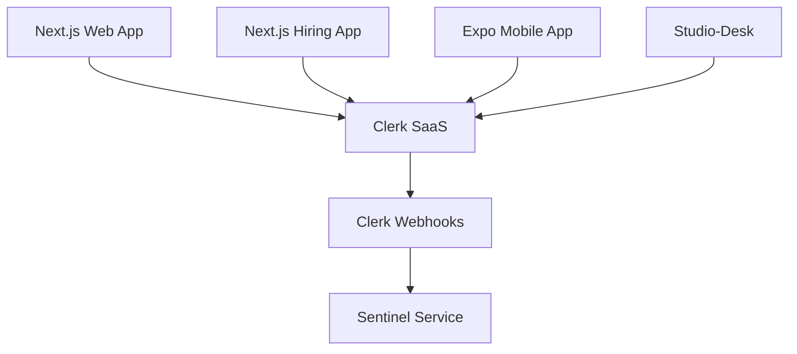
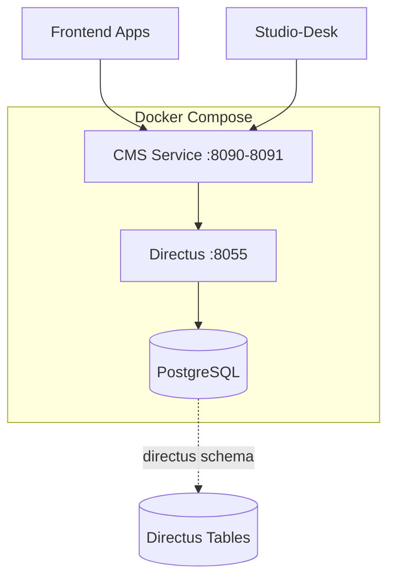

# External Services & Integrations

This document describes all external services and third-party integrations used by the Anthropos platform. These are services the platform **depends on** but does not directly maintain in the core codebase.

## High-Level Summary (For PMs & Non-Engineers)

The Anthropos platform integrates with **three key external services**:

1. **Clerk** - Handles all user authentication and organization management (SaaS)
2. **Directus** - Stores and manages platform content (self-hosted via Docker)
3. **GraphQL/Wundergraph** - Unifies all backend services into a single API
4. **AI Providers** - OpenAI, Anthropic, and Azure for intelligent features

These services allow us to focus on core features while leveraging best-in-class solutions for authentication, content management, and API orchestration.

---

## Clerk (Authentication Service)

### Overview

| Property | Value |
|:---------|:------|
| **Type** | External SaaS |
| **Purpose** | User authentication, session management, organization management |
| **Website** | [clerk.com](https://clerk.com) |
| **Pricing Model** | Freemium (pay per active user) |

### What Clerk Provides

- **Authentication**: Email/password, OAuth (Google, GitHub, etc.), magic links
- **Session Management**: Secure session handling, token refresh
- **Organizations**: Multi-tenant support with roles and permissions
- **User Management**: Profile management, user metadata
- **Security**: Built-in protection against common attacks
- **Webhooks**: Real-time sync of user events

### Integration Points

Clerk is integrated across **all user-facing applications**:



#### Frontend Applications

**Next.js Apps** (Web, Hiring, Integration):
```typescript
// Uses @clerk/nextjs SDK
import { ClerkProvider } from '@clerk/nextjs'

// Environment variables
NEXT_PUBLIC_CLERK_PUBLISHABLE_KEY=pk_test_xxxxx
CLERK_SECRET_KEY=sk_test_xxxxx
NEXT_PUBLIC_CLERK_SIGN_IN_URL=/login
NEXT_PUBLIC_CLERK_SIGN_UP_URL=/sign-up
```

**Expo Mobile App**:
```typescript
// Uses Clerk mobile SDK
EXPO_PUBLIC_CLERK_PUBLISHABLE_KEY=pk_test_xxxxx
EXPO_PUBLIC_CLERK_SIGN_IN_URL=/login
```

**Studio-Desk**:
```typescript
// Frontend: @clerk/clerk-js
// Backend: @clerk/express
VITE_CLERK_PUBLISHABLE_KEY=pk_test_xxxxx
CLERK_SECRET_KEY=sk_test_xxxxx
```

#### Backend Services

**Sentinel Service**:
- Acts as the **authentication & authorization gateway**
- Validates Clerk tokens for backend services
- Syncs Clerk organizations and users to local database

**Other Backend Services**:
- Don't directly integrate with Clerk
- Route authentication through Sentinel
- Trust Sentinel's authorization decisions

### Configuration

#### Required Environment Variables

**Public Keys** (safe for frontend):
```bash
NEXT_PUBLIC_CLERK_PUBLISHABLE_KEY=pk_test_xxxxx
VITE_CLERK_PUBLISHABLE_KEY=pk_test_xxxxx
EXPO_PUBLIC_CLERK_PUBLISHABLE_KEY=pk_test_xxxxx
```

**Secret Keys** (backend only):
```bash
CLERK_SECRET_KEY=sk_test_xxxxx
```

**URLs**:
```bash
NEXT_PUBLIC_CLERK_SIGN_IN_URL=/login
NEXT_PUBLIC_CLERK_SIGN_UP_URL=/sign-up
CLERK_SIGN_IN_URL=http://localhost:3000/login
```

#### Getting Clerk Credentials

1. Sign up at [clerk.com](https://clerk.com)
2. Create a new application
3. Copy publishable and secret keys from dashboard
4. Configure Auth providers (Google, GitHub, etc.)
5. Set up webhooks (for user sync)

### Development Workflow

#### Local User Sync (Optional)

To sync Clerk users to the local database during development, use **Tailscale Funnel**:

1. Install and run Tailscale on your machine
2. Enable Funnel for your organization
3. Expose your local Sentinel service:

```bash
# Option A: Mac App Store install
/Applications/Tailscale.app/Contents/MacOS/Tailscale funnel http://localhost:8082

# Option B: Website install
tailscale funnel http://localhost:8082
```

4. Configure Clerk webhooks to point to your Tailscale funnel URL
5. Log in at `http://localhost:3000/login` to trigger user creation

This is only needed the **first time** or when you need to mirror new users/organizations.

### Security Considerations

- **Never commit** secret keys to version control
- Use **different Clerk applications** for development and production
- Clerk handles **GDPR compliance** and secure password storage
- All tokens are **short-lived** and automatically refreshed

---

## Directus (Headless CMS)

### Overview

| Property | Value |
|:---------|:------|
| **Type** | Self-hosted via Docker |
| **Image** | `directus/directus:10.10.1` |
| **Purpose** | Content storage, media management, CMS |
| **Port** | 8055 |
| **Website** | [directus.io](https://directus.io) |

### What Directus Provides

- **Headless CMS**: Manage content via REST/GraphQL APIs
- **Database Abstraction**: Works directly with PostgreSQL
- **Media Management**: File uploads, image transformations
- **Content Versioning**: Track changes to content
- **Webhooks**: Real-time notifications on content changes
- **Admin UI**: User-friendly interface for content editors

### Architecture

Directus runs as a **Docker container** alongside core services:



### Integration Pattern

**The CMS Service acts as a smart proxy** between applications and Directus:

1. **Frontend/Studio-Desk** → GraphQL request
2. **CMS Service** → Translates to Directus API call
3. **Directus** → Queries PostgreSQL
4. **CMS Service** ← Adds business logic, caching
5. **Frontend/Studio-Desk** ← Returns enriched data

**Why the proxy pattern?**
- Add platform-specific business logic
- Cache frequently accessed content
- Abstract Directus implementation details
- Easier to migrate CMS in the future

### Docker Configuration

From `platform/docker-compose.yml`:

```yaml
directus:
  image: directus/directus:10.10.1
  ports:
    - 8055:8055
  volumes:
    - ./data/directus/uploads:/directus/uploads
    - $HOME/.aws/credentials:/home/node/.aws/credentials:ro
  environment:
    # Database
    - DB_CLIENT=pg
    - DB_CONNECTION_STRING=postgresql://postgres@postgresql:5432/postgres?sslmode=disable
    - DB_SEARCH_PATH=directus
    
    # Caching
    - REDIS=redis://redis/4
    - CACHE_STORE=redis
    - CACHE_AUTO_PURGE=true
    - CACHE_ENABLED=true
    
    # Storage
    - STORAGE_LOCATIONS=local
    - STORAGE_LOCAL_ROOT=/directus/uploads
    
    # Admin
    - PUBLIC_URL=https://localhost:8055
    - ADMIN_PASSWORD=password
    - TELEMETRY=false
```

### Data Storage

#### Database Schema

Directus uses a **dedicated PostgreSQL schema**:
```sql
-- Search path: directus
-- Contains Directus system tables + content collections
```

**Key Collections**:
- `directus_files`: Media and file metadata
- `directus_folders`: File organization
- `directus_users`: CMS admin users (separate from Clerk)
- Custom collections: Simulations, skills, skill paths, etc.

#### File Storage

**Local Development**:
```
platform/data/directus/uploads/
├── images/
├── documents/
└── media/
```

**Production**:
- Files stored in **S3** (AWS credentials mounted)
- Directus handles upload to S3 automatically
- CDN delivery for optimal performance

### CMS Service Integration

The CMS service connects to Directus via:

**Environment Variables**:
```bash
DIRECTUS_BASE_ADDR=https://content.anthropos.work
DIRECTUS_PUBLIC_BASE_ADDR=https://content.anthropos.work
```

**Code Integration** (from CMS service):
```go
// internal/directus/
// - Client initialization
// - Collection queries
// - File management
// - Webhook handlers
```

**Key Entities Managed**:
- Job simulations
- Skill definitions
- Skill paths
- Training content
- Media files

### Development Access

**Admin Interface**:
- **URL**: `http://localhost:8055`
- **Default User**: `admin@example.com`
- **Default Password**: `password` (from docker-compose)

**API Endpoints**:
- **REST**: `http://localhost:8055/items/{collection}`
- **GraphQL**: `http://localhost:8055/graphql`

### Webhooks

Directus can trigger webhooks on content changes:

**Use Cases**:
- Invalidate CMS service cache when content updates
- Trigger content regeneration in Studio-Room
- Sync content to search indexes

**Configuration**: Set up in Directus admin UI under Settings → Webhooks

---

## GraphQL/Wundergraph (API Gateway)

### Overview

| Property | Value |
|:---------|:------|
| **Type** | Configured third-party (Dockerized) |
| **Technology** | Wundergraph (Next.js-based) |
| **Port** | 5050 |
| **Purpose** | GraphQL federation, unified API gateway |
| **Repository** | `git@github.com:anthropos-work/graphql-wundergraph.git` |

### What Wundergraph Provides

- **GraphQL Federation**: Combines multiple service APIs into one
- **Type-Safe Client**: Auto-generated TypeScript clients
- **Authentication**: Integrates with Clerk
- **Caching**: Built-in response caching
- **Subscriptions**: Real-time data via GraphQL subscriptions

### Architecture

Wundergraph **aggregates all backend services** into a unified GraphQL API:

```mermaid
graph TB
    subgraph Frontend
        Web[Next.js Web]
        Desk[Studio-Desk]
    end
    
    subgraph Gateway
        WG[Wundergraph :5050]
    end
    
    subgraph Backend[Backend Services]
        Backend[Backend]
        CMS[CMS]
        Skiller[Skiller]
        JobSim[Job Simulation]
        Intelligence[Intelligence]
    end
    
    Web --> WG
    Desk --> WG
    WG --> Backend
    WG --> CMS
    WG --> Skiller
    WG --> JobSim
    WG --> Intelligence
```

### Service Dependencies

From `docker-compose.yml`, Wundergraph depends on:
- Backend
- CMS
- Skiller
- Jobsimulation
- Intelligence

**Starts only when all these services are running.**

### Configuration

**Environment**:
```bash
ENVIRONMENT=compose  # or production
```

**Build Context**:
```yaml
build:
  context: git@github.com:anthropos-work/graphql-wundergraph.git#main
  ssh: ["default"]
  args:
    ENVIRONMENT: compose
```

### Development Usage

#### Frontend Integration

**Next.js Apps**:
```typescript
// Generated client from Wundergraph
import { createClient } from '@/lib/graphql/client'

const client = createClient({
  endpoint: process.env.NEXT_PUBLIC_GRAPHQL_ENDPOINT
})

// Type-safe queries
const user = await client.query({
  operationName: 'GetUser',
  variables: { id: '123' }
})
```

**Studio-Desk**:
```typescript
// GraphQL Code Generator approach
// Queries in app/graphql/*.graphql
// Types in app/__generated__/

// Environment
VITE_GRAPHQL_ENDPOINT=http://localhost:5050/graphql
```

#### Playground

Access GraphQL playground at:
```
http://localhost:5050/
```

**Features**:
- Schema exploration
- Query testing
- Subscription testing
- Auto-complete and validation

### Schema Updates

When backend services add new GraphQL types or operations:

1. **Backend service** updates its GraphQL schema
2. **Restart Wundergraph**: `docker compose restart graphql`
3. **Studio-Desk**: Run `npm run codegen` to regenerate types
4. **Next.js apps**: Regenerate clients as needed

---

## AI Providers (External Intelligence)

The platform relies on several AI providers for the **Studio-Desk Copilot** and **Studio-Room generation pipeline**.

### Supported Providers

| Provider | Service | Integration Point | Purpose |
|:---|:---|:---|:---|
| **OpenAI** | SaaS | Studio-Desk, Studio-Room | GPT-4o, GPT-5.x for content generation |
| **Anthropic** | SaaS | Studio-Room | Claude 3.x for analytical tasks |
| **Azure OpenAI** | SaaS | Studio-Room | Private enterprise deployment of GPT models |

### Configuration

AI services are configured via environment variables in `platform/.env` (for backend) or `studio/.env` (for studio services):

```bash
# OpenAI
OPENAI_API_KEY=sk-proj-xxxxx
OPENAI_ORG_ID=org-xxxxx

# Anthropic
ANTHROPIC_API_KEY=sk-ant-xxxxx

# Azure OpenAI (Optional)
AZURE_OPENAI_KEY=xxxxx
AZURE_OPENAI_ENDPOINT=https://resource.openai.azure.com/
AZURE_OPENAI_DEPLOYMENT=deployment-name
```

### Usage Patterns

1. **Studio-Desk Copilot**:
   - Uses **OpenAI** directly via backend proxy
   - Supports streaming responses for real-time interaction
   - Uses `gpt-5.1` (experimental) or `gpt-4o` (stable)

2. **Studio-Room Pipeline**:
   - Uses abstract **AI Service Layer** (`services/ai.py`)
   - Can switch providers based on task type (Creative vs Analytical)
   - Configured in `studio-room/configs/*.ini`

---

## Development Setup Summary

### Required Accounts
- **Clerk**: `clerk.com` (free tier available)

### Required Services (via Docker)
```bash
cd platform
docker compose up -d directus graphql
```

### Environment Variables Checklist

**For Next.js Apps**:
```bash
NEXT_PUBLIC_CLERK_PUBLISHABLE_KEY=pk_test_xxxxx
CLERK_SECRET_KEY=sk_test_xxxxx
NEXT_PUBLIC_GRAPHQL_ENDPOINT=http://localhost:5050/graphql
```

**For Studio-Desk**:
```bash
VITE_CLERK_PUBLISHABLE_KEY=pk_test_xxxxx
CLERK_SECRET_KEY=sk_test_xxxxx
VITE_GRAPHQL_ENDPOINT=http://localhost:5050/graphql
```

**For CMS Service**:
```bash
DIRECTUS_BASE_ADDR=https://content.anthropos.work
DIRECTUS_PUBLIC_BASE_ADDR=https://content.anthropos.work
```

---

## Production Deployment

### Clerk
- Use **production Clerk application** (separate from dev)
- Configure production URLs in Clerk dashboard
- Set up webhooks to production Sentinel endpoint

### Directus
- Deploy via Docker in production infrastructure
- Configure S3 for file storage
- Set up CDN for media delivery
- Enable HTTPS with proper SSL certificates

### Wundergraph
- Build and deploy as Docker container
- Configure production backend service URLs
- Enable caching and CDN if needed

---

## Troubleshooting

### Clerk Issues

**"Invalid publishable key"**:
- Ensure key starts with `pk_test_` (dev) or `pk_live_` (prod)
- Check environment variables are loaded correctly

**Users not syncing**:
- Verify Tailscale funnel is running (dev)
- Check Clerk webhooks are configured correctly
- Inspect Sentinel logs for sync errors

### Directus Issues

**"Cannot connect to Directus"**:
```bash
# Ensure Directus container is running
docker compose ps directus

# Check logs
docker compose logs directus
```

**File uploads failing**:
- Verify `./data/directus/uploads` directory exists
- Check AWS credentials are mounted (production)
- Ensure storage permissions are correct

### GraphQL Issues

**"GraphQL endpoint not responding"**:
```bash
# Ensure Wundergraph is running
docker compose ps graphql

# Check dependent services are up
docker compose ps backend cms skiller jobsimulation intelligence
```

**Schema outdated**:
```bash
# Restart Wundergraph to reload schemas
docker compose restart graphql
```

---

## Related Documentation
- [Service Taxonomy](./service_taxonomy.md) - Service categorization
- [CMS Service](../services/cms.md) - Directus proxy/adapter
- [Studio-Desk](../services/studio-desk.md) - Uses Clerk + GraphQL
- [Architecture Overview](./architecture_overview.md) - System architecture
