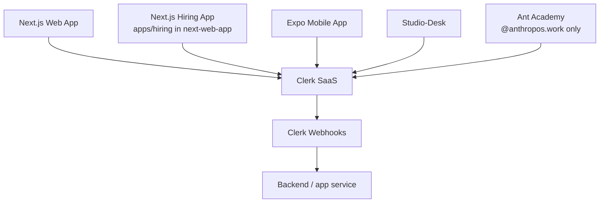
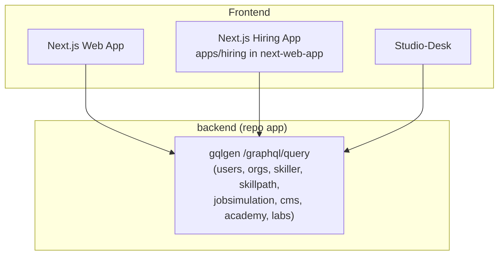

# External Services & Integrations

This document describes all external services and third-party integrations used by the Anthropos platform. These are services the platform **depends on** but does not directly maintain in the core codebase.

## High-Level Summary (For PMs & Non-Engineers)

The Anthropos platform integrates with a handful of key external services:

1. **Clerk** - Handles all user authentication and organization management (SaaS)
2. **Directus** - Stores and manages platform content (self-hosted via Docker)
3. **AI Providers** - OpenAI, Anthropic, and Azure for intelligent features
4. **Brevo** - Transactional email, product tracking, and the marketing-contact sync
5. **AWS S3** - Object storage (session recordings, documents, assets), CloudFront-fronted for public media

These services allow us to focus on core features while leveraging best-in-class solutions for authentication, content management, and AI.

> **GraphQL is no longer on this list.** The WunderGraph/Cosmo federation router — the one
> third-party piece of API orchestration the platform ran — was **retired on 2026-07-31**. There is
> no gateway and no supergraph; `backend` serves its own GraphQL. The
> [GraphQL endpoint section](#graphql-endpoint--backends-own-gqlgen-server) below is kept because
> the *integration view* (frontend wiring, codegen, troubleshooting) still needs a home — it just
> describes a first-party endpoint now.

> **Brevo and S3 moved up into this document at v9.0 "support-in-app"** (2026-08-04). They were
> previously reached *through* the `messenger` and `storage` microservices; those folded into
> `app`, so `backend` now talks to both vendors directly. Same vendors, one fewer hop — and,
> for Brevo, one credential covering three uses.

---

## Clerk (Authentication Service)

### Overview

| Property | Value |
|:---------|:------|
| **Type** | External SaaS |
| **Purpose** | User authentication, session management, organization management |
| **Website** | [clerk.com](https://clerk.com) |
| **Pricing Model** | Freemium (pay per active user) |

> **Full integration picture** — what Clerk is used for (the authentication-vs-authorization split), how it's wired, which repos depend on it, and each one's SDK — lives in **[Clerk Integration](../services/clerk-integration.md)**. This section is the external-services-catalog overview.

### What Clerk Provides

- **Authentication**: Email/password, OAuth (Google, GitHub, etc.), magic links
- **Session Management**: Secure session handling, token refresh
- **Organizations**: Multi-tenant support with roles and permissions
- **User Management**: Profile management, user metadata
- **Security**: Built-in protection against common attacks
- **Webhooks**: Real-time sync of user events

### Integration Points

Clerk is integrated across **all user-facing applications**:


```mermaid
graph TB
    Clerk[Clerk SaaS]
    
    Web[Next.js Web App]
    Hiring[Next.js Hiring App<br/>apps/hiring in next-web-app]
    Mobile[Expo Mobile App]
    Desk[Studio-Desk]
    Academy[Ant Academy<br/>@anthropos.work only]
    
    Web --> Clerk
    Hiring --> Clerk
    Mobile --> Clerk
    Desk --> Clerk
    Academy --> Clerk
    
    Clerk --> Webhook[Clerk Webhooks]
    Webhook --> Backend[Backend / app service]
```

#### Per-application integration

Each app authenticates with its framework's Clerk SDK — `@clerk/nextjs` (next-web-app web/hiring/integration + ant-academy), `@clerk/clerk-expo` (mobile), `@clerk/clerk-js` + `@clerk/express` (studio-desk), and `colony/authn` + `clerk-sdk-go/v2` (Go services). The next-web-app `/enterprise` area, studio-desk admin tooling, and ant-academy content are additionally gated **directly** on Clerk `org:admin` / org membership. Per-repo SDKs and the auth/authz split: [Clerk Integration → Dependent Repos](../services/clerk-integration.md#dependent-repos--how-they-integrate).

#### Backend Services

**Sentinel Service**:
- Acts as the centralized **authorization** service (Casbin RBAC/ABAC)
- Does NOT perform authentication and does NOT validate Clerk tokens — JWT validation is done in each consuming service via the shared `authn` library (now `colony/authn`)
- Clerk user/org sync is handled by the `app`/backend service via Clerk webhooks (see [webhook_setup.md](../ops/webhook_setup.md)), not by Sentinel

**Other Backend Services**:
- Don't directly integrate with Clerk for sync (that's the backend's job)
- Call Sentinel via Connect-RPC for authorization decisions; authenticate independently via the `authn`/Clerk JWT middleware
- Trust Sentinel's authorization decisions

### Configuration

Credentials live in `platform/.env` (backend) and each app's own env: a backend `CLERK_SECRET_KEY` + `CLERK_WEBHOOK_SECRET`, plus a framework-prefixed publishable key per frontend (`NEXT_PUBLIC_` / `VITE_` / `EXPO_PUBLIC_CLERK_PUBLISHABLE_KEY`) and sign-in/up URLs. Full key list: [Clerk Integration → Configuration](../services/clerk-integration.md#configuration-keys). Get keys by creating an app at [clerk.com](https://clerk.com) (use **separate dev/prod apps**) and configuring webhooks for user/org sync.

### Development Workflow

#### Local Webhook Setup (For User/Org Sync)

Clerk webhooks sync user and organization data to your local database. Without working webhooks, users created in Clerk won't appear locally.

**Quick Start** (no account needed):
```bash
# Start a tunnel to expose localhost:8082
npx localtunnel --port 8082
```

Then configure the webhook URL in Clerk Dashboard pointing to `https://<your-url>/api/webhook/clerk`.

**For detailed setup instructions**, see the [Webhook Setup Guide](../ops/webhook_setup.md), which covers:
- Full localtunnel setup with Clerk configuration
- More reliable alternatives (ngrok, Tailscale Funnel)
- Troubleshooting common issues
- Security considerations

**Note**: This is only needed when you need user/org sync. For pure frontend development with existing test accounts, webhook setup can be skipped.

### Security Considerations

- **Never commit** secret keys to version control
- Use **different Clerk applications** for development and production
- Clerk handles **GDPR compliance** and secure password storage
- All tokens are **short-lived** and automatically refreshed

---

## Directus (Headless CMS)

### Overview

| Property | Value |
|:---------|:------|
| **Type** | Self-hosted Headless CMS (lives in **production**) |
| **Address** | `https://content.anthropos.work` (the prod public instance) |
| **Purpose** | Content storage, media management, CMS |
| **Website** | [directus.io](https://directus.io) |

> **The platform `docker-compose.yml` has NO directus service.** A local stack does not run Directus — the cms domain in `backend`
> reaches Directus over the network via `DIRECTUS_BASE_ADDR` / `DIRECTUS_PUBLIC_BASE_ADDR` (the only service the
> compose gives these env vars), which point at the **production** instance `https://content.anthropos.work` in
> the stock compose. A freshly-
> built local stack reads its public content **live from prod**. (Earlier revisions of this doc described a
> `directus/directus:10.10.1` compose service on port 8055 with an `admin@example.com` / `password` admin login
> and an inline `docker-compose.yml` snippet — **all of that is false**; that service has never existed in the
> platform compose, verified against `stack-dev/platform/docker-compose.yml`.)
>
> **A *local* Directus is a Rosetta tooling feature, not a platform-compose service.** The v1.5 "prop room"
> tooling (`rosetta-extensions`) can stand up a **per-stack** local Directus — `directus/directus:11.6.1`, on an
> **offset port** — serving the captured public library so a stack is content-self-contained (demo-default /
> dev-opt-in `--local-content`). The bootstrap empirics, image pin, and locally-minted admin all live there. See
> [`corpus/ops/directus-local.md`](../ops/directus-local.md). Everything below describes the **production**
> Directus the platform reads from, except where it explicitly says "local tooling".

### What Directus Provides

- **Headless CMS**: Manage content via REST/GraphQL APIs
- **Database Abstraction**: Works directly with PostgreSQL
- **Media Management**: File uploads, image transformations
- **Content Versioning**: Track changes to content
- **Webhooks**: Real-time notifications on content changes
- **Admin UI**: User-friendly interface for content editors

### Architecture

In the **default local posture**, Directus is **not** part of the local stack — `backend` (which hosts the cms
domain since cms-in-app) reaches the **production** Directus over the network. Only the local Postgres +
`backend` run in Docker Compose:

```mermaid
graph TB
    subgraph Docker[Docker Compose (local stack)]
        CMS[CMS Service :8090-8091]
        Postgres[(PostgreSQL)]
    end

    subgraph Prod[Production]
        Directus[Directus — content.anthropos.work]
    end

    Frontend[Frontend Apps]
    StudioDesk[Studio-Desk]

    Frontend --> CMS
    StudioDesk --> CMS
    CMS -->|DIRECTUS_BASE_ADDR| Directus
    Directus --> ProdPG[(Prod PostgreSQL · directus schema)]
```

> With the v1.5 "prop room" **local tooling** (`--local-content` / demo-default), a per-stack `directus`
> container is added to the stack's compose (offset port) and `backend`'s `DIRECTUS_BASE_ADDR` is re-pointed at it,
> so the whole content path stays in-stack. See [`directus-local.md`](../ops/directus-local.md).

### Integration Pattern

**The CMS Service acts as a smart proxy** between applications and Directus:

1. **Frontend/Studio-Desk** → GraphQL request
2. **CMS Service** → Translates to Directus API call
3. **Directus** → Queries PostgreSQL
4. **CMS Service** ← Adds business logic, caching
5. **Frontend/Studio-Desk** ← Returns enriched data

**Why the proxy pattern?**
- Add platform-specific business logic
- Cache frequently accessed content
- Abstract Directus implementation details
- Easier to migrate CMS in the future

### Compose configuration

There is **no `directus` service in `platform/docker-compose.yml`** — `backend` reaches the production Directus via
the env vars below; the platform compose never defines, builds, or runs a Directus container. (A previous
revision of this doc reproduced a `directus:` compose block — image `10.10.1`, `ADMIN_PASSWORD=password`, a
mounted uploads volume — and attributed it to `platform/docker-compose.yml`. That block is fictional; the
platform compose has no such service.)

The only Directus-related platform config is the address `backend` points at:

```bash
# platform/.env (and the backend service environment)
DIRECTUS_BASE_ADDR=https://content.anthropos.work
DIRECTUS_PUBLIC_BASE_ADDR=https://content.anthropos.work
```

> The **per-stack local Directus** that the v1.5 "prop room" tooling stands up (`directus/directus:11.6.1`, on an
> offset port, with a **locally-minted** admin) is defined in the **tooling's** compose overlay, not the platform
> repo. Its real, empirically-pinned config lives in [`directus-local.md`](../ops/directus-local.md).

### Data Storage

#### Database Schema

Directus uses a **dedicated PostgreSQL schema**:
```sql
-- Search path: directus
-- Contains Directus system tables + content collections
```

**Key Collections**:
- `directus_files`: Media and file metadata
- `directus_folders`: File organization
- `directus_users`: CMS admin users (separate from Clerk)
- Custom collections: Simulations, skills, skill paths, etc.

#### File Storage

**Local Development**: there is no local Directus and no local uploads directory in the default posture. Image
bytes are served from the **asset plane** — prod's anonymous public `<DIRECTUS_PUBLIC_BASE_ADDR>/assets/<uuid>`
links, which browsers fetch token-less (now `app/internal/cms/directus/`). Even when the v1.5 local tooling
serves the *data plane* (catalog rows) from a per-stack Directus, the *asset plane* stays on prod's public links
so images stay real — no blob bytes are copied locally.

**Production**:
- Files stored in **S3** (AWS credentials mounted)
- Directus handles upload to S3 automatically
- CDN delivery for optimal performance

### CMS Service Integration

The CMS service connects to Directus via:

**Environment Variables**:
```bash
DIRECTUS_BASE_ADDR=https://content.anthropos.work
DIRECTUS_PUBLIC_BASE_ADDR=https://content.anthropos.work
```

**Code Integration** (from CMS service):
```go
// internal/directus/
// - Client initialization
// - Collection queries
// - File management
// - Webhook handlers
```

**Key Entities Managed**:
- Job simulations
- Skill definitions
- Skill paths
- Training content
- Media files

### Development Access

In the **default posture there is no local Directus to log into** — content comes from the production instance,
which developers don't administer locally. There is no `localhost:8055` admin and **no `admin@example.com` /
`password` login** (that earlier claim was tied to the fictional compose service above).

**When the v1.5 local tooling stands a per-stack Directus up** (`--local-content` / demo-default), it listens on
an **offset port** (8055 on the first stack, offset thereafter) with a **locally-minted** admin
(`admin@<stack>.example.com`, an RFC-2606 reserved address — never a real mailbox; see
[`directus-local.md`](../ops/directus-local.md)). Against **that** local instance:

- **Admin UI / REST / GraphQL**: `http://localhost:<offset-8055>/` , `…/items/{collection}` , `…/graphql`

### Webhooks

Directus can trigger webhooks on content changes:

**Use Cases**:
- Invalidate CMS service cache when content updates
- Trigger content regeneration in Studio-Room
- Sync content to search indexes

**Configuration**: Set up in Directus admin UI under Settings → Webhooks

---

## GraphQL endpoint — `backend`'s own gqlgen server

> **The federation router is gone.** WunderGraph/Cosmo was **retired 2026-07-31** and the
> `graphql-wundergraph` repo is archived. There is no gateway container, no supergraph, no
> composition step, and **host port `:5050` is free**. Everything below describes the endpoint that
> replaced it — which is not an external service at all, but `backend`'s own gqlgen server.
> For the retired gateway's record see [`graphql-wundergraph.md`](../services/graphql-wundergraph.md).

### Overview

| Property | Value |
|:---------|:------|
| **Type** | First-party — served by `backend` (repo `app`), not a separate process |
| **Technology** | gqlgen (Go), inside the `app` monolith |
| **Production URL** | `https://gql.anthropos.work/graphql/query` |
| **Local URL** | `http://localhost:8082/graphql/query` |
| **Container port** | `backend` HTTP `8080` (prod) / host `8082` (local compose) |
| **Schema source** | `app/internal/web/backend/graphql/graph/schemas/*.graphqls` |

### How the endpoint is wired in production

`gql.anthropos.work` is a Route53 **alias A record** onto the platform ALB. It has its own
DNS-validated ACM cert (`infrastructure/terraform/production/gql_endpoint.tf`), but **not** its own
ALB rule: `base_service` exposes no target-group output, so `gql.anthropos.work` is appended to
`backend`'s existing rule's `host_headers_condition` (priority **100**, alongside
`api.anthropos.work`) in `locals.tf`. One rule, two hostnames, one target group.

> **Security posture.** Introspection and the Apollo Sandbox playground are disabled in
> staging/production **at the app layer**, and anonymous GraphQL is already rejected by the
> viewer/auth layer. That hardening had to ship *before* `gql.anthropos.work` was applied, so the
> host never served an introspectable schema.

### Path matters: `/graphql/query`, not `/graphql`

`backend` serves the executable endpoint at **`/graphql/query`**. The bare `/graphql` path returns
the Apollo Sandbox UI (where enabled); CORS preflight and auth happen at `/query`. Tools and
clients configured with a plain `/graphql` will not work.

### Architecture


```mermaid
graph TB
    subgraph Frontend
        Web[Next.js Web App]
        Hiring[Next.js Hiring App<br/>apps/hiring in next-web-app]
        Desk[Studio-Desk]
    end

    subgraph Backend["backend (repo app)"]
        GQL["gqlgen /graphql/query<br/>(users, orgs, skiller, skillpath,<br/>jobsimulation, cms, academy, labs)"]
    end

    Web --> GQL
    Hiring --> GQL
    Desk --> GQL
```

### Configuration

The env var **names** are historical — they date from the router and were deliberately **not**
renamed. The values point at `backend`.

| Variable | Consumer | Local value |
|----------|----------|-------------|
| `NEXT_PUBLIC_WUNDERGRAPH_ENDPOINT` | `next-web-app` (`apps/web`, `apps/hiring`, `apps/integration`), `ant-academy` | `http://localhost:8082/graphql/query` |
| `GRAPHQL_SCHEMA_FOR_GEN` | `next-web-app` codegen | `http://localhost:8082/graphql/query` |
| `VITE_GRAPHQL_ENDPOINT` | `studio-desk` | `http://localhost:8082/graphql/query` |

> **Do not rename these.** Renaming is a coordinated code + deploy change across `next-web-app`,
> `ant-academy`, `studio-desk` and their deploy configs. In production, `infrastructure`'s
> `services.tf` also still passes a **dead** `wundergraph_endpoint = ""` to the next-web-app module
> — the projects read `backend_gql_endpoint` instead, but the variable has no default in
> next-web-app `v2.133.0` so it must still be supplied.

### Development Usage

**Next.js Apps**:
```typescript
import { createClient } from '@/lib/graphql/client'

const client = createClient({
  // reads NEXT_PUBLIC_WUNDERGRAPH_ENDPOINT — the name is a fossil, the value is backend
  endpoint: process.env.NEXT_PUBLIC_WUNDERGRAPH_ENDPOINT
})

const user = await client.query({
  operationName: 'GetUser',
  variables: { id: '123' }
})
```

**Studio-Desk**:
```bash
# Queries in app/graphql/*.graphql, types in app/__generated__/
VITE_GRAPHQL_ENDPOINT=http://localhost:8082/graphql/query
```

#### Playground

In local compose, `backend` serves the Apollo Sandbox UI at:
```
http://localhost:8082/graphql
```
(Disabled in staging/production — see the security note above.)

### Schema Updates

Adding a GraphQL type or operation is now a **single-service** change — there is no supergraph to
recompose and no gateway to rebuild or restart:

1. **`app`** — update the Ent schema + `internal/web/backend/graphql/graph/schemas/*.graphqls`, then
   `make gen` (and `make migrations` if the DB changed)
2. **Rebuild `backend`** — `cd platform && make up`
3. **`next-web-app`** — `pnpm codegen` (it introspects `GRAPHQL_SCHEMA_FOR_GEN`, so **`backend` must
   be running**), then update the UI
4. **Studio-Desk** — `npm run codegen`

---

## AI Providers (External Intelligence)

The platform relies on multiple AI providers across backend services, Studio tools, and the simulation engine. All Go services access AI through the shared `ai` library, which provides **unified provider access** behind one `ai.AI` interface (OpenAI, Azure, Anthropic, Bedrock, Mistral). **EU-first routing and cost tracking are implemented in the consuming services, not in the `ai` library itself** — see [Shared Libraries → ai](./shared_libraries.md#ai).

For full details on models, routing, voice engines, and recording architecture, see [AI Architecture](./ai_architecture.md).

### Supported Providers

| Provider | Routing | Integration Points | Purpose |
|:---|:---|:---|:---|
| **Azure OpenAI (EU)** | Primary | Jobsimulation, Backend (app — merged skiller domain), CMS, Studio | GPT-5.x, GPT-4.1 for simulations and content |
| **AWS Bedrock (EU)** | Primary | Jobsimulation, Backend (app) | Claude 4.5/4 Sonnet for simulations |
| **Mistral (EU)** | Primary | CMS | OCR and specialized tasks |
| **OpenAI Direct (US)** | Fallback | All services | Fallback when EU unavailable |
| **Anthropic Direct (US)** | Fallback | Studio-Room | Fallback for analytical tasks |

### EU-First Routing

AI requests follow a strict EU-first policy for data residency compliance:
1. Azure OpenAI (EU-West) → 2. AWS Bedrock (EU) → 3. Mistral (EU) → 4. OpenAI Direct (US) → 5. Anthropic Direct (US)

### Configuration

AI services are configured via environment variables in `platform/.env`:

```bash
# OpenAI
OPENAI_API_KEY=sk-proj-xxxxx
OPENAI_ORG_ID=org-xxxxx

# Anthropic
ANTHROPIC_API_KEY=sk-ant-xxxxx

# Azure OpenAI
AZURE_OPENAI_KEY=xxxxx
AZURE_OPENAI_ENDPOINT=https://resource.openai.azure.com/
AZURE_OPENAI_DEPLOYMENT=deployment-name
```

### Usage Patterns

1. **Simulation Engine** (Jobsimulation):
   - AI-powered conversations (voice + chat) with configurable model per simulation
   - Voice calls via **LiveKit + GPT Realtime** agents
   - Document analysis and code evaluation

2. **Skills Matching** (Backend `app` — merged skiller domain):
   - Embeddings (Text Embedding 3 Small) for 60K skills + 18K roles
   - RAG for job role matching

3. **Studio-Desk Copilot**:
   - Uses a configurable multi-provider chain (Azure OpenAI / OpenAI / Anthropic) via backend proxy, with tier-based model selection and circuit-breaker failover (`AI_PROVIDER_CHAIN`, default `azure-openai,openai`)
   - Supports streaming responses for real-time interaction
   - Default models: `gpt-5.2` (OpenAI/Azure) or `claude-sonnet-4-5` / `claude-opus-4-5` (Anthropic)

4. **Studio-Room Pipeline**:
   - Uses abstract **AI Service Layer** (`services/ai.py`)
   - Configurable model slots (FAST, STRICT, EXECUTION, CREATIVE, REASONING)
   - Configured in `studio-room/configs/*.ini`

---

## LiveKit (Voice Engine)

| Property | Value |
|:---------|:------|
| **Type** | External SaaS |
| **Purpose** | Real-time voice conversations in AI Simulations |
| **Integration** | Jobsimulation service |

LiveKit provides the real-time voice infrastructure for simulation voice calls. The platform runs **GPT Realtime agents** (`anthropos-agent-eu` / `anthropos-agent-us`) inside LiveKit rooms, enabling AI actors to hold voice conversations with players.

- **Audio**: Recorded as MP3
- **Transcripts**: Generated from conversation events
- **Coexists with ElevenLabs**: LiveKit + OpenAI Realtime powers new sessions (gated by `flag_use_realtime_openai`); ElevenLabs remains the active default for the call/reply pipeline and transcript improvement

---

## AWS Chime SDK (Recording)

| Property | Value |
|:---------|:------|
| **Type** | AWS Service |
| **Purpose** | Video/audio recording of simulation sessions |
| **Integration** | Jobsimulation service |

AWS Chime SDK captures the full simulation session (camera, screensharing, microphone) as a composited MP4 grid view. This runs in parallel with LiveKit's audio-only recording.

---

## Brevo (Email + Marketing Contacts)

| Property | Value |
|:---------|:------|
| **Type** | SaaS (formerly Sendinblue) |
| **Purpose** | Transactional email, product tracking, **and** the marketing-contact sync |
| **Integration** | **`backend` directly** — in-process since v9.0 "support-in-app" (2026-08-04) |
| **Credential** | a single `BREVO_KEY` covers all three uses |

Brevo became a **direct** `backend` dependency when [messenger](../services/messenger.md) and
[customerio-sync](../services/customerio-sync.md) folded into `app`. There is no Messenger RPC hop
and no Customer.io — the `customerio-sync` name is a fossil from a vendor the platform left long ago.

Two independent, explicitly-gated subsystems drive it:

| Subsystem | Package | Switch | What it does |
|---|---|---|---|
| Transactional mail | `app/internal/messenger/` | `MESSENGER_ENABLED` | The 24 event handlers → Liquid templates → Brevo send, on messenger's own Redis consumer group |
| Marketing contacts | `app/internal/customeriosync/` | `CUSTOMERIO_SYNC_ENABLED` | A 10-minute push of platform users to Brevo as marketing contacts, on `app`'s asynq scheduler |

> **Both are OFF unless switched on by name.** Being separate deployments used to be what kept
> them off a developer's machine; folding them in deleted that barrier, since `BREVO_KEY` is
> already in the same `.env` for product tracking. So an inferred condition — "deployed?", "key
> present?" — is deliberately **not** accepted as consent. Unset in a **deployed** environment is
> a **boot failure** rather than a default-off, because silently-unsent mail passes every health
> check. `backend` also refuses to boot if either switch is on with an empty `BREVO_KEY`.
>
> The practical consequence for a prod-dump staging stack: **leave the switches off**. Emptying
> `BREVO_KEY` with a switch on gives you a dead stack, not a muted mailer.

---

## AWS S3 (Object Storage)

| Property | Value |
|:---------|:------|
| **Type** | AWS Service |
| **Purpose** | Session recordings, simulation documents, content assets, user files, profile images |
| **Integration** | **`backend` directly** — in-process since v9.0 "support-in-app" |
| **Config** | `STORAGE_S3_BUCKET` (private) · `STORAGE_S3_PUBLIC_BUCKET` (public) · `AWS_REGION=eu-west-1` |

S3 became a direct `backend` edge when [storage](../services/storage.md) folded in.
`STORAGE_RPC_ADDR` is **gone** — no code reads it. The public bucket is fronted by CloudFront at
**`media.anthropos.work`** (`MEDIA_URL`).

Ownership of the assets themselves is the part worth remembering: the storage *ECS service* is gone,
but **`module.storage-service_euwest1` in production terraform must NOT be deleted** — it declares
both buckets, their versioning and SSE, the CloudFront distribution + OAI + bucket policy, and the
`media.anthropos.work` CNAME, and `backend`'s bucket/media inputs are wired from its outputs.

> **Local dev hits production S3 by default.** `backend`'s compose env hardcodes **both** bucket
> names to the real production buckets, and mounts `~/.aws/credentials` read-only. The private
> manager's old "/tmp fallback when the bucket is empty" no longer applies, because the bucket name
> is no longer empty. `backend` verifies bucket access at boot — but that guard is **disarmed by
> `ENVIRONMENT=development`**, so with the names blanked a local stack boots clean and silently
> writes every upload to the container's ephemeral disk.

---

## Development Setup Summary

### Required Accounts
- **Clerk**: `clerk.com` (free tier available)

### Required Services (via Docker)
```bash
cd platform
make up                        # default profile `core`: postgres, redis, sentinel, backend, gotenberg
```
> There is **no `graphql` service and no `graphql` profile** — the router was retired 2026-07-31 and
> `backend` serves GraphQL itself. `docker compose --profile <unknown>` exits **0** and selects
> nothing, so an old `--profile graphql` starts nothing while looking like it succeeded.

> The platform compose has no `directus` service to start; `cms` points `DIRECTUS_BASE_ADDR` at
> `content.anthropos.work`. To run content locally instead, use the v1.5 "prop room" tooling
> ([`directus-local.md`](../ops/directus-local.md)), not `docker compose up directus`.

### Environment Variables Checklist

**For Next.js Apps**:
```bash
NEXT_PUBLIC_CLERK_PUBLISHABLE_KEY=pk_test_xxxxx
CLERK_SECRET_KEY=sk_test_xxxxx
# historical name, points at backend
NEXT_PUBLIC_WUNDERGRAPH_ENDPOINT=http://localhost:8082/graphql/query
GRAPHQL_SCHEMA_FOR_GEN=http://localhost:8082/graphql/query
```

**For Studio-Desk**:
```bash
VITE_CLERK_PUBLISHABLE_KEY=pk_test_xxxxx
CLERK_SECRET_KEY=sk_test_xxxxx
VITE_GRAPHQL_ENDPOINT=http://localhost:8082/graphql/query
```

**For CMS Service**:
```bash
DIRECTUS_BASE_ADDR=https://content.anthropos.work
DIRECTUS_PUBLIC_BASE_ADDR=https://content.anthropos.work
```

---

## Production Deployment

### Clerk
- Use **production Clerk application** (separate from dev)
- Configure production URLs in Clerk dashboard
- Set up webhooks to production Sentinel endpoint

### Directus
- Deploy via Docker in production infrastructure
- Configure S3 for file storage
- Set up CDN for media delivery
- Enable HTTPS with proper SSL certificates

### GraphQL (`gql.anthropos.work`)
- Nothing to deploy — it is `backend`. Retiring the router removed the only deployable piece.
- The hostname is provisioned in `infrastructure/terraform/production/gql_endpoint.tf` (Route53
  alias + ACM cert) and attached to `backend`'s existing ALB rule in `locals.tf`.
- Keep introspection and the Apollo Sandbox playground **disabled** at the app layer in
  staging/production.

---

## Troubleshooting

### Clerk Issues

**"Invalid publishable key"**:
- Ensure key starts with `pk_test_` (dev) or `pk_live_` (prod)
- Check environment variables are loaded correctly

**Users not syncing**:
- Verify Tailscale funnel is running (dev)
- Check Clerk webhooks are configured correctly
- Inspect Sentinel logs for sync errors

### Directus Issues

**"Cannot connect to Directus"** (default posture — reading prod):
- `cms` reads Directus **live from prod**; there is no local `directus` container to `ps`. Check the address
  `cms` resolves: `DIRECTUS_BASE_ADDR` must be `https://content.anthropos.work` and reachable from the box.
- `docker compose logs cms` (not `directus`) surfaces the content-fetch errors.

**"Cannot connect to Directus"** (when running the local tooling, `--local-content` / demo):
```bash
# The per-stack Directus runs under the stack's OWN tooling compose, on an OFFSET port:
docker compose -p <stack> ps directus
docker compose -p <stack> logs directus
```
See [`directus-local.md`](../ops/directus-local.md) for the container lifecycle + verify probes.

**File uploads / asset bytes**:
- Image bytes are served from the **asset plane** — prod's anonymous public `…/assets/<uuid>` links — even when
  the data plane is local. There is no local uploads volume in the default posture.

### GraphQL Issues

**"GraphQL endpoint not responding"**:
```bash
# There is no gateway to check — backend IS the GraphQL server.
docker compose ps backend
docker compose logs backend --tail 50

# Smoke-test the real path (/graphql/query, not /graphql):
curl -s http://localhost:8082/graphql/query \
  -H 'content-type: application/json' \
  -d '{"query":"{ __typename }"}'
```
> `docker compose ps graphql` returns nothing and exits **0** — the service no longer exists. Same
> for `--profile graphql`. An empty result is not evidence the stack is broken; it is evidence the
> command is from a pre-2026-07-31 runbook.

**Schema outdated**:
```bash
# No supergraph to recompose and no router to restart. Rebuild backend:
cd platform && make up
# then regenerate the client types:
cd ../next-web-app && pnpm codegen     # needs backend up (GRAPHQL_SCHEMA_FOR_GEN)
```

---

## Related Documentation
- [Service Taxonomy](./service_taxonomy.md) - Service categorization
- [AI Architecture](./ai_architecture.md) - Full AI model inventory, voice, recording
- [Security & Compliance](./security_compliance.md) - Data protection, EU compliance
- [CMS Service](../services/cms.md) - Directus proxy/adapter
- [Studio-Desk](../services/studio-desk.md) - Uses Clerk + GraphQL
- [Architecture Overview](./architecture_overview.md) - System architecture
