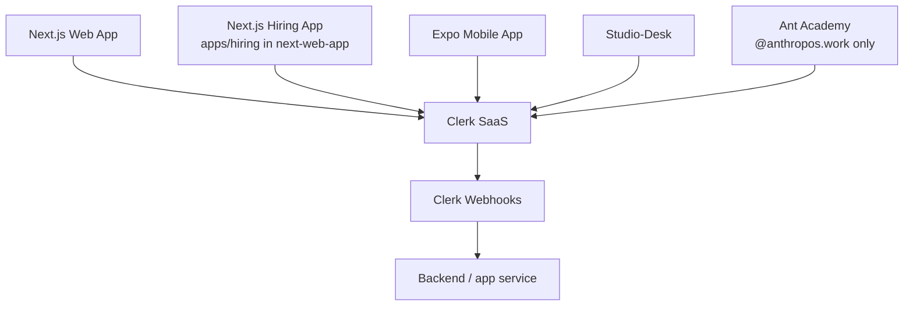

# External Services & Integrations

> **⚠️ Router status, two states (v2.8 M257x).** Platform `b56d731`+`360efd4` (merged **`2adcf71`**, 2026-07-31) **deleted the Cosmo Router from local dev** — no `graphql` compose service, no `repos.yml` entry — and re-pointed the frontends at **`backend` directly, `http://localhost:8082/graphql/query`**. **There is no `:5050` on a local stack.** In *production* the router is still declared (`graphql-wundergraph/terraform/main.tf:20` `= 1`), though **the repo is ARCHIVED on GitHub (2026-07-30)**. And the supergraph is **ONE** subgraph — `backend` — since `915da06` (2026-07-29). The fenced source of truth is [`platform-migration-status.md`](./platform-migration-status.md).


This document describes all external services and third-party integrations used by the Anthropos platform. These are services the platform **depends on** but does not directly maintain in the core codebase.

## High-Level Summary (For PMs & Non-Engineers)

The Anthropos platform integrates with **four key external services**:

1. **Clerk** - Handles all user authentication and organization management (SaaS)
2. **Directus** - Stores and manages platform content (self-hosted via Docker)
3. **GraphQL/Wundergraph** - Unifies all backend services into a single API. **Prod-only since platform `2adcf71`** — see the two-state note in that section
4. **AI Providers** - OpenAI, Anthropic, and Azure for intelligent features

These services allow us to focus on core features while leveraging best-in-class solutions for authentication, content management, and API orchestration.

---

## Clerk (Authentication Service)

### Overview

| Property | Value |
|:---------|:------|
| **Type** | External SaaS |
| **Purpose** | User authentication, session management, organization management |
| **Website** | [clerk.com](https://clerk.com) |
| **Pricing Model** | Freemium (pay per active user) |

> **Full integration picture** — what Clerk is used for (the authentication-vs-authorization split), how it's wired, which repos depend on it, and each one's SDK — lives in **[Clerk Integration](../services/clerk-integration.md)**. This section is the external-services-catalog overview.

### What Clerk Provides

- **Authentication**: Email/password, OAuth (Google, GitHub, etc.), magic links
- **Session Management**: Secure session handling, token refresh
- **Organizations**: Multi-tenant support with roles and permissions
- **User Management**: Profile management, user metadata
- **Security**: Built-in protection against common attacks
- **Webhooks**: Real-time sync of user events

### Integration Points

Clerk is integrated across **all user-facing applications**:


```mermaid
graph TB
    Clerk[Clerk SaaS]
    
    Web[Next.js Web App]
    Hiring[Next.js Hiring App<br/>apps/hiring in next-web-app]
    Mobile[Expo Mobile App]
    Desk[Studio-Desk]
    Academy[Ant Academy<br/>@anthropos.work only]
    
    Web --> Clerk
    Hiring --> Clerk
    Mobile --> Clerk
    Desk --> Clerk
    Academy --> Clerk
    
    Clerk --> Webhook[Clerk Webhooks]
    Webhook --> Backend[Backend / app service]
```

#### Per-application integration

Each app authenticates with its framework's Clerk SDK — `@clerk/nextjs` (next-web-app web/hiring/integration + ant-academy), `@clerk/clerk-expo` (mobile), `@clerk/clerk-js` + `@clerk/express` (studio-desk), and `colony/authn` + `clerk-sdk-go/v2` (Go services). The next-web-app `/enterprise` area, studio-desk admin tooling, and ant-academy content are additionally gated **directly** on Clerk `org:admin` / org membership. Per-repo SDKs and the auth/authz split: [Clerk Integration → Dependent Repos](../services/clerk-integration.md#dependent-repos--how-they-integrate).

#### Backend Services

**Sentinel Service**:
- Acts as the centralized **authorization** service (Casbin RBAC/ABAC)
- Does NOT perform authentication and does NOT validate Clerk tokens — JWT validation is done in each consuming service via the shared `authn` library (now `colony/authn`)
- Clerk user/org sync is handled by the `app`/backend service via Clerk webhooks (see [webhook_setup.md](../ops/webhook_setup.md)), not by Sentinel

**Other Backend Services**:
- Don't directly integrate with Clerk for sync (that's the backend's job)
- Call Sentinel via Connect-RPC for authorization decisions; authenticate independently via the `authn`/Clerk JWT middleware
- Trust Sentinel's authorization decisions

### Configuration

Credentials live in `platform/.env` (backend) and each app's own env: a backend `CLERK_SECRET_KEY` + `CLERK_WEBHOOK_SECRET`, plus a framework-prefixed publishable key per frontend (`NEXT_PUBLIC_` / `VITE_` / `EXPO_PUBLIC_CLERK_PUBLISHABLE_KEY`) and sign-in/up URLs. Full key list: [Clerk Integration → Configuration](../services/clerk-integration.md#configuration-keys). Get keys by creating an app at [clerk.com](https://clerk.com) (use **separate dev/prod apps**) and configuring webhooks for user/org sync.

### Development Workflow

#### Local Webhook Setup (For User/Org Sync)

Clerk webhooks sync user and organization data to your local database. Without working webhooks, users created in Clerk won't appear locally.

**Quick Start** (no account needed):
```bash
# Start a tunnel to expose localhost:8082
npx localtunnel --port 8082
```

Then configure the webhook URL in Clerk Dashboard pointing to `https://<your-url>/api/webhook/clerk`.

**For detailed setup instructions**, see the [Webhook Setup Guide](../ops/webhook_setup.md), which covers:
- Full localtunnel setup with Clerk configuration
- More reliable alternatives (ngrok, Tailscale Funnel)
- Troubleshooting common issues
- Security considerations

**Note**: This is only needed when you need user/org sync. For pure frontend development with existing test accounts, webhook setup can be skipped.

### Security Considerations

- **Never commit** secret keys to version control
- Use **different Clerk applications** for development and production
- Clerk handles **GDPR compliance** and secure password storage
- All tokens are **short-lived** and automatically refreshed

---

## Directus (Headless CMS)

### Overview

| Property | Value |
|:---------|:------|
| **Type** | Self-hosted Headless CMS (lives in **production**) |
| **Address** | `https://content.anthropos.work` (the prod public instance) |
| **Purpose** | Content storage, media management, CMS |
| **Website** | [directus.io](https://directus.io) |

> **The platform `docker-compose.yml` has NO directus service.** A local stack does not run Directus — the cms
> domain in `backend` reaches Directus over the network via `DIRECTUS_BASE_ADDR` / `DIRECTUS_PUBLIC_BASE_ADDR`,
> which point at the **production** instance `https://content.anthropos.work` in the stock compose.
> **⚠️ `backend` does NOT get those vars from its compose `environment:` block** — that block (`:43-67` @
> `2adcf71`) has no `DIRECTUS_*` at all; `backend` picks them up from the shared `env_file: .env`. The only
> service the compose sets them on **explicitly** is the still-running standalone **`cms`** (`:164-165`), which
> survives as messenger's `CMS_RPC_ADDR` target + the rollback path until M810. This distinction is
> load-bearing for any tooling that re-points the address per service — see the ⚠️ under *Architecture* below.
 A freshly-
> built local stack reads its public content **live from prod**. (Earlier revisions of this doc described a
> `directus/directus:10.10.1` compose service on port 8055 with an `admin@example.com` / `password` admin login
> and an inline `docker-compose.yml` snippet — **all of that is false**; that service has never existed in the
> platform compose, verified against `stack-dev/platform/docker-compose.yml`.)
>
> **A *local* Directus is a Rosetta tooling feature, not a platform-compose service.** The v1.5 "prop room"
> tooling (`rosetta-extensions`) can stand up a **per-stack** local Directus — `directus/directus:11.6.1`, on an
> **offset port** — serving the captured public library so a stack is content-self-contained (demo-default /
> dev-opt-in `--local-content`). The bootstrap empirics, image pin, and locally-minted admin all live there. See
> [`corpus/ops/directus-local.md`](../ops/directus-local.md). Everything below describes the **production**
> Directus the platform reads from, except where it explicitly says "local tooling".

### What Directus Provides

- **Headless CMS**: Manage content via REST/GraphQL APIs
- **Database Abstraction**: Works directly with PostgreSQL
- **Media Management**: File uploads, image transformations
- **Content Versioning**: Track changes to content
- **Webhooks**: Real-time notifications on content changes
- **Admin UI**: User-friendly interface for content editors

### Architecture

In the **default local posture**, Directus is **not** part of the local stack — `backend` (which hosts the cms
domain since cms-in-app) reaches the **production** Directus over the network. The default `graphql` profile is
**not** just Postgres + `backend`: it starts **nine** containers — `postgresql` + `redis` (from the included
`common.yml`, profile-less so they always start) and seven application services, `sentinel` · `backend` ·
`jobsimulation` · `cms` · `storage` · `roadrunner` · `gotenberg`. The `jobsimulation` and `cms` containers are
**merged-into-`app` husks kept live as the rollback path** (teardown is M810) — merged in production is not the
same claim as removed from compose:

```mermaid
graph TB
    subgraph Docker[Docker Compose (local stack)]
        Backend[backend :8082 — hosts the cms domain in-process]
        CMSHusk[cms :8090-8091 — merged-into-app husk, rollback path]
        Postgres[(PostgreSQL)]
    end

    subgraph Prod[Production]
        Directus[Directus — content.anthropos.work]
    end

    Frontend[Frontend Apps]
    StudioDesk[Studio-Desk]

    Frontend -->|:8082/graphql/query| Backend
    StudioDesk -->|:8082/graphql/query| Backend
    Backend -->|DIRECTUS_BASE_ADDR from env_file| Directus
    CMSHusk -.->|DIRECTUS_BASE_ADDR from compose| Directus
    Directus --> ProdPG[(Prod PostgreSQL · directus schema)]
```

> **Both frontends target `backend`, not `cms`** (`docker-compose.yml:352`/`:361` for next-web-app, `:318`/`:334`
> for studio-desk — all four are `:8082/graphql/query`). And `backend` does **not** proxy content through the
> `cms` container: `app/cms_reader_switch.go` swaps the cms content reader in-place to the **in-process** cms
> RPC server once Directus is configured, so every content read is *"a DIRECT domain call — no proto round-trip
> … and no internal traffic to a standalone cms."* `backend` requires `DIRECTUS_BASE_ADDR` to boot at all
> (`app/main.go:971-973` `log.Fatalf`s without it). The prose two paragraphs above already said this; the
> diagram had not caught up.

> **The `--local-content` re-point targets BOTH `cms` and `backend`.** With the v1.5 "prop room" **local
> tooling** (`--local-content` / demo-default) a per-stack `directus` container is added to the stack's
> compose on an offset port, and `rosetta-extensions/stack-injection/gen_injected_override.py:598-599`
> re-points every service in `DIRECTUS_DATA_CONSUMERS`, which is **`("cms", "backend")`** (`:53`). `backend`
> is in that tuple because — per the `cms_reader_switch` above — **`backend` is the service that actually
> reads Directus**; re-pointing only `cms` would leave the real reader aimed at production content.
>
> **HISTORICAL — fixed at M257x iter-24 (rext `f9ac72f`).** The tuple originally named `cms` alone, and a
> test (`test_only_cms_is_repointed_not_other_services`) asserted that `backend` must **not** carry the
> re-point — i.e. the suite was *pinning the defect*. Measured on live `demo-1` (2026-08-01) before the fix:
> `cms` had `DIRECTUS_BASE_ADDR=http://directus:8055` while `backend` still had
> `https://content.anthropos.work` with an empty `DIRECTUS_TOKEN`, which surfaced as **96 all-403 lines** in
> `backend`'s log. That test is gone, replaced by `test_backend_the_actual_reader_is_repointed`
> (`stack-injection/tests/test_injection.py:1005`), which asserts the opposite. See
> [`directus-local.md`](../ops/directus-local.md).

### Integration Pattern

**The cms domain inside `backend` acts as a smart proxy** between applications and Directus (it was the
standalone CMS Service until cms-in-app folded it into `app`):

1. **Frontend/Studio-Desk** → GraphQL request to `backend:8082/graphql/query`
2. **cms domain** (`app/internal/cms/directus/`) → Translates to Directus API call
3. **Directus** → Queries PostgreSQL
4. **cms domain** ← Adds business logic, caching
5. **Frontend/Studio-Desk** ← Returns enriched data

**Why the proxy pattern?**
- Add platform-specific business logic
- Cache frequently accessed content
- Abstract Directus implementation details
- Easier to migrate CMS in the future

### Compose configuration

There is **no `directus` service in `platform/docker-compose.yml`** — `backend` reaches the production Directus via
the env vars below; the platform compose never defines, builds, or runs a Directus container. (A previous
revision of this doc reproduced a `directus:` compose block — image `10.10.1`, `ADMIN_PASSWORD=password`, a
mounted uploads volume — and attributed it to `platform/docker-compose.yml`. That block is fictional; the
platform compose has no such service.)

The only Directus-related platform config is the address `backend` points at — set in the shared `.env`, which
`backend` consumes via `env_file:` (its compose `environment:` block carries no `DIRECTUS_*`):

```bash
# platform/.env  — backend reads these through `env_file: .env`, NOT its compose environment: block
DIRECTUS_BASE_ADDR=https://content.anthropos.work
DIRECTUS_PUBLIC_BASE_ADDR=https://content.anthropos.work
```

> The **per-stack local Directus** that the v1.5 "prop room" tooling stands up (`directus/directus:11.6.1`, on an
> offset port, with a **locally-minted** admin) is defined in the **tooling's** compose overlay, not the platform
> repo. Its real, empirically-pinned config lives in [`directus-local.md`](../ops/directus-local.md).

### Data Storage

#### Database Schema

Directus uses a **dedicated PostgreSQL schema**:
```sql
-- Search path: directus
-- Contains Directus system tables + content collections
```

**Key Collections**:
- `directus_files`: Media and file metadata
- `directus_folders`: File organization
- `directus_users`: CMS admin users (separate from Clerk)
- Custom collections: Simulations, skills, skill paths, etc.

#### File Storage

**Local Development**: there is no local Directus and no local uploads directory in the default posture. Image
bytes are served from the **asset plane** — prod's anonymous public `<DIRECTUS_PUBLIC_BASE_ADDR>/assets/<uuid>`
links, which browsers fetch token-less (now `app/internal/cms/directus/`). Even when the v1.5 local tooling
serves the *data plane* (catalog rows) from a per-stack Directus, the *asset plane* stays on prod's public links
so images stay real — no blob bytes are copied locally.

**Production**:
- Files stored in **S3** (AWS credentials mounted)
- Directus handles upload to S3 automatically
- CDN delivery for optimal performance

### cms-domain Directus integration

> **⚠️ This is the cms DOMAIN inside `backend`, not the `cms` container.** Since cms-in-app the
> Directus client lives at `app/internal/cms/directus/` and runs in-process in `backend`;
> `app/cms_reader_switch.go` swaps the content reader to the in-process cms server, and
> `app/main.go:971-973` makes `DIRECTUS_BASE_ADDR` a hard boot requirement **of `backend`**. The
> `cms` container still starts until platform M810 but serves none of `backend`'s content reads.

The cms domain connects to Directus via:

**Environment Variables**:
```bash
DIRECTUS_BASE_ADDR=https://content.anthropos.work
DIRECTUS_PUBLIC_BASE_ADDR=https://content.anthropos.work
```

**Code Integration** (`app/internal/cms/directus/`, compiled into `backend`):
```go
// app/internal/cms/directus/   (NOT the frozen cms repo's internal/directus/)
// - Client initialization
// - Collection queries
// - File management
// - Webhook handlers
```

**Key Entities Managed**:
- Job simulations
- Skill definitions
- Skill paths
- Training content
- Media files

### Development Access

In the **default posture there is no local Directus to log into** — content comes from the production instance,
which developers don't administer locally. There is no `localhost:8055` admin and **no `admin@example.com` /
`password` login** (that earlier claim was tied to the fictional compose service above).

**When the v1.5 local tooling stands a per-stack Directus up** (`--local-content` / demo-default), it listens on
an **offset port** (8055 on the first stack, offset thereafter) with a **locally-minted** admin
(`admin@<stack>.example.com`, an RFC-2606 reserved address — never a real mailbox; see
[`directus-local.md`](../ops/directus-local.md)). Against **that** local instance:

- **Admin UI / REST / GraphQL**: `http://localhost:<offset-8055>/` , `…/items/{collection}` , `…/graphql`

### Webhooks

Directus can trigger webhooks on content changes:

**Use Cases**:
- Invalidate CMS service cache when content updates
- Trigger content regeneration in Studio-Room
- Sync content to search indexes

**Configuration**: Set up in Directus admin UI under Settings → Webhooks

---

## GraphQL Gateway — WunderGraph Cosmo Router

### Overview

| Property | Value |
|:---------|:------|
| **Type** | Configured third-party (Dockerized) |
| **Technology** | [WunderGraph Cosmo Router](https://cosmo-docs.wundergraph.com/router) (Go binary, image `ghcr.io/wundergraph/cosmo/router:0.275.0`) — Apollo Federation v2 |
| **Composition tool** | `wgc@0.104.0` (WunderGraph Cosmo CLI) — runs at Docker build time |
| **Port** | 5050 (host) → 8080 (container) |
| **Purpose** | Federated GraphQL API gateway — **over ONE subgraph (`backend`) since `915da06`**, and **prod-only** since platform `2adcf71` deleted it from local dev |
| **Repository** | `git@github.com:anthropos-work/graphql-wundergraph` |

### What the gateway provides

- **Federation v2**: Composes **one** subgraph — `backend`. All four former subgraphs were folded into it in sequence: `skiller` (July 2026), `skillpath` ("skillpath-in-app", M502→M507), `jobsimulation` ("jobsim-in-app"), and `cms` ("cms-in-app v8.0", app v1.360.0 — the 2→1 step). The supergraph config now lists a single entry pointing at `http://backend.internal.anthropos:8080/graphql/query`, and `subgraphs.conf` tracks a single `BACKEND=` pin. `supergraph-config-prod.yaml` lists `backend` alone, `schemas/` holds `backend.graphqls` alone, and `subgraphs.conf` reads `BACKEND=v1.360.0` (the cms fold is `915da06`, 2026-07-29).
- **Subscriptions** for the jobsimulation types over SSE POST (`subscription.protocol: sse_post`) — served by `backend` now
- **Apollo-compatibility flags** enabled for stricter validation behavior
- **Playground** at `/graphql` for local development
- **Introspection** enabled in dev mode

### Architecture


```mermaid
graph TB
    subgraph Frontend
        Web[Next.js Web App]
        Hiring[Next.js Hiring App<br/>apps/hiring in next-web-app]
        Desk[Studio-Desk]
    end

    subgraph Gateway
        WG[GraphQL — backend :8082/graphql/query locally; Cosmo Router :5050 in prod]
    end

    subgraph Subgraphs[1 GraphQL Subgraph]
        Backend["backend<br/>(users, orgs, skiller, skillpath,<br/>jobsimulation, cms)"]
    end

    Web --> WG
    Hiring --> WG
    Desk --> WG
    WG --> Backend
```

### Service Dependencies — **HISTORICAL**

> Everything from here to the end of *Subgraph routing URLs* describes the **local compose build of the router, which platform `2adcf71` deleted**. There is no `graphql` service in `docker-compose.yml` any more (the name survives only as a **profile** label) and no `graphql-wundergraph` entry in `repos.yml`. Kept because the archived repo still contains these configs and a reader will meet them there; **do not follow any of it as a local-development instruction.**

From `docker-compose.yml` *before the drop*, the gateway `depends_on`:
- backend
- storage

It starts after these services have reported "started" (not necessarily healthy — there is no subgraph healthcheck). The composed `config.json` is generated at image build time, so **any** subgraph SDL change means rebuilding the gateway.

> Since cms-in-app the compose `graphql` service built from `graphql-wundergraph/Dockerfile` (the **production** one), so it composed the **committed** `schemas/backend.graphqls` rather than regenerating the SDL from a sibling `../app` checkout. Then `2adcf71` removed the service outright.

### Build-time composition

The gateway's `Dockerfile.dev` does multi-stage composition with the WunderGraph CLI:

```dockerfile
RUN npm install -g wgc@0.104.0
COPY graphql-wundergraph/supergraph-config-compose.yaml ./supergraph-config.yaml
COPY graphql-wundergraph/config.compose.yaml ./config.yaml
COPY app/internal/web/backend/graphql/graph/schemas/ /tmp/schemas/backend/
COPY cms/internal/graph/schemas/ /tmp/schemas/cms/
COPY jobsimulation/internal/graph/schemas/ /tmp/schemas/jobsimulation/
RUN awk ... /tmp/schemas/backend/* > ./schemas/backend.graphqls && ...
RUN wgc router compose -i supergraph-config.yaml -o config.json
```

In other words: **the gateway image is built from the platform's monorepo context with all subgraph repos as siblings**. This is why `make up` rebuilds gateway whenever any subgraph schema changes.

The composed `config.json` is then served by the Cosmo router binary at runtime.

### Subgraph routing URLs

From `graphql-wundergraph/supergraph-config-compose.yaml` — **as the archived repo still has it.** Only the first row survives: `jobsimulation` and `cms` folded into `backend`, and `supergraph-config-prod.yaml` lists `backend` alone.

| Subgraph | URL (Docker network) |
|----------|----------------------|
| backend | `http://backend:8082/graphql/query` — **the only one left** |
| ~~jobsimulation~~ | ~~`http://jobsimulation:8400/query`~~ (SSE POST for subscriptions) — folded into `backend` |
| ~~cms~~ | ~~`http://cms:8090/query`~~ — folded into `backend` at `915da06` |

### Configuration

**Environment**:
```bash
ENVIRONMENT=compose  # or production
ENVIRONMENT_CONFIG=compose
```

**Build Context**: the platform monorepo (`context: ..`) — not the upstream repo. This was changed from the old "git+url" build because the composition needs sibling repos. Composition is **build-time and static** (the supergraph `config.json` is baked into the image; the router does not live-introspect subgraphs), so adding/changing a subgraph requires a rebuild + restart.

> **Developer/code map**: see the [GraphQL Gateway service doc](../services/graphql-wundergraph.md) for the two Dockerfiles, per-environment routing URLs, version pins, and compose profiles.

### Development Usage

#### Frontend Integration

**Next.js Apps**:
```typescript
// Generated client from Wundergraph
import { createClient } from '@/lib/graphql/client'

const client = createClient({
  endpoint: process.env.NEXT_PUBLIC_WUNDERGRAPH_ENDPOINT
})

// Type-safe queries
const user = await client.query({
  operationName: 'GetUser',
  variables: { id: '123' }
})
```

**Studio-Desk**:
```typescript
// GraphQL Code Generator approach
// Queries in app/graphql/*.graphql
// Types in app/__generated__/

// Environment
VITE_GRAPHQL_ENDPOINT=http://localhost:8082/graphql/query   # was :5050/graphql on the router
```

#### Playground

Access GraphQL playground at:
```
http://localhost:8082/graphql   # Apollo Sandbox on `backend`; the router's :5050 playground is gone locally
```

**Features**:
- Schema exploration
- Query testing
- Subscription testing
- Auto-complete and validation

### Schema Updates

When backend services add new GraphQL types or operations:

1. **Backend service** updates its GraphQL schema
2. ~~**Restart Wundergraph**: `docker compose restart graphql`~~ — there is no `graphql` service locally any more; restart `backend`
3. **Studio-Desk**: Run `npm run codegen` to regenerate types
4. **Next.js apps**: Regenerate clients as needed

---

## AI Providers (External Intelligence)

The platform relies on multiple AI providers across backend services, Studio tools, and the simulation engine. All Go services access AI through the shared `ai` library, which provides **unified provider access** behind one `ai.AI` interface (OpenAI, Azure, Anthropic, Bedrock, Mistral). **EU-first routing and cost tracking are implemented in the consuming services, not in the `ai` library itself** — see [Shared Libraries → ai](./shared_libraries.md#ai).

For full details on models, routing, voice engines, and recording architecture, see [AI Architecture](./ai_architecture.md).

### Supported Providers

| Provider | Routing | Integration Points | Purpose |
|:---|:---|:---|:---|
| **Azure OpenAI (EU)** | Primary | Jobsimulation, Backend (app — merged skiller domain), CMS, Studio | GPT-5.x, GPT-4.1 for simulations and content |
| **AWS Bedrock (EU)** | Primary | Jobsimulation, Backend (app) | Claude 4.5/4 Sonnet for simulations |
| **Mistral (EU)** | Primary | CMS | OCR and specialized tasks |
| **OpenAI Direct (US)** | Fallback | All services | Fallback when EU unavailable |
| **Anthropic Direct (US)** | Fallback | Studio-Room | Fallback for analytical tasks |

### EU-First Routing

AI requests follow a strict EU-first policy for data residency compliance:
1. Azure OpenAI (EU-West) → 2. AWS Bedrock (EU) → 3. Mistral (EU) → 4. OpenAI Direct (US) → 5. Anthropic Direct (US)

### Configuration

AI services are configured via environment variables in `platform/.env`:

```bash
# OpenAI
OPENAI_API_KEY=sk-proj-xxxxx
OPENAI_ORG_ID=org-xxxxx

# Anthropic
ANTHROPIC_API_KEY=sk-ant-xxxxx

# Azure OpenAI
AZURE_OPENAI_KEY=xxxxx
AZURE_OPENAI_ENDPOINT=https://resource.openai.azure.com/
AZURE_OPENAI_DEPLOYMENT=deployment-name
```

### Usage Patterns

1. **Simulation Engine** (Jobsimulation):
   - AI-powered conversations (voice + chat) with configurable model per simulation
   - Voice calls via **LiveKit + GPT Realtime** agents
   - Document analysis and code evaluation

2. **Skills Matching** (Backend `app` — merged skiller domain):
   - Embeddings (Text Embedding 3 Small) for 60K skills + 18K roles
   - RAG for job role matching

3. **Studio-Desk Copilot**:
   - Uses a configurable multi-provider chain (Azure OpenAI / OpenAI / Anthropic) via backend proxy, with tier-based model selection and circuit-breaker failover (`AI_PROVIDER_CHAIN`, default `azure-openai,openai`)
   - Supports streaming responses for real-time interaction
   - Default models: `gpt-5.2` (OpenAI/Azure) or `claude-sonnet-4-5` / `claude-opus-4-5` (Anthropic)

4. **Studio-Room Pipeline**:
   - Uses abstract **AI Service Layer** (`services/ai.py`)
   - Configurable model slots (FAST, STRICT, EXECUTION, CREATIVE, REASONING)
   - Configured in `anthropos-studio-room/configs/*.ini` (the repo is `anthropos-studio-room`;
     it is baked into the `app` image and orchestrated from `app/internal/cms/studio/`)

---

## LiveKit (Voice Engine)

| Property | Value |
|:---------|:------|
| **Type** | External SaaS |
| **Purpose** | Real-time voice conversations in AI Simulations |
| **Integration** | Jobsimulation service |

LiveKit provides the real-time voice infrastructure for simulation voice calls. The platform runs **GPT Realtime agents** (`anthropos-agent-eu` / `anthropos-agent-us`) inside LiveKit rooms, enabling AI actors to hold voice conversations with players.

- **Audio**: Recorded as MP3
- **Transcripts**: Generated from conversation events
- **Coexists with ElevenLabs**: LiveKit + OpenAI Realtime powers new sessions (gated by `flag_use_realtime_openai`); ElevenLabs remains the active default for the call/reply pipeline and transcript improvement

---

## AWS Chime SDK (Recording)

| Property | Value |
|:---------|:------|
| **Type** | AWS Service |
| **Purpose** | Video/audio recording of simulation sessions |
| **Integration** | Jobsimulation service |

AWS Chime SDK captures the full simulation session (camera, screensharing, microphone) as a composited MP4 grid view. This runs in parallel with LiveKit's audio-only recording.

---

## Development Setup Summary

### Required Accounts
- **Clerk**: `clerk.com` (free tier available)

### Required Services (via Docker)
```bash
cd platform
docker compose up -d backend  # NOT `graphql` (deleted at `2adcf71`) and NOT `cms` (that container is an
                              # unfederated HUSK that serves no subgraph). The Directus reader is the cms
                              # DOMAIN inside `backend` (`app/internal/cms/directus/`).
                              # Directus is NOT a local service — it is read live from prod.
```
> The platform compose has no `directus` service to start; `cms` points `DIRECTUS_BASE_ADDR` at
> `content.anthropos.work`. To run content locally instead, use the v1.5 "prop room" tooling
> ([`directus-local.md`](../ops/directus-local.md)), not `docker compose up directus`.

### Environment Variables Checklist

**For Next.js Apps**:
```bash
NEXT_PUBLIC_CLERK_PUBLISHABLE_KEY=pk_test_xxxxx
CLERK_SECRET_KEY=sk_test_xxxxx
NEXT_PUBLIC_WUNDERGRAPH_ENDPOINT=http://localhost:8082/graphql/query   # was :5050/graphql
# NB the var is WUNDERGRAPH, not GRAPHQL — `NEXT_PUBLIC_GRAPHQL_ENDPOINT` does not exist in
# next-web-app. Set on the image at docker-compose.yml:352 (build arg) and :361 (runtime env).
```

**For Studio-Desk**:
```bash
VITE_CLERK_PUBLISHABLE_KEY=pk_test_xxxxx
CLERK_SECRET_KEY=sk_test_xxxxx
VITE_GRAPHQL_ENDPOINT=http://localhost:8082/graphql/query   # was :5050/graphql on the router
```

**For CMS Service**:
```bash
DIRECTUS_BASE_ADDR=https://content.anthropos.work
DIRECTUS_PUBLIC_BASE_ADDR=https://content.anthropos.work
```

---

## Production Deployment

### Clerk
- Use **production Clerk application** (separate from dev)
- Configure production URLs in Clerk dashboard
- Set up Clerk webhooks to the production **backend** endpoint `/api/webhook/clerk` — **not**
  Sentinel, which is authorization-only and exposes no webhook route

### Directus
- Deploy via Docker in production infrastructure
- Configure S3 for file storage
- Set up CDN for media delivery
- Enable HTTPS with proper SSL certificates

### Wundergraph
- Build and deploy as Docker container
- Configure production backend service URLs
- Enable caching and CDN if needed

---

## Troubleshooting

### Clerk Issues

**"Invalid publishable key"**:
- Ensure key starts with `pk_test_` (dev) or `pk_live_` (prod)
- Check environment variables are loaded correctly

**Users not syncing**:
- Verify Tailscale funnel is running (dev)
- Check Clerk webhooks are configured correctly
- Inspect **backend** logs (`docker compose logs backend`) for `/api/webhook/clerk` errors — Clerk
  user/org sync is app/backend's job (`app/internal/web/backend/backend.go:130`), not Sentinel's

### Directus Issues

**"Cannot connect to Directus"** (default posture — reading prod):
- **`backend`** reads Directus **live from prod** (the fetch is `app/internal/cms/directus/` running inside the
  `backend` container since cms-in-app); there is no local `directus` container to `ps`. Check the address
  `backend` resolves: `DIRECTUS_BASE_ADDR` must be `https://content.anthropos.work` and reachable from the box.
- `docker compose logs backend` (not `directus`, and not `cms` — that container is a merged husk that no longer
  serves `backend`'s content reads) surfaces the content-fetch errors.

**"Cannot connect to Directus"** (when running the local tooling, `--local-content` / demo):
```bash
# The per-stack Directus runs under the stack's OWN tooling compose, on an OFFSET port:
docker compose -p <stack> ps directus
docker compose -p <stack> logs directus
```
See [`directus-local.md`](../ops/directus-local.md) for the container lifecycle + verify probes.

**File uploads / asset bytes**:
- Image bytes are served from the **asset plane** — prod's anonymous public `…/assets/<uuid>` links — even when
  the data plane is local. There is no local uploads volume in the default posture.

### GraphQL Issues

**"GraphQL endpoint not responding"**:
```bash
# There is no `graphql` service since platform `2adcf71` — check the endpoint's real host:
docker compose ps backend

# Check dependent services are up
docker compose ps backend cms jobsimulation storage
```

**Schema outdated**:
```bash
# ~~docker compose restart graphql~~ — no such service since `2adcf71`.
# The schema is served by backend itself; restart it:
docker compose restart backend
```
> Consistent with :447 above, where the same correction is already recorded.

---

## Related Documentation
- [Service Taxonomy](./service_taxonomy.md) - Service categorization
- [AI Architecture](./ai_architecture.md) - Full AI model inventory, voice, recording
- [Security & Compliance](./security_compliance.md) - Data protection, EU compliance
- [CMS Service](../services/cms.md) - Directus proxy/adapter
- [Studio-Desk](../services/studio-desk.md) - Uses Clerk + GraphQL
- [Architecture Overview](./architecture_overview.md) - System architecture
