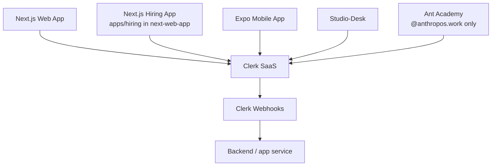
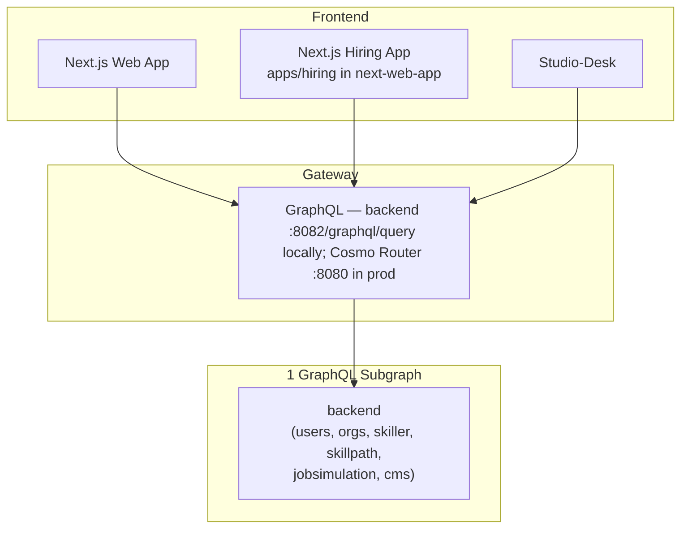

# External Services & Integrations

> **⚠️ Router status, two states (v2.8 M257x).** Platform `b56d731`+`360efd4` (merged **`2adcf71`**, 2026-07-31) **deleted the Cosmo Router from local dev** — no `graphql` compose service, no `repos.yml` entry — and re-pointed the frontends at **`backend` directly, `http://localhost:8082/graphql/query`**. **There is no `:5050` on a local stack.** In *production* the router is still declared (`graphql-wundergraph/terraform/main.tf:20` `= 1`), though **the repo is ARCHIVED on GitHub (2026-07-30)**. And the supergraph is **ONE** subgraph — `backend` — since `915da06` (2026-07-29). The fenced source of truth is [`platform-migration-status.md`](./platform-migration-status.md).


This document describes all external services and third-party integrations used by the Anthropos platform. These are services the platform **depends on** but does not directly maintain in the core codebase.

## High-Level Summary (For PMs & Non-Engineers)

The Anthropos platform integrates with **four key external services**:

1. **Clerk** - Handles all user authentication and organization management (SaaS)
2. **Directus** - Stores and manages platform content (self-hosted via Docker)
3. **GraphQL/Wundergraph** - Unifies all backend services into a single API. **Prod-only since platform `2adcf71`** — see the two-state note in that section
4. **AI Providers** - OpenAI, Anthropic, and Azure for intelligent features

These services allow us to focus on core features while leveraging best-in-class solutions for authentication, content management, and API orchestration.

---

## Clerk (Authentication Service)

### Overview

| Property | Value |
|:---------|:------|
| **Type** | External SaaS |
| **Purpose** | User authentication, session management, organization management |
| **Website** | [clerk.com](https://clerk.com) |
| **Pricing Model** | Freemium (pay per active user) |

> **Full integration picture** — what Clerk is used for (the authentication-vs-authorization split), how it's wired, which repos depend on it, and each one's SDK — lives in **[Clerk Integration](../services/clerk-integration.md)**. This section is the external-services-catalog overview.

### What Clerk Provides

- **Authentication**: Email/password, OAuth (Google, GitHub, etc.), magic links
- **Session Management**: Secure session handling, token refresh
- **Organizations**: Multi-tenant support with roles and permissions
- **User Management**: Profile management, user metadata
- **Security**: Built-in protection against common attacks
- **Webhooks**: Real-time sync of user events

### Integration Points

Clerk is integrated across **all user-facing applications**:


```mermaid
graph TB
    Clerk[Clerk SaaS]
    
    Web[Next.js Web App]
    Hiring[Next.js Hiring App<br/>apps/hiring in next-web-app]
    Mobile[Expo Mobile App]
    Desk[Studio-Desk]
    Academy[Ant Academy<br/>@anthropos.work only]
    
    Web --> Clerk
    Hiring --> Clerk
    Mobile --> Clerk
    Desk --> Clerk
    Academy --> Clerk
    
    Clerk --> Webhook[Clerk Webhooks]
    Webhook --> Backend[Backend / app service]
```

#### Per-application integration

Each app authenticates with its framework's Clerk SDK — `@clerk/nextjs` (next-web-app web/hiring/integration + ant-academy), `@clerk/clerk-expo` (mobile), `@clerk/clerk-js` + `@clerk/express` (studio-desk), and `colony/authn` + `clerk-sdk-go/v2` (Go services). The next-web-app `/enterprise` area, studio-desk admin tooling, and ant-academy content are additionally gated **directly** on Clerk `org:admin` / org membership. Per-repo SDKs and the auth/authz split: [Clerk Integration → Dependent Repos](../services/clerk-integration.md#dependent-repos--how-they-integrate).

#### Backend Services

**Sentinel Service**:
- Acts as the centralized **authorization** service (Casbin RBAC/ABAC)
- Does NOT perform authentication and does NOT validate Clerk tokens — JWT validation is done in each consuming service via the shared `authn` library (now `colony/authn`)
- Clerk user/org sync is handled by the `app`/backend service via Clerk webhooks (see [webhook_setup.md](../ops/webhook_setup.md)), not by Sentinel

**Other Backend Services**:
- Don't directly integrate with Clerk for sync (that's the backend's job)
- Call Sentinel via Connect-RPC for authorization decisions; authenticate independently via the `authn`/Clerk JWT middleware
- Trust Sentinel's authorization decisions

### Configuration

Credentials live in `platform/.env` (backend) and each app's own env: a backend `CLERK_SECRET_KEY` + `CLERK_WEBHOOK_SECRET`, plus a framework-prefixed publishable key per frontend (`NEXT_PUBLIC_` / `VITE_` / `EXPO_PUBLIC_CLERK_PUBLISHABLE_KEY`) and sign-in/up URLs. Full key list: [Clerk Integration → Configuration](../services/clerk-integration.md#configuration-keys). Get keys by creating an app at [clerk.com](https://clerk.com) (use **separate dev/prod apps**) and configuring webhooks for user/org sync.

### Development Workflow

#### Local Webhook Setup (For User/Org Sync)

Clerk webhooks sync user and organization data to your local database. Without working webhooks, users created in Clerk won't appear locally.

**Quick Start** (no account needed):
```bash
# Start a tunnel to expose localhost:8082
npx localtunnel --port 8082
```

Then configure the webhook URL in Clerk Dashboard pointing to `https://<your-url>/api/webhook/clerk`.

**For detailed setup instructions**, see the [Webhook Setup Guide](../ops/webhook_setup.md), which covers:
- Full localtunnel setup with Clerk configuration
- More reliable alternatives (ngrok, Tailscale Funnel)
- Troubleshooting common issues
- Security considerations

**Note**: This is only needed when you need user/org sync. For pure frontend development with existing test accounts, webhook setup can be skipped.

### Security Considerations

- **Never commit** secret keys to version control
- Use **different Clerk applications** for development and production
- Clerk handles **GDPR compliance** and secure password storage
- All tokens are **short-lived** and automatically refreshed

---

## Directus (Headless CMS)

### Overview

| Property | Value |
|:---------|:------|
| **Type** | Self-hosted Headless CMS (lives in **production**) |
| **Address** | `https://content.anthropos.work` (the prod public instance) |
| **Purpose** | Content storage, media management, CMS |
| **Website** | [directus.io](https://directus.io) |

> **The platform `docker-compose.yml` has NO directus service.** A local stack does not run Directus — the cms
> domain in `backend` reaches Directus over the network via `DIRECTUS_BASE_ADDR` / `DIRECTUS_PUBLIC_BASE_ADDR`,
> which point at the **production** instance `https://content.anthropos.work` in the stock compose.
> **⚠️ `backend`'s compose `environment:` block sets exactly ONE of the pair.** At platform `0dab54d` it sets
> `DIRECTUS_PUBLIC_BASE_ADDR=https://content.anthropos.work` (`docker-compose.yml:53`) and **no
> `DIRECTUS_BASE_ADDR`** — that one `backend` picks up from the shared `env_file: .env`. The standalone `cms`
> service that used to carry both explicitly is **gone from compose** (`d11a403`), so `backend` is the only
> consumer left and per-service re-point tooling has ONE target, not two — see the ⚠️ under *Architecture* below.
> A freshly-built local stack reads its public content **live from prod**. (Earlier revisions of this doc described a
> `directus/directus:10.10.1` compose service on port 8055 with an `admin@example.com` / `password` admin login
> and an inline `docker-compose.yml` snippet **as if it were CURRENT**, which it is not — there is still no
> Directus service in the platform compose at `0dab54d`.)
>
> **That retraction over-corrected, and this corrects the correction (M257x iter-48).** The twin of this
> paragraph said *"all of that is false; that service **has never existed**"* — repaired at
> [`service_taxonomy.md:308-317`](./service_taxonomy.md) and left standing here. The service **did** exist,
> with exactly that image tag, port and password, until platform `a2a3ee6` (2026-02-27) removed it:
> `git show a2a3ee6^:docker-compose.yml` → `:384 image: directus/directus:10.10.1`, `:386 8055:8055`,
> `:409 ADMIN_PASSWORD=password`. Only the `admin@example.com` **email** is unfound in history. And a check
> against `docker-compose.yml` at HEAD can establish *"does not exist now"*; it cannot establish *"never"*.
>
> **A *local* Directus is a Rosetta tooling feature, not a platform-compose service.** The v1.5 "prop room"
> tooling (`rosetta-extensions`) can stand up a **per-stack** local Directus — `directus/directus:11.6.1`, on an
> **offset port** — serving the captured public library so a stack is content-self-contained (demo-default /
> dev-opt-in `--local-content`). The bootstrap empirics, image pin, and locally-minted admin all live there. See
> [`corpus/ops/directus-local.md`](../ops/directus-local.md). Everything below describes the **production**
> Directus the platform reads from, except where it explicitly says "local tooling".

### What Directus Provides

- **Headless CMS**: Manage content via REST/GraphQL APIs
- **Database Abstraction**: Works directly with PostgreSQL
- **Media Management**: File uploads, image transformations
- **Content Versioning**: Track changes to content
- **Webhooks**: Real-time notifications on content changes
- **Admin UI**: User-friendly interface for content editors

### Architecture

In the **default local posture**, Directus is **not** part of the local stack — `backend` (which hosts the cms
domain since cms-in-app) reaches the **production** Directus over the network. The default `core` profile is
**not** just Postgres + `backend`: it starts **nine** containers — `postgresql` + `redis` (from the included
`common.yml`, profile-less so they always start) and seven application services, `sentinel` · `backend` ·
`jobsimulation` · `cms` · `storage` · `roadrunner` · `gotenberg`. The `jobsimulation` and `cms` containers are
**merged-into-`app` husks kept live as the rollback path** (teardown is M810) — merged in production is not the
same claim as removed from compose:

```mermaid
graph TB
    subgraph Docker[Docker Compose (local stack)]
        Backend[backend :8082 — hosts the cms domain in-process]
        CMSHusk[cms :8090-8091 — merged-into-app husk, rollback path]
        Postgres[(PostgreSQL)]
    end

    subgraph Prod[Production]
        Directus[Directus — content.anthropos.work]
    end

    Frontend[Frontend Apps]
    StudioDesk[Studio-Desk]

    Frontend -->|:8082/graphql/query| Backend
    StudioDesk -->|:8082/graphql/query| Backend
    Backend -->|DIRECTUS_BASE_ADDR from env_file| Directus
    CMSHusk -.->|DIRECTUS_BASE_ADDR from compose| Directus
    Directus --> ProdPG[(Prod PostgreSQL · directus schema)]
```

> **Both frontends target `backend`, not `cms`** (`docker-compose.yml:236`/`:245` for next-web-app, `:204`/`:220`
> for studio-desk — all four are `:8082/graphql/query`). And `backend` does **not** proxy content through the
> `cms` container: `app/cms_reader_switch.go` swaps the cms content reader in-place to the **in-process** cms
> RPC server once Directus is configured, so every content read is *"a DIRECT domain call — no proto round-trip
> … and no internal traffic to a standalone cms."* `backend` requires `DIRECTUS_BASE_ADDR` to boot at all
> (`app/main.go:980-982` `log.Fatalf`s without it — @ `app` `b948604` v1.366.0). The prose two paragraphs above already said this; the
> diagram had not caught up.

> **The `--local-content` re-point targets BOTH `cms` and `backend`.** With the v1.5 "prop room" **local
> tooling** (`--local-content` / demo-default) a per-stack `directus` container is added to the stack's
> compose on an offset port, and `rosetta-extensions/stack-injection/gen_injected_override.py:636-637`
> re-points every service in `DIRECTUS_DATA_CONSUMERS`, which is **`("cms", "backend")`** (`:53`). `backend`
> is in that tuple because — per the `cms_reader_switch` above — **`backend` is the service that actually
> reads Directus**; re-pointing only `cms` would leave the real reader aimed at production content.
>
> **HISTORICAL — fixed at M257x iter-24 (rext `f9ac72f`).** The tuple originally named `cms` alone, and a
> test (`test_only_cms_is_repointed_not_other_services`) asserted that `backend` must **not** carry the
> re-point — i.e. the suite was *pinning the defect*. Measured on live `demo-1` (2026-08-01) before the fix:
> `cms` had `DIRECTUS_BASE_ADDR=http://directus:8055` while `backend` still had
> `https://content.anthropos.work` with an empty `DIRECTUS_TOKEN`, which surfaced as **96 all-403 lines** in
> `backend`'s log. That test is gone, replaced by `test_backend_the_actual_reader_is_repointed`
> (`stack-injection/tests/test_injection.py:1051`), which asserts the opposite. See
> [`directus-local.md`](../ops/directus-local.md).

### Integration Pattern

**The cms domain inside `backend` acts as a smart proxy** between applications and Directus (it was the
standalone CMS Service until cms-in-app folded it into `app`):

1. **Frontend/Studio-Desk** → GraphQL request to `backend:8082/graphql/query`
2. **cms domain** (`app/internal/cms/directus/`) → Translates to Directus API call
3. **Directus** → Queries PostgreSQL
4. **cms domain** ← Adds business logic, caching
5. **Frontend/Studio-Desk** ← Returns enriched data

**Why the proxy pattern?**
- Add platform-specific business logic
- Cache frequently accessed content
- Abstract Directus implementation details
- Easier to migrate CMS in the future

### Compose configuration

There is **no `directus` service in `platform/docker-compose.yml`** — `backend` reaches the production Directus via
the env vars below; the platform compose never defines, builds, or runs a Directus container. (A previous
revision of this doc reproduced a `directus:` compose block — image `10.10.1`, `ADMIN_PASSWORD=password`, a
mounted uploads volume — and attributed it to `platform/docker-compose.yml`. That block is fictional; the
platform compose has no such service.)

The only Directus-related platform config is the address `backend` points at — set in the shared `.env`, which
`backend` consumes via `env_file:` (its compose `environment:` block carries no `DIRECTUS_*`):

```bash
# platform/.env  — backend reads these through `env_file: .env`, NOT its compose environment: block
DIRECTUS_BASE_ADDR=https://content.anthropos.work
DIRECTUS_PUBLIC_BASE_ADDR=https://content.anthropos.work
```

> The **per-stack local Directus** that the v1.5 "prop room" tooling stands up (`directus/directus:11.6.1`, on an
> offset port, with a **locally-minted** admin) is defined in the **tooling's** compose overlay, not the platform
> repo. Its real, empirically-pinned config lives in [`directus-local.md`](../ops/directus-local.md).

### Data Storage

#### Database Schema

Directus uses a **dedicated PostgreSQL schema**:
```sql
-- Search path: directus
-- Contains Directus system tables + content collections
```

**Key Collections**:
- `directus_files`: Media and file metadata
- `directus_folders`: File organization
- `directus_users`: CMS admin users (separate from Clerk)
- Custom collections: Simulations, skills, skill paths, etc.

#### File Storage

**Local Development**: there is no local Directus and no local uploads directory in the default posture. Image
bytes are served from the **asset plane** — prod's anonymous public `<DIRECTUS_PUBLIC_BASE_ADDR>/assets/<uuid>`
links, which browsers fetch token-less (now `app/internal/cms/directus/`). Even when the v1.5 local tooling
serves the *data plane* (catalog rows) from a per-stack Directus, the *asset plane* stays on prod's public links
so images stay real — no blob bytes are copied locally.

**Production**:
- Files stored in **S3** (AWS credentials mounted)
- Directus handles upload to S3 automatically
- CDN delivery for optimal performance

### cms-domain Directus integration

> **⚠️ This is the cms DOMAIN inside `backend`, not the `cms` container.** Since cms-in-app the
> Directus client lives at `app/internal/cms/directus/` and runs in-process in `backend`;
> `app/cms_reader_switch.go` swaps the content reader to the in-process cms server, and
> `app/main.go:980-982` makes `DIRECTUS_BASE_ADDR` a hard boot requirement **of `backend`** (@ `app`
> `b948604` v1.366.0). There is **no `cms` container left to start** — platform `0dab54d`'s compose
> declares **eight** services — ten in the effective topology, once `include: common.yml` adds the
> `postgresql`/`redis` floor — and `cms` is not one of them; every content read is `backend`'s own.

The cms domain connects to Directus via:

**Environment Variables**:
```bash
DIRECTUS_BASE_ADDR=https://content.anthropos.work
DIRECTUS_PUBLIC_BASE_ADDR=https://content.anthropos.work
```

**Code Integration** (`app/internal/cms/directus/`, compiled into `backend`):
```go
// app/internal/cms/directus/   (NOT the frozen cms repo's internal/directus/)
// - Client initialization
// - Collection queries
// - File management
// - Webhook handlers
```

**Key Entities Managed**:
- Job simulations
- Skill definitions
- Skill paths
- Training content
- Media files

### Development Access

In the **default posture there is no local Directus to log into** — content comes from the production instance,
which developers don't administer locally. There is no `localhost:8055` admin and **no `admin@example.com` /
`password` login** (that earlier claim was tied to the fictional compose service above).

**When the v1.5 local tooling stands a per-stack Directus up** (`--local-content` / demo-default), it listens on
an **offset port** (8055 on the first stack, offset thereafter) with a **locally-minted** admin
(`admin@<stack>.example.com`, an RFC-2606 reserved address — never a real mailbox; see
[`directus-local.md`](../ops/directus-local.md)). Against **that** local instance:

- **Admin UI / REST / GraphQL**: `http://localhost:<offset-8055>/` , `…/items/{collection}` , `…/graphql`

### Webhooks

Directus can trigger webhooks on content changes:

**Use Cases**:
- Invalidate CMS service cache when content updates
- Trigger content regeneration in Studio-Room
- Sync content to search indexes

**Configuration**: Set up in Directus admin UI under Settings → Webhooks

---

## GraphQL Gateway — WunderGraph Cosmo Router

### Overview

| Property | Value |
|:---------|:------|
| **Type** | Configured third-party (Dockerized) |
| **Technology** | [WunderGraph Cosmo Router](https://cosmo-docs.wundergraph.com/router) (Go binary, image `ghcr.io/wundergraph/cosmo/router:0.275.0`) — Apollo Federation v2 |
| **Composition tool** | `wgc@0.104.0` (WunderGraph Cosmo CLI) — runs at Docker build time |
| **Port** | **8080** everywhere the router still runs — container and ECS alike (`terraform/locals.tf:8` `port = 8080`, `terraform/main.tf:48-49` maps container 8080 → host 8080; `config.prod.yaml:5` `listen_addr: 0.0.0.0:8080`). `5050` was **only** the local compose host mapping (`"5050:8080"`), deleted with the service — **there is no `:5050` on a local stack** |
| **Purpose** | Federated GraphQL API gateway — **over ONE subgraph (`backend`) since `915da06`**, and **prod-only** since platform `2adcf71` deleted it from local dev |
| **Repository** | `git@github.com:anthropos-work/graphql-wundergraph` |

### What the gateway provides

- **Federation v2**: Composes **one** subgraph — `backend`. All four former subgraphs were folded into it, but the supergraph did **not** shrink once per service merge. The count, read straight off `supergraph-config-prod.yaml` at each commit (`git show <sha>:supergraph-config-prod.yaml`):

  | commit | date | subgraphs | what changed |
  |---|---|---|---|
  | `749dc86~1` | — | **5** | `backend`, `skiller`, `jobsimulation`, `cms`, `skillpath` |
  | `749dc86` | 2026-06-24 | **4** | `skiller` removed |
  | `7c17e63` | 2026-07-21 | **3** | `skillpath` removed ("skillpath-in-app") |
  | `915da06` | 2026-07-29 | **1** | `cms` **and** `jobsimulation` removed together — cms-in-app v8.0, app v1.360.0 |

  Two things follow that the corpus had wrong for four releases. **cms-in-app was the 3 → 1 step, not 2 → 1.** And **the `jobsimulation` subgraph outlived jobsim-in-app**: the service merged into `app` earlier, but its supergraph entry and `schemas/jobsimulation.graphqls` survived until `915da06` deleted them in the same commit as cms's (`git show --name-status 915da06` marks both `D`).

  > **Do not take the count from `915da06`'s own commit subject** — it reads *"fold cms subgraph into backend (supergraph 2→1)"*, and the tree it was committed against lists **three**. This is where the 2 → 1 figure entered the corpus. The config file, not the commit message, is the source of truth.

  The supergraph config now lists a single entry pointing at `http://backend.internal.anthropos:8080/graphql/query`, `schemas/` holds `backend.graphqls` alone, and `subgraphs.conf` tracks a single `BACKEND=v1.360.0` pin.
- **No subscriptions — the supergraph is query/mutation only.** Two independent checks: (a) **no config** — none of the three `supergraph-config-*.yaml` files carries a `subscription:` block at all (`grep -rn "sse\|subscription" graphql-wundergraph/*.yaml` returns nothing; positive control — `grep -rln backend graphql-wundergraph/*.yaml` matches all three). The `subscription.protocol: sse_post` that used to sit on the `jobsimulation` entry read `sse_post` for its **entire mainline life**, from introduction to deletion at `915da06` — `git show 915da06~1:supergraph-config-prod.yaml` still reads `protocol: "sse_post"`, and `git log -S 'protocol: "ws"'` over the repo returns nothing (positive control: the same search for `sse_post` returns five commits). **Mainline never carried `ws`.** `bba862f` (2026-02-25, "change subscription protocol from sse_post to ws") is a real commit but an **unmerged** one — it exists only on `remotes/origin/feat/use-web-socket` (`git merge-base --is-ancestor bba862f HEAD` → rc **1**; `git branch -a --contains bba862f` names that branch and nothing else). Cite it as the abandoned branch it is, never as history. (b) **no schema** — the composed `schemas/backend.graphqls` declares `type Mutation` (`:4053`) and `type Query` (`:4912`) and **no `type Subscription`**; the six `Subscription` hits in that SDL are all Stripe/plan field names (`activeSubscription`, `stripeSubscriptionId`, `type PlanSubscription`). So there is nothing to subscribe to, through the router or on `backend` directly.
- **Apollo-compatibility flags** enabled for stricter validation behavior
- **Playground** at `/graphql` for local development
- **Introspection** enabled in dev mode

### Architecture


```mermaid
graph TB
    subgraph Frontend
        Web[Next.js Web App]
        Hiring[Next.js Hiring App<br/>apps/hiring in next-web-app]
        Desk[Studio-Desk]
    end

    subgraph Gateway
        WG[GraphQL — backend :8082/graphql/query locally; Cosmo Router :8080 in prod]
    end

    subgraph Subgraphs[1 GraphQL Subgraph]
        Backend["backend<br/>(users, orgs, skiller, skillpath,<br/>jobsimulation, cms)"]
    end

    Web --> WG
    Hiring --> WG
    Desk --> WG
    WG --> Backend
```

### Service Dependencies — **HISTORICAL**

> Everything from here to the end of *Subgraph routing URLs* describes the **local compose build of the router, which platform `2adcf71` deleted**. There is no `graphql` service in `docker-compose.yml` any more (the name survives only as a **profile** label) and no `graphql-wundergraph` entry in `repos.yml`. Kept because the archived repo still contains these configs and a reader will meet them there; **do not follow any of it as a local-development instruction.**

From `docker-compose.yml` *before the drop*, the gateway `depends_on`:
- backend
- storage

It starts after these services have reported "started" (not necessarily healthy — there is no subgraph healthcheck). The composed `config.json` is generated at image build time, so **any** subgraph SDL change means rebuilding the gateway.

> **From February 2026 until its deletion the compose service built from `Dockerfile.dev`, not the production `Dockerfile`** — so the local router **regenerated** `schemas/backend.graphqls` from the sibling `../app` checkout at image-build time, while the production `Dockerfile` (which composes the committed `schemas/` as-is) was the CI/prod path. Three eras, and the middle one is the whole point:
>
> | era | `build:` config | effective Dockerfile |
> |---|---|---|
> | `63d285c` (2024-06-20, then named `wundergraph`) → `719befb` | `context:` only, **no `dockerfile:` key** | Docker's default → the **production `Dockerfile`** |
> | `2c85211` (2026-02-27) → `360efd4` | `dockerfile: Dockerfile.dev`; `67ba772` later raised the context `../graphql-wundergraph` → `..` | **`Dockerfile.dev`** |
> | `360efd4` (2026-07-31), merged as `2adcf71` | block deleted | — |
>
> Verify with `git show 2c85211^:docker-compose.yml` (no `dockerfile:` key) against `git show 2c85211:docker-compose.yml` and `git show 1e8e754:docker-compose.yml` lines 6-8.
>
> **`b56d731` does not end the second era**, though its subject line ("drop the WunderGraph router; point local dev at backend") reads as if it does. It only parked the `graphql` block behind a `wundergraph-deprecated` profile — the block is still there, still `dockerfile: graphql-wundergraph/Dockerfile.dev`. `360efd4`, its sibling in the same PR, is the commit that actually deleted it: `git show b56d731:docker-compose.yml` still has `  graphql:` at `:22`, `git show 360efd4:docker-compose.yml` has no such key (positive control — `  backend:` is at `:28`). The [GraphQL Gateway service doc](../services/graphql-wundergraph.md) states it the same way.
>
> **A caution about how to check this, because it is what made the claim wrong for four releases.** `git log -S "graphql-wundergraph/Dockerfile" -- docker-compose.yml` returns exactly two commits and tempts the conclusion *"it always built from `Dockerfile.dev`."* It cannot see otherwise: that **prefixed** path only came into existence at `67ba772`, so the search is structurally blind to both earlier eras — including the one where no `dockerfile:` key existed at all and Docker silently defaulted to the production file. An absent key is invisible to every search for its value.
>
> **And a caution about the archived repo, which the fence above sends you into.** `graphql-wundergraph/CLAUDE.md:39` asserts the exact opposite of this section — *"Since cms-in-app the platform compose `graphql` service builds from the **production** Dockerfile"* — and it is not an old stale line: it was written on 2026-07-30 in `60c229f`, a commit titled *"correct the compose build path"*. It is wrong. **The compose file wins**, and it lives in `platform`, not here: `git show 1e8e754:docker-compose.yml` lines 6-8 read `dockerfile: graphql-wundergraph/Dockerfile.dev`. A doc in the composed repo cannot testify about the consuming repo's build config; do not "re-correct" this section back from it.

### Build-time composition

The gateway's `Dockerfile.dev` does multi-stage composition with the WunderGraph CLI — **as the archived repo still has it**, post-fold:

```dockerfile
RUN npm install -g wgc@0.104.0
COPY graphql-wundergraph/supergraph-config-${ENVIRONMENT_CONFIG}.yaml ./supergraph-config.yaml
COPY graphql-wundergraph/config.${ENVIRONMENT}.yaml ./config.yaml
RUN mkdir -p schemas /tmp/schemas
COPY app/internal/web/backend/graphql/graph/schemas/ /tmp/schemas/backend/
# cms + skillpath folded into the backend subgraph (cms-in-app / skillpath-in-app) — the backend
# SDL now owns the cms content types + SkillPathSession, so there are no standalone subgraph SDLs.
RUN awk '{ print $0 }' /tmp/schemas/backend/* > ./schemas/backend.graphqls
RUN wgc router compose -i supergraph-config.yaml -o config.json
```

There is **one** schema `COPY` (`Dockerfile.dev:18`) and **one** `awk` concatenation (`:23`) — the `cms/` and `jobsimulation/` copies were deleted at `915da06`, which left the comment at `:19-20` in their place. In other words: **the gateway image is built from the platform's monorepo context with the surviving subgraph's source repo (`app`) as a sibling** — one sibling now, all of them before the folds. This is why `make up` used to rebuild the gateway whenever a subgraph schema changed.

The composed `config.json` is then served by the Cosmo router binary at runtime.

### Subgraph routing URLs

From `graphql-wundergraph/supergraph-config-compose.yaml` — **as the archived repo still has it.** Only the first row survives: `jobsimulation` and `cms` folded into `backend`, and `supergraph-config-prod.yaml` lists `backend` alone.

| Subgraph | URL (Docker network) |
|----------|----------------------|
| backend | `http://backend:8082/graphql/query` — **the only one left** |
| ~~jobsimulation~~ | ~~`http://jobsimulation:8400/query`~~ — folded into `backend`; the entry itself survived jobsim-in-app and was deleted at `915da06`, in the same commit as cms's. This was the one entry that ever carried a `subscription:` block, and it read `sse_post` for its whole mainline life (`bba862f` would have made it `ws` but never merged — see *What the gateway provides*). No entry carries one today |
| ~~cms~~ | ~~`http://cms:8090/query`~~ — folded into `backend` at `915da06`, the **3 → 1** step |

### Configuration

**Environment**:
```bash
ENVIRONMENT=compose  # or production
ENVIRONMENT_CONFIG=compose
```

**Build Context**: the platform monorepo (`context: ..`) — not the upstream repo. This was changed from the old "git+url" build because the composition needs sibling repos. Composition is **build-time and static** (the supergraph `config.json` is baked into the image; the router does not live-introspect subgraphs), so adding/changing a subgraph requires a rebuild + restart.

> **Developer/code map**: see the [GraphQL Gateway service doc](../services/graphql-wundergraph.md) for the two Dockerfiles, per-environment routing URLs, version pins, and compose profiles.

### Development Usage

#### Frontend Integration

**Next.js Apps**:
```typescript
// Generated client from Wundergraph
import { createClient } from '@/lib/graphql/client'

const client = createClient({
  endpoint: process.env.NEXT_PUBLIC_WUNDERGRAPH_ENDPOINT
})

// Type-safe queries
const user = await client.query({
  operationName: 'GetUser',
  variables: { id: '123' }
})
```

**Studio-Desk**:
```typescript
// GraphQL Code Generator approach
// Queries in app/graphql/*.graphql
// Types in app/__generated__/

// Environment
VITE_GRAPHQL_ENDPOINT=http://localhost:8082/graphql/query   # was :5050/graphql on the router
```

#### Playground

Access GraphQL playground at:
```
http://localhost:8082/graphql   # Apollo Sandbox on `backend`; the router's :5050 playground is gone locally
```

**Features**:
- Schema exploration
- Query **and mutation** testing (there is no `type Subscription` in `backend.graphqls` — see *What the gateway provides* above, so there is no subscription tab to exercise)
- Auto-complete and validation

### Schema Updates

When backend services add new GraphQL types or operations:

1. **Backend service** updates its GraphQL schema
2. ~~**Restart Wundergraph**: `docker compose restart graphql`~~ — there is no `graphql` service locally any more; restart `backend`
3. **Studio-Desk**: Run `npm run codegen` to regenerate types
4. **Next.js apps**: Regenerate clients as needed

---

## AI Providers (External Intelligence)

The platform relies on multiple AI providers across backend services, Studio tools, and the simulation engine. All Go services access AI through the shared `ai` library, which provides **unified provider access** behind one `ai.AI` interface (OpenAI, Azure, Anthropic, Bedrock, Mistral). **Provider selection and cost tracking are implemented in the consuming services, not in the `ai` library itself** — see [Shared Libraries → ai](./shared_libraries.md#ai). What that selection actually does is **not** an ordered EU-first ladder; see *Routing: what is actually implemented* below before relying on it for a residency argument.

For full details on models, routing, voice engines, and recording architecture, see [AI Architecture](./ai_architecture.md).

### Supported Providers

| Provider | Selected how | Integration Points | Purpose |
|:---|:---|:---|:---|
| **Azure OpenAI (EU)** | `vendor = Azure` from the caller | Jobsimulation domain, Backend (app — merged skiller domain), cms domain, Studio | GPT-5.x, GPT-4.1 for simulations and content |
| **Azure OpenAI (US)** | `vendor = Azure` **+ PostHog `flag_use_azure_us`** | same as above | The EU deployment's US twin — a flag flip, not a failure fallback |
| **AWS Bedrock (EU)** | `vendor = AnthropicAws` **or** `Anthropic` — both resolve to the *same* Bedrock client | Jobsimulation domain, Backend (app) | `eu.anthropic.claude-sonnet-4-6` (simulation report agent, `app/internal/jobsimulation/agent/report_agent.go:31`; ask-engine, `app/internal/askengine/bedrock.go:25`) and `eu.anthropic.claude-opus-4-8` / `eu.anthropic.claude-sonnet-4-6` (course-builder author/grader, `app/internal/coursebuilder/bedrock.go:23,29`) |
| **Mistral (EU)** | direct client, not via the AI manager | cms domain **only** | **OCR only** — `mistral.NewMistral(...)` in `app/internal/cms/studio/markdownManager.go:19`, for studio attachment → markdown |
| **OpenAI Direct (US)** | **two ways in**: (a) `vendor = Openai` from the caller — including the case where the caller never chose, since a simulation sequence with **`ai_vendor` unset defaults to `openai`** in the cms content layer (`internal/cms/directus/collections/jobsimulation.go:1302`); (b) automatic on **HTTP 429** | (a) any sequence authored without an explicit vendor; (b) the jobsimulation AI manager's retry loop | The 429 retry is the only *automatic fallback* — but it is **not** the only route to US OpenAI. Path (a) gets there on the first attempt. See *Routing* below |
| **Anthropic Direct (first-party API)** | **presence of `ANTHROPIC_API_KEY`**, not a failure fallback | Course Builder (`app/internal/coursebuilder/bedrock.go:106-113` — key set → first-party API with the model id stripped to its bare form, key unset → Bedrock); Studio-Room (`app/studio/services/ai.py:627-664` `AnthropicProvider`, which `TARGET SERVICE = anthropic` would select — but **no shipped `configs/*.ini` does**: all 30 `*_AI_*_MODEL` lines pin `azure`, so this arm is latent, M257x iter-52) | An either/or **backend switch** for authoring/grading, logged at boot (`app/main.go:770` @ `app` `b948604` v1.366.0, `coursebuilder.ModelBackendName()`) |

> **`app/studio/**` is an IN-IMAGE path, and it is in no `app` commit.** Every `app/studio/…`
> citation on this page (and elsewhere in the corpus) names Studio-Room, which CI pulls into the
> `app` image as an `additional_repo` (app v1.360.1) — the source lives in
> `anthropos-work/anthropos-studio-room`, not in `anthropos-work/app`. `git show <ref>:studio/…`
> against an `app` clone returns nothing at **every** ref, so a citation-resolver that roots these
> under `app` reads them as dead when they are merely elsewhere. Resolve them against the
> studio-room repo; see [`corpus/services/studio-room.md`](../services/studio-room.md).

### Routing: what is actually implemented

There is **no ordered EU-first fallback chain.** The corpus asserted one for several releases
("Azure → Bedrock → Mistral → OpenAI → Anthropic"); no such ladder exists in the code. The real
mechanics, all in `app/internal/jobsimulation/ai/ai.go`:

1. **The caller picks the vendor.** `ChatCompletion` / `Response` take a `vendor AIVendor` argument
   and hand it to `getClient` (`:259-289`). The four vendors are consts at `:30-33` — `azure`,
   `openai`, `anthropic-aws`, `anthropic`. **When the authored content names no vendor, the
   caller's own default is `openai`** — that default lives in the cms content layer, not here; see
   the residency note below.
2. **`Azure` is EU by default**, swapped to the US deployment only when the PostHog flag
   `flag_use_azure_us` evaluates true (`:264-276`); if the flag lookup errors, the code logs and
   **keeps the EU client**. This is a deliberate flag flip, not a health-based failover.
3. **`AnthropicAws` and `Anthropic` both return `a.anthropicClient`** (`:280-283`) — the Bedrock
   client. There is **no US-direct Anthropic branch** in this manager.
4. **The one automatic fallback is 429-only.** `isThrottlingError` matches an HTTP 429 from the
   OpenAI or Anthropic SDK (`:130-141`); the retry wrapper then sets `vendor = Openai` on the next
   attempt (`:150-155`, mirrored at `:296-302`/`:326`), i.e. **direct US OpenAI**. Nothing else —
   not a timeout, not a 5xx, not a region outage — moves a request off its vendor.
5. **Mistral is not in this manager at all.** Its only use anywhere in `app` is OCR in the cms
   domain (`internal/cms/studio/markdownManager.go:19`, `studioManager.go:583`), so it can neither
   receive nor pass on a simulation request.

**Residency consequence, stated plainly:** the EU posture rests on the *default* vendor clients
being EU-resident (Azure EU, Bedrock `eu-west-1`), not on a chain that walks EU options before US
ones. This list **previously said five**, counting a latent arm as live; that count is **refuted** (M257x
iter-52). **Four** things can send a request outside the EU, none of them a region-health failover — plus a
**fifth arm that exists in code but is selectable by no shipped config** (item 5, and it is listed because a
config change would arm it, not because it is live):

1. the `flag_use_azure_us` PostHog flag;
2. the 429 retry, which switches to direct OpenAI **without** trying another EU provider first;
3. setting `ANTHROPIC_API_KEY`, which flips **Course Builder** off Bedrock onto Anthropic's
   first-party API (`coursebuilder/bedrock.go:106-113`) and supplies **Studio-Room** the credential
   its `anthropic` `TARGET SERVICE` needs — *Studio-Room was never on Bedrock*, so nothing is flipped
   off it there (`:542` above; 0 hits for `bedrock|boto3` under `app/studio/`; corrected M257x iter-48).
   **This item is live on the Course Builder half only.** Its Studio-Room half is latent for exactly the
   reason item 5 is: no shipped `configs/*.ini` selects `anthropic` either — all 30 `*_AI_*_MODEL` lines
   pin `azure`. Symmetry noted M257x iter-52, after two pre-commit readers caught the same evidence being
   applied to one arm and not the other;
4. **an authored simulation sequence that simply leaves `ai_vendor` unset** — the easiest of the
   four to miss, because nothing in the AI manager looks like a US default. `ai_vendor` is a
   *nullable* Directus field (`app/internal/cms/directus/collections/jobsimulation.go:905`
   `AIVendor *AIVendor`), and when it is nil the cms content layer supplies `openai` as the
   default (`:1302-1305`, `aiVendor := simulation.Openai`). That value reaches
   `internal/jobsimulation/simulator/ai/ai.go:58-59`, which maps `simulation.Openai` →
   `internalAi.Openai`, and `getClient` resolves that to `a.openaiClient` — the plain
   `openai.NewOpenAI(openaiKey)` client built at `internal/jobsimulation/ai/ai.go:80`, i.e.
   **direct US OpenAI**, on the very first attempt rather than as a 429 retry. (The same switch's
   own `default:` arm at `:114-115` is `internalAi.Openai` too, so an *unrecognized* vendor string
   lands in the same place.)
5. **Studio-Room's own `openai` `TARGET SERVICE`.** The generation pipeline's provider set is
   `{openai, azure, anthropic}` (`app/studio/services/ai.py:704-724`), and the `openai` arm builds a
   bare `OpenAI(api_key=…)` against **`https://api.openai.com`** (`:383`, `:706-708`;
   `config_template.ini:30-31`) — no Azure endpoint, no EU region. Item 3 above already names
   Studio-Room for its `anthropic` arm, which is what makes leaving this one out an *internal*
   inconsistency rather than merely an omission. Added M257x iter-49.
   ⚠️ **This arm is NOT reachable as shipped, and iter-49 counted it as if it were.** Every
   `*_AI_*_MODEL` line in all three `app/studio/configs/*.ini` pins the service to **`azure`**, and
   `gen.py:41-53` overrides only `*_API_KEY` / `*_ENDPOINT` from the environment — **never the service
   selector**. So the arm exists and nothing selects it: a config edit would arm it, no env var will.
   Count corrected from *five* to *four live + one latent* at M257x iter-52.

> **Why this one was missed, and how to avoid missing it again.** The "only three" version of this
> paragraph was derived by reading `internal/jobsimulation/ai/ai.go` end to end. That file is
> genuinely complete about what it does with a vendor it is *given* — but the vendor-defaulting
> happens one layer up, in the **cms content layer**, which the AI manager cannot see and a reader
> auditing the AI manager has no reason to open. **A residency claim needs the caller's default,
> not just the callee's dispatch.**

### Configuration

AI services are configured via environment variables in `platform/.env`:

```bash
# OpenAI
OPENAI_KEY=sk-proj-xxxxx

# Anthropic
ANTHROPIC_API_KEY=sk-ant-xxxxx

# Azure OpenAI
AZURE_OPENAI_KEY=xxxxx
AZURE_OPENAI_ENDPOINT_URL=https://resource.openai.azure.com/
```

Re-derive with `command grep -rho '\b<NAME>\b' --include='*.go'` in `app` (`5ba17044`): the four names above
return **5 / 26 / 13 / 13**. `OPENAI_ORG_ID`, `AZURE_OPENAI_ENDPOINT` and `AZURE_OPENAI_DEPLOYMENT` return
**0** and were removed; `OPENAI_API_KEY` returns 2, both the studio subprocess remap. Use `command grep` —
a `grep` aliased to a `.gitignore`-honouring wrapper undercounts, which is how iter-52 first published
12 / 12. **This block covers `app`'s Go only**; `app/studio/gen.py:45-47` reads the separate bare names
`AZURE_API_KEY` / `AZURE_ENDPOINT` / `OPENAI_ENDPOINT`. (Corrected M257x iter-52.)

### Usage Patterns

1. **Simulation Engine** (Jobsimulation):
   - AI-powered conversations (voice + chat) with configurable model per simulation
   - Voice calls via **LiveKit + GPT Realtime** agents
   - Document analysis and code evaluation

2. **Skills Matching** (Backend `app` — merged skiller domain):
   - Embeddings (Text Embedding 3 Small) over the taxonomy — `public.skill_embeddings` and
     `public.job_role_embeddings`
   - RAG for job role matching

   > **Taxonomy size — what is measured, and what is not.** The only read-only prod measurement the
   > corpus holds is the **public-only** taxonomy capture
   > (`.agentspace/snapshots/taxonomy/5afc0bccf1df7ef538b643321fc6362f/manifest.json`, `"public_only":
   > true`, `"predicate": "org-null"`, captured 2026-06-29): **42,790 public skills** and **22,470
   > public job roles**, with **42,790 skill embeddings** and **18,919 job-role embeddings**. Replayed
   > into `demo-1` these reproduce exactly (`select count(*) … where organization_id is null` → 42,790 /
   > 22,470).
   >
   > - The old **"18K roles"** figure is **refuted**. Public ⊆ total, so prod holds **at least 22,470**
   >   job roles. 18,919 is the *job-role-embedding* row count, which appears to have been transcribed
   >   onto the role count.
   > - The old **"60K skills"** figure is **unsupported, not refuted**. A public-only capture cannot see
   >   org-scoped private skills, so the total may still be ~60K; **42,790 is a floor, not the total**.
   >   Do not quote it as the taxonomy size.

3. **Studio-Desk Copilot**:
   - Uses a configurable multi-provider chain (Azure OpenAI / OpenAI / Anthropic) via backend proxy, with tier-based model selection and circuit-breaker failover (`AI_PROVIDER_CHAIN`, default `azure-openai,openai`)
   - Supports streaming responses for real-time interaction
   - Default models: `gpt-5.2` (OpenAI/Azure) or `claude-sonnet-4-5` / `claude-opus-4-5` (Anthropic)

4. **Studio-Room Pipeline**:
   - Uses abstract **AI Service Layer** (`services/ai.py`)
   - Configurable model slots (FAST, STRICT, EXECUTION, CREATIVE, REASONING)
   - Configured in `anthropos-studio-room/configs/*.ini` (the repo is `anthropos-studio-room`;
     it is baked into the `app` image and orchestrated from `app/internal/cms/studio/`)

---

## LiveKit (Voice Engine)

| Property | Value |
|:---------|:------|
| **Type** | External SaaS |
| **Purpose** | Real-time voice conversations in AI Simulations |
| **Integration** | Jobsimulation service |

LiveKit provides the real-time voice infrastructure for simulation voice calls. The platform runs **GPT Realtime agents** inside LiveKit rooms, enabling AI actors to hold voice conversations with players. **The EU agent is the bare `anthropos-agent`** (`calls/livekit.go:110,120`); the US one is suffixed `anthropos-agent-us` (`:126`), and the voice-chain engine dispatches `anthropos-agent-chain` (`:115`). There is no `anthropos-agent-eu` — the name appears nowhere in the platform, and the eu/us split lives on the **endpoint** (`azure-eu` / `azure-us`), not on the agent name. (Corrected M257x iter-49; the `-eu` form had stood since 2026-03-02.)

- **Audio**: Recorded as MP3
- **Transcripts**: Generated from conversation events
- **Coexists with ElevenLabs**: ElevenLabs credentials are still wired for the call/reply pipeline. Engine choice is the per-sequence CMS `voice_engine` field, and **its nil default is `gptrealtime`** — `flag_use_realtime_openai` selects no engine at all. See [`ai_architecture.md`](ai_architecture.md) § voice engines

---

## AWS Chime SDK (Recording)

| Property | Value |
|:---------|:------|
| **Type** | AWS Service |
| **Purpose** | Video/audio recording of simulation sessions |
| **Integration** | Jobsimulation service |

AWS Chime SDK captures the full simulation session (camera, screensharing, microphone) as a composited MP4 grid view. This runs in parallel with LiveKit's audio-only recording.

---

## Development Setup Summary

### Required Accounts
- **Clerk**: `clerk.com` (free tier available)

### Required Services (via Docker)
```bash
cd platform
docker compose up -d backend  # NOT `graphql` (deleted at `2adcf71`) and NOT `cms` (that container is an
                              # unfederated HUSK that serves no subgraph). The Directus reader is the cms
                              # DOMAIN inside `backend` (`app/internal/cms/directus/`).
                              # Directus is NOT a local service — it is read live from prod.
```
> The platform compose has no `directus` service to start; `cms` points `DIRECTUS_BASE_ADDR` at
> `content.anthropos.work`. To run content locally instead, use the v1.5 "prop room" tooling
> ([`directus-local.md`](../ops/directus-local.md)), not `docker compose up directus`.

### Environment Variables Checklist

**For Next.js Apps**:
```bash
NEXT_PUBLIC_CLERK_PUBLISHABLE_KEY=pk_test_xxxxx
CLERK_SECRET_KEY=sk_test_xxxxx
NEXT_PUBLIC_WUNDERGRAPH_ENDPOINT=http://localhost:8082/graphql/query   # was :5050/graphql
# NB the var is WUNDERGRAPH, not GRAPHQL — `NEXT_PUBLIC_GRAPHQL_ENDPOINT` does not exist in
# next-web-app. Set on the image at docker-compose.yml:352 (build arg) and :361 (runtime env).
```

**For Studio-Desk**:
```bash
VITE_CLERK_PUBLISHABLE_KEY=pk_test_xxxxx
CLERK_SECRET_KEY=sk_test_xxxxx
VITE_GRAPHQL_ENDPOINT=http://localhost:8082/graphql/query   # was :5050/graphql on the router
```

**For CMS Service**:
```bash
DIRECTUS_BASE_ADDR=https://content.anthropos.work
DIRECTUS_PUBLIC_BASE_ADDR=https://content.anthropos.work
```

---

## Production Deployment

### Clerk
- Use **production Clerk application** (separate from dev)
- Configure production URLs in Clerk dashboard
- Set up Clerk webhooks to the production **backend** endpoint `/api/webhook/clerk` — **not**
  Sentinel, which is authorization-only and exposes no webhook route

### Directus
- Deploy via Docker in production infrastructure
- Configure S3 for file storage
- Set up CDN for media delivery
- Enable HTTPS with proper SSL certificates

### Wundergraph
- Build and deploy as Docker container
- Configure production backend service URLs
- Enable caching and CDN if needed

---

## Troubleshooting

### Clerk Issues

**"Invalid publishable key"**:
- Ensure key starts with `pk_test_` (dev) or `pk_live_` (prod)
- Check environment variables are loaded correctly

**Users not syncing**:
- Verify Tailscale funnel is running (dev)
- Check Clerk webhooks are configured correctly
- Inspect **backend** logs (`docker compose logs backend`) for `/api/webhook/clerk` errors — Clerk
  user/org sync is app/backend's job (`app/internal/web/backend/backend.go:130`), not Sentinel's

### Directus Issues

**"Cannot connect to Directus"** (default posture — reading prod):
- **`backend`** reads Directus **live from prod** (the fetch is `app/internal/cms/directus/` running inside the
  `backend` container since cms-in-app); there is no local `directus` container to `ps`. Check the address
  `backend` resolves: `DIRECTUS_BASE_ADDR` must be `https://content.anthropos.work` and reachable from the box.
- `docker compose logs backend` (not `directus`, and not `cms` — that container is a merged husk that no longer
  serves `backend`'s content reads) surfaces the content-fetch errors.

**"Cannot connect to Directus"** (when running the local tooling, `--local-content` / demo):
```bash
# The per-stack Directus runs under the stack's OWN tooling compose, on an OFFSET port:
docker compose -p <stack> ps directus
docker compose -p <stack> logs directus
```
See [`directus-local.md`](../ops/directus-local.md) for the container lifecycle + verify probes.

**File uploads / asset bytes**:
- Image bytes are served from the **asset plane** — prod's anonymous public `…/assets/<uuid>` links — even when
  the data plane is local. There is no local uploads volume in the default posture.

### GraphQL Issues

**"GraphQL endpoint not responding"**:
```bash
# There is no `graphql` service since platform `2adcf71` — check the endpoint's real host:
docker compose ps backend

# Check dependent services are up
docker compose ps backend cms jobsimulation storage
```

**Schema outdated**:
```bash
# ~~docker compose restart graphql~~ — no such service since `2adcf71`.
# The schema is served by backend itself; restart it:
docker compose restart backend
```
> Consistent with :512 above, where the same correction is already recorded.

---

## Related Documentation
- [Service Taxonomy](./service_taxonomy.md) - Service categorization
- [AI Architecture](./ai_architecture.md) - Full AI model inventory, voice, recording
- [Security & Compliance](./security_compliance.md) - Data protection, EU compliance
- [CMS Service](../services/cms.md) - Directus proxy/adapter
- [Studio-Desk](../services/studio-desk.md) - Uses Clerk + GraphQL
- [Architecture Overview](./architecture_overview.md) - System architecture
