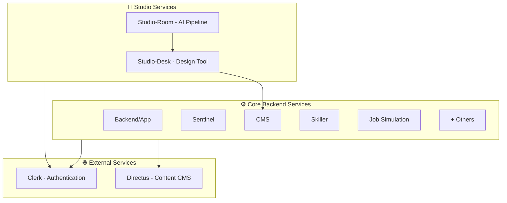

# Anthropos Service Taxonomy

This document explains the three-tier service architecture of the Anthropos platform, categorizing all services by their deployment model, technology stack, and operational characteristics.

## High-Level Summary (For PMs & Non-Engineers)

The Anthropos platform is built from **three types of services**:

1. **Core Backend Services**: The main engine of the platform - containerized microservices that handle user data, skills, simulations, and business logic.
2. **Studio Services**: Specialized tools for content creators to design and generate job simulations and learning content.
3. **External Services**: Third-party solutions we integrate with for authentication, content management, and infrastructure.



## Technical Deep Dive (For Engineers)

### Tier 1: Core Backend Services (Dockerized Go Microservices)

**Characteristics**:
- **Language**: Go
- **Deployment**: Docker Compose (local) / Kubernetes (production)
- **Communication**: HTTP/RPC + Redis Streams
- **Database**: PostgreSQL (dedicated schemas per service)
- **Source**: Private GitHub repositories

**Services**:

| Service | Port(s) | Purpose | Repository |
|:--------|:--------|:--------|:-----------|
| **Backend/App** | 8081-8083 | Main API Gateway, User Management | `git@github.com:anthropos-work/app.git` |
| **Sentinel** | 8087 | Authentication & Authorization | `git@github.com:anthropos-work/sentinel.git` |
| **CMS** | 8090-8091 | Content Management, Directus Proxy | Local `../cms` |
| **Skiller** | 8085-8086 | Skill Management & Assessment | `git@github.com:anthropos-work/skiller.git` |
| **Skillpath** | 8100-8101 | Skill Progression Paths | `git@github.com:anthropos-work/skillpath.git` |
| **Jobsimulation** | 8400-8401 | Job Environment Simulation | `git@github.com:anthropos-work/jobsimulation.git` |
| **Storage** | 8300-8301 | File/Blob Storage Management | `git@github.com:anthropos-work/storage.git` |
| **Chronos** | 8500-8501 | Scheduling & Time-based Events | `git@github.com:anthropos-work/chronos.git` |
| **Intelligence** | - | Background data sync (backend ↔ skiller) | `git@github.com:anthropos-work/intelligence.git` |
| **Messenger** | - | Email notifications via Brevo | Internal (platform repo) |
| **Roadrunner** | - | Code execution proxy to Judge0 | Internal (platform repo) |
| **db-backup** | - | Scheduled PostgreSQL backups (6h cycle) | Internal (platform repo) |

**Shared Libraries** (imported by services, not deployed):

| Library | Purpose | Repository |
|:--------|:--------|:-----------|
| **colony** | Platform framework: logging, DB/Redis, middleware, pub/sub (Watermill) | `git@github.com:anthropos-work/colony.git` |
| **authn** | Clerk JWT authentication middleware | `git@github.com:anthropos-work/authn.git` |
| **proto** | Protobuf definitions (single source of truth for RPC contracts) | `git@github.com:anthropos-work/proto.git` |
| **ai** | Unified AI provider wrapper (OpenAI, Anthropic, Mistral, Azure) + cost tracking | `git@github.com:anthropos-work/ai.git` |
| **taxonomy** | Skills taxonomy data (60K skills, 18K roles) | `git@github.com:anthropos-work/taxonomy.git` |

**Development Pattern**:
```bash
# Start all core services
cd platform
docker compose up -d backend cms sentinel skiller jobsimulation
```

---

### Tier 2: Studio Services (Custom Applications)

**Characteristics**:
- **Deployment**: Standalone processes (not in main docker-compose)
- **Purpose**: Content creation and AI-powered generation
- **Users**: Internal content creators and designers
- **Integration**: Connect to Core Services via GraphQL/HTTP

#### Studio-Desk

| Property | Value |
|:---------|:------|
| **Technology** | TypeScript, Vite, Express.js, React |
| **Port** | 9100 (frontend), 9000 (backend) - configurable via `.env` |
| **Purpose** | User-facing design tool for creating job simulation blueprints |
| **Authentication** | Clerk |
| **Location** | `studio/studio-desk/` |

**Key Features**:
- Simulation Builder with visual designer
- Studio Copilot (AI assistant using GPT-5.x)
- Document editing and attachments management
- Multi-language support (7 languages)

**Development**:
```bash
cd studio-desk
npm install
npm run dev  # Starts both frontend (9100) and backend (9000)
```

#### Studio-Room

| Property | Value |
|:---------|:------|
| **Technology** | Python 3.x, asyncio, OpenAI/Anthropic APIs |
| **Purpose** | AI-powered content generation pipeline |
| **Input** | Blueprints from Studio-Desk |
| **Output** | Final job simulations and learning content |
| **Location** | `studio/studio-room/` |

**Generation Pipeline**:
1. **Pre-generation**: Load template, validate parameters
2. **AI Generation**: Execute multi-step generation workflow
3. **Post-generation**: Translation, metadata, guidance generation

**Development**:
```bash
cd studio-room
pip install -r requirements.txt
python gen.py --media simulation --template <name>
```

**Relationship**: Studio-Desk creates the *design* (blueprint), Studio-Room performs the *implementation* (AI generation).

---

### Tier 3: External Services & Integrations

**Characteristics**:
- **Hosting**: SaaS or third-party Docker images
- **Integration**: Via APIs, webhooks, SDKs
- **Management**: Minimal custom code, configuration-driven

#### Clerk (SaaS - Authentication)

| Property | Value |
|:---------|:------|
| **Type** | External SaaS |
| **Purpose** | User authentication, organization management |
| **Integration Points** | Frontend apps, Backend middleware, Studio-Desk |
| **SDK** | `@clerk/nextjs`, `@clerk/express`, `@clerk/clerk-js` |

**Environment Variables**:
- `CLERK_PUBLISHABLE_KEY` / `NEXT_PUBLIC_CLERK_PUBLISHABLE_KEY`
- `CLERK_SECRET_KEY`
- `CLERK_SIGN_IN_URL`

**Used By**: 
- Next.js apps (Web, Hiring, Mobile)
- Studio-Desk
- Backend services (via Sentinel)

#### Directus (Dockerized - Headless CMS)

| Property | Value |
|:---------|:------|
| **Type** | Third-party Docker Image |
| **Image** | `directus/directus:10.10.1` |
| **Port** | 8055 |
| **Purpose** | Content storage and management |
| **Database** | PostgreSQL (dedicated `directus` schema) |

**Integration Pattern**:
```
Frontend → CMS Service → Directus API → PostgreSQL
```

The **CMS Service** acts as a smart proxy/adapter, adding business logic on top of Directus.

**Storage**:
- Local: `./data/directus/uploads`
- Cloud: S3 (via AWS credentials)

#### GraphQL/Cosmo Router (Dockerized - API Gateway)

| Property | Value |
|:---------|:------|
| **Type** | Third-party with custom config (WunderGraph Cosmo Router) |
| **Port** | 5050 |
| **Purpose** | Apollo Federation v2, unified GraphQL API gateway |
| **Repository** | `git@github.com:anthropos-work/graphql-wundergraph.git` |
| **Subgraphs** | app, skiller, jobsimulation, cms, skillpath |

**Aggregates**:
- Backend, CMS, Skiller, Jobsimulation, Intelligence services

**Consumed By**:
- Next.js frontend applications
- Studio-Desk

---

## Service Communication Patterns

### Core Services ↔ Core Services
- **Synchronous**: HTTP RPC (e.g., `SKILLER_RPC_ADDR=http://skiller:8086`)
- **Asynchronous**: Redis Streams (e.g., `JOBSIMULATION_STREAM=jobsimulation`)

### Studio Services → Core Services
- **Studio-Desk**: GraphQL via Wundergraph (`VITE_GRAPHQL_ENDPOINT=http://localhost:5050/graphql`)
- **Studio-Room**: Direct integration with CMS service for blueprint retrieval

### All Services → External Services
- **Authentication**: Clerk SDK/API
- **Content Storage**: Directus API (via CMS proxy for core services)

---

## Development Environment Setup

### Minimal Setup (Core Only)
```bash
cd platform
docker compose up -d backend cms sentinel postgresql redis
```

### Full Platform (Core + Studio)
```bash
# Terminal 1: Core services
cd platform
docker compose up -d backend cms sentinel skiller jobsimulation storage chronos postgresql redis directus

# Terminal 2: Frontend
cd next-web-app
pnpm dev

# Terminal 3: Studio-Desk
cd studio-desk
npm run dev

# Terminal 4: Studio-Room (on-demand)
cd studio-room
python gen.py --media simulation --template default
```

### External Service Setup
- **Clerk**: Sign up at clerk.com, configure environment variables
- **Directus**: Runs in Docker, auto-configured via docker-compose
- **GraphQL**: Auto-starts with `docker compose up graphql`

---

## Summary Table

| Tier | Services | Technology | Deployment | Management |
|:-----|:---------|:-----------|:-----------|:-----------|
| **Core Backend** | 12 microservices | Go | Docker Compose | GitHub repos |
| **Shared Libraries** | 5 libraries | Go | Imported (not deployed) | GitHub repos |
| **Studio** | 2 applications | TypeScript, Python | Standalone | Local directories |
| **External** | 6+ integrations | Various | SaaS/Docker | Configuration |

**Total**: 20+ distinct services, libraries, and integrations comprising the Anthropos platform.
