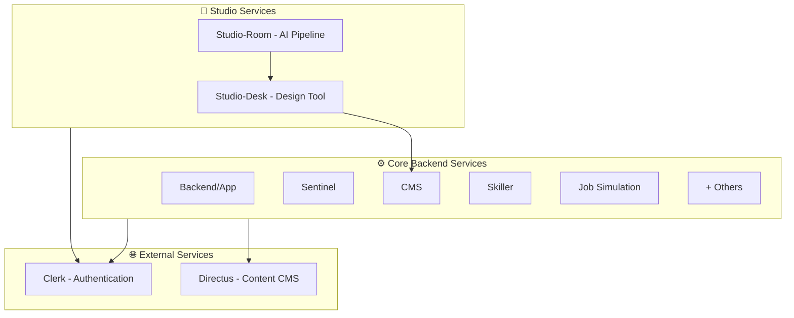

# Anthropos Service Taxonomy

This document explains the three-tier service architecture of the Anthropos platform, categorizing all services by their deployment model, technology stack, and operational characteristics.

## High-Level Summary (For PMs & Non-Engineers)

The Anthropos platform is built from **three types of services**:

1. **Core Backend Services**: The main engine of the platform - containerized microservices that handle user data, skills, simulations, and business logic.
2. **Studio Services**: Specialized tools for content creators to design and generate job simulations and learning content.
3. **External Services**: Third-party solutions we integrate with for authentication, content management, and infrastructure.



## Technical Deep Dive (For Engineers)

### Tier 1: Core Backend Services (Dockerized Go Microservices)

**Characteristics**:
- **Language**: Go
- **Deployment**: Docker Compose with Makefile automation (local) / AWS ECS (production)
- **Communication**: HTTP/RPC + Redis Streams
- **Database**: PostgreSQL (dedicated schemas per service)
- **Source**: Private GitHub repositories

**Services** (current local docker-compose, as of 2026-05-11):

| Service | Port(s) | Purpose | Profile | Source |
|:--------|:--------|:--------|:--------|:-------|
| **Backend/App** | 8081-8083 | Main API Gateway, User Management | graphql, backend | Local `../app` |
| **Sentinel** | 8087 | Authentication & Authorization | (always on) | Local `../sentinel` |
| **CMS** | 8090-8091 | Content Management, Directus Proxy, **embedded studio-room AI generation pipeline** | graphql, cms | Local `../cms` (+ `cms/studio/` submodule = `anthropos-studio-room`) |
| **Skiller** | 8085-8086 | Skill Management, Assessment, Vector Embeddings (RAG) | graphql, skiller | Local `../skiller` |
| **Skillpath** | 8100-8101 | Skill Progression Paths | graphql, skillpath | Local `../skillpath` |
| **Jobsimulation** | 8400-8401 | Job Environment Simulation | graphql, jobsimulation | Local `../jobsimulation` |
| **Storage** | 8300-8301 | File/Blob Storage Management | graphql, storage | Local `../storage` |
| **Roadrunner** | 10400-10401 | Code execution proxy to Judge0 | graphql, roadrunner | Local `../roadrunner` |
| **Gotenberg** | 3200 | Office-doc → PDF conversion (LibreOffice) | graphql, backend | Third-party image `gotenberg/gotenberg:8` |
| **Graphql** (Cosmo Router) | 5050 | Apollo Federation v2 gateway | graphql | Local `../graphql-wundergraph` (built into local image) |

**Available but not in default `graphql` profile**:

| Service | Port(s) | Purpose | Profile | Source |
|:--------|:--------|:--------|:--------|:-------|
| **Messenger** | 8200-8201 | Email notifications via Brevo | messenger | Local `../messenger` |
| **CustomerIO Sync** | 8080 | Background data sync to Customer.io | customerio-sync | Built directly from `git@github.com:anthropos-work/customerio-sync.git#main` (not cloned locally) |
| **Studio-Desk** | 9000, 9100 | Studio design tool (containerized variant) | studio-desk | Local `../studio-desk` |
| **Next-Web-App** | 3000 | Frontend (containerized variant) | frontend | Local `../next-web-app` |

**Base services (no profile, always on with any `make up`)**:
- **PostgreSQL** :5432 (custom image with pgvector extension)
- **Redis** :6379 (`bitnamilegacy/redis:latest`)

**Archived (removed from local orchestration; repo dirs may still exist on disk)**:

| Service | Why removed | Reference |
|:--------|:------------|:----------|
| **Chronos** | Removed from local dev orchestration | Platform commit `045857c` |
| **Intelligence** | Removed from local dev orchestration | Platform commit `fdfa189` |

**Production-only (deployed but not in local docker-compose)**:
- **db-backup**: Scheduled PostgreSQL backups (6h cycle) to S3, Azure, Hetzner — see [db-backup.md](../services/db-backup.md)

**Shared Libraries** (imported by services, not deployed):

| Library | Purpose | Repository |
|:--------|:--------|:-----------|
| **colony** | Platform framework: logging, DB/Redis, middleware, pub/sub (Watermill) | `git@github.com:anthropos-work/colony.git` |
| **authn** | Clerk JWT authentication middleware | `git@github.com:anthropos-work/authn.git` |
| **proto** | Protobuf definitions (single source of truth for RPC contracts) | `git@github.com:anthropos-work/proto.git` |
| **ai** | Unified AI provider wrapper (OpenAI, Anthropic, Mistral, Azure) + cost tracking | `git@github.com:anthropos-work/ai.git` |
| **taxonomy** | Skills taxonomy data (60K skills, 18K roles) | `git@github.com:anthropos-work/taxonomy.git` |

**Development Pattern**:
```bash
# Clone all repos and start all backend services
cd platform
make init              # Clone all repos (first time only)
make up                # Build from local code and start (graphql profile)
make up PROFILE=cms    # Start a specific profile
make dev S=cms         # Stop Docker container, develop natively
```

---

### Tier 2: Studio Services (Custom Applications)

**Characteristics**:
- **Deployment**: Standalone processes (not in main docker-compose)
- **Purpose**: Content creation and AI-powered generation
- **Users**: Internal content creators and designers
- **Integration**: Connect to Core Services via GraphQL/HTTP

#### Studio-Desk

| Property | Value |
|:---------|:------|
| **Technology** | TypeScript, Vite, Express.js, React |
| **Port** | 9100 (frontend), 9000 (backend) - configurable via `.env` |
| **Purpose** | User-facing design tool for creating job simulation blueprints |
| **Authentication** | Clerk |
| **Location** | `studio/studio-desk/` |

**Key Features**:
- Simulation Builder with visual designer
- Studio Copilot (AI assistant using GPT-5.x)
- Document editing and attachments management
- Multi-language support (7 languages)

**Development**:
```bash
cd studio-desk
npm install
npm run dev  # Starts both frontend (9100) and backend (9000)
```

#### Studio-Room (embedded in CMS)

| Property | Value |
|:---------|:------|
| **Technology** | Python 3.11, asyncio, OpenAI/Anthropic/Mistral APIs |
| **Purpose** | AI-powered content generation pipeline |
| **Input** | Blueprints (StudioDocuments) created in Studio-Desk and stored via CMS |
| **Output** | Generated simulations and learning content; CMS persists results |
| **Repo** | `git@github.com:anthropos-work/anthropos-studio-room.git` |
| **Location** | `cms/studio/` — cloned in by `cd cms && make init-studio` (git submodule pattern, not a real `.gitmodules` entry) |
| **Runtime** | Baked into the cms Docker image (`Dockerfile.dev` final stage uses `python:3.11-slim` + `pip install -r studio/requirements.txt`) |

**Generation Pipeline**:
1. **Pre-generation**: Load template, validate parameters
2. **AI Generation**: Execute multi-step generation workflow
3. **Post-generation**: Translation, metadata, guidance generation

**Local development** (no cms container needed):
```bash
cd cms/studio
pip install -r requirements.txt
python gen.py --media simulation --template <name>
```

**Sync the studio submodule** when upstream changes:
```bash
cd cms
make update-studio   # pulls latest in cms/studio/
```

**Relationship**: Studio-Desk creates the *design* (blueprint). The cms service (Go) orchestrates `StudioTask` records; the studio-room Python code runs inside the same container to execute generation.

---

### Tier 3: External Services & Integrations

**Characteristics**:
- **Hosting**: SaaS or third-party Docker images
- **Integration**: Via APIs, webhooks, SDKs
- **Management**: Minimal custom code, configuration-driven

#### Clerk (SaaS - Authentication)

| Property | Value |
|:---------|:------|
| **Type** | External SaaS |
| **Purpose** | User authentication, organization management |
| **Integration Points** | Frontend apps, Backend middleware, Studio-Desk |
| **SDK** | `@clerk/nextjs`, `@clerk/express`, `@clerk/clerk-js` |

**Environment Variables**:
- `CLERK_PUBLISHABLE_KEY` / `NEXT_PUBLIC_CLERK_PUBLISHABLE_KEY`
- `CLERK_SECRET_KEY`
- `CLERK_SIGN_IN_URL`

**Used By**: 
- Next.js apps (Web, Hiring, Mobile)
- Studio-Desk
- Backend services (via Sentinel)

#### Directus (Dockerized - Headless CMS)

| Property | Value |
|:---------|:------|
| **Type** | Third-party Docker Image |
| **Image** | `directus/directus:10.10.1` |
| **Port** | 8055 |
| **Purpose** | Content storage and management |
| **Database** | PostgreSQL (dedicated `directus` schema) |

**Integration Pattern**:
```
Frontend → CMS Service → Directus API → PostgreSQL
```

The **CMS Service** acts as a smart proxy/adapter, adding business logic on top of Directus.

**Storage**:
- Local: `./data/directus/uploads`
- Cloud: S3 (via AWS credentials)

#### GraphQL/Cosmo Router (Dockerized - API Gateway)

| Property | Value |
|:---------|:------|
| **Type** | Third-party with custom config (WunderGraph Cosmo Router) |
| **Port** | 5050 |
| **Purpose** | Apollo Federation v2, unified GraphQL API gateway |
| **Repository** | `git@github.com:anthropos-work/graphql-wundergraph.git` |
| **Subgraphs** | app, skiller, jobsimulation, cms, skillpath |

**Aggregates**:
- Backend, CMS, Skiller, Jobsimulation, Intelligence services

**Consumed By**:
- Next.js frontend applications
- Studio-Desk

---

## Service Communication Patterns

### Core Services ↔ Core Services
- **Synchronous**: HTTP RPC (e.g., `SKILLER_RPC_ADDR=http://skiller:8086`)
- **Asynchronous**: Redis Streams (e.g., `JOBSIMULATION_STREAM=jobsimulation`)

### Studio Services → Core Services
- **Studio-Desk**: GraphQL via Wundergraph (`VITE_GRAPHQL_ENDPOINT=http://localhost:5050/graphql`)
- **Studio-Room**: Direct integration with CMS service for blueprint retrieval

### All Services → External Services
- **Authentication**: Clerk SDK/API
- **Content Storage**: Directus API (via CMS proxy for core services)

---

## Development Environment Setup

The platform uses a **Makefile** as the single entry point. All service repos are cloned as siblings via `make init` and built from local code.

### Quick Start
```bash
cd platform
make init              # Clone all repos (first time)
make up                # Start all backend services (graphql profile)
```

### Full Platform (Backend + Frontend + Studio)
```bash
# Terminal 1: All backend services
cd platform
make up

# Terminal 2: Frontend (native, hot-reload)
cd next-web-app
pnpm install && pnpm dev:web

# Terminal 3: Studio-Desk (native, hot-reload)
cd studio-desk
npm install && npm run dev
```

Or run everything in Docker:
```bash
cd platform
make up-all
```

### Native Development (Single Service)
```bash
cd platform
make dev S=cms         # Stops Docker container
cd ../cms
go run .               # Run natively
```

### Profiles
| Profile | Services started |
|---------|------------------|
| (none — default `docker compose up`) | postgresql, redis, sentinel only |
| `graphql` (the Makefile default) | postgresql, redis, sentinel, backend, skiller, skillpath, jobsimulation, cms, storage, roadrunner, gotenberg, graphql |
| `backend` | postgresql, redis, sentinel, backend, gotenberg |
| `skiller` / `skillpath` / `cms` / `jobsimulation` / `storage` / `roadrunner` | postgresql, redis, sentinel + the named service |
| `messenger` | postgresql, redis, sentinel, messenger (depends on backend/cms/jobsimulation/skiller/skillpath — bring those up too) |
| `customerio-sync` | postgresql, redis, sentinel, customerio-sync |
| `frontend` | + next-web-app (containerized) |
| `studio-desk` | + studio-desk (containerized) |
| `all` | Everything in the compose file |

Use `docker compose --profile <name> config --services` to verify the actual member list for a given profile.

---

## Summary Table

| Tier | Count | Technology | Deployment | Management |
|:-----|:------|:-----------|:-----------|:-----------|
| **Core Backend (local `graphql` profile)** | 10 Go services + Gotenberg + Cosmo Router | Go (+ embedded Python in cms) | Docker Compose + Makefile | GitHub repos (`anthropos-work` org) |
| **Other profiles (off by default)** | Messenger, CustomerIO Sync, Studio-Desk (Docker), Next-Web-App (Docker) | Go / TypeScript | Docker Compose (opt-in profiles) | GitHub repos |
| **Shared Libraries** | 5 (colony, authn, proto, ai, taxonomy) | Go | Imported (not deployed) | GitHub repos |
| **Studio** | Studio-Desk + Studio-Room | TypeScript / Python | Studio-Desk standalone; Studio-Room is embedded in cms image as `cms/studio/` | Local directories / cms submodule |
| **Production-only** | db-backup | Go | ECS scheduled task | GitHub repo |
| **Archived** | Chronos, Intelligence | Go | Removed from local orchestration (2026-Q2) | GitHub repos still exist |
| **External** | Clerk, Directus, Cosmo Router, AI providers, LiveKit, AWS Chime | Various | SaaS / Docker | Configuration-driven |
