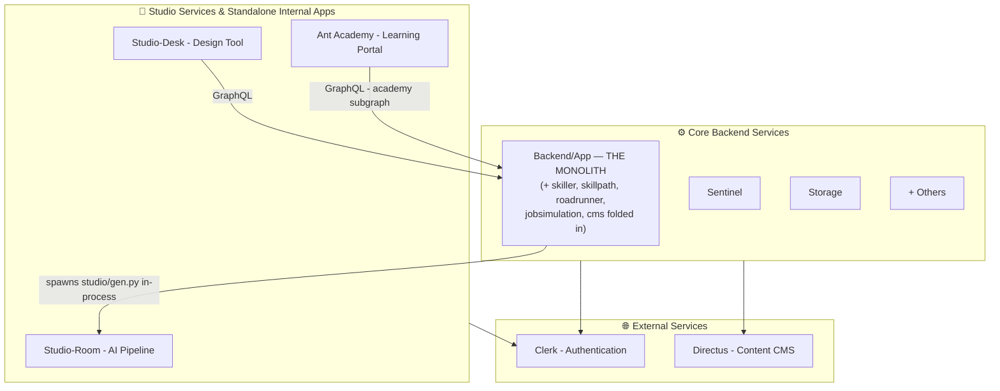

# Anthropos Service Taxonomy

> **⚠️ Router status, two states (v2.8 M257x).** Platform `b56d731`+`360efd4` (merged **`2adcf71`**, 2026-07-31) **deleted the Cosmo Router from local dev** — no `graphql` compose service, no `repos.yml` entry — and re-pointed the frontends at **`backend` directly, `http://localhost:8082/graphql/query`**. **There is no `:5050` on a local stack.** In *production* the router is still declared (`graphql-wundergraph/terraform/main.tf:20` `= 1`), though **the repo is ARCHIVED on GitHub (2026-07-30)**. And the supergraph is **ONE** subgraph — `backend` — since `915da06` (2026-07-29). The fenced source of truth is [`platform-migration-status.md`](./platform-migration-status.md).


This document explains the three-tier service architecture of the Anthropos platform, categorizing all services by their deployment model, technology stack, and operational characteristics.

## High-Level Summary (For PMs & Non-Engineers)

The Anthropos platform is built from **three types of services**:

1. **Core Backend Services**: The main engine of the platform - containerized microservices that handle user data, skills, simulations, and business logic.
2. **Studio Services**: Specialized tools for content creators to design and generate job simulations and learning content.
3. **External Services**: Third-party solutions we integrate with for authentication, content management, and infrastructure.


```mermaid
graph TB
    subgraph External["🌐 External Services"]
        Clerk[Clerk - Authentication]
        Directus[Directus - Content CMS]
    end
    
    subgraph Studio["🎨 Studio Services & Standalone Internal Apps"]
        Desk[Studio-Desk - Design Tool]
        Room[Studio-Room - AI Pipeline]
        Academy[Ant Academy - Learning Portal]
    end
    
    subgraph Core["⚙️ Core Backend Services"]
        Backend["Backend/App — THE MONOLITH<br/>(+ skiller, skillpath, roadrunner,<br/>jobsimulation, cms folded in)"]
        Sentinel[Sentinel]
        Storage[Storage]
        Others[+ Others]
    end
    
    Desk -->|GraphQL| Backend
    Academy -->|GraphQL - academy subgraph| Backend
    Backend -->|spawns studio/gen.py in-process| Room
    Core --> Directus
    Studio --> Clerk
    Core --> Clerk
```

> **Read the generation edge in that direction.** Until this pass the diagram drew `Room --> Desk`, which
> is backwards: Studio-Desk never receives anything from Studio-Room, and Studio-Room never calls
> Studio-Desk. Generation flows **Desk → Backend → Room** — Desk submits/polls `StudioTask` over GraphQL
> (`studio-desk/.env.example:45` bakes `VITE_GRAPHQL_ENDPOINT=http://localhost:8082/graphql/query`; the
> `studioTask` / `studioTasks` / `archiveStudioTask` operations are `app`'s, in
> `app/internal/web/backend/graphql/graph/schemas/cms_queries.graphqls:106`), and the cms domain in `app`
> then runs the pipeline as a **subprocess of its own container** —
> `app/internal/cms/studio/studioManager.go:119` execs `studio/gen.py`. Same correction as
> [`dependency_map.md`](./dependency_map.md)'s content-generation flow, which had it right all along.

## Technical Deep Dive (For Engineers)

### Tier 1: Core Backend Services (Dockerized Go Microservices)

**Characteristics**:
- **Language**: Go
- **Deployment**: Docker Compose with Makefile automation (local) / AWS ECS (production)
- **Communication**: HTTP/RPC + Redis Streams
- **Database**: PostgreSQL — **one schema, `public`, owned by `app`**, which is the only repo with migrations (`repos.yml:11-14`). `sentinel` keeps its own `sentinel` schema (`docker-compose.yml:18`, `search_path=sentinel`) **despite `migrations: false`** (`repos.yml:15-17`) — the Trap-A case; the `cms`, `jobsimulation` and `skillpath` schemas are legacy husks
- **Source**: Private GitHub repositories

**Services**, derived from the local docker-compose at platform `0dab54d` — **`docker-compose.yml`
declares eight services (ten in the effective topology, once `include: common.yml` adds the
`postgresql`/`redis` floor), the default profile is `core`, and `core` starts five**: `backend`,
`gotenberg` and the three always-on base services. **There is no `graphql` profile, and no cms /
jobsimulation / roadrunner service of any kind.** (For four releases this table named the retired
router token as the default selection and counted six Go services plus Gotenberg, three of them
unfederated husks — long after that stopped being true. It was dated `@ 2adcf71`, and the date is what
made it look checked. M257x iter-63; the eight-declared/ten-effective split corrected in the M257x
platform re-alignment pass, to match [`external_services.md:296`](./external_services.md).)

| Service | Port(s) | Purpose | Profile | Source |
|:--------|:--------|:--------|:--------|:-------|
| **Backend/App** | 8081-8083 (container: HTTP 8082, RPC 8083, meta 8084) | **The monolith.** Main API Gateway, User Management, **AI-readiness** workforce subsystem ([→](../services/ai-readiness.md)), **skills taxonomy + embeddings + AI matching** (merged skiller domain, July 2026 — [→](../services/skiller.md)), the **skill-path progression engine** (merged skillpath, "skillpath-in-app" M502→M507 — [→](../services/skillpath.md)), the **simulation runtime** (merged jobsimulation, "jobsim-in-app" — [→](../services/jobsimulation.md)), the **content layer + Studio** (merged cms, "cms-in-app v8.0" app v1.360.0 — [→](../services/cms.md)), **Judge0 code execution** (merged roadrunner — [→](../services/roadrunner.md)), plus the newer app-owned domains (course-builder, AI Labs + credits, ask-engine, academy store) | core, backend, all | Local `../app` (+ `anthropos-studio-room` baked into the image) |
| **Sentinel** | 8087 | Authorization (Casbin RBAC/ABAC) | (always on — declares no `profiles:` key) | Local `../sentinel` |
| **Gotenberg** | 3200 | Office-doc → PDF conversion (LibreOffice) | core, backend, all | Third-party image `gotenberg/gotenberg:8` |

**Available, but NOT in the default `core` selection** — each needs its profile named explicitly.
**Storage is the one to notice**: it used to start with the backend tier and now does not.

| Service | Port(s) | Purpose | Profile | Source |
|:--------|:--------|:--------|:--------|:-------|
| **Storage** | 8300-8301 | File/Blob Storage Management. **Moved out of the default selection** — a bare `make up` no longer starts it | storage-legacy | Local `../storage` |
| **Messenger** | 8200-8201 | Email notifications via Brevo | messenger | Local `../messenger` |
| **CustomerIO Sync** | 8080 | Background data sync to Customer.io | customerio-sync, all | Built directly from `git@github.com:anthropos-work/customerio-sync.git#main` (not cloned locally) |
| **Studio-Desk** | 9000, 9100 | Studio design tool (containerized variant) | studio-desk, all | Local `../studio-desk` |
| **Next-Web-App** | 3000 | Frontend (containerized variant) | frontend, all | Local `../next-web-app` |

**Gone from compose entirely** — no service, no port, no profile, at `0dab54d`:
Jobsimulation, CMS and Roadrunner (their domains run inside `app`; deleted by `d11a403`), and the
Cosmo Router (`graphql`, deleted by `2adcf71`; frontends hit `backend` at **`:8082/graphql/query`**).

**Base services (no profile, always on with any `make up`)**:
- **PostgreSQL** :5432 (custom image with pgvector extension)
- **Redis** :6379 (`bitnamilegacy/redis:latest`)

**Archived / merged — but read the `Local container?` column** (repo dirs may still exist on disk):

> **⚠️ Two different fates shared this table, and the second one has now closed.** *Merged into `app`*
> did **not** imply *gone from compose*: until `d11a403` (merged `ef32d4c`, 2026-08-03) CMS,
> Jobsimulation and Roadrunner were still defined in `docker-compose.yml` in the then-default profile,
> so a bare `make up` started all three as unfederated husks — the `running_but_unfederated` state in
> [`platform-migration-status.md`](./platform-migration-status.md). **At `0dab54d` all three are gone
> from compose and from `repos.yml`**, so every row below now reads `no` and the two fates have
> converged. Keep the distinction in mind anyway: it is a *phase*, and the next fold will pass through
> it too.

| Service | Why removed | Local container? | Reference |
|:--------|:------------|:-----------------|:----------|
| **Chronos** | Removed from local dev orchestration | **no** | Platform commit `045857c` |
| **Intelligence** | Removed from local dev orchestration | **no** | Platform commit `fdfa189` |
| **Skiller** | Merged into Backend/App (July 2026); repo legacy/decommissioned, ARCHIVED 2026-07-01 | **no** | [skiller.md](../services/skiller.md) |
| **Skillpath** | Merged into Backend/App then decommissioned ("skillpath-in-app", platform M502→M507); session state → `public.skill_path_sessions`; repo legacy, ARCHIVED 2026-07-31 | **no** | [skillpath.md](../services/skillpath.md) |
| **Jobsimulation** | Merged into Backend/App ("jobsim-in-app"); 23 run-state tables → `public`; **no subgraph**; ECS module kept as the rollback path; repo ARCHIVED 2026-07-31 | **NO — gone from compose at platform `0dab54d`** (and from `repos.yml`). Merged into `app`, no subgraph, no container | [jobsimulation.md](../services/jobsimulation.md) |
| **CMS** | Merged into Backend/App ("cms-in-app v8.0", app v1.360.0); similarity + Studio tables → `public`; supergraph **3→1** (the one commit `graphql-wundergraph@915da06` deleted `cms.graphqls` **and** `jobsimulation.graphqls`); ECS module kept as the rollback path; repo frozen, **not** archived | **NO — gone from compose at platform `0dab54d`** (and from `repos.yml`), deleted by `d11a403`. Merged into `app`, no subgraph, no container, no port. `messenger`'s `CMS_RPC_ADDR` now reads `http://backend:8083` (`docker-compose.yml:174`) | [cms.md](../services/cms.md) |
| **Roadrunner** | Merged into Backend/App with jobsim-in-app; `backend` calls Judge0 directly via `JUDGE0_BASE_URL`; **orphaned, not absent** — prod terraform still reads `= 1` | **NO — gone from compose at platform `0dab54d`**, deleted by `d11a403`. Merged into `app`, no container, no port; only the prod terraform module survives as the rollback path | [roadrunner.md](../services/roadrunner.md) |

**Production-only (deployed but not in local docker-compose)**:
- **db-backup**: Scheduled PostgreSQL backups (6h cycle) to S3, Azure, Hetzner — see [db-backup.md](../services/db-backup.md)

**Shared Libraries** (imported as private Go modules — **not** cloned by `make init`; pulled at Docker build via `GH_PAT`/`GOPRIVATE`). Full reference: [Shared Libraries](./shared_libraries.md).

| Library | Purpose | Repository |
|:--------|:--------|:-----------|
| **colony** | Platform framework: logging, DB/Redis, GraphQL/RPC servers, middleware, pub/sub (Watermill); also contains `authn` | `git@github.com:anthropos-work/colony.git` |
| **proto** | Protobuf definitions (single source of truth for RPC contracts) + hand-written domain types | `git@github.com:anthropos-work/proto.git` |
| **ai** | AI provider wrapper behind one `ai.AI` interface (OpenAI, Azure, Anthropic, Bedrock, Mistral). Cost tracking & **vendor selection** live in the **consumers**, not this lib — and that selection is a caller-supplied switch, **not** an EU-first fallback ladder ([no such ladder exists](./external_services.md#routing-what-is-actually-implemented)) | `git@github.com:anthropos-work/ai.git` |
| **authn** | Clerk JWT authentication — now shipped **inside colony** as `colony/authn` (standalone repo is legacy) | `git@github.com:anthropos-work/authn.git` |
| **taxonomy** | **node-id library** (`NodeID` type + ID generation/validation) — **not** a dataset; the skill/job-role data (**≥42,790 skills**, **≥22,470 job roles** — public subset, measured 2026-06-29) lives in `app`'s `public` schema (former skiller service). The long-quoted "60K skills / 18K roles" is not a measurement: [18K is refuted, 60K is unverified](./shared_libraries.md#taxonomy-figures) | `git@github.com:anthropos-work/taxonomy.git` |

**Development Pattern**:
```bash
# Clone all repos and start all backend services
cd platform
make init              # Clone all repos (first time only)
make up                # Build from local code and start (core profile — Makefile:10 PROFILE ?= core)
make up PROFILE=backend  # Start a specific profile
make dev S=backend       # Stop Docker container, develop natively
```

> [!IMPORTANT]
> **Content layer vs. runtime state.** This split-ownership model **survived the monolith merge** — the boundary is now between packages inside `app`, not between services:
> - **CMS is the content layer** — it owns the authored CONTENT / DEFINITIONS (skill-path content: chapters → steps, curators, skills-to-verify, settings; job-simulation *blueprints*; the content library) by wrapping Directus with business logic + a Redis cache.
> - **The skill-path and jobsimulation engines** own RUNTIME / SESSION / PROGRESS state and reference cms content **by ID only**. The skill-path engine tracks `SkillPathSession → ChapterSession → StepSession` (state in `public.skill_path_sessions`); the jobsimulation engine runs the interactive session (23 run-state tables, also in `public`). Both fetch definitions from the cms domain **in-process** — the `CMS_RPC_ADDR` / `cms.GetSimulation` hops are gone.
>
> So **skill-path *content* ≠ the skill-path *engine*, and "jobsimulation" ≠ simulation content.** Content = the cms domain/Directus; the engine = the state machine over it. See [CMS](../services/cms.md), [Skillpath](../services/skillpath.md), [Jobsimulation](../services/jobsimulation.md).

---

### Tier 2: Studio Services & Standalone Internal Apps

**Characteristics**:
- **Deployment**: standalone processes — typically Vercel or local-only — **but not uniformly outside
  docker-compose**: Studio-Desk, the first Tier-2 member listed below, IS in the platform compose at
  `docker-compose.yml:197` behind `profiles: [studio-desk, all]` (`:226`), so it starts on
  `make up PROFILE=studio-desk` and not on a bare `make up`. The unqualified *"not in main
  docker-compose"* contradicted `:79` of this same file (the Studio-Desk row), `frontend_architecture.md:11` and
  `studio-desk.md:21`; corrected M257x iter-46
- **Purpose**: Content creation, AI-powered generation, and internal learning
- **Users**: Internal content creators, designers, and Anthropos employees
- **Integration**: Reuse platform identity (Clerk), and **both connect to Core Services over GraphQL** — Studio-Desk via `VITE_GRAPHQL_ENDPOINT`, Ant Academy via `NEXT_PUBLIC_WUNDERGRAPH_ENDPOINT`. **Neither is independent of the backend.** *(This page previously called Ant Academy "fully independent of the backend"; that framing was retired at v2.5 M231 — see [`ant-academy.md`](../services/ant-academy.md) — and it is the documented root cause of the "empty academy" demo bug.)*

#### Studio-Desk

| Property | Value |
|:---------|:------|
| **Technology** | TypeScript, Vite, Express.js — **no framework** (0 react/vue/angular entries in
`package.json`, 0 `.tsx`/`.jsx` in the repo). *"React"* was published here and contradicted by
[`studio-desk.md:20`](../services/studio-desk.md) (*"vanilla TS frontend, no framework"*); corrected
M257x iter-46 |
| **Port** | 9100 (frontend), 9000 (backend) - configurable via `.env` |
| **Purpose** | User-facing design tool for creating job simulation blueprints |
| **Authentication** | Clerk |
| **Location** | Local `../studio-desk` (sibling of platform, cloned by `make init`) |

**Key Features**:
- Simulation Builder with visual designer
- Studio Copilot (AI assistant using GPT-5.x)
- Document editing and attachments management
- Multi-language support (7 languages)

**Development**:
```bash
cd studio-desk
npm install
npm run dev  # Starts both frontend (9100) and backend (9000)
```

#### Studio-Room (embedded in `app`)

| Property | Value |
|:---------|:------|
| **Technology** | Python 3.11, asyncio, OpenAI / Azure OpenAI / Anthropic APIs — **no Mistral path** (`services/ai.py:705-708` is the whole provider registry; `mistralai` is declared in `requirements.txt` and imported nowhere). Mistral in this platform is Go-side and **OCR-only** |
| **Purpose** | AI-powered content generation pipeline |
| **Input** | Blueprints (StudioDocuments) created in Studio-Desk and stored via CMS |
| **Output** | Generated simulations and learning content; CMS persists results |
| **Repo** | `git@github.com:anthropos-work/anthropos-studio-room.git` |
| **Location** | Pulled into the **`app`** image by CI (`additional_repo`, app v1.360.1). Before cms-in-app it was `cms/studio/`, cloned by `cd cms && make init-studio`. |
| **Runtime** | Baked into the `app` (backend) Docker image — Python deps installed alongside the Go binary |

**Generation Pipeline**:
1. **Pre-generation**: Load the prompt (or a **blueprint** JSON), validate parameters
2. **AI Generation**: Execute multi-step generation workflow
3. **Post-generation**: Translation, metadata, guidance generation

**Local development** (no backend container needed) — run the Python project directly from a
clone of `anthropos-studio-room`:
```bash
cd ../anthropos-studio-room
pip install -r requirements.txt
# the repo's own entry point (studio/CLAUDE.md:12-14)
python gen.py --media simulation --prompt "..." --evaluation_skills "skill1, skill2" --branch stable
# or, from a reusable blueprint JSON in the attachments directory
python gen.py --media simulation --blueprint <file>.json
```

> **⚠️ There is no `--template` flag.** `gen.py`'s parser registers exactly nine arguments
> (`-i/--interactive`, `-m/--media`, `-f/--force`, `--simid`, `--branch`, `--prompt`,
> `--annotations`, `--pipeline`, `--blueprint`), and `parse_argument` uses `parse_known_args`,
> merging leftovers into the args dict — so a stray `--template foo` is **silently swallowed**, the
> command *succeeds*, and it generates something unrelated to what you asked for. The reusable unit
> is a **blueprint**, not a template. See
> [studio-room.md](../services/studio-room.md#blueprints-not-templates).

> Before cms-in-app this lived at `cms/studio/`, synced with `cd cms && make update-studio`.
> The pipeline is unchanged — only where the code is pulled in changed.

**Relationship**: Studio-Desk creates the *design* (blueprint). The cms domain in `app` (Go) orchestrates `StudioTask` records; the studio-room Python code runs inside the same container to execute generation.

#### Ant Academy

| Property | Value |
|:---------|:------|
| **Technology** | Next.js 16 App Router + React 19.2 (web) + Expo / React Native (mobile) |
| **Port** | 3077 (web dev), 8555 (mobile web preview) |
| **Purpose** | Internal learning portal — micro-chapters on AI engineering, agent frameworks, Claude Code, etc., for `@anthropos.work` employees |
| **Authentication** | Clerk (domain-gated to `@anthropos.work` + org-membership gate) |
| **Repo** | `git@github.com:anthropos-work/ant-academy.git` |
| **Location** | Local `../ant-academy` — **NOT** in `platform/repos.yml`, so **not** cloned by `make init` (by design, v1.10b M49 #5). For a **demo**, `ensure-clones.sh` clones it explicitly; for **dev**, clone it manually. See [`ant-academy.md`](../services/ant-academy.md). |
| **Deployment** | Vercel native (`.github/workflows/deploy-academy.yaml`) — **not** in docker-compose |
| **Platform dependencies** | **A GraphQL client of the platform `app` academy subgraph at runtime** — `NEXT_PUBLIC_WUNDERGRAPH_ENDPOINT` (`code/src/graphql/server.js:14,18` — it **throws** when unset). Reads: the course catalog is **DB-authoritative**, not the committed FS tree (`code/src/lib/backendContent.js:36,102-103`; `code/src/lib/serverTenant.js:145`). Writes: per-user progress, bookmarks, certificates and feedback POST through `code/app/api/academy/beacon/route.js:36,41-55` (`UPSERT_CHAPTER_PROGRESS`, `SET_LAST_ACTIVITY`, …). Server side: `app/internal/web/backend/graphql/graph/schemas/academy.graphqls`. Also reuses platform Clerk; AI calls go straight to the providers (never through the platform `ai` library). No Connect-RPC, no Redis. |

**Key Features**:
- Static chapter *bodies* as JSON in `code/public/content/<series>/<skill-path>/` — but **the catalog that decides what is visible is read from the platform over GraphQL, not from this tree**. With `NEXT_PUBLIC_WUNDERGRAPH_ENDPOINT` unset or the academy tables empty, the read degrades to an **empty grid**; it does *not* back-fill from the committed FS content (`code/src/lib/serverTenant.js:115-145` — *"there is NO FS-as-published fallback … not reversible-on-error"*). This is the "empty academy" demo symptom, and a **demo** only shows a populated grid because a rext demo-patch (`demo-stack/patches/academy-fs-published-fallback`) restores that fallback on the demo's ephemeral clone — it is not the shipped behaviour
- **No service worker / no offline caching** — the Serwist 9 layer was REMOVED (v0.5 M1). `code/package.json` has no `serwist`/`workbox` dependency, no `sw.*` is emitted, `RegisterServiceWorker.jsx` is now a kill-switch that *unregisters* any surviving worker, and the repo regression-fences the removal (`code/tests/unit/next-scaffold.test.js:106,111`; `react-compiler-config.test.js:41`). **The web-app MANIFEST survives** (`public/academy-manifest.json`, `display: standalone`, declared at `code/app/layout.jsx:132`), so the app is still installable — it is simply online-only. Offline chapter bundling survives only in the Expo mobile app
- Companion iOS / Android app (Expo SDK 54) bundling the same chapters at build time
- Opt-in in-app "Cosmo" AI assistant (`NEXT_PUBLIC_FEATURE_TRAINING_COACH`, default OFF) — calls the OpenAI Responses API (`gpt-5.2`) directly from the browser via a per-user `localStorage` key
- Repo-local Claude skills (`.claude/skills/`) for authoring chapters, podcasts, covers, and benchmarks

**Development** (web):
```bash
cd ant-academy/code
cp .env.example .env.local   # fill Clerk + AI keys (the app reads code/.env.local)
npm install
npm run dev            # next dev — port 3077
```

**Mobile** (optional):
```bash
cd ant-academy/mobile
pnpm install
pnpm run dev:web       # web preview at :8555
```

See [Ant Academy service doc](../services/ant-academy.md) for the full picture.

---

### Tier 3: External Services & Integrations

**Characteristics**:
- **Hosting**: SaaS or third-party Docker images
- **Integration**: Via APIs, webhooks, SDKs
- **Management**: Minimal custom code, configuration-driven

#### Clerk (SaaS - Authentication)

| Property | Value |
|:---------|:------|
| **Type** | External SaaS |
| **Purpose** | User authentication, organization management |
| **Integration Points** | Frontend apps, Backend middleware, Studio-Desk |
| **SDK** | `@clerk/nextjs`, `@clerk/express`, `@clerk/clerk-js`, `@clerk/clerk-expo`, `clerk-sdk-go/v2` |

> Full integration picture (dependent repos, the auth-vs-authz split): [Clerk Integration](../services/clerk-integration.md).

**Environment Variables**:
- `CLERK_PUBLISHABLE_KEY` / `NEXT_PUBLIC_CLERK_PUBLISHABLE_KEY`
- `CLERK_SECRET_KEY`
- `CLERK_SIGN_IN_URL`

**Used By**: 
- Next.js apps (Web, Hiring)
- Mobile app (Expo / React Native, via `@clerk/clerk-expo`)
- Studio-Desk
- Backend services (authenticate via the `authn` library; authorization is Sentinel's job)

#### Directus (Headless CMS — read live from prod by default)

| Property | Value |
|:---------|:------|
| **Type** | Third-party Headless CMS (self-hosted, **production**) |
| **Address** | `https://content.anthropos.work` (the prod public instance) |
| **Purpose** | Content storage and management (the public catalog + content library) |
| **Database** | PostgreSQL (dedicated `directus` schema) |

> **The platform `docker-compose.yml` has NO directus service.** The **cms domain inside `backend`** reaches
> Directus over the network via `DIRECTUS_BASE_ADDR` / `DIRECTUS_PUBLIC_BASE_ADDR` (compose sets the second on
> `backend` at `:53` @ `0dab54d`; the first arrives via the shared `env_file: .env`) — which
> point at the **production** instance `https://content.anthropos.work` in the stock compose. A freshly-built
> local stack
> reads its public content **live from prod**; there is no local Directus container, image pin, port, or
> admin/password in the platform compose. (Earlier revisions of this doc described a
> `directus/directus:10.10.1` compose service on port 8055 with an `admin@example.com` / `password` login as if
> it were CURRENT, which it is not.)
>
> **That retraction over-corrected, and this corrects the correction (M257x iter-46).** The service DID exist,
> with exactly that image tag, port and password, until platform `a2a3ee6` (2026-02-27) removed it:
> `git show a2a3ee6^:docker-compose.yml` → `:384 image: directus/directus:10.10.1`, `:386 8055:8055`,
> `:409 ADMIN_PASSWORD=password`. Only the `admin@example.com` **email** is unfound in history. *"Does not
> exist now"* became *"has never existed"* — and **the platform's own history refutes the stronger form**,
> which is the only thing that could. (This passage used to appeal to
> [`platform-migration-status.md`](./platform-migration-status.md) as *"the corpus's own fenced source of
> truth"* on the point, by `file:line`. That map has **no Directus row at all** — it maps repos, and
> Directus is an external service — so the anchor resolved to a row about something else entirely.
> `CHECK-M257x-iter64-pms-87-subject`, closed M257x iter-65.)

**Integration Pattern**:
```
Frontend/Studio-Desk → `backend` :8082/graphql/query (cms **domain**,
`app/internal/cms/directus/`) → Directus API (content.anthropos.work) → PostgreSQL
```

The **cms domain inside `backend`** acts as a smart proxy/adapter, adding business logic on top of
Directus. (Before cms-in-app this was a standalone `cms` service; **that container no longer exists** —
`d11a403` deleted it from compose, so at `0dab54d` there is nothing left to reach. The frontends are
baked against `backend`.)

> **A *local* Directus is a tooling feature, not a platform-compose service.** The Rosetta v1.5 "prop room"
> tooling (`rosetta-extensions`, not the platform repo) can stand up a **per-stack local Directus** —
> `directus/directus:11.6.1`, on an **offset port**, serving the captured public library so a stack is
> content-self-contained. It's **demo-default / dev-opt-in (`--local-content`)** and lives entirely in the
> stack-ops tooling. See [`corpus/ops/directus-local.md`](../ops/directus-local.md).

#### GraphQL/Cosmo Router — **HISTORICAL / PROD-ONLY**

> **⚠️ Not a local service.** Platform `2adcf71` (2026-07-31) deleted the `graphql` compose service **and** the
> `graphql-wundergraph` `repos.yml` entry; the GitHub repo was **archived 2026-07-30**. **There is no `:5050` on
> a local stack** — the frontends and studio-desk hit `backend` at `:8082/graphql/query`. The table below
> describes the router as it still exists **in production** (`graphql-wundergraph/terraform/main.tf:20` `= 1`)
> and in the archived repo; **do not follow it as a local-development instruction.** Consistent with `:58-59` above
> (*"There is no `graphql` profile"*).
> Fenced source of truth: [`platform-migration-status.md`](./platform-migration-status.md).

| Property | Value |
|:---------|:------|
| **Type** | Third-party with custom config (WunderGraph Cosmo Router) |
| **Port** | **8080** everywhere the router still runs — container and ECS alike (`terraform/locals.tf:8` `port = 8080`; `terraform/main.tf:48-49` maps container 8080 → host 8080; `config.prod.yaml:5` `listen_addr: 0.0.0.0:8080`). **`5050` was never a production port** — it was only the LOCAL compose host mapping `"5050:8080"`, deleted with the service at `2adcf71` |
| **Purpose** | Apollo Federation v2, unified GraphQL API gateway |
| **Repository** | `git@github.com:anthropos-work/graphql-wundergraph.git` |
| **Subgraphs** | **`backend` alone (1)**. The measured ladder in `supergraph-config-prod.yaml`: **5** (backend, skiller, jobsimulation, cms, skillpath) → **4** at `749dc86` (2026-06-24, skiller removed) → **3** at `7c17e63` (2026-07-21, skillpath folded in) → **1** at `915da06` (2026-07-29), which deleted `cms.graphqls` **and** `jobsimulation.graphqls` in a single commit. cms-in-app is therefore the **3 → 1** step, not "2 → 1" — the jobsimulation subgraph outlived jobsim-in-app and was removed here |

> Developer/code map: [GraphQL Gateway service doc](../services/graphql-wundergraph.md) (build-time composition, routing URLs, profiles).

**Aggregates**:
- Backend (`app`) — the only subgraph left. CMS and Jobsimulation folded into it.

**Consumed By** *(in production)*:
- Next.js frontend applications
- Studio-Desk

Locally, both of those now consume `backend` directly at `:8082/graphql/query`.

---

## Service Communication Patterns

### Core Services ↔ Core Services
- **Synchronous**: HTTP RPC — at platform `0dab54d` **all four** `*_RPC_ADDR` values compose sets (`BACKEND_USERS_`, `CMS_`, `JOBSIMULATION_`, `SKILLER_`) read `http://backend:8083`. The M809 re-point has landed; the husk addresses are gone along with the husk containers
- **Asynchronous**: Redis Streams (e.g., `JOBSIMULATION_STREAM=jobsimulation`)

### Studio Services → Core Services
- **Studio-Desk**: GraphQL via `VITE_GRAPHQL_ENDPOINT` — compose bakes `http://localhost:8082/graphql/query` (was `:5050/graphql` on the router)
- **Studio-Room**: runs inside the `app` image, orchestrated from `app/internal/cms/studio/` —
  blueprint retrieval is in-process against the cms domain, not a call to a CMS service

### All Services → External Services
- **Authentication**: Clerk SDK/API
- **Content Storage**: Directus API (via the cms **domain** in `app`, for core services)

---

## Development Environment Setup

The platform uses a **Makefile** as the single entry point. All service repos are cloned as siblings via `make init` and built from local code.

### Quick Start
```bash
cd platform
make init              # Clone all repos (first time)
make up                # Start the core selection: backend + gotenberg + the postgresql/redis/sentinel floor
```

### Full Platform (Backend + Frontend + Studio)
```bash
# Terminal 1: the backend tier (core profile — backend + gotenberg + the floor)
cd platform
make up

# Terminal 2: Frontend (native, hot-reload)
cd next-web-app
pnpm install && pnpm dev:web

# Terminal 3: Studio-Desk (native, hot-reload)
cd studio-desk
npm install && npm run dev
```

Or run everything in Docker:
```bash
cd platform
make up-all
```

### Native Development (Single Service)
```bash
cd platform
make dev S=backend     # Stops Docker container
cd ../app
go run .               # Run natively — this one process covers skiller,
                       # skillpath, roadrunner, jobsimulation and cms too
```

### Profiles
| Profile | Services started |
|---------|------------------|
| (none — default `docker compose up`) | postgresql, redis, sentinel only — **the floor**, the three services that declare no `profiles:` key and are therefore in *every* selection |
| `core` (the Makefile default — `PROFILE ?= core`) | the floor + backend, gotenberg |
| `backend` | the floor + backend, gotenberg |
| `all` | the floor + backend, gotenberg, customerio-sync, next-web-app, studio-desk |
| `storage-legacy` | the floor + storage — the rollback path; `app` serves storage in-process now |
| `customerio-sync` | the floor + customerio-sync |
| `frontend` / `studio-desk` / `messenger` | **exit 1** — each named service declares `depends_on: backend`, which its own profile does not select, so compose rejects the project |

**Retired tokens — and they do not fail.** `graphql` (renamed to `core` at platform `0dab54d`), plus
`cms`, `jobsimulation`, `roadrunner` and `storage`, are no longer profiles. Selecting any of them
**exits 0 and starts the 3-service floor and nothing else**. Grade a documented command on *does it
still select anything*, not *does it still parse* — which is why none of them appears above in a
runnable form.

Use `docker compose --profile <name> config --services` to verify the actual member list for a given profile.

---

## Summary Table

| Tier | Count | Technology | Deployment | Management |
|:-----|:------|:-----------|:-----------|:-----------|
| **Core Backend (the default `core` selection)** | **5 containers** — `backend` + `gotenberg` + the three always-on base services (`postgresql`, `redis`, `sentinel`). No Cosmo Router (deleted at `2adcf71`), no cms / jobsimulation / roadrunner (deleted at `d11a403`) | Go (+ embedded Python — Studio-Room, in the **`app`** image) | Docker Compose + Makefile | GitHub repos (`anthropos-work` org) |
| **Other profiles (off by default)** | Storage (`storage-legacy`), Messenger, CustomerIO Sync, Studio-Desk (Docker), Next-Web-App (Docker) | Go / TypeScript | Docker Compose (opt-in profiles) | GitHub repos |
| **Shared Libraries** | **5 libraries, 4 imported** — colony, proto, ai, taxonomy (none of them in `repos.yml`; they are pulled at Docker build). `authn` is a library but not a dependency: it ships inside colony as `colony/authn` and no service's `go.mod` requires the standalone module (0 hits across all seven Go clones; control — `colony` is required by all seven) | Go | Imported (not deployed) | GitHub repos |
| **Studio** | Studio-Desk + Studio-Room | TypeScript / Python | Studio-Desk standalone; Studio-Room is embedded in the **`app`** image, orchestrated from `app/internal/cms/studio/` (it was `cms/studio/` before cms-in-app) | Local directories |
| **Standalone Internal Apps** | Ant Academy | Next.js 16 + Expo (TypeScript / JavaScript) | Standalone, Vercel-deployed; not in docker-compose | GitHub repo `ant-academy` — **not** in `repos.yml`, so **not** cloned by `make init` (demo: explicit `ensure-clones.sh` clone; dev: manual) |
| **Production-only** | db-backup | Go | ECS scheduled task | GitHub repo |
| **Archived / merged** | Chronos, Intelligence, Skiller (merged into app, July 2026), Skillpath (merged into app, M502→M507), **CMS, Jobsimulation and Roadrunner** (merged into app; their compose services and `repos.yml` entries deleted by `d11a403`) | Go | Removed from local orchestration | GitHub repos still exist |
| **External** | Clerk, Directus, Cosmo Router (**prod only** — see the banner at the top of this file), AI providers, LiveKit, AWS Chime | Various | SaaS / Docker | Configuration-driven |
