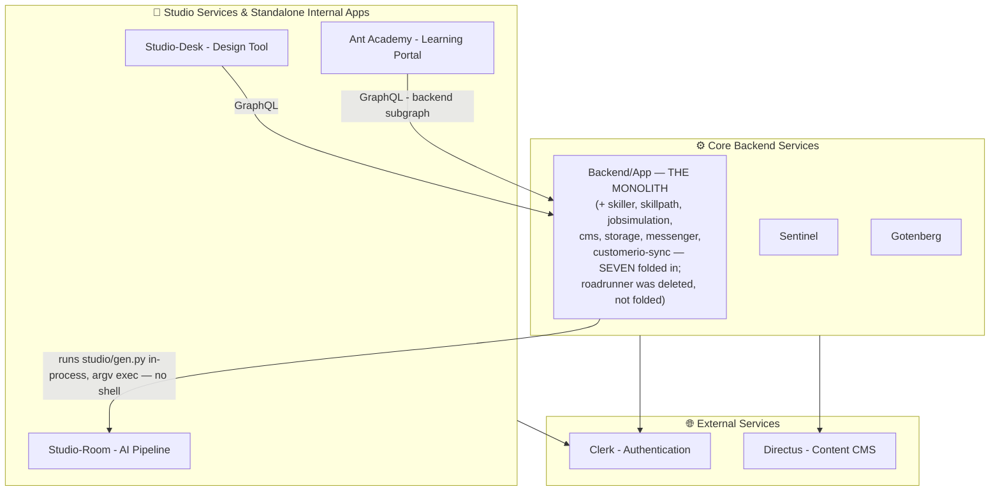

# Anthropos Service Taxonomy

> **⚠️ THE ROUTER IS GONE IN BOTH STATES — corrected M257x iter-124 (v2.8).** Platform `b56d731`+`360efd4` (merged **`2adcf71`**, 2026-07-31) **deleted the Cosmo Router from local dev** — no `graphql` compose service, no `repos.yml` entry — and re-pointed the frontends at **`backend` directly, `http://localhost:8082/graphql/query`**. **There is no `:5050` on a local stack.** **And it is DESTROYED in production too**: `module.wundergraph_euwest1` is deleted from `infrastructure/terraform/production/services.tf` @ `13c248e6`, whose `:509-517` records that the apply destroyed *"its ECS service, task definition, target group, ALB rule (priority 810), Cloud Map entry, log group, ACM cert and the `wundergraph.anthropos.work` alias"* — ECR hand-deleted **2026-08-05**, *"so production-wundergraph is gone and this block is now inert."* **This banner said *"in production the router is still declared"* until iter-124**, citing `graphql-wundergraph/terraform/main.tf:20` `= 1` — **orphaned dead code**: a `service_desired_count` in a repo whose module no root module instantiates describes nothing ([`org-repos.md` § 3](org-repos.md)). The repo is **ARCHIVED on GitHub (2026-07-30)**. The supergraph was **ONE** subgraph — `backend` — since `915da06` (2026-07-29). **Where production's frontends now send GraphQL is NOT something this corpus can see** — that is Vercel runtime configuration, in no clone set. The fenced source of truth is [`platform-migration-status.md`](./platform-migration-status.md).


This document explains the three-tier service architecture of the Anthropos platform, categorizing all services by their deployment model, technology stack, and operational characteristics.

## High-Level Summary (For PMs & Non-Engineers)

The Anthropos platform is built from **three types of services**:

1. **Core Backend Services**: The main engine of the platform - containerized microservices that handle user data, skills, simulations, and business logic.
2. **Studio Services**: Specialized tools for content creators to design and generate job simulations and learning content.
3. **External Services**: Third-party solutions we integrate with for authentication, content management, and infrastructure.


```mermaid
graph TB
    subgraph External["🌐 External Services"]
        Clerk[Clerk - Authentication]
        Directus[Directus - Content CMS]
    end
    
    subgraph Studio["🎨 Studio Services & Standalone Internal Apps"]
        Desk[Studio-Desk - Design Tool]
        Room[Studio-Room - AI Pipeline]
        Academy[Ant Academy - Learning Portal]
    end
    
    subgraph Core["⚙️ Core Backend Services"]
        Backend["Backend/App — THE MONOLITH<br/>(+ skiller, skillpath, jobsimulation,<br/>cms, storage, messenger,<br/>customerio-sync — SEVEN folded in;<br/>roadrunner was deleted, not folded)"]
        Sentinel[Sentinel]
        Gotenberg[Gotenberg]
        %% A Storage node stood here until 838d907 folded it into Backend
    end
    
    Desk -->|GraphQL| Backend
    Academy -->|GraphQL - backend subgraph| Backend
    Backend -->|runs studio/gen.py in-process, argv exec — no shell| Room
    Core --> Directus
    Studio --> Clerk
    Core --> Clerk
```

> **Read the generation edge in that direction.** Until this pass the diagram drew `Room --> Desk`, which
> is backwards: Studio-Desk never receives anything from Studio-Room, and Studio-Room never calls
> Studio-Desk. Generation flows **Desk → Backend → Room** — Desk submits/polls `StudioTask` over GraphQL
> (`studio-desk/.env.example` bakes `NEXT_PUBLIC_GRAPHQL_ENDPOINT=http://localhost:8082/graphql/query` on the migration branch — the `VITE_*` spelling this cited @ `41ee3575` is retired, and the file now carries ZERO `VITE_` assignments; the
> `studioTask` / `studioTasks` / `archiveStudioTask` operations are `app`'s — but ⚠️ **they are not all in
> one file, and this bullet supplied a single locator for three constructs until M257x iter-115.** At `app`
> `ad9f3c49`: `studioTask` is `…/graphql/graph/schemas/cms_queries.graphqls:106` and `studioTasks` is `:107`,
> while **`archiveStudioTask` is a MUTATION and lives in `cms_mutations.graphqls:22`** — it occurs nowhere in
> `cms_queries.graphqls`, so this was a wrong *file*, not line drift, and a reader chasing the archive
> operation found nothing. The load-bearing proposition — *these operations are `app`'s, not studio-desk's and
> not a standalone cms's* — is true and re-derived), and the cms domain in `app`
> then runs the pipeline as a **subprocess of its own container**, in **argv (exec) form, never through a
> shell** — `app/internal/cms/studio/studioManager.go:119` runs `studio/gen.py` via `runCommand`, whose
> contract at `:1096-1098` is *"NEVER through a shell"*. Same correction as
> [`dependency_map.md`](./dependency_map.md)'s content-generation flow, which had it right all along.

## Technical Deep Dive (For Engineers)

### Tier 1: Core Backend Services (Dockerized Go Microservices)

**Characteristics**:
- **Language**: Go
- **Deployment**: Docker Compose with Makefile automation (local) / AWS ECS (production)
- **Communication**: HTTP/RPC + Redis Streams
- **Database**: PostgreSQL — **one schema, `public`, owned by `app`**, which is the only repo with migrations (`repos.yml:3-6`) — and, since `766df6c`, the only Go repo in `repos.yml` at all. **The `sentinel` schema outlived its service**: `app` reaches it through `SENTINEL_DB_CONNECTION` (`docker-compose.yml:25`, `search_path=sentinel`) and migrates it separately with `make migrations-sentinel`. So the Trap-A case survives in a sharper form — one repo, one declared `schema: public`, **two** schemas actually written. *(This cited `repos.yml` lines 14-17 and 18-20, both past the end of a 13-line file at `766df6c`; corrected M258 iter-18. The line numbers are written **without** the `path:line` form on purpose — quoting a retracted citation verbatim re-arms it as a live one, which is how this very edit went RED the first time.)* the `cms`, `jobsimulation` and `skillpath` schemas are legacy husks
- **Source**: Private GitHub repositories

**Services**, derived from the local docker-compose at platform `0c91421` — **`docker-compose.yml`
declares five services (seven in the effective topology, once `include: common.yml` adds the
`postgresql`/`redis` floor), the default profile is `core`, and `core` starts five**: `backend`,
`gotenberg` and the three always-on base services. **There is no `graphql` profile, and no cms /
jobsimulation / roadrunner / storage / messenger / customerio-sync service of any kind.** (For four
releases this table named the retired router token as the default selection and counted six Go
services plus Gotenberg, three of them unfederated husks — long after that stopped being true.
It was dated `@ 2adcf71`, and the date is what
made it look checked. M257x iter-63; the declared/effective split was eight/ten at `0dab54d` and became
five/seven when `838d907` deleted the last three support containers — see
[`external_services.md`](./external_services.md), *cms-domain Directus integration*.)

| Service | Port(s) | Purpose | Profile | Source |
|:--------|:--------|:--------|:--------|:-------|
| **Backend/App** | 8081-8083 (container: HTTP 8082, RPC 8083, meta 8084) | **The monolith.** Main API Gateway, User Management, **AI-readiness** workforce subsystem ([→](../services/ai-readiness.md)), **skills taxonomy + embeddings + AI matching** (merged skiller domain, July 2026 — [→](../services/skiller.md)), the **skill-path progression engine** (merged skillpath, "skillpath-in-app" M502→M507 — [→](../services/skillpath.md)), the **simulation runtime** (merged jobsimulation, "jobsim-in-app" — [→](../services/jobsimulation.md)), the **content layer + Studio** (merged cms, "cms-in-app v8.0" app v1.360.0 — [→](../services/cms.md)), **Judge0 code execution** (merged roadrunner — [→](../services/roadrunner.md)), plus the newer app-owned domains (course-builder, AI Labs + credits, ask-engine, academy store) | core, backend, all | Local `../app` (+ `anthropos-studio-room` baked into the image) |
| **Sentinel** | 8087 | Authorization (Casbin RBAC/ABAC) | (always on — declares no `profiles:` key) | Local `../sentinel` |
| **Gotenberg** | 3200 | Office-doc → PDF conversion (LibreOffice) | core, backend, all | Third-party image `gotenberg/gotenberg:8` |

**Available, but NOT in the default `core` selection** — each needs its profile named explicitly. **Two
rows, both frontends**: the three Go services that used to sit here are gone (see the note below).
Neither profile works *alone* — both services declare `depends_on: backend`, which their own profile does
not select, so compose exits 1; stack them on `core`.

| Service | Port(s) | Purpose | Profile | Source |
|:--------|:--------|:--------|:--------|:-------|
| **Studio-Desk** | **9000** *(one port)* | Studio design tool (containerized variant) | studio-desk, all | Local `../studio-desk` |
| **Next-Web-App** | 3000 | Frontend (containerized variant) | frontend, all | Local `../next-web-app` |

> **Storage (8300-8301), Messenger (8200-8201) and CustomerIO Sync (8080) were the other three rows.**
> Platform `838d907` (merged `0c91421`, 2026-08-05, *"drop the storage, messenger and customerio-sync
> containers"*) deleted all three service definitions — build contexts, env blocks, ports, `depends_on`
> edges — and dropped `storage` + `messenger` from `repos.yml`. The `storage-legacy` / `messenger` /
> `customerio-sync` profiles are gone with them. All three are served in-process by `backend` (storage + messenger at
> v9.0 "support-in-app", customerio-sync on the asynq scheduler). The last two stay **OFF** on a
> developer machine behind `MESSENGER_ENABLED` / `CUSTOMERIO_SYNC_ENABLED`, which compose deliberately
> does not set — pinning them to `false` there would override `.env` and make opting in impossible
> (`docker-compose.yml:84-92`). `customerio-sync` was still in the **`all`** profile until the deletion
> (`profiles: [customerio-sync, all]`, `0dab54d:docker-compose.yml:154`) — **that half is true; the
> "second Brevo pusher" half is not.** `make up-all` started exactly **one** Brevo contact pusher, the
> container: `backend`'s own was never on locally. Compose sets `ENVIRONMENT=development` on `backend`
> (`0dab54d:docker-compose.yml:56`, still `:56` at `0c91421`), so `deployedEnvironment()` returns
> **false** (`app/env_guards.go:37-44` @ `ad9f3c49`) and an unset `CUSTOMERIO_SYNC_ENABLED` resolves to
> `(false, nil)` rather than an error (`resolveSubsystemSwitch`, `:92-111`) — `main.go:394`'s
> `if customerIOSyncEnabled` never fires. Nor did it before that switch existed: at the fold commit
> itself, `app` `3e5bc33ef:main.go:387` gated the manager on `deployedEnvironment() &&
> os.Getenv("BREVO_KEY") != ""`. True at **every** ref between the fold (2026-08-04) and the container's
> deletion (`838d907`, 2026-08-05) — which is what the `MESSENGER_ENABLED` / `CUSTOMERIO_SYNC_ENABLED`
> sentence just above already said.

**Gone from compose entirely** — no service, no port, no profile, at `0c91421`:
Jobsimulation and CMS (their domains run inside `app`), Roadrunner (**deleted, not folded** — no
`app/internal/roadrunner/` at any ref; corrected M257x iter-137) — all three by `d11a403` — Storage,
Messenger and CustomerIO Sync (also in-process; deleted by `838d907`), and the
Cosmo Router (`graphql`, deleted by `2adcf71`; frontends hit `backend` at **`:8082/graphql/query`**).

**Base services — the floor. Three, not two.** These declare **no `profiles:` key**, so they are in
*every* selection, including a bare `docker compose up`. Measured at `0c91421`: of the five services
`docker-compose.yml` declares at `766df6c`, **all four** carry a `profiles:` key — `backend` (`:88`),
`studio-desk` (`:119`), `next-web-app` (`:146`), `gotenberg` (`:161`); `common.yml`'s two carry none.
⚠️ **This read "exactly four … and `sentinel` carries none"** — `766df6c` deleted the `sentinel`
service, so the file's services and its profile-carriers are now the same set, and the floor is
`common.yml`'s two alone (corrected M258 iter-18; the old citations 110/141/168/183 were all past the
end of a 164-line file).
- **PostgreSQL** :5432 (custom image with pgvector extension) — `common.yml:2`, via `include:`
- **Redis** :6379 (`bitnamilegacy/redis:latest`) — `common.yml:24`
- ~~**Sentinel** :8087~~ — ⚠️ **NOT A SERVICE and NOT a floor member since platform `766df6c`**
  (2026-08-11, v11.0): the Casbin PDP is `app/internal/sentinel/`, in-process, and the compose block is
  deleted. The floor is **two** (`postgresql`, `redis`) and `core` starts **four** containers. This
  bullet used to call it *"a Tier-1 Go service **and** a floor member … the third member"* — and it is
  worth keeping the history, because the same bullet had already been wrong the other way: it said
  **two** for four releases while every other statement of the floor in this file said three. The count
  has now been wrong in both directions, which is why it is [fenced in the migration
  map](./platform-migration-status.md) rather than restated here.

**Archived / merged — but read the `Local container?` column** (repo dirs may still exist on disk):

> **⚠️ Two different fates shared this table, and the second one has now closed.** *Merged into `app`*
> did **not** imply *gone from compose*: until `d11a403` (merged `ef32d4c`, 2026-08-03) CMS,
> Jobsimulation and Roadrunner were still defined in `docker-compose.yml` in the then-default profile,
> so a bare `make up` started all three as unfederated husks — the `running_but_unfederated` state in
> [`platform-migration-status.md`](./platform-migration-status.md). **At `0dab54d` all three are gone
> from compose and from `repos.yml`**, so every row below now reads `no` and the two fates have
> converged. Keep the distinction in mind anyway: it is a *phase*, and the next fold will pass through
> it too.

> **Every `ARCHIVED <date>` in this table is a DATED SNAPSHOT, not a derived fact.** Archive state lives in
> the **GitHub org API** (`gh api repos/anthropos-work/<repo> --jq .archived`), never in the git objects, so
> **no clone can measure it and neither can this corpus** — re-checked M257x iter-98: `gh` is not installed
> on this host and the repos are private, so even the anonymous REST path is closed. Each date below was true
> when taken and **carries an expiry**; the `Jobsimulation` row is the live proof that they expire (its flat
> archive assertion was refuted by four post-dated commits — see the row, and `platform-migration-status.md:116`).
> **Read every date here as "asserted on", never as "is".** This note exists because the **Skiller**
> **Roadrunner** and **Skillpath** rows publish the flat form immediately above the **Jobsimulation** row —
> the one cell retracting exactly that predicate. ⚠️ **The row NUMBERS are now gone entirely (M257x
> iter-115), because this is the second time they rotted.** iter-100's edit shifted this table and left three
> bare row numbers behind; iter-102 added the row *names* beside them as a self-heal; iter-115's repair
> shifted the table again and the Jobsimulation number landed on the table **header**. A same-file line pin
> into a growing table is not worth its self-heal — **search the row name.**

| Service | Why removed | Local container? | Reference |
|:--------|:------------|:-----------------|:----------|
| **Chronos** | Removed from local dev orchestration | **no** | Platform commit `045857c` |
| **Intelligence** | Removed from local dev orchestration | **no** | Platform commit `fdfa189` |
| **Skiller** | Merged into Backend/App (July 2026); repo legacy/decommissioned, ARCHIVED 2026-07-01 | **no** | [skiller.md](../services/skiller.md) |
| **Skillpath** | Merged into Backend/App then decommissioned ("skillpath-in-app", platform M502→M507); session state → `public.skill_path_sessions`; repo legacy, ARCHIVED 2026-07-31 | **no** | [skillpath.md](../services/skillpath.md) |
| **Jobsimulation** | Merged into Backend/App ("jobsim-in-app"); 23 run-state tables → `public`; **no subgraph**; **the prod ECS service is DESTROYED — M810 landed for this row** (`6092c6d2` deleted the `module "jobsimulation"` block; the file survives owning only the LiveKit/Chime buckets, the SSM parameters and the atlas tracker — `jobsimulation/terraform/main.tf:15-40`), unlike CMS below; **repo archive state: report both, assert neither** — this cell asserted a GitHub archive on 2026-07-31, but `origin/main` carries four commits dated **2026-08-04**, including merged PR #439, and an archived repo is read-only; archive state is not visible to this corpus (it lives in the GitHub org API, not a clone). See the fenced map | **NO — gone from compose at platform `0dab54d`** (and from `repos.yml`). Merged into `app`, no subgraph, no container | [jobsimulation.md](../services/jobsimulation.md) |
| **CMS** | Merged into Backend/App ("cms-in-app v8.0", app v1.360.0); similarity + Studio tables → `public`; supergraph **3→1** (the one commit `graphql-wundergraph@915da06` deleted `cms.graphqls` **and** `jobsimulation.graphqls`); the prod ECS service is **DESTROYED** (corrected M257x iter-127 — `infrastructure` @ `13c248e6` declares no `module "cms"`; `infrastructure/terraform/production/services.tf:64-70`). **This cell read *"NOT a settled rollback path — report both, assert neither"*, citing `cms/terraform/main.tf:39` — orphaned dead code in a module no root module instantiates.** Corroborating, `6efa1d5` (merged `f38c0c4`, 2026-08-04) deleted `.github/workflows/build-production.yml` under the subject *"the cms ECR repository is decommissioned (M810)"*, its body stating that M810 deletes `module.cms_euwest1` and destroys the ECS service and the production-cms ECR repository. **It HAS been applied — measured at `infrastructure` `13c248e6` (2026-08-07), M257x iter-123**: no `module "cms_euwest1"` exists, and `services.tf:64-70` states what the deletion destroyed. `cms/terraform/main.tf:39` is **orphaned dead code** ([`org-repos.md` § 3](../architecture/org-repos.md)); repo frozen, **not** archived (`origin/main` `f38c0c4`, 2026-08-04) | **NO — gone from compose at platform `0dab54d`** (and from `repos.yml`), deleted by `d11a403`. Merged into `app`, no subgraph, no container, no port. `d11a403` re-pointed `messenger`'s `CMS_RPC_ADDR` at `http://backend:8083` — **one of the two variables that commit moved** (with `JOBSIMULATION_RPC_ADDR`), not one of four; `838d907` then deleted `messenger` too, so **no compose file sets that variable at all** | [cms.md](../services/cms.md) |
| **Roadrunner** | **Deleted, not merged** (corrected M257x iter-137) — no `app/internal/roadrunner/` at any ref; `backend` calls Judge0 directly via `JUDGE0_BASE_URL` from inside the **jobsimulation** domain; **absent from production too** — `infrastructure` @ `13c248e6` declares ten service modules and roadrunner is not one | **NO — gone from compose at platform `0dab54d`**, deleted by `d11a403`; no container, no port. **This cell said *"orphaned, not absent — prod terraform still reads `= 1`"* and called that module *"the rollback path"*; it is an input to an uninstantiated module — orphaned dead code, the `cms`/`messenger`/`wundergraph` class (`org-repos.md` § 3)** | [roadrunner.md](../services/roadrunner.md) |

**Production-only (deployed but not in local docker-compose)**:
- **db-backup**: a **Bash** script (not Go) dumping Postgres to **S3 + Hetzner** — **not Azure**, and **not on a schedule**: its trigger is commented out since 2025-05-29 at the commit prod pins — see [db-backup.md](../services/db-backup.md)

**Shared Libraries** (⚠️ **historically** imported as private Go modules — **not** cloned by `make init`; pulled at Docker build via `GH_PAT`/`GOPRIVATE`. **Nothing is pulled that way any more** — see below). **`ai` is NO LONGER among them** — `app` folded it in-tree at `1e457fa70` (2026-08-04) and it is now `app/internal/ai/`. ⚠️ **The live private-module set a stack builds is now EMPTY — `app` requires ZERO of them** (measured at `app` `c334f559`, 2026-09-01; fenced by `app/internal/taxonomy/module_import_guard_test.go` → `TestNoFirstPartyModulesInGoMod`, which scans **both `go.mod` and `go.sum`** for any `github.com/anthropos-work/` line other than `app`'s own). **This sentence said *"FIVE — `analytics-go`, `colony`, `proto`, `storage`, `taxonomy`"* (`app/go.mod:14-18` @ `ad9f3c498`) until 2026-09-01**, and *"colony, proto, taxonomy"* before M257x iter-133 — three answers, so **re-measure before citing any count here.** **Do not confuse the five historical "shared libraries" with the five modules a stack builds: they are different sets that happen to share a cardinality**, and only the second is what Docker pulls. Full reference: [Shared Libraries](./shared_libraries.md).

| Library | Purpose | Repository |
|:--------|:--------|:-----------|
| **colony** | Platform framework: logging, DB/Redis, GraphQL/RPC servers, middleware, pub/sub (Watermill); also contains `authn` | `git@github.com:anthropos-work/colony.git` |
| **proto** | Protobuf definitions (single source of truth for RPC contracts) + hand-written domain types | `git@github.com:anthropos-work/proto.git` |
| **ai** | AI provider wrapper behind one `ai.AI` interface (OpenAI, Azure, Anthropic, Bedrock, Mistral). Cost tracking & **vendor selection** live in the **consumers**, not this lib — and that selection is a caller-supplied switch, **not** an EU-first fallback ladder ([no such ladder exists](./external_services.md#routing-what-is-actually-implemented)) | `git@github.com:anthropos-work/ai.git` |
| **authn** | Clerk JWT authentication — now shipped **inside colony** as `colony/authn` (standalone repo is legacy) | `git@github.com:anthropos-work/authn.git` |
| **taxonomy** | **node-id library** (`NodeID` type + ID generation/validation) — **not** a dataset; the skill/job-role data (**≥42,790 skills**, **≥22,470 job roles** — public subset, measured 2026-06-29) lives in `app`'s `public` schema (former skiller service). The long-quoted "60K skills / 18K roles" is not a measurement: [18K is refuted, 60K is unverified](./shared_libraries.md#taxonomy-figures) | `git@github.com:anthropos-work/taxonomy.git` |

**Development Pattern**:
```bash
# Clone all repos and start all backend services
cd platform
make init              # Clone the 3 repos in repos.yml — app, next-web-app, studio-desk (first time only)
make up                # Build from local code and start (core profile — Makefile:10 PROFILE ?= core)
make up PROFILE=backend  # Start a specific profile
make dev S=backend       # Stop Docker container, develop natively
```

> [!IMPORTANT]
> **Content layer vs. runtime state.** This split-ownership model **survived the monolith merge** — the boundary is now between packages inside `app`, not between services:
> - **CMS is the content layer** — it owns the authored CONTENT / DEFINITIONS (skill-path content: chapters → steps, curators, skills-to-verify, settings; job-simulation *blueprints*; the content library) by wrapping Directus with business logic + a Redis cache.
> - **The skill-path and jobsimulation engines** own RUNTIME / SESSION / PROGRESS state and reference cms content **by ID only**. The skill-path engine tracks `SkillPathSession → ChapterSession → StepSession` (state in `public.skill_path_sessions`); the jobsimulation engine runs the interactive session (23 run-state tables, also in `public`). Both fetch definitions from the cms domain **in-process** — the `CMS_RPC_ADDR` / `cms.GetSimulation` hops are gone.
>
> So **skill-path *content* ≠ the skill-path *engine*, and "jobsimulation" ≠ simulation content.** Content = the cms domain/Directus; the engine = the state machine over it. See [CMS](../services/cms.md), [Skillpath](../services/skillpath.md), [Jobsimulation](../services/jobsimulation.md).

---

### Tier 2: Studio Services & Standalone Internal Apps

**Characteristics**:
- **Deployment**: standalone processes — typically Vercel or local-only — **but not uniformly outside
  docker-compose**: Studio-Desk, the first Tier-2 member listed below, IS in the platform compose at
  `docker-compose.yml:112` behind `profiles: [studio-desk, all]` (`:141`), so it starts when that profile
  is selected — stacked on `core`, since `studio-desk` **alone** exits 1 (see *Profiles* below) — and not on
  a bare `make up`. The unqualified *"not in main docker-compose"* contradicted the Studio-Desk row above,
  `frontend_architecture.md:11` and [`studio-desk.md`](../services/studio-desk.md)'s **Deployment** fact-table row; corrected M257x iter-46
- **Purpose**: Content creation, AI-powered generation, and AI-engineering learning
- **Users**: Internal content creators and designers (Studio-Desk / Studio-Room) — **plus, for Ant
  Academy, the general public**: it is a public storefront with an enterprise/org tier, and its access
  gate is *any Clerk organization membership*, never an `@anthropos.work` email (`ant-academy`
  `d5875e34`; `code/proxy.js:298` @ `22df69dd8`). See the Ant Academy row below and
  [`ant-academy.md`](../services/ant-academy.md)
- **Integration**: Reuse platform identity (Clerk), and **both connect to Core Services over GraphQL** — Studio-Desk via **`NEXT_PUBLIC_GRAPHQL_ENDPOINT`** (renamed from `VITE_GRAPHQL_ENDPOINT` at the Next migration; note the path is `/graphql/query`, not `/graphql`), Ant Academy via `NEXT_PUBLIC_WUNDERGRAPH_ENDPOINT`. **Neither is independent of the backend.** *(This page previously called Ant Academy "fully independent of the backend"; that framing was retired at v2.5 M231 — see [`ant-academy.md`](../services/ant-academy.md) — and it is the documented root cause of the "empty academy" demo bug.)*

#### Studio-Desk

| Property | Value |
|:---------|:------|
| **Technology** | **Next.js 16 (App Router) + React 19 + TypeScript, Node ≥24.** ⚠️ This row read *"TypeScript, Vite, Express.js — no framework (0 react/vue/angular entries…, 0 `.tsx`/`.jsx` in the repo)"* until 2026-08-23 and every clause of it is now false. The Next migration **merged to `main`** that day (PR #123, `2ddf2ee3`, 874 commits): `src/`, `vite.config.ts` and every `*.html` entry point are deleted, the ~3,750-LOC Express API is now route handlers inside the same Next runtime, and the build is `output: 'standalone'`. The older *"React"* claim this row was corrected AWAY from at M257x iter-46 was wrong about the tree of its day and is right about this one — a reminder to date a measurement rather than settle it |
| **Port** | **9000 — ONE port** (container: `9000 + N*OFFSET`; native dev server: **9200**, `npm run dev:next`). `9100` was the Vite frontend port and is dead; there is no second process to give a second port to |
| **Purpose** | User-facing design tool for creating job simulation blueprints |
| **Authentication** | Clerk — `@clerk/nextjs`, and the browser key is **`NEXT_PUBLIC_CLERK_PUBLISHABLE_KEY`, INLINED AT BUILD TIME**. An empty value produces HTTP 500 on every gated page behind a container that reports *healthy*, because `/api/health-check` is public by design and cannot witness it |
| **Location** | Local `../studio-desk` (sibling of platform, cloned by `make init`) |

**Key Features**:
- Simulation Builder with visual designer
- Studio Copilot (AI assistant using GPT-5.x)
- Document editing and attachments management
- Multi-language support (7 languages)

**Development**:
```bash
cd stack-dev/studio-desk   # the repo is cloned into the stack workspace, not the corpus root
cp .env.example .env       # REQUIRED — see the Authentication row above
npm ci
npm run dev:next           # next dev (Turbopack) on :9200 — one process
```

> ⚠️ **`npm run dev` NO LONGER EXISTS**, nor do `start`, `build` or `test` — the migrated
> `package.json` names them `dev:next` / `start:next` / `build:next` / `test:next`. The old
> invocation here (*"Starts both frontend (9100) and backend (9000)"*) described two processes that
> are now one. On a Rosetta dev stack prefer the tooling, which wires the stack's own offset ports and
> injects secrets rather than copying them:
> `.agentspace/rosetta-extensions/dev-stack/studio-desk-dev.sh <N>`.

#### Studio-Room (embedded in `app`)

| Property | Value |
|:---------|:------|
| **Technology** | Python 3.11, asyncio, OpenAI / Azure OpenAI / Anthropic APIs — **no Mistral path in the generation pipeline** (`services/ai.py:705-708` is the whole provider registry; `ai.py:1-2` imports only `openai`/`anthropic`). `mistralai` **is** imported, but only by `tools/pdf2md.py:24` — a standalone CLI OCR utility off the generation path (`git -C app/studio grep -i mistral aeec036a` → 22 hits / 3 files). Mistral is **OCR-only** wherever it appears: Go-side for studio attachments, Python-side for that tool |
| **Purpose** | AI-powered content generation pipeline |
| **Input** | Blueprints (StudioDocuments) created in Studio-Desk and stored via CMS |
| **Output** | Generated simulations and learning content; CMS persists results |
| **Repo** | `git@github.com:anthropos-work/anthropos-studio-room.git` |
| **Location** | Pulled into the **`app`** image by CI (`additional_repo`, app v1.360.1). Before cms-in-app it was `cms/studio/`, cloned by `cd cms && make init-studio`. |
| **Runtime** | Baked into the `app` (backend) Docker image — Python deps installed alongside the Go binary |

**Generation Pipeline**:
1. **Pre-generation**: Load the prompt (or a **blueprint** JSON), validate parameters
2. **AI Generation**: Execute multi-step generation workflow
3. **Post-generation**: Translation, metadata, guidance generation

**Local development** (no backend container needed) — run the Python project directly from a
clone of `anthropos-studio-room`:
```bash
cd ../anthropos-studio-room
pip install -r requirements.txt
# the repo's own entry point (studio/CLAUDE.md:12-14)
python gen.py --media simulation --prompt "..." --evaluation_skills "skill1, skill2" --branch stable
# or, from a reusable blueprint JSON in the attachments directory
python gen.py --media simulation --blueprint <file>.json
```

> **⚠️ There is no `--template` flag.** `gen.py`'s parser registers exactly nine arguments
> (`-i/--interactive`, `-m/--media`, `-f/--force`, `--simid`, `--branch`, `--prompt`,
> `--annotations`, `--pipeline`, `--blueprint`), and `parse_argument` uses `parse_known_args`,
> merging leftovers into the args dict — so a stray `--template foo` is **silently swallowed**, the
> command *succeeds*, and it generates something unrelated to what you asked for. The reusable unit
> is a **blueprint**, not a template. See
> [studio-room.md](../services/studio-room.md#blueprints-not-templates).

> Before cms-in-app this lived at `cms/studio/`, synced with `cd cms && make update-studio`.
> The pipeline is unchanged — only where the code is pulled in changed.

**Relationship**: Studio-Desk creates the *design* (blueprint). The cms domain in `app` (Go) orchestrates `StudioTask` records; the studio-room Python code runs inside the same container to execute generation.

#### Ant Academy

| Property | Value |
|:---------|:------|
| **Technology** | Next.js 16 App Router + React 19.2 (web) + Expo / React Native (mobile) |
| **Port** | 3077 (web dev), 8555 (mobile web preview) |
| **Purpose** | The AI-academy learning product — micro-chapters on AI engineering, agent frameworks, Claude Code, etc. **Publicly reachable, sold to anonymous visitors; the org tier is the enterprise surface.** *"for `@anthropos.work` employees"* was removed at run 81 |
| **Authentication** | Clerk (org-membership gate only). ⚠️ **`domain-gated to @anthropos.work` was REMOVED at run 81 — it is FALSE**, and it had been retracted at iter-115 in [`ant-academy.md`](../services/ant-academy.md) without reaching this row. The Academy is a **public storefront** that sells a $399/yr subscription to anonymous visitors; `code/proxy.js:293-329` @ `22df69dd` contains sign-in + an env-toggleable org redirect and **no email/domain predicate** |
| **Repo** | `git@github.com:anthropos-work/ant-academy.git` |
| **Location** | Local `../ant-academy` — **NOT** in `platform/repos.yml`, so **not** cloned by `make init` (by design, v1.10b M49 #5). For a **demo**, `ensure-clones.sh` clones it explicitly; for **dev**, clone it manually. See [`ant-academy.md`](../services/ant-academy.md). |
| **Deployment** | Vercel native (`.github/workflows/deploy-academy.yaml`) — **not** in docker-compose |
| **Platform dependencies** | **A GraphQL client of the platform `app` (`backend`) at runtime** — `NEXT_PUBLIC_WUNDERGRAPH_ENDPOINT` (`code/src/graphql/server.js:14,18` — it **throws** when unset). **There is no separate "academy subgraph"**: the supergraph declares exactly **one** subgraph, `backend` — all three of `graphql-wundergraph`'s configs at `60c229f3` (`supergraph-config-prod.yaml`, `-dev`, `-compose`) carry a single `- name: backend` entry, and `schemas/` holds one file, `backend.graphqls` — and the academy types are **one SDL file inside it** — `app/internal/web/backend/graphql/graph/schemas/academy.graphqls`, 1 of 43 files in that directory at `app` `ad9f3c49`. Locally there is no router at all (deleted at platform `2adcf71`), so the endpoint resolves straight to `backend` `:8082/graphql/query`. Same statement, same words, at [`academy-backend.md`](../services/academy-backend.md) (*"There is no separate 'academy subgraph'"*), and this file says it again below — *"**`backend` alone (1)**"*. Reads: the course catalog is **DB-authoritative**, not the committed FS tree (`code/src/lib/backendContent.js:36,102-103`; `code/src/lib/serverTenant.js:145`). Writes: per-user progress, bookmarks, certificates and feedback POST through `code/app/api/academy/beacon/route.js:36,41-55` (`UPSERT_CHAPTER_PROGRESS`, `SET_LAST_ACTIVITY`, …). Also reuses platform Clerk; AI calls go straight to the providers (never through the platform `ai` library). No Connect-RPC, no Redis. |

**Key Features**:
- Static chapter *bodies* as JSON in `code/public/content/<series>/<skill-path>/` — but **the catalog that decides what is visible is read from the platform over GraphQL, not from this tree**. With `NEXT_PUBLIC_WUNDERGRAPH_ENDPOINT` unset or the academy tables empty, the read degrades to an **empty grid**; it does *not* back-fill from the committed FS content (`code/src/lib/serverTenant.js:115-145` — *"there is NO FS-as-published fallback … not reversible-on-error"*). This is the "empty academy" demo symptom, and a **demo** only shows a populated grid because a rext demo-patch (`demo-stack/patches/academy-fs-published-fallback`) restores that fallback on the demo's ephemeral clone — it is not the shipped behaviour
- **No service worker / no offline caching** — the Serwist 9 layer was REMOVED (v0.5 M1). `code/package.json` has no `serwist`/`workbox` dependency, no `sw.*` is emitted, `RegisterServiceWorker.jsx` is now a kill-switch that *unregisters* any surviving worker, and the repo regression-fences the removal (`code/tests/unit/next-scaffold.test.js:106,111`; `react-compiler-config.test.js:41`). **The web-app MANIFEST survives** (`public/academy-manifest.json`, `display: standalone`, declared at `code/app/layout.jsx:132`), so the app is still installable — it is simply online-only. Offline chapter bundling survives only in the Expo mobile app
- Companion iOS / Android app (Expo SDK 54) bundling the same chapters at build time
- Opt-in in-app "Cosmo" AI assistant (`NEXT_PUBLIC_FEATURE_TRAINING_COACH`, default OFF) — calls the OpenAI Responses API (`gpt-5.2`) directly from the browser via a per-user `localStorage` key
- Repo-local Claude skills (`.claude/skills/`) for authoring chapters, podcasts, covers, and benchmarks

**Development** (web):
```bash
cd ant-academy/code
cp .env.example .env.local   # fill Clerk + AI keys (the app reads code/.env.local)
npm install
npm run dev            # next dev — port 3077
```

**Mobile** (optional):
```bash
cd ant-academy/mobile
pnpm install
pnpm run dev:web       # web preview at :8555
```

See [Ant Academy service doc](../services/ant-academy.md) for the full picture.

---

### Tier 3: External Services & Integrations

**Characteristics**:
- **Hosting**: SaaS or third-party Docker images
- **Integration**: Via APIs, webhooks, SDKs
- **Management**: Minimal custom code, configuration-driven

#### Clerk (SaaS - Authentication)

| Property | Value |
|:---------|:------|
| **Type** | External SaaS |
| **Purpose** | User authentication, organization management |
| **Integration Points** | Frontend apps, Backend middleware, Studio-Desk |
| **SDK** | `@clerk/nextjs`, `@clerk/express`, `@clerk/clerk-js`, `@clerk/clerk-expo`, `clerk-sdk-go/v2` |

> Full integration picture (dependent repos, the auth-vs-authz split): [Clerk Integration](../services/clerk-integration.md).

**Environment Variables**:
- `CLERK_PUBLISHABLE_KEY` / `NEXT_PUBLIC_CLERK_PUBLISHABLE_KEY`
- `CLERK_SECRET_KEY`
- `CLERK_SIGN_IN_URL`

**Used By**: 
- Next.js apps (Web, Hiring)
- Mobile app (Expo / React Native, via `@clerk/clerk-expo`)
- Studio-Desk
- Backend services (authenticate via the `authn` library; authorization is Sentinel's job)

#### Directus (Headless CMS — read live from prod by default)

| Property | Value |
|:---------|:------|
| **Type** | Third-party Headless CMS (self-hosted, **production**) |
| **Address** | `https://content.anthropos.work` (the prod public instance) |
| **Purpose** | Content storage and management (the public catalog + content library) |
| **Database** | PostgreSQL (dedicated `directus` schema) |

> **The platform `docker-compose.yml` has NO directus service.** The **cms domain inside `backend`** reaches
> Directus over the network via `DIRECTUS_BASE_ADDR` / `DIRECTUS_PUBLIC_BASE_ADDR` (compose sets the second on
> `backend` at `:53` @ `0dab54d`; the first arrives via the shared `env_file: .env`) — which
> point at the **production** instance `https://content.anthropos.work` in the stock compose. A freshly-built
> local stack
> reads its public content **live from prod**; there is no local Directus container, image pin, port, or
> admin/password in the platform compose. (Earlier revisions of this doc described a
> `directus/directus:10.10.1` compose service on port 8055 with an `admin@example.com` / `password` login as if
> it were CURRENT, which it is not.)
>
> **That retraction over-corrected, and this corrects the correction (M257x iter-46).** The service DID exist,
> with exactly that image tag, port and password, until platform `a2a3ee6` (2026-02-27) removed it:
> `git show a2a3ee6^:docker-compose.yml` → `:384 image: directus/directus:10.10.1`, `:386 8055:8055`,
> `:409 ADMIN_PASSWORD=password`. Only the `admin@example.com` **email** is unfound in history. *"Does not
> exist now"* became *"has never existed"* — and **the platform's own history refutes the stronger form**,
> which is the only thing that could. (This passage used to appeal to
> [`platform-migration-status.md`](./platform-migration-status.md) as *"the corpus's own fenced source of
> truth"* on the point, by `file:line`. That map has **no Directus row at all** — it maps repos, and
> Directus is an external service — so the anchor resolved to a row about something else entirely.
> `CHECK-M257x-iter64-pms-87-subject`, closed M257x iter-65.)

**Integration Pattern**:
```
Frontend/Studio-Desk → `backend` :8082/graphql/query (cms **domain**,
`app/internal/cms/directus/`) → Directus API (content.anthropos.work) → PostgreSQL
```

The **cms domain inside `backend`** acts as a smart proxy/adapter, adding business logic on top of
Directus. (Before cms-in-app this was a standalone `cms` service; **that container no longer exists** —
`d11a403` deleted it from compose, so at `0dab54d` there is nothing left to reach. The frontends are
baked against `backend`.)

> **A *local* Directus is a tooling feature, not a platform-compose service.** The Rosetta v1.5 "prop room"
> tooling (`rosetta-extensions`, not the platform repo) can stand up a **per-stack local Directus** —
> `directus/directus:11.6.1`, on an **offset port**, serving the captured public library so a stack is
> content-self-contained. It's **demo-default / dev-opt-in (`--local-content`)** and lives entirely in the
> stack-ops tooling. See [`corpus/ops/directus-local.md`](../ops/directus-local.md).

#### GraphQL/Cosmo Router — **HISTORICAL, IN BOTH STATES**

> **⚠️ Not a local service.** Platform `2adcf71` (2026-07-31) deleted the `graphql` compose service **and** the
> `graphql-wundergraph` `repos.yml` entry; the GitHub repo was **archived 2026-07-30** (a dated snapshot — see
> the archive-state note above the *Archived / merged* table — the **⚠️ *"Two different fates shared this
> table"*** blockquote, **named, not pinned** (it carried a line number until M257x iter-120, by then a middle line of that blockquote rather than its start); the clone is consistent with it, no commit after that date). **There is no `:5050` on
> a local stack** — the frontends and studio-desk hit `backend` at `:8082/graphql/query`. The table below
> describes the router as it **used to exist**. **It exists nowhere now — corrected iter-124**: `module.wundergraph_euwest1` was destroyed (`infrastructure/terraform/production/services.tf:509-517` @ `13c248e6`), and the `graphql-wundergraph/terraform/main.tf:20` `= 1` this line used to cite is orphaned dead code
> and in the archived repo; **do not follow it as a local-development instruction.** Consistent with the
> *"**There is no `graphql` profile**, and no cms / …"* sentence in the **Tier 1** deep-dive section above —
> **named, not pinned** (it carried a line range until M257x iter-120, by then the *Communication* + *Database*
> characteristic bullets, not that sentence).
> Fenced source of truth: [`platform-migration-status.md`](./platform-migration-status.md).

| Property | Value |
|:---------|:------|
| **Type** | Third-party with custom config (WunderGraph Cosmo Router) |
| **Port** | **8080** everywhere the router *ran* — **past tense since iter-124; it runs nowhere** — container and ECS alike (`terraform/locals.tf:8` `port = 8080`; `terraform/main.tf:48-49` maps container 8080 → host 8080; `config.prod.yaml:5` `listen_addr: 0.0.0.0:8080`). **`5050` was never a production port** — it was only the LOCAL compose host mapping `"5050:8080"`, deleted with the service at `2adcf71` |
| **Purpose** | Apollo Federation v2, unified GraphQL API gateway |
| **Repository** | `git@github.com:anthropos-work/graphql-wundergraph.git` |
| **Subgraphs** | **`backend` alone (1)**. The measured ladder in `supergraph-config-prod.yaml`: **5** (backend, skiller, jobsimulation, cms, skillpath) → **4** at `749dc86` (2026-06-24, skiller removed) → **3** at `7c17e63` (2026-07-21, skillpath folded in) → **1** at `915da06` (2026-07-29), which deleted `cms.graphqls` **and** `jobsimulation.graphqls` in a single commit. cms-in-app is therefore the **3 → 1** step, not "2 → 1" — the jobsimulation subgraph outlived jobsim-in-app and was removed here |

> Developer/code map: [GraphQL Gateway service doc](../services/graphql-wundergraph.md) (build-time composition, routing URLs, profiles).

**Aggregates**:
- Backend (`app`) — the only subgraph left. CMS and Jobsimulation folded into it.

**Consumed By** *(in production)*:
- Next.js frontend applications
- Studio-Desk

Locally, both of those now consume `backend` directly at `:8082/graphql/query`.

---

## Service Communication Patterns

### Core Services ↔ Core Services
- **Synchronous**: ⚠️ **RETRACTED at M258 iter-18 — there is no such edge.** Platform `766df6c` (v11.0) folded the Casbin PDP into `app` as `app/internal/sentinel/` and deleted the `sentinel` compose service; `AUTHORIZATION_ADDRESS` occurs **0** times across `docker-compose.yml`, `common.yml` and `repos.yml`, and `app` deleted its own Connect-RPC listener with it (`app/main.go:1310`, *"NO RPC SERVER"*). **A `core` stack has NO cross-process Connect-RPC edge at all.** What survives of the old qualification, and is still the point: `backend` still calls `gotenberg` over **plain HTTP** (`GOTENBERG_URL`, `docker-compose.yml:34`; `gotenberg` is in the default `core` profile, `:161`) and Judge0 via `JUDGE0_BASE_URL` (`:36`) — *no RPC edge* does **not** mean *no cross-process edge*. Canonical statement: [`platform-migration-status.md`](./platform-migration-status.md) § the `sentinel` row. *(Historical, at platform `0c91421`, and left below because the reasoning around it is still instructive:)* the only cross-process **Connect-RPC** edge out of `backend` on a `core` stack was **`backend → sentinel`** (`AUTHORIZATION_ADDRESS=http://sentinel:8087`, `docker-compose.yml:48`), and there are **zero `*_RPC_ADDR` variables anywhere in compose**. **It is not the only cross-process edge, and compose does not set a single service address:** `backend` also calls **`gotenberg` over plain HTTP** (`GOTENBERG_URL=http://gotenberg:3200`, `docker-compose.yml:57`; `gotenberg` is in the default `core` profile at `docker-compose.yml:183`, consumed at `app/internal/converter/gotenberg.go:31` @ `ad9f3c49`), and Judge0 directly via `JUDGE0_BASE_URL` (`docker-compose.yml:59`). The last four `*_RPC_ADDR` (`BACKEND_USERS_`, `CMS_`, `JOBSIMULATION_`, `SKILLER_`) were `messenger`'s and all read `http://backend:8083`. ⚠️ **They were not all re-pointed by `d11a403`, and this sentence said they were until M257x iter-115.** That commit changed exactly two values on the messenger block — `CMS_RPC_ADDR` (`http://cms:8091` → `http://backend:8083`) and `JOBSIMULATION_RPC_ADDR` (`http://jobsimulation:8401` → `http://backend:8083`). At `d11a403^` the other two **already** read `http://backend:8083`, and `BACKEND_USERS_RPC_ADDR` never addressed anything else from its introduction at `3e85fce` — it only ever moved ports, so there was nothing to re-point. The end-state (*all four reach `backend`*) is true; **the agentive form is the false one**, and the clause *"— the M809 re-point landed —"* is what forced it. Root `CLAUDE.md` states the precise version (*"`d11a403` had re-pointed the **middle two**"*), so the corpus knew the distinction and this file stated it wrong. The M809 re-point did land — and `838d907` deleted the `messenger` service, taking all four with it. The env-var names survive in consumer code; no compose file configures them. The correctly-scoped model form is [`architecture_overview.md`](./architecture_overview.md) — *"the only cross-process RPC edge out of backend on a core stack"*
- **Asynchronous**: Redis Streams (e.g., `JOBSIMULATION_STREAM=jobsimulation`)

### Studio Services → Core Services
- **Studio-Desk**: GraphQL via `VITE_GRAPHQL_ENDPOINT` — compose bakes `http://localhost:8082/graphql/query` (was `:5050/graphql` on the router)
- **Studio-Room**: runs inside the `app` image, orchestrated from `app/internal/cms/studio/` —
  blueprint retrieval is in-process against the cms domain, not a call to a CMS service

### All Services → External Services
- **Authentication**: Clerk SDK/API
- **Content Storage**: Directus API (via the cms **domain** in `app`, for core services)

---

## Development Environment Setup

The platform uses a **Makefile** as the single entry point. The four repos `repos.yml` still lists are cloned as siblings via `make init` and built from local code.

### Quick Start
```bash
cd platform
make init              # Clone the 3 repos.yml repos — app, next-web-app, studio-desk (first time)
make up                # Start the core selection: backend + gotenberg + the postgresql/redis/sentinel floor
```

### Full Platform (Backend + Frontend + Studio)
```bash
# Terminal 1: the backend tier (core profile — backend + gotenberg + the floor)
cd platform
make up

# Terminal 2: Frontend (native, hot-reload)
cd next-web-app
pnpm install && pnpm dev:web

# Terminal 3: Studio-Desk (native, hot-reload)
cd studio-desk
npm install && npm run dev
```

Or run everything in Docker:
```bash
cd platform
make up-all
```

### Native Development (Single Service)
```bash
cd platform
make dev S=backend     # Stops Docker container
cd ../app
go run .               # Run natively — this one process covers skiller,
                       # skillpath, roadrunner, jobsimulation and cms too
```

### Profiles
| Profile | Services started |
|---------|------------------|
| (none — default `docker compose up`) | postgresql, redis only — **the floor**, the two services that declare no `profiles:` key and are therefore in *every* selection. Since `766df6c` they are not in `docker-compose.yml` at all: they are the whole of the **included** `common.yml`. *(`sentinel` was in this list until M258 iter-18; platform `766df6c` folded it into `app` and deleted its service, so the floor is **two**.)* |
| `core` (the Makefile default — `PROFILE ?= core`) | the floor + backend, gotenberg |
| `backend` | the floor + backend, gotenberg |
| `all` | the floor + backend, gotenberg, next-web-app, studio-desk — **customerio-sync left this list at `838d907`**, when the service was deleted |
| `frontend` / `studio-desk` | **exit 1** — each named service declares `depends_on: backend`, which its own profile does not select, so compose rejects the project |

That is the whole legal set at `0c91421`: **`all`, `backend`, `core`, `frontend`, `studio-desk`** — five
tokens, and only four services carry a `profiles:` key at all.

**Retired tokens — and they do not fail.** `graphql` (renamed to `core` at platform `0dab54d`),
`cms`, `jobsimulation`, `roadrunner` and `storage`, plus — since `838d907` (merged `0c91421`,
2026-08-05) — `storage-legacy`, `messenger` and `customerio-sync`, are no longer profiles. Selecting any
of them **exits 0 and starts the 3-service floor and nothing else**. Grade a documented command on *does
it still select anything*, not *does it still parse* — which is why none of them appears above in a
runnable form.

Use `docker compose --profile <name> config --services` to verify the actual member list for a given profile.

---

## Summary Table

| Tier | Count | Technology | Deployment | Management |
|:-----|:------|:-----------|:-----------|:-----------|
| **Core Backend (the default `core` selection)** | **4 containers** — `backend` + `gotenberg` + the two always-on base services (`postgresql`, `redis`). *(`sentinel` was in this list until M258 iter-18; platform `766df6c` folded it into `app` and deleted its service, so the floor is **two**.)* No Cosmo Router (deleted at `2adcf71`), no cms / jobsimulation / roadrunner (deleted at `d11a403`) | Go (+ embedded Python — Studio-Room, in the **`app`** image) | Docker Compose + Makefile | GitHub repos (`anthropos-work` org) |
| **Other profiles (off by default)** | Studio-Desk (`studio-desk`) and Next-Web-App (`frontend`) — **the only two left**. Storage (`storage-legacy`), Messenger (`messenger`) and CustomerIO Sync (`customerio-sync`) were here until `838d907` deleted all three services and their profiles | TypeScript | Docker Compose (opt-in profiles) | GitHub repos |
| **Shared Libraries** | **5 historical library repos; and separately ZERO private modules imported by a service a stack builds** — ⚠️ `app` requires **none** (`app` `c334f559`, 2026-09-01; fenced by `app/internal/taxonomy/module_import_guard_test.go` → `TestNoFirstPartyModulesInGoMod`, which scans **both `go.mod` and `go.sum`** for any `github.com/anthropos-work/` line other than `app`'s own). Nothing is pulled at Docker build. This cell read *"FIVE imported — `analytics-go`, `colony`, `proto`, `storage`, `taxonomy`"* (`app/go.mod:14-18` @ `ad9f3c498`) until 2026-09-01, and *"3 imported"* before M257x iter-133 — **the historical five is now a repo grouping only, with no import set behind it.** **`ai` left this set** at `1e457fa70` (2026-08-04): `app` carries it in-tree as `app/internal/ai/`, and no `go.mod` a stack builds requires the module — only the frozen `cms` / `jobsimulation` husks (`v1.40.2`) still do. `authn` is a library but not a dependency: it ships inside colony as `colony/authn` and no service's `go.mod` requires the standalone module (0 hits across all seven Go clones; control — `colony` is required by all seven) | Go | Imported (not deployed) | GitHub repos |
| **Studio** | Studio-Desk + Studio-Room | TypeScript / Python | Studio-Desk standalone; Studio-Room is embedded in the **`app`** image, orchestrated from `app/internal/cms/studio/` (it was `cms/studio/` before cms-in-app) | Local directories |
| **Standalone Apps** (*not* internal-only — the label said "Standalone Internal Apps" until M257x iter-130) | Ant Academy | Next.js 16 + Expo (TypeScript / JavaScript) | Standalone, Vercel-deployed; not in docker-compose | GitHub repo `ant-academy` — **not** in `repos.yml`, so **not** cloned by `make init` (demo: explicit `ensure-clones.sh` clone; dev: manual) |
| **Production-only** | db-backup | **Bash** (Alpine) | an ECS **task definition with no live trigger** — the schedule is commented out (`7dd1b80`, 2025-05-29) | GitHub repo |
| **Archived / merged** | Chronos, Intelligence, Skiller (merged into app in July 2026), Skillpath (merged into app, M502→M507), **CMS and Jobsimulation** (merged into app) and **Roadrunner** (**deleted, not merged** — corrected M257x iter-137) — all three losing their compose services and `repos.yml` entries at `d11a403`, **Storage, Messenger and CustomerIO Sync** (merged into app in the v9.0 "support-in-app" program; their compose services deleted by `838d907`, which also took `storage` + `messenger` out of `repos.yml` — `customerio-sync` was never in it) | Go | Removed from local orchestration | GitHub repos still exist |
| **External** | Clerk, Directus, AI providers, LiveKit, AWS Chime. **The Cosmo Router is not among them in either state** — deleted from local dev at platform `2adcf71`, and its production module destroyed (`infrastructure/terraform/production/services.tf:509-517` @ `13c248e6`; corrected M257x iter-124, where this cell read *"Cosmo Router (**prod only**)"*) | Various | SaaS / Docker | Configuration-driven |
