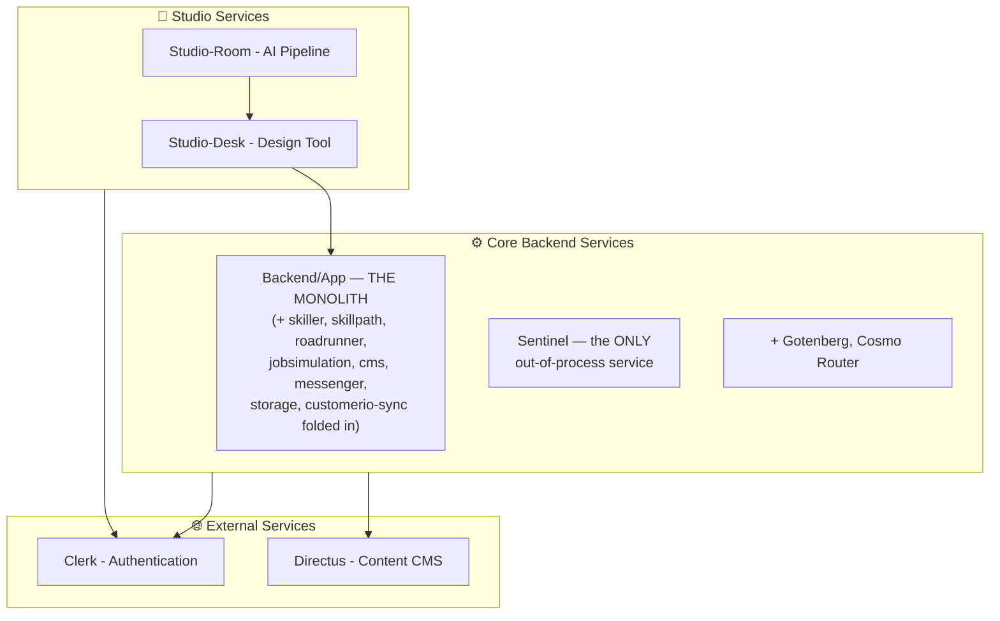

# Anthropos Service Taxonomy

This document explains the three-tier service architecture of the Anthropos platform, categorizing all services by their deployment model, technology stack, and operational characteristics.

## High-Level Summary (For PMs & Non-Engineers)

The Anthropos platform is built from **three types of services**:

1. **Core Backend Services**: The main engine of the platform - containerized microservices that handle user data, skills, simulations, and business logic.
2. **Studio Services**: Specialized tools for content creators to design and generate job simulations and learning content.
3. **External Services**: Third-party solutions we integrate with for authentication, content management, and infrastructure.


```mermaid
graph TB
    subgraph External["🌐 External Services"]
        Clerk[Clerk - Authentication]
        Directus[Directus - Content CMS]
    end
    
    subgraph Studio["🎨 Studio Services"]
        Desk[Studio-Desk - Design Tool]
        Room[Studio-Room - AI Pipeline]
    end
    
    subgraph Core["⚙️ Core Backend Services"]
        Backend["Backend/App — THE MONOLITH<br/>(+ skiller, skillpath, roadrunner,<br/>jobsimulation, cms, messenger,<br/>storage, customerio-sync folded in)"]
        Sentinel["Sentinel — the ONLY<br/>out-of-process service"]
        Others[+ Gotenberg, Cosmo Router]
    end
    
    Desk --> Backend
    Room --> Desk
    Core --> Directus
    Studio --> Clerk
    Core --> Clerk
```

## Technical Deep Dive (For Engineers)

### Tier 1: Core Backend Services (Dockerized Go Microservices)

**Characteristics**:
- **Language**: Go
- **Deployment**: Docker Compose with Makefile automation (local) / AWS ECS (production)
- **Communication**: HTTP/RPC + Redis Streams
- **Database**: PostgreSQL (dedicated schemas per service)
- **Source**: Private GitHub repositories

**Services** (current local docker-compose, as of platform `0dab54d`):

> **The default profile is now `core`, not `graphql`.** Platform `0dab54d` renamed it; the Makefile's
> `PROFILE ?= core`. There is no `graphql` profile any more — every `--profile graphql` invocation in
> older notes should read `--profile core`.

| Service | Port(s) | Purpose | Profile | Source |
|:--------|:--------|:--------|:--------|:-------|
| **Backend/App** | 8081-8083 (container: HTTP 8082, RPC 8083, meta 8084) | **The monolith.** Main API Gateway, User Management, **AI-readiness** workforce subsystem ([→](../services/ai-readiness.md)), **skills taxonomy + embeddings + AI matching** (merged skiller domain, July 2026 — [→](../services/skiller.md)), the **skill-path progression engine** (merged skillpath, "skillpath-in-app" M502→M507 — [→](../services/skillpath.md)), the **simulation runtime** (merged jobsimulation, "jobsim-in-app" — [→](../services/jobsimulation.md)), the **content layer + Studio** (merged cms, "cms-in-app v8.0" app v1.360.0 — [→](../services/cms.md)), **Judge0 code execution** (merged roadrunner — [→](../services/roadrunner.md)), and — since **v9.0 "support-in-app"** (2026-08-04) — **transactional email** (merged messenger, `MESSENGER_ENABLED` — [→](../services/messenger.md)), **S3 object storage** (merged storage, `STORAGE_S3_*_BUCKET` — [→](../services/storage.md)) and the **Brevo marketing-contact sync** (merged customerio-sync, `CUSTOMERIO_SYNC_ENABLED` — [→](../services/customerio-sync.md)), plus the newer app-owned domains (course-builder, AI Labs + credits, ask-engine, academy store) | core, backend | Local `../app` (+ `anthropos-studio-room` baked into the image) |
| **Sentinel** | 8087 | Authorization (Casbin RBAC/ABAC). **The only Anthropos service still running out-of-process** | (always on) | Local `../sentinel` |
| **Gotenberg** | 3200 | Office-doc → PDF conversion (LibreOffice) | core, backend | Third-party image `gotenberg/gotenberg:8` |
| **Graphql** (Cosmo Router) | 5050 | Apollo Federation v2 gateway — **one** subgraph (`backend`) since cms-in-app; built from the **production** Dockerfile so it uses the committed `schemas/backend.graphqls` | core | Local `../graphql-wundergraph` |

**Available but not in the default `core` profile**:

| Service | Port(s) | Purpose | Profile | Source |
|:--------|:--------|:--------|:--------|:-------|
| **Storage** | 8300-8301 | **Merged into `app` at v9.0** — kept startable purely as a rollback comparison. Running it alongside `backend` means **two writers on one bucket** | storage-legacy | Local `../storage` (frozen) |
| **Messenger** | 8200-8201 | **Merged into `app` at v9.0** — kept startable as the rollback path. Dropped from the `all` profile: `backend` consumes messenger's **own** Redis consumer group, so running both puts two consumers on one group | messenger | Local `../messenger` (frozen) |
| **CustomerIO Sync** | 8080 | **Merged into `app` at v9.0** — but still declared in compose and still in `all`. The push destination is **Brevo**, not Customer.io (the name is a fossil) | customerio-sync, all | Built directly from `git@github.com:anthropos-work/customerio-sync.git#main` (not cloned locally, frozen) |
| **Studio-Desk** | 9000, 9100 | Studio design tool (containerized variant) | studio-desk, all | Local `../studio-desk` |
| **Next-Web-App** | 3000 | Frontend (containerized variant) | frontend, all | Local `../next-web-app` |

> **Why the three v9.0 services are still in compose at all.** `storage` and `messenger` stay in
> `repos.yml` and in the compose file as **rollback paths** — the same treatment `cms` and
> `jobsimulation` got. `customerio-sync` has **no** rollback path (its terraform module was deleted and
> its ECR repo destroyed); its compose entry is simply residue, and because it builds from
> `#main` it builds the frozen repo at whatever `main` happens to be.

**Base services (no profile, always on with any `make up`)**:
- **PostgreSQL** :5432 (custom image with pgvector extension)
- **Redis** :6379 (`bitnamilegacy/redis:latest`)

**Archived / merged (removed from local orchestration; repo dirs may still exist on disk)**:

| Service | Why removed | Reference |
|:--------|:------------|:----------|
| **Chronos** | Removed from local dev orchestration | Platform commit `045857c` |
| **Intelligence** | Removed from local dev orchestration | Platform commit `fdfa189` |
| **Skiller** | Merged into Backend/App (July 2026); repo legacy/decommissioned | [skiller.md](../services/skiller.md) |
| **Skillpath** | Merged into Backend/App then decommissioned ("skillpath-in-app", platform M502→M507); session state → `public.skill_path_sessions`; no container/subgraph; repo legacy | [skillpath.md](../services/skillpath.md) |
| **Jobsimulation** | Merged into Backend/App ("jobsim-in-app"); 23 run-state tables → `public`; no container/subgraph; ECS module kept as the rollback path, teardown **M810**; repo frozen | [jobsimulation.md](../services/jobsimulation.md) |
| **CMS** | Merged into Backend/App ("cms-in-app v8.0", app v1.360.0); similarity + Studio tables → `public`; supergraph 2→1; ECS module kept as the rollback path, teardown **M810**; repo frozen | [cms.md](../services/cms.md) |
| **Roadrunner** | Merged into Backend/App with jobsim-in-app; `backend` calls Judge0 directly via `JUDGE0_BASE_URL`; no container | [roadrunner.md](../services/roadrunner.md) |
| **Messenger** | Merged into Backend/App (v9.0 "support-in-app", 2026-08-04); the mailer + its 24 handlers run in-process behind `MESSENGER_ENABLED`, on messenger's **own** Redis consumer group. ECS module deleted; ECR repo preserved (`removed { destroy = false }`) and now **unmanaged** in AWS. Still in compose + `repos.yml` as the rollback path; repo frozen | [messenger.md](../services/messenger.md) |
| **Storage** | Merged into Backend/App (v9.0); `backend` reads/writes both S3 buckets directly, `STORAGE_RPC_ADDR` gone. ECS service gone but **`module.storage-service_euwest1` is deliberately kept** — it now declares only the buckets, CloudFront + OAI and the `media.anthropos.work` CNAME. Still in compose (`storage-legacy`) + `repos.yml` as the rollback path; repo frozen | [storage.md](../services/storage.md) |
| **CustomerIO Sync** | Merged into Backend/App (v9.0); the 10-minute **Brevo** marketing-contact push runs on app's asynq scheduler behind `CUSTOMERIO_SYNC_ENABLED`. Terraform module **fully deleted**, ECR destroyed — **no rollback path**. Compose entry survives (profiles `customerio-sync`, `all`); repo frozen | [customerio-sync.md](../services/customerio-sync.md) |

**Production-only (deployed but not in local docker-compose)**:
- **db-backup**: Scheduled PostgreSQL backups (6h cycle) to S3, Azure, Hetzner — see [db-backup.md](../services/db-backup.md)

**Shared Libraries** (imported as private Go modules — **not** cloned by `make init`; pulled at Docker build via `GH_PAT`/`GOPRIVATE`). Full reference: [Shared Libraries](./shared_libraries.md).

| Library | Purpose | Repository |
|:--------|:--------|:-----------|
| **colony** | Platform framework: logging, DB/Redis, GraphQL/RPC servers, middleware, pub/sub (Watermill); also contains `authn` | `git@github.com:anthropos-work/colony.git` |
| **proto** | Protobuf definitions (single source of truth for RPC contracts) + hand-written domain types | `git@github.com:anthropos-work/proto.git` |
| **ai** | AI provider wrapper behind one `ai.AI` interface (OpenAI, Azure, Anthropic, Bedrock, Mistral). Cost tracking & EU-first routing live in the **consumers**, not this lib | `git@github.com:anthropos-work/ai.git` |
| **authn** | Clerk JWT authentication — now shipped **inside colony** as `colony/authn` (standalone repo is legacy) | `git@github.com:anthropos-work/authn.git` |
| **taxonomy** | **node-id library** (`NodeID` type + ID generation/validation) — **not** a dataset; the 60K/18K data lives in `app`'s `public` schema (former skiller service) | `git@github.com:anthropos-work/taxonomy.git` |

**Development Pattern**:
```bash
# Clone all repos and start all backend services
cd platform
make init              # Clone all repos (first time only)
make up                # Build from local code and start (graphql profile)
make up PROFILE=backend  # Start a specific profile
make dev S=backend       # Stop Docker container, develop natively
```

> [!IMPORTANT]
> **Content layer vs. runtime state.** This split-ownership model **survived the monolith merge** — the boundary is now between packages inside `app`, not between services:
> - **CMS is the content layer** — it owns the authored CONTENT / DEFINITIONS (skill-path content: chapters → steps, curators, skills-to-verify, settings; job-simulation *blueprints*; the content library) by wrapping Directus with business logic + a Redis cache.
> - **The skill-path and jobsimulation engines** own RUNTIME / SESSION / PROGRESS state and reference cms content **by ID only**. The skill-path engine tracks `SkillPathSession → ChapterSession → StepSession` (state in `public.skill_path_sessions`); the jobsimulation engine runs the interactive session (23 run-state tables, also in `public`). Both fetch definitions from the cms domain **in-process** — the `CMS_RPC_ADDR` / `cms.GetSimulation` hops are gone.
>
> So **skill-path *content* ≠ the skill-path *engine*, and "jobsimulation" ≠ simulation content.** Content = the cms domain/Directus; the engine = the state machine over it. See [CMS](../services/cms.md), [Skillpath](../services/skillpath.md), [Jobsimulation](../services/jobsimulation.md).

---

### Tier 2: Studio Services & Standalone Internal Apps

**Characteristics**:
- **Deployment**: Standalone processes (not in main docker-compose) — typically Vercel or local-only
- **Purpose**: Content creation, AI-powered generation, and internal learning
- **Users**: Internal content creators, designers, and Anthropos employees
- **Integration**: Reuse platform identity (Clerk). Some connect to Core Services via GraphQL/HTTP (Studio-Desk); others are fully independent of the backend (Ant Academy).

#### Studio-Desk

| Property | Value |
|:---------|:------|
| **Technology** | TypeScript, Vite, Express.js, React |
| **Port** | 9100 (frontend), 9000 (backend) - configurable via `.env` |
| **Purpose** | User-facing design tool for creating job simulation blueprints |
| **Authentication** | Clerk |
| **Location** | Local `../studio-desk` (sibling of platform, cloned by `make init`) |

**Key Features**:
- Simulation Builder with visual designer
- Studio Copilot (AI assistant using GPT-5.x)
- Document editing and attachments management
- Multi-language support (7 languages)

**Development**:
```bash
cd studio-desk
npm install
npm run dev  # Starts both frontend (9100) and backend (9000)
```

#### Studio-Room (embedded in CMS)

| Property | Value |
|:---------|:------|
| **Technology** | Python 3.11, asyncio, OpenAI/Anthropic/Mistral APIs |
| **Purpose** | AI-powered content generation pipeline |
| **Input** | Blueprints (StudioDocuments) created in Studio-Desk and stored via CMS |
| **Output** | Generated simulations and learning content; CMS persists results |
| **Repo** | `git@github.com:anthropos-work/anthropos-studio-room.git` |
| **Location** | Pulled into the **`app`** image by CI (`additional_repo`, app v1.360.1). Before cms-in-app it was `cms/studio/`, cloned by `cd cms && make init-studio`. |
| **Runtime** | Baked into the `app` (backend) Docker image — Python deps installed alongside the Go binary |

**Generation Pipeline**:
1. **Pre-generation**: Load template, validate parameters
2. **AI Generation**: Execute multi-step generation workflow
3. **Post-generation**: Translation, metadata, guidance generation

**Local development** (no backend container needed) — run the Python project directly from a
clone of `anthropos-studio-room`:
```bash
cd ../anthropos-studio-room
pip install -r requirements.txt
python gen.py --media simulation --template <name>
```

> Before cms-in-app this lived at `cms/studio/`, synced with `cd cms && make update-studio`.
> The pipeline is unchanged — only where the code is pulled in changed.

**Relationship**: Studio-Desk creates the *design* (blueprint). The cms domain in `app` (Go) orchestrates `StudioTask` records; the studio-room Python code runs inside the same container to execute generation.

#### Ant Academy

| Property | Value |
|:---------|:------|
| **Technology** | Next.js 16 App Router + React 19.2 (web) + Expo / React Native (mobile) |
| **Port** | 3077 (web dev), 8555 (mobile web preview) |
| **Purpose** | Internal learning portal — micro-chapters on AI engineering, agent frameworks, Claude Code, etc., for `@anthropos.work` employees |
| **Authentication** | Clerk (domain-gated to `@anthropos.work` + org-membership gate) |
| **Repo** | `git@github.com:anthropos-work/ant-academy.git` |
| **Location** | Local `../ant-academy` — **NOT** in `platform/repos.yml`, so **not** cloned by `make init` (by design, v1.10b M49 #5). For a **demo**, `ensure-clones.sh` clones it explicitly; for **dev**, clone it manually. See [`ant-academy.md`](../services/ant-academy.md). |
| **Deployment** | Vercel native (`.github/workflows/deploy-academy.yaml`) — **not** in docker-compose |
| **Platform dependencies** | **None at runtime.** Reuses platform Clerk; any AI calls go straight to the providers (never through the platform `ai` library). No GraphQL, no Connect-RPC, no Redis. |

**Key Features**:
- Static chapter JSON in `code/public/content/<series>/<skill-path>/`
- PWA via Serwist 9 (offline chapters)
- Companion iOS / Android app (Expo SDK 54) bundling the same chapters at build time
- Opt-in in-app "Cosmo" AI assistant (`NEXT_PUBLIC_FEATURE_TRAINING_COACH`, default OFF) — calls the OpenAI Responses API (`gpt-5.2`) directly from the browser via a per-user `localStorage` key
- Repo-local Claude skills (`.claude/skills/`) for authoring chapters, podcasts, covers, and benchmarks

**Development** (web):
```bash
cd ant-academy/code
cp .env.example .env   # fill Clerk + AI keys
npm install
npm run dev            # next dev — port 3077
```

**Mobile** (optional):
```bash
cd ant-academy/mobile
pnpm install
pnpm run dev:web       # web preview at :8555
```

See [Ant Academy service doc](../services/ant-academy.md) for the full picture.

---

### Tier 3: External Services & Integrations

**Characteristics**:
- **Hosting**: SaaS or third-party Docker images
- **Integration**: Via APIs, webhooks, SDKs
- **Management**: Minimal custom code, configuration-driven

#### Clerk (SaaS - Authentication)

| Property | Value |
|:---------|:------|
| **Type** | External SaaS |
| **Purpose** | User authentication, organization management |
| **Integration Points** | Frontend apps, Backend middleware, Studio-Desk |
| **SDK** | `@clerk/nextjs`, `@clerk/express`, `@clerk/clerk-js`, `@clerk/clerk-expo`, `clerk-sdk-go/v2` |

> Full integration picture (dependent repos, the auth-vs-authz split): [Clerk Integration](../services/clerk-integration.md).

**Environment Variables**:
- `CLERK_PUBLISHABLE_KEY` / `NEXT_PUBLIC_CLERK_PUBLISHABLE_KEY`
- `CLERK_SECRET_KEY`
- `CLERK_SIGN_IN_URL`

**Used By**: 
- Next.js apps (Web, Hiring)
- Mobile app (Expo / React Native, via `@clerk/clerk-expo`)
- Studio-Desk
- Backend services (authenticate via the `authn` library; authorization is Sentinel's job)

#### Directus (Headless CMS — read live from prod by default)

| Property | Value |
|:---------|:------|
| **Type** | Third-party Headless CMS (self-hosted, **production**) |
| **Address** | `https://content.anthropos.work` (the prod public instance) |
| **Purpose** | Content storage and management (the public catalog + content library) |
| **Database** | PostgreSQL (dedicated `directus` schema) |

> **The platform `docker-compose.yml` has NO directus service.** `cms` reaches Directus over the network via
> `DIRECTUS_BASE_ADDR` / `DIRECTUS_PUBLIC_BASE_ADDR` env vars (the only service the compose gives these) — which
> point at the **production** instance `https://content.anthropos.work` in the stock compose. A freshly-built
> local stack
> reads its public content **live from prod**; there is no local Directus container, image pin, port, or
> admin/password in the platform compose. (Earlier revisions of this doc wrongly described a
> `directus/directus:10.10.1` compose service on port 8055 with an `admin@example.com` / `password` login — that
> service has never existed in the platform compose.)

**Integration Pattern**:
```
Frontend → CMS Service → Directus API (content.anthropos.work) → PostgreSQL
```

The **CMS Service** acts as a smart proxy/adapter, adding business logic on top of Directus.

> **A *local* Directus is a tooling feature, not a platform-compose service.** The Rosetta v1.5 "prop room"
> tooling (`rosetta-extensions`, not the platform repo) can stand up a **per-stack local Directus** —
> `directus/directus:11.6.1`, on an **offset port**, serving the captured public library so a stack is
> content-self-contained. It's **demo-default / dev-opt-in (`--local-content`)** and lives entirely in the
> stack-ops tooling. See [`corpus/ops/directus-local.md`](../ops/directus-local.md).

#### GraphQL/Cosmo Router (Dockerized - API Gateway)

| Property | Value |
|:---------|:------|
| **Type** | Third-party with custom config (WunderGraph Cosmo Router) |
| **Port** | 5050 |
| **Purpose** | Apollo Federation v2, unified GraphQL API gateway |
| **Repository** | `git@github.com:anthropos-work/graphql-wundergraph.git` |
| **Subgraphs** | backend/app, jobsimulation, cms (3 — skillpath's subgraph was folded into `backend` when skillpath merged into `app`, M505) |

> Developer/code map: [GraphQL Gateway service doc](../services/graphql-wundergraph.md) (build-time composition, routing URLs, profiles).

**Aggregates**:
- Backend (app), CMS, Jobsimulation services

**Consumed By**:
- Next.js frontend applications
- Studio-Desk

---

## Service Communication Patterns

### Core Services ↔ Core Services
- **Synchronous**: HTTP RPC (e.g., `CMS_RPC_ADDR=http://cms:8091`; note `SKILLER_RPC_ADDR=http://backend:8083` — the skiller surface is served by backend since the merge)
- **Asynchronous**: Redis Streams (e.g., `JOBSIMULATION_STREAM=jobsimulation`)

### Studio Services → Core Services
- **Studio-Desk**: GraphQL via Wundergraph (`VITE_GRAPHQL_ENDPOINT=http://localhost:5050/graphql`)
- **Studio-Room**: Direct integration with CMS service for blueprint retrieval

### All Services → External Services
- **Authentication**: Clerk SDK/API
- **Content Storage**: Directus API (via CMS proxy for core services)

---

## Development Environment Setup

The platform uses a **Makefile** as the single entry point. All service repos are cloned as siblings via `make init` and built from local code.

### Quick Start
```bash
cd platform
make init              # Clone all repos (first time)
make up                # Start all backend services (graphql profile)
```

### Full Platform (Backend + Frontend + Studio)
```bash
# Terminal 1: All backend services
cd platform
make up

# Terminal 2: Frontend (native, hot-reload)
cd next-web-app
pnpm install && pnpm dev:web

# Terminal 3: Studio-Desk (native, hot-reload)
cd studio-desk
npm install && npm run dev
```

Or run everything in Docker:
```bash
cd platform
make up-all
```

### Native Development (Single Service)
```bash
cd platform
make dev S=backend     # Stops Docker container
cd ../app
go run .               # Run natively — this one process covers skiller,
                       # skillpath, roadrunner, jobsimulation and cms too
```

### Profiles
| Profile | Services started |
|---------|------------------|
| (none — default `docker compose up`) | postgresql, redis, sentinel only |
| **`core`** (the Makefile default — renamed from `graphql` at platform `0dab54d`) | postgresql, redis, sentinel, backend, gotenberg, graphql |
| `backend` | postgresql, redis, sentinel, backend, gotenberg |
| `storage-legacy` | postgresql, redis + the frozen standalone `storage` (rollback comparison only) |
| `messenger` | postgresql, redis + the frozen standalone `messenger`. **`make up PROFILE=messenger` alone exits 1** — messenger declares `depends_on: backend`, which this profile does not select, so compose rejects the project. Use `docker compose --profile core --profile messenger up` |
| `customerio-sync` | postgresql + the frozen standalone `customerio-sync` |
| `frontend` | + next-web-app (containerized) |
| `studio-desk` | + studio-desk (containerized) |
| `all` | Everything in the compose file **except `messenger` and `storage`** — both were removed from `all` at v9.0, because each would duplicate a subsystem `backend` now runs in-process (two consumers on one Redis group; two writers on one bucket). `customerio-sync` **is** still in `all` |

> The `cms`, `jobsimulation` and `roadrunner` profiles are gone with their services — those domains
> are inside `backend`. `storage` (the bare profile name) never existed; it is `storage-legacy` now.

Use `docker compose --profile <name> config --services` to verify the actual member list for a given profile.

---

## Summary Table

| Tier | Count | Technology | Deployment | Management |
|:-----|:------|:-----------|:-----------|:-----------|
| **Core Backend (local `core` profile)** | **2** Go services (`backend`, `sentinel`) + Gotenberg + Cosmo Router | Go (+ embedded Python studio-room in the `app` image) | Docker Compose + Makefile | GitHub repos (`anthropos-work` org) |
| **Other profiles (off by default)** | Storage (`storage-legacy`), Messenger, CustomerIO Sync — all three **frozen rollback paths**, not live services — plus Studio-Desk (Docker), Next-Web-App (Docker) | Go / TypeScript | Docker Compose (opt-in profiles) | GitHub repos |
| **Shared Libraries** | 5 (colony, authn, proto, ai, taxonomy) | Go | Imported (not deployed) | GitHub repos |
| **Studio** | Studio-Desk + Studio-Room | TypeScript / Python | Studio-Desk standalone; Studio-Room is embedded in cms image as `cms/studio/` | Local directories / cms submodule |
| **Standalone Internal Apps** | Ant Academy | Next.js 16 + Expo (TypeScript / JavaScript) | Standalone, Vercel-deployed; not in docker-compose | GitHub repo `ant-academy` — **not** in `repos.yml`, so **not** cloned by `make init` (demo: explicit `ensure-clones.sh` clone; dev: manual) |
| **Production-only** | db-backup | Go | ECS scheduled task | GitHub repo |
| **Archived / merged** | Chronos, Intelligence, Skiller, Skillpath, Roadrunner, Jobsimulation, CMS, **Messenger, Storage, CustomerIO Sync** (the last three at v9.0 "support-in-app", 2026-08-04) | Go | Merged into `app`; removed from local orchestration or demoted to an opt-in rollback profile | GitHub repos still exist (frozen) |
| **External** | Clerk, Directus, Cosmo Router, AI providers, LiveKit, AWS Chime | Various | SaaS / Docker | Configuration-driven |
