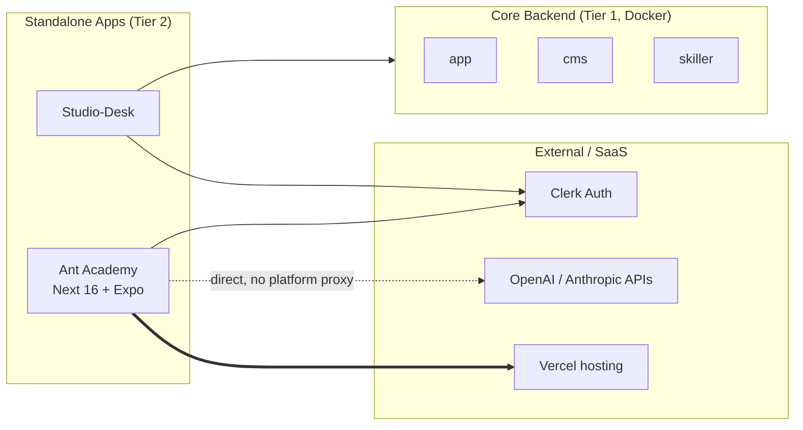

# Ant Academy

## High-Level Summary (For PMs & Non-Engineers)

**Ant Academy** (a.k.a. *AI Academy*) is the **internal learning portal** for Anthropos employees. It delivers micro-chapters on AI engineering, Claude Code, agent frameworks, and related topics to anyone with an `@anthropos.work` email.

Think of it as **the company's training app**:
- A web portal where employees take short, structured chapters
- A companion **iOS / Android app** (Expo / React Native) that bundles the same content for offline reading
- Authored content lives **inside the repo** as JSON, so curriculum changes ship through normal PRs

It is **not** a platform microservice. It is a standalone product that *uses* the platform's identity provider (Clerk) but does not depend on the backend Go services to function.

## Technical Deep Dive (For Engineers)

### Service Overview

| Property | Value |
|:---------|:------|
| **Service Type** | Standalone application (Tier 2 — Studio/Standalone) |
| **Technology Stack** | Next.js 16 App Router + React 19.2 (React Compiler enabled), Expo / React Native (mobile) |
| **Deployment** | **Vercel native** (no Docker, no docker-compose entry). Mobile builds via Expo. |
| **Local dev port** | **3077** (web); **8555** (mobile web preview) |
| **Authentication** | Clerk (`@anthropos.work` domain gate + org-membership gate) |
| **Repository** | `git@github.com:anthropos-work/ant-academy.git` → `anthropos-dev/ant-academy/` |
| **In `repos.yml`** | Yes — `type: node-npm`, `migrations: false` (pulled by `make init` / `make pull`) |
| **In `docker-compose.yml`** | **No** — runs natively only |

### Role & Responsibility

- **Primary Goal**: Internal-only learning portal that delivers AI-engineering chapters to `@anthropos.work` employees, online and offline (PWA + mobile bundle).
- **Key Functions**:
  - Serve chapter content as a Next.js App Router site at `/chapters/<slug>/`
  - Cache chapters offline via a Serwist-built service worker
  - Bundle the same chapter JSON into the iOS / Android Expo app at build time
  - Provide an in-app AI assistant ("Cosmo") that talks to OpenAI / Anthropic directly from the browser
  - Author / publish / benchmark content via repo-local Claude skills (`.claude/skills/author-chapter`, `author-skill-path`, `author-podcast`, `author-cover`, `benchmark-chapter`, `build-index`, …)

### Repository Layout

```
ant-academy/
├── code/                  # Next.js 16 web app (this is where 99% of work happens)
│   ├── app/               # App Router routes (RSCs + client islands)
│   ├── src/               # Components, hooks, virtual library subsystem
│   ├── public/content/    # Chapter JSON — series / skill-path / chapter
│   ├── ucourses/          # Catalog, chapter engine, Cosmo AI assistant
│   ├── tests/             # Vitest (unit/integration/api) + Playwright e2e
│   ├── tools/             # offline-parity CLI
│   └── package.json       # npm scripts (dev/build/test/validate/...)
├── mobile/                # Expo / React Native app (iOS + Android)
├── knowledge/             # Architecture & authoring docs (project-overview, content-model, ...)
├── tools/course-validator/  # Node CLI: static checks against authoring rules
├── .claude/skills/        # Repo-local authoring/benchmarking skills (separate from platform skills)
├── .env.example           # Repo-root tooling env (NOT for the React app)
└── CLAUDE.md              # In-repo agent guide
```

The **React app's** env lives at `code/.env.example` (Clerk + AI keys); the **repo-root `.env`** is only for authoring-side tooling (`AUTOCONTENT_API_KEY`, `OPENAI_API_KEY` for cover generation).

### How It Fits Into the Platform

Ant Academy is architecturally a **sibling of `studio-desk` and `next-web-app`** — a frontend product that **reuses platform identity** but does not call backend services.



**Key contrasts** with the core Go services:
- No PostgreSQL schema, no Atlas migrations
- No Connect-RPC, no Redis Streams
- No GraphQL subgraph (does not federate into Cosmo Router)
- Content is **static JSON in the repo**, not in Directus

The only platform-shared concern is **Clerk** — Ant Academy reuses the platform's Clerk app so engineers log in with the same identity they use elsewhere.

### Tech Stack

| Layer | Technology |
|:------|:-----------|
| **Framework** | Next.js 16 App Router + React 19.2 (React Compiler enabled, Turbopack default) |
| **Auth** | `@clerk/nextjs` middleware in `proxy.js` (`clerkMiddleware()` + `@anthropos.work` domain gate) |
| **Markdown** | `marked` (client-side rendering) |
| **Styling** | Vanilla CSS with custom properties (dark theme) |
| **Fonts** | DM Sans + Instrument Serif + JetBrains Mono (via `next/font/google`) + Font Awesome Pro |
| **PWA** | Serwist 9 (configurator mode); service worker compiled by `serwist build` |
| **Mobile** | Expo SDK 54 / React Native (Expo Router) |
| **Testing** | Vitest (happy-dom + node), Playwright (e2e). ~1135 Vitest tests + 14 Playwright suites. |
| **Deployment** | Vercel native (no `vercel.json`) |
| **Node** | `>= 22` (declared in `code/package.json` `engines`) |

### Local Development

#### Prerequisites
- Node **v22+** (from `code/package.json` `engines.node`)
- npm (web app uses npm, not pnpm)
- pnpm — only if you also want to run the mobile app
- Clerk credentials (use the platform's dev tenant — same `@anthropos.work` domain)
- A Font Awesome Pro npm token (issued by the team)

#### 1. Clone

The repo is now in `platform/repos.yml`, so:

```bash
cd anthropos-dev/platform
make init    # clones ant-academy into anthropos-dev/ant-academy/ if missing
```

Or directly:

```bash
cd anthropos-dev
git clone git@github.com:anthropos-work/ant-academy.git
```

#### 2. Configure env

The **app's** env file is `code/.env`, not the repo root:

```bash
cd anthropos-dev/ant-academy/code
cp .env.example .env
# Fill in:
#   NEXT_PUBLIC_CLERK_PUBLISHABLE_KEY
#   CLERK_SECRET_KEY
#   FONTAWESOME_NPM_AUTH_TOKEN
#   OPENAI_API_KEY        (server-side; for /api/ai/chat)
#   ANTHROPIC_API_KEY     (server-side; for /api/ai/chat)
#   NEXT_PUBLIC_STUDIO_URL  (optional — Studio Desk URL bridge)
```

Reuse the **same Clerk keys** as in `platform/.env` so dev login works across the platform and the academy with a single session.

> **Org-membership gate**: by default, `proxy.js` redirects signed-in users with zero org memberships to `/no-organization`. For solo local dev without an org, set `REQUIRE_ORGANIZATION_MEMBERSHIP=0` in `code/.env`.

#### 3. Install & run (web)

```bash
cd anthropos-dev/ant-academy/code
npm install
npm run dev          # next dev — port 3077 (3000 is reserved on dev machines)
```

Open <http://localhost:3077>.

#### 4. Install & run (mobile, optional)

```bash
cd anthropos-dev/ant-academy/mobile
pnpm install
pnpm run dev:web     # web preview at :8555 (Playwright-friendly)
# or run on a real device / simulator with Expo Go
```

The mobile app bundles `code/public/content/` at build time via `pnpm run dev:bundle`.

#### 5. Tests

```bash
cd code
npm test                  # vitest run (unit + integration + api)
npm run test:e2e          # playwright (boots dev server)
npm run validate -- --all # course-validator across all chapters
```

### Repo-Local Claude Skills

`ant-academy/.claude/skills/` ships **its own** set of skills focused on **authoring content** — not to be confused with the platform's `/ant-*` skills in Rosetta:

| Skill | Purpose |
|-------|---------|
| `author-chapter` | Draft a new chapter JSON from an outline |
| `author-skill-path` | Bootstrap a new skill-path directory + path intro |
| `author-podcast` | Generate the `path-intro.mp3` companion audio (uses AutoContent API) |
| `author-cover` | Generate the `cover.{png,webp}` for a skill path (uses OpenAI `gpt-image-2`) |
| `benchmark-chapter` | Drive Playwright through a chapter for visual + content benchmarking |
| `check-plagiarism`, `consolidate-library`, `extend-library`, `build-index`, `publish`, `preview` | Other content-pipeline helpers |

These are **isolated to the ant-academy repo** and are loaded only when working inside it. They share no state with the Rosetta corpus skills.

### Deployment

- **Web**: Pushed to Vercel via `.github/workflows/deploy-academy.yaml`
- **Vercel env sync**: `.github/workflows/sync-vercel-env.yml` mirrors env vars
- **Mobile**: Expo build pipeline (outside platform CI)
- **Coverage CI**: `.github/workflows/sidebar-coverage-tests.yaml`

Releases use **Cocogitto** conventional-commit tagging (`cog.toml`).

### Integration Points

- **Clerk (shared)**: Uses the same Clerk app as the rest of the platform. Domain-gated to `@anthropos.work` so external users cannot enter.
- **OpenAI / Anthropic (direct)**: The in-app "Cosmo" assistant calls the model providers directly from the browser using a per-user `localStorage('openai_api_key')` — it does **not** route through the platform's shared `ai` library.
- **Studio Desk (loose link)**: `NEXT_PUBLIC_STUDIO_URL` can deep-link from the academy to the Studio Desk UI; nothing required at runtime.
- **Backend services**: **None.** No GraphQL calls, no Connect-RPC, no Redis events.

### Why It's Not in `docker-compose.yml`

Ant Academy is deployed to Vercel and runs natively in dev (`npm run dev`) just like `studio-desk` natively or `next-web-app` natively. It has no upstream service it needs to wait on, no migrations to apply, and its container would only duplicate what Vercel already serves. We deliberately mirror the studio-desk pattern: **clone via `make init`, run natively, skip docker-compose**.

If you ever need to add a Docker profile (e.g. for an integration-test harness), follow studio-desk's containerized variant as the template.

### Related Documentation
- [Service Taxonomy](../architecture/service_taxonomy.md) — where Ant Academy sits in the three-tier model
- [Architecture Overview](../architecture/architecture_overview.md) — overall platform diagram
- [Frontend Architecture](../architecture/frontend_architecture.md) — sibling frontend (`next-web-app`)
- [Studio-Desk](./studio-desk.md) — closest deployment-shape sibling
- [Run Guide](../ops/run_guide.md) — how to start the academy alongside the rest of the platform
- [External Services](../architecture/external_services.md) — Clerk integration details
