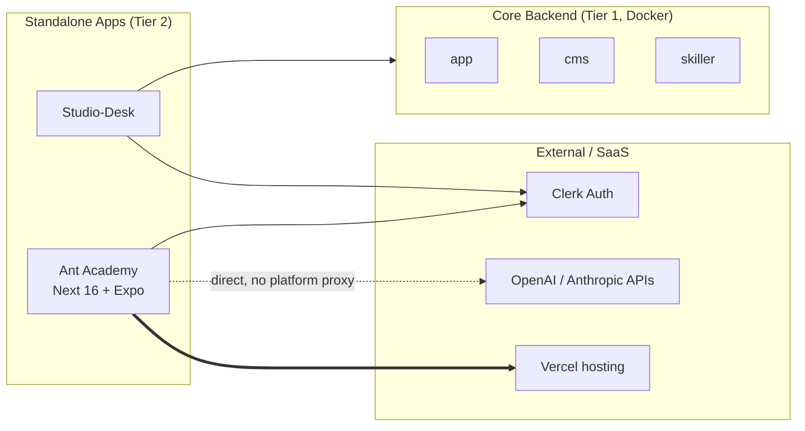

# Ant Academy

## High-Level Summary (For PMs & Non-Engineers)

**Ant Academy** (a.k.a. *AI Academy*) is the **internal learning portal** for Anthropos employees. It delivers micro-chapters on AI engineering, Claude Code, agent frameworks, and related topics to anyone with an `@anthropos.work` email.

Think of it as **the company's training app**:
- A web portal where employees take short, structured chapters
- A companion **iOS / Android app** (Expo / React Native) that bundles the same content for offline reading
- Authored content lives **inside the repo** as JSON, so curriculum changes ship through normal PRs

It is **not** a platform microservice. It is a standalone product that *uses* the platform's identity provider (Clerk) but does not depend on the backend Go services to function.

## Technical Deep Dive (For Engineers)

### Service Overview

| Property | Value |
|:---------|:------|
| **Service Type** | Standalone application (Tier 2 — Studio/Standalone) |
| **Technology Stack** | Next.js 16 App Router + React 19.2 (React Compiler enabled), Expo / React Native (mobile) |
| **Deployment** | **Vercel native** (no Docker, no docker-compose entry). Mobile builds via Expo. |
| **Local dev port** | **3077** (web); **8555** (mobile web preview) |
| **Authentication** | Clerk (`@anthropos.work` domain gate + org-membership gate) |
| **Repository** | `git@github.com:anthropos-work/ant-academy.git` → `stack-dev/ant-academy/` |
| **In `repos.yml`** | **No — by design (v1.10b M49 #5).** NOT in `platform/repos.yml`, so `make init` / `make pull` do **not** clone/pull it. M49 did **not** add the entry: `repos.yml` lives in the *ephemeral, gitignored* `stack-demo/platform` clone (editing it is non-durable + a platform-repo edit). Instead, for a **demo**, `ensure-clones.sh` clones ant-academy **explicitly** (phase d2 — the cms/studio submodule-pattern precedent, non-fatal). For **dev**, clone it directly (it's a Vercel-native peripheral). The old "cloned by `make init`" claims are **stale**. |
| **In `docker-compose.yml`** | **No** — runs natively only |

### Role & Responsibility

- **Primary Goal**: Internal-only learning portal that delivers AI-engineering chapters to `@anthropos.work` employees, online and offline (PWA + mobile bundle).
- **Key Functions**:
  - Serve chapter content as a Next.js App Router site at `/chapters/<slug>/`
  - Cache chapters offline via a Serwist-built service worker
  - Bundle the same chapter JSON into the iOS / Android Expo app at build time
  - Provide an opt-in in-app AI assistant ("Cosmo", behind a feature flag) that talks to OpenAI directly from the browser
  - Author / publish / benchmark content via repo-local Claude skills (`.claude/skills/author-chapter`, `author-skill-path`, `author-podcast`, `author-cover`, `benchmark-chapter`, `build-index`, …)

### Repository Layout

```
ant-academy/
├── code/                  # Next.js 16 web app (this is where 99% of work happens)
│   ├── app/               # App Router routes (RSCs + client islands)
│   ├── src/               # Components, hooks, virtual library subsystem
│   ├── public/content/    # Chapter JSON — series / skill-path / chapter
│   ├── ucourses/          # Catalog, chapter engine, Cosmo AI assistant
│   ├── tests/             # Vitest (unit/integration/api) + Playwright e2e
│   ├── tools/             # offline-parity CLI
│   └── package.json       # npm scripts (dev/build/test/validate/...)
├── mobile/                # Expo / React Native app (iOS + Android)
├── knowledge/             # Architecture & authoring docs (project-overview, content-model, ...)
├── tools/course-validator/  # Node CLI: static checks against authoring rules
├── .claude/skills/        # Repo-local authoring/benchmarking skills (separate from platform skills)
├── .env.example           # Repo-root tooling env (NOT for the React app)
└── CLAUDE.md              # In-repo agent guide
```

The **React app's** env lives at `code/.env.example` (Clerk + AI keys); the **repo-root `.env`** is only for authoring-side tooling (`AUTOCONTENT_API_KEY`, `OPENAI_API_KEY` for cover generation).

### How It Fits Into the Platform

Ant Academy is architecturally a **sibling of `studio-desk` and `next-web-app`** — a frontend product that **reuses platform identity** but does not call backend services.



**Key contrasts** with the core Go services:
- No PostgreSQL schema, no Atlas migrations
- No Connect-RPC, no Redis Streams
- No GraphQL subgraph (does not federate into Cosmo Router)
- Content is **static JSON in the repo**, not in Directus

The only platform-shared concern is **Clerk** — Ant Academy reuses the platform's Clerk app so engineers log in with the same identity they use elsewhere.

### Tech Stack

| Layer | Technology |
|:------|:-----------|
| **Framework** | Next.js 16 App Router + React 19.2 (React Compiler enabled, Turbopack default) |
| **Auth** | `@clerk/nextjs` middleware in `proxy.js` (Next 16 renamed `middleware` → `proxy`). `clerkMiddleware()` + org-membership gate; `@anthropos.work` domain restriction is enforced in the Clerk app. Public routes: `/sign-in/*`, `/no-organization`, `/verify/*`, `/api/ai/chat`, `/library`, `/library/*`, `/free`, `/free/*`, `/local-content/*`, `/catalog.json`, `/academy-manifest.json` (other `/api/*` stay gated). The last three are public-by-design: `/local-content/*` for `<audio>` Range requests + cover previews, `/catalog.json` for the external Anthropos backend Talk-to-Data indexer, `/academy-manifest.json` for the PWA manifest (gating any of them 307s the fetch through sign-in and breaks it). |
| **Markdown** | `marked` (client-side rendering) |
| **Styling** | Vanilla CSS with custom properties (dark theme) |
| **Fonts** | DM Sans + Instrument Serif + JetBrains Mono (via `next/font/google`) + Font Awesome Pro **icons self-hosted/vendored in the repo** (`code/public/assets/fontawesome/` — `webfonts/*.woff2` + `css/all.min.css`, used as `<i class="fa-solid …">`; **not** pulled from the FA npm registry, so `npm install` needs no FA token) |
| **PWA** | Serwist 9 (configurator mode); service worker compiled by `serwist build` |
| **Mobile** | Expo SDK 54 / React Native (Expo Router) |
| **Testing** | Vitest (happy-dom + node), Playwright (e2e). 1000+ Vitest tests + ~26 Playwright e2e spec files (tests/e2e/). |
| **Deployment** | Vercel native (minimal `code/vercel.json` — only `{"framework": "nextjs"}`; Next.js handles routing). Mobile builds via Expo. |
| **Node** | `>= 22` (declared in `code/package.json` `engines`) |

### Local Development

#### Prerequisites
- Node **v22+** (from `code/package.json` `engines.node`)
- npm (web app uses npm, not pnpm)
- pnpm — only if you also want to run the mobile app
- Clerk credentials (use the platform's dev tenant — same `@anthropos.work` domain)
- _(vestigial — NOT required)_ A Font Awesome Pro npm token. The FA Pro icons are vendored in the repo (`code/public/assets/fontawesome/`), so a fresh, token-less `npm install` succeeds and the app serves working icons. `FONTAWESOME_NPM_AUTH_TOKEN` survives in `code/.env.example` but is **not** needed to install or run.

#### 1. Clone

ant-academy is **NOT** in `platform/repos.yml` (by design — v1.10b M49 #5), so `make init` does **not** clone it.
This was the demo-up #5 "ant-academy never cloned" gap; **M49 fixed it for a demo by cloning ant-academy
explicitly** in `ensure-clones.sh` (phase d2 — `repos.yml` lives in the ephemeral platform clone, so editing it
is non-durable + a platform-repo edit; the explicit clone mirrors the `make init-studio` exception). **For a
demo, `/demo-up` clones it automatically.** For **dev** (no `ensure-clones.sh`), clone it directly:

```bash
# Demo: ensure-clones.sh does this automatically on /demo-up (phase d2) — into stack-demo/ant-academy/.
# Dev (or a manual clone): clone it directly — it's a Vercel-native peripheral, not in repos.yml.
cd stack-dev
git clone git@github.com:anthropos-work/ant-academy.git
```

#### 2. Configure env

The **app's** env file is `code/.env`, not the repo root:

```bash
cd stack-dev/ant-academy/code
cp .env.example .env
# Minimum to boot locally:
#   NEXT_PUBLIC_CLERK_PUBLISHABLE_KEY
#   CLERK_SECRET_KEY
# Vestigial — NOT required (FA Pro icons are vendored in the repo; token-less npm install works):
#   FONTAWESOME_NPM_AUTH_TOKEN
# Needed only for the server-side /api/ai/chat route handler:
#   OPENAI_API_KEY        (server-side)
#   ANTHROPIC_API_KEY     (server-side)
# Optional:
#   NEXT_PUBLIC_STUDIO_URL              (Studio Desk URL bridge)
#   NEXT_PUBLIC_FEATURE_TRAINING_COACH  (1/true to turn on Cosmo — default OFF)
#   REQUIRE_ORGANIZATION_MEMBERSHIP     (0/false to skip the org gate in solo dev)
```

`code/.env.example` is the authoritative, fuller list (it also carries Sentry / Better Stack DSN vars and the `NEXT_PUBLIC_CLERK_SIGN_IN_URL` / `SIGN_UP_URL` family used to keep Clerk on the in-app sign-in page). Reuse the **same Clerk keys** as in `platform/.env` so dev login works across the platform and the academy with a single session.

> **Org-membership gate**: by default, `proxy.js` redirects signed-in users with zero org memberships to `/no-organization`. For solo local dev without an org, set `REQUIRE_ORGANIZATION_MEMBERSHIP=0` in `code/.env`.

#### 3. Install & run (web)

```bash
cd stack-dev/ant-academy/code
npm install
npm run dev          # next dev — port 3077 (3000 is reserved on dev machines)
```

Open <http://localhost:3077>.

#### 4. Install & run (mobile, optional)

```bash
cd stack-dev/ant-academy/mobile
pnpm install
pnpm run dev:web     # web preview at :8555 (Playwright-friendly)
# or run on a real device / simulator with Expo Go
```

The mobile app bundles `code/public/content/` at build time via `pnpm run dev:bundle`.

#### 5. Tests

```bash
cd code
npm test                  # vitest run (unit + integration + api)
npm run test:e2e          # playwright (boots dev server)
npm run validate -- --all # course-validator across all chapters
```

### Repo-Local Claude Skills

`ant-academy/.claude/skills/` ships **its own** set of skills focused on **authoring content** — not to be confused with the platform's `/ant-*` skills in Rosetta:

| Skill | Purpose |
|-------|---------|
| `author-chapter` | Draft a new chapter JSON from an outline |
| `author-skill-path` | Bootstrap a new skill-path directory + path intro |
| `author-podcast` | Generate the `path-intro.mp3` companion audio (uses AutoContent API) |
| `author-cover` | Generate the `cover.{png,webp}` for a skill path (uses OpenAI `gpt-image-2`) |
| `benchmark-chapter` | Drive Playwright through a chapter for visual + content benchmarking |
| `translate-path` | Translate a skill path into another language (i18n pipeline) |
| `benchmark-translation` | Benchmark translation quality/coverage for a translated path |
| `check-plagiarism`, `consolidate-library`, `extend-library`, `build-index`, `publish`, `preview`, `cover-scale` | Other content-pipeline helpers |

Academy is multi-language: content is authored per language, `catalog.json` is emitted per chapter × language, and `proxy.js` propagates `?lang=` into SSR via an `x-locale` header (see `tests/e2e/i18n-language-toggle.spec.js`).

These are **isolated to the ant-academy repo** and are loaded only when working inside it. They share no state with the Rosetta corpus skills.

### Deployment

- **Web**: Pushed to Vercel via `.github/workflows/deploy-academy.yaml`
- **Vercel env sync**: `.github/workflows/sync-vercel-env.yml` mirrors env vars
- **Mobile**: Expo build pipeline (outside platform CI)
- **Coverage CI**: `.github/workflows/sidebar-coverage-tests.yaml`

Releases use **Cocogitto** conventional-commit tagging (`cog.toml`).

### Integration Points

- **Clerk (shared)**: Uses the same Clerk app as the rest of the platform. Domain-gated to `@anthropos.work` so external users cannot enter.
- **OpenAI (direct, browser, opt-in)**: The in-app "Cosmo" assistant — gated behind `NEXT_PUBLIC_FEATURE_TRAINING_COACH` (default OFF) — calls the **OpenAI Responses API** (`gpt-5.2`, `https://api.openai.com/v1/responses`) directly from the browser using a per-user `localStorage('openai_api_key')`. It is OpenAI-only and does **not** route through the platform's shared `ai` library or the `/api/ai/chat` route. (The separate server-side `/api/ai/chat` route handler does support both OpenAI and Anthropic with server keys, but Cosmo does not use it.)
- **Studio Desk (loose link)**: `NEXT_PUBLIC_STUDIO_URL` can deep-link from the academy to the Studio Desk UI; nothing required at runtime.
- **next-web-app (iframe embed):** the Workforce app loads Academy in an iframe with `?embed=anthropos`; `proxy.js` detects this server-side (`Sec-Fetch-Dest=iframe` + an `embed-mode` cookie, or an explicit `?embed=anthropos`), stamps an `x-embed-mode` request header, persists the cookie, and SSRs a light-themed, topbar-less variant (`data-embed` + `data-theme=light`). No data flows back — it is a presentation/cookie coupling only.
- **Backend services**: **None.** No GraphQL calls, no Connect-RPC, no Redis events. (Academy initiates no backend calls. The reverse exists: per a comment in `proxy.js`, the platform backend's Talk-to-Data indexer pulls Academy's public `/catalog.json` — a metadata-only, per-chapter × language index.)

### Why It's Not in `docker-compose.yml`

Ant Academy is deployed to Vercel and runs natively in dev (`npm run dev`) just like `studio-desk` natively or `next-web-app` natively. It has no upstream service it needs to wait on, no migrations to apply, and its container would only duplicate what Vercel already serves. We deliberately mirror the studio-desk pattern: **clone, run natively, skip docker-compose** — though, unlike
studio-desk, ant-academy is **not in `repos.yml`** (by design — v1.10b M49 #5 kept it out, since `repos.yml`
lives in the ephemeral platform clone). So for a **demo**, `ensure-clones.sh` clones it **explicitly** (phase
d2, non-fatal); for **dev**, it's a manual `git clone` — not `make init`.

If you ever need to add a Docker profile (e.g. for an integration-test harness), follow studio-desk's containerized variant as the template.

### Related Documentation
- [Service Taxonomy](../architecture/service_taxonomy.md) — where Ant Academy sits in the three-tier model
- [Architecture Overview](../architecture/architecture_overview.md) — overall platform diagram
- [Frontend Architecture](../architecture/frontend_architecture.md) — sibling frontend (`next-web-app`)
- [Studio-Desk](./studio-desk.md) — closest deployment-shape sibling
- [Run Guide](../ops/run_guide.md) — how to start the academy alongside the rest of the platform
- [External Services](../architecture/external_services.md) — Clerk integration details
