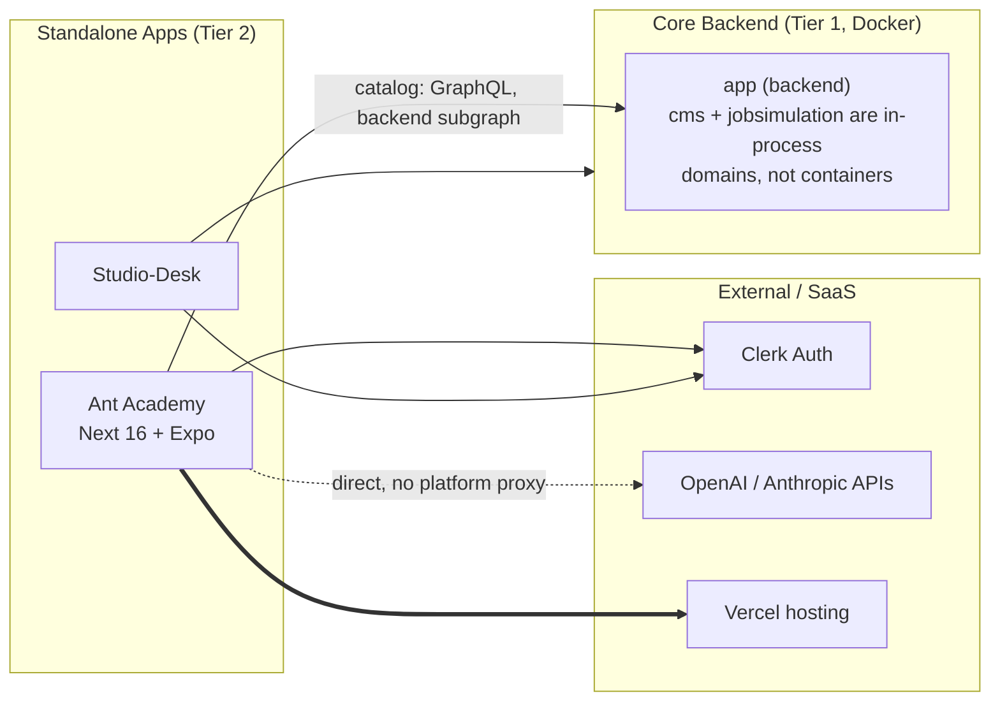

# Ant Academy

## High-Level Summary (For PMs & Non-Engineers)

**Ant Academy** (a.k.a. *AI Academy*) is the **internal learning portal** for Anthropos employees. It delivers micro-chapters on AI engineering, Claude Code, agent frameworks, and related topics to anyone with an `@anthropos.work` email.

Think of it as **the company's training app**:
- A web portal where employees take short, structured chapters
- A companion **iOS / Android app** (Expo / React Native) that bundles the same content for offline reading
- Authored content lives **inside the repo** as JSON, so curriculum changes ship through normal PRs

It is **not** a platform microservice. It is a standalone product that *uses* the platform's identity provider (Clerk) — and, since **v0.5.1**, **reads its course catalog from the platform's academy backend over GraphQL**. Without that backend it still boots and authenticates, but the catalog **degrades to empty**: the home grid renders **0 cards**. (This is exactly why the academy looks blank in a demo — see [*The Content Model*](#the-content-model--db-authoritative-catalog-v051-m7) below.)

## Technical Deep Dive (For Engineers)

### Service Overview

| Property | Value |
|:---------|:------|
| **Service Type** | Standalone application (Tier 2 — Studio/Standalone) |
| **Technology Stack** | Next.js 16 App Router + React 19.2 (React Compiler enabled), Expo / React Native (mobile) |
| **Deployment** | **Vercel native** (no Docker, no docker-compose entry). Mobile builds via Expo. |
| **Local dev port** | **3077** (web); **8555** (mobile web preview) |
| **Authentication** | Clerk (`@anthropos.work` domain gate + org-membership gate) |
| **Repository** | `git@github.com:anthropos-work/ant-academy.git` → `stack-dev/ant-academy/` |
| **In `repos.yml`** | **No — by design (v1.10b M49 #5).** NOT in `platform/repos.yml`, so `make init` / `make pull` do **not** clone/pull it. M49 did **not** add the entry: `repos.yml` lives in the *ephemeral, gitignored* `stack-demo/platform` clone (editing it is non-durable + a platform-repo edit). Instead, for a **demo**, `ensure-clones.sh` clones ant-academy **explicitly** (phase d2 — the cms/studio submodule-pattern precedent, non-fatal). For **dev**, clone it directly (it's a Vercel-native peripheral). The old "cloned by `make init`" claims are **stale**. |
| **In `docker-compose.yml`** | **No** — runs natively only |

### Role & Responsibility

- **Primary Goal**: Internal-only learning portal that delivers AI-engineering chapters to `@anthropos.work` employees, online (installable via `public/academy-manifest.json`, but **no longer offline on the web** — the Serwist service worker was removed at v0.5 M1) and offline on the Expo mobile bundle.
- **Key Functions**:
  - Serve chapter content as a Next.js App Router site at `/chapters/<slug>/`
  - ~~Cache chapters offline via a Serwist-built service worker~~ — **REMOVED at v0.5 M1.** `RegisterServiceWorker.jsx` is now a kill-switch that unregisters any surviving worker and deletes its caches; the web app is online-only
  - Bundle the same chapter JSON into the iOS / Android Expo app at build time
  - Provide an opt-in in-app AI assistant ("Cosmo", behind a feature flag) that talks to OpenAI directly from the browser
  - Author / publish / benchmark content via repo-local Claude skills (`.claude/skills/author-chapter`, `author-skill-path`, `author-podcast`, `author-cover`, `benchmark-chapter`, `build-index`, …)

### Repository Layout

```
ant-academy/
├── code/                  # Next.js 16 web app (this is where 99% of work happens)
│   ├── app/               # App Router routes (RSCs + client islands)
│   ├── src/               # Components, hooks, virtual library subsystem
│   ├── public/content/    # Chapter JSON — series / skill-path / chapter
│   ├── ucourses/          # Catalog, chapter engine, Cosmo AI assistant
│   ├── tests/             # Vitest (unit/integration/api) + Playwright e2e
│   ├── tools/             # offline-parity CLI
│   └── package.json       # npm scripts (dev/build/test/validate/...)
├── mobile/                # Expo / React Native app (iOS + Android)
├── knowledge/             # Architecture & authoring docs (project-overview, content-model, ...)
├── tools/course-validator/  # Node CLI: static checks against authoring rules
├── .claude/skills/        # Repo-local authoring/benchmarking skills (separate from platform skills)
├── .env.example           # Repo-root tooling env (NOT for the React app)
└── CLAUDE.md              # In-repo agent guide
```

The **React app's** env lives at `code/.env.example` (Clerk + AI keys); the **repo-root `.env`** is only for authoring-side tooling (`AUTOCONTENT_API_KEY`, `OPENAI_API_KEY` for cover generation).

### How It Fits Into the Platform

Ant Academy is architecturally a **sibling of `studio-desk` and `next-web-app`** — a frontend product that **reuses platform identity** and is a **backend-authoritative read/WRITE GraphQL client** of the platform `app`'s **`backend`** subgraph — **there is no separate "academy subgraph"**; the academy types are one SDL file (`academy.graphqls`, 1 of 43) inside it. It has no backend of its own, but it does call one: it **reads** the catalog (below) and, since **v0.5 "direct line" M2**, **writes** per-user progress to the platform backend (chapter progress, last-activity, bookmarks, certificates, study-time, feedback) — the platform `app internal/academy` store is the sole source of truth (there is NO localStorage/IDB source-of-truth). The earlier "does not call backend services / read-only client" framing is retired (corrected v2.5 M231): progress persists via GraphQL mutations (`upsertChapterProgress[Batch]` / `setLastActivity`) to Ent tables `academy_chapter_progresses` / `academy_last_activities` / … in `app` (**plural** — Ent pluralizes; the singular forms are schema-file names, not table names).

> **⚠️ The write path is the CLIENT harness, not the beacon route** (corrected M257x iter-102 — this sentence
> sourced the mutations to `code/app/api/academy/beacon/route.js`, which states the mechanism in the opposite
> order). Measured @ `ant-academy` `22df69dd`: **every in-session write is fired from `code/src/progress/store.js`**
> — `saveChapterProgress` (`:150`) calls the injected authed requester with `UPSERT_CHAPTER_PROGRESS` at `:162`,
> `saveLastActivity` (`:202`) with `SET_LAST_ACTIVITY` at `:210` — i.e. **straight to the supergraph** over the
> cross-origin GraphQL endpoint with a Clerk Bearer token. The beacon route is the **exception the old sentence
> presented as the rule**: an *on-unload last-ditch flush*, passed as the `beacon:` option at `store.js:169` /
> `:215` and reached only by `navigator.sendBeacon` / `fetch({keepalive:true})` on pagehide
> (`src/writeThrough/index.js:247`, `:259`). It exists precisely **because** `sendBeacon` cannot set an
> `Authorization` header, so this **same-origin** route re-issues the mutation server-side from the Clerk session
> cookie — its own header comment says so: *"a best-effort last-ditch flush for a write that would otherwise be
> lost if the tab closes mid-retry"* (`route.js:1-18`). The mutation NAMES are correct either way; only the
> attribution of where they are posted from was wrong.

This makes a "played academy session" a **seedable server row** (via `app/cmd/academy-seed`) — **on a
backend-wired deployment. That binary is MOOT on a demo stack** (M236 iter-08): a demo academy has no
`NEXT_PUBLIC_WUNDERGRAPH_ENDPOINT`, so the backend read yields nothing and **nothing ever reads the seeded
`academy_chapter_progresses` rows**. Seeding them on a demo changes no pixel. **⚠️ It does *not* "fall back to
the committed FS catalog"** — there is **no FS-as-published fallback** in the app; `getServerCatalogView()`
resolves a null backend result to the **empty view**, and `serverTenant.js:115-145` says so in-code: *"the
cutover is intentional, not reversible-on-error."* A demo grid renders cards only because the rext demo-patch
**`demo-stack/patches/academy-fs-published-fallback`** *restores* that removed fallback on the demo's ephemeral
clone (applied by `demo-stack/ant-academy.sh` before `next dev`, env-gated on `ACADEMY_DEMO_FS_PUBLISHED`,
reverted on `--stop`); if that patch is refused, the grid is empty. See
[the empty-grid analysis below](#the-content-model--db-authoritative-catalog-v051-m7). The demo's academy
story is therefore **presence-only** — a real `/courses/<slug>` link into a grid of 65 real cards — not a
progress/result surface. See [`../ops/demo/content-stories-routes.md`](../ops/demo/content-stories-routes.md).


```mermaid
graph LR
    subgraph External["External / SaaS"]
        Clerk[Clerk Auth]
        OpenAI[OpenAI / Anthropic APIs]
        Vercel[Vercel hosting]
    end

    subgraph Standalone["Standalone Apps (Tier 2)"]
        Academy[Ant Academy<br/>Next 16 + Expo]
        Desk[Studio-Desk]
    end

    subgraph Core["Core Backend (Tier 1, Docker)"]
        App["app (backend)<br/>cms + jobsimulation are in-process<br/>domains, not containers"]
    end

    Academy --> Clerk
    Academy -->|catalog: GraphQL, backend subgraph| App
    Academy -.->|direct, no platform proxy| OpenAI
    Academy ==> Vercel
    Desk --> Clerk
    Desk --> Core
```

**Key contrasts** with the core Go services:
- No PostgreSQL schema of its own, no Atlas migrations
- No Connect-RPC, no Redis Streams
- **Provides** no GraphQL subgraph (it doesn't federate into the supergraph, which is `backend` alone) — but it **consumes** the platform's
  **`backend` subgraph** as a GraphQL *client* (see below); "no subgraph" ≠ "no GraphQL". **There is no
  "academy subgraph" to consume either** — the academy types live inside `backend`; this bullet named one
  until M257x iter-108
- Its rendered catalog is **NOT static repo JSON** — since v0.5.1 it is **DB-authoritative**, read from the platform
  academy backend over GraphQL. The committed JSON is the *authoring source* + the dev *draft* layer + a separate
  machine index — not what the authenticated grid renders

The platform-shared concerns are **Clerk** (identity — Ant Academy reuses the platform's Clerk app so engineers log
in with the same identity) **and the academy backend** (`app internal/academy`, queried over GraphQL for the course
catalog).

### The Content Model — DB-authoritative catalog (v0.5.1 M7)

**The home grid does NOT read the committed JSON.** Since ant-academy **v0.5.1 (M7)** the catalog the portal renders is
**DB-authoritative** — queried from the **platform `backend` subgraph** (the academy types are served by `app`'s `internal/academy`; there is no separate academy subgraph) over
GraphQL, not from the repo's JSON files. This is the most load-bearing fact about the academy and the root of the demo
"empty grid" symptom below.

**The read chain** (all under `code/`):

```
app/(authed)/page.jsx  →  resolveCatalogView()
    ├─ signed-in → getServerCatalogView()   (src/lib/serverTenant.js)
    └─ anonymous → getPublicCatalogView()    (empty-eid variant)
         ▼
getBackendCatalogView(eids)   (src/lib/backendContent.js)
    →  createServerGraphQLClient()   (src/graphql/server.js — endpoint = NEXT_PUBLIC_WUNDERGRAPH_ENDPOINT)
    →  query academyCatalogSeries + academyCatalogSkillPaths   (tenant-filtered server-side by the user's eids)
```

`getServerCatalogView()` is literally `const view = (await getBackendCatalogView(eids)) ?? emptyCatalogView()`
(`code/src/lib/serverTenant.js:145` @ `ant-academy` `22df69dd` — byte-exact), so on **any** failure the catalog
becomes `emptyCatalogView()` → **0 cards**.

> **The shape of `emptyCatalogView()` is FIVE keys, not three** (corrected M257x iter-102 — this passage asserted
> it by `=` as the 3-key literal `{ chapters: [], skillPaths: {}, series: [] }`). Measured at
> `serverTenant.js:115-117`: `return { chapters: [], skillPaths: {}, series: [], bundles: PUBLIC_BUNDLES,
> catalogVersion: CATALOG_VERSION }`. The two extra keys are **not** empty — `PUBLIC_BUNDLES`
> (`code/ucourses/catalog.js:961`) is a populated exported array of curated bundle objects and `CATALOG_VERSION`
> (`:31`) is `'1.0'` — they pass through verbatim from the committed FS tree because, in the function's own
> words (`:111-113`), `bundles` *"carries no tenant metadata and is the one piece not yet modeled in the backend
> catalog."* **The `→ 0 cards` conclusion is unaffected and stands:** a bundle stripe's path cards are derived
> from the (empty) `chapters` — `AcademyClient.jsx:1363-1365` drops every path whose `scopedChapters` filter is
> empty — so the audience views render bundle chrome with **zero** path cards, and the grid itself renders none.
> Do not "fix" this by deleting the bundles key from the shape; the shape is what the code returns.

Three failure legs collapse to the same empty grid:
1. **Endpoint unset** — `NEXT_PUBLIC_WUNDERGRAPH_ENDPOINT` empty → `createServerGraphQLClient()` throws → `makeClient()`
   returns `null` → `getBackendCatalogView()` returns `null`.
2. **Query error** — network/schema failure → `catch → return null`.
3. **Empty DB** — the query succeeds but the app academy tables have no rows → `[]`.

**Two DIFFERENT "catalog" data paths — do not confuse them:**
- **The grid READS** the catalog from `app internal/academy` **via GraphQL** (the DB-authoritative chain above).
- **`build-catalog.mjs` WRITES** a separate, unauthenticated `code/public/catalog.json` (~2,667 entries) — an
  FS-derived machine index built from the committed content tree, served at `/catalog.json` **for the platform
  backend's Talk-to-Data indexer** (the reverse-ingest noted in `proxy.js`). The grid never reads it. This is why the
  academy can serve `/catalog.json` HTTP 200 with thousands of entries **while the grid renders 0 cards** — unrelated
  sources.

**The committed JSON** (`code/public/content/<series>/<skill-path>/*.json`) is the **authoring source** (published into
the app academy DB via the repo's export path), the input to `build-catalog.mjs`, and the input to the dev **draft**
layer — but it is **not** what the authenticated grid renders.

**The dev DRAFT layer** (`src/lib/draftMode.js` + `src/lib/draftCatalog.js`): `draftsEnabled()` is
`NODE_ENV === 'development' && ACADEMY_SHOW_DRAFTS ∈ {1,true}` — a production **hard-block** (whitelisted on
`'development'`, so it can never leak into a deployed build). When on, `getServerCatalogView()` calls
`mergeDrafts(view, eids)`, which merges the **entire committed FS catalog** into the (possibly empty) backend view and
serves FS chapter bodies unlocked. It is the lightest possible demo-fill lever — but it stamps a visible **"Draft"**
chip on cards, so **v2.5 M230 deliberately chose the production-faithful path instead** (see
[`../ops/demo/frontend-tier.md`](../ops/demo/frontend-tier.md)).

**Why a demo grid is empty** (the v2.4 **F4** carry — long mis-attributed as an ant-academy-repo "client-side render
defect"): the demo launcher `demo-stack/ant-academy.sh` **never sets `NEXT_PUBLIC_WUNDERGRAPH_ENDPOINT`** (`.env.example`
ships it empty), the demo runs via `next dev` (so `NODE_ENV=development`) with drafts **off**, and the demo app DB holds
no academy rows — so **failure legs 1 and 3 both hold** and the grid resolves to `emptyCatalogView()`. It is **not** a
render bug in the academy repo; it is the DB-authoritative catalog with **no reachable, populated source**. Filling it
(M230) is a demo-tooling concern — **zero academy-repo edits** (env / a sha-pinned demo-patch on the ephemeral clone).

### The chapter BODY is backend-authoritative too — the demo needs a SECOND FS-published fallback (v2.6 M238)

The catalog is only half the read path. **Chapter BODIES are backend-authoritative with NO FS fallback**, exactly like
the catalog. `src/lib/serverChapterBody.js::resolveServerChapterBody(slug, locale)` is
`const body = await getBackendChapterBody(slug, locale)`; a **null** backend result → the dev-only draft path
(`maybeResolveDraftBody`, gated on `draftsEnabled() ∧ isFsDraftSlug` — off in a demo) → else `return { notFound: true }`
→ the caller `notFound()`s → the 404 whose `<h1>` reads **"You wandered off the trail."** (`app/not-found.jsx`). In a
demo the backend is null for **every** chapter (no endpoint, empty DB), so **clicking "Start the course" 404'd** even
after M230 made the grid + course landing render — the catalog patch (`academy-fs-published-fallback`) patches only
`serverTenant.js` (the catalog `getServerCatalogView`), not the body.

**The fix (M238) is the BODY half of the same FS-as-published behavior:** the
[`academy-fs-published-chapter-body`](../ops/demo/demopatch-spec.md) demopatch adds, at that backend-null branch, an
env-gated FS-as-published body fallback — when `getBackendChapterBody` returns null **and**
`ACADEMY_DEMO_FS_PUBLISHED === '1'` (the **same** env var + `DEMO_NO_ACADEMY_FILL` opt-out the catalog patch uses),
serve the committed FS chapter shape (`safeLoadFsShape → loadChapterShape`, locale-aware) **unlocked + un-chipped**
(`draft:false`) — production-faithful, mirroring the dev-only draft path but without the draft predicate/chip.
**Behavior-identical when the env is unset** (the pristine 404 stands — safe even if upstreamed). So the grid renders
FS cards (catalog patch) and clicking one renders the FS body (this patch), both gated together. **Zero academy-repo
edits** — a native-run `apply-academy-fs-published-body.sh` patches the demo's ephemeral clone, reverted on teardown.
Proven live on `billion`: a chapter that returned **HTTP 404 "Not Found"** now returns **HTTP 200** with the real
chapter title + body.

### The demo-config is applied at bring-up and must survive the demo LIFECYCLE — the durability fix (v2.6 M245)

The academy's entire demo-config — the **five** bring-up patches applied to the **ephemeral clone**
(`academy-fs-published-fallback` · `academy-fs-published-public` · `academy-fs-published-chapter-body` ·
`ant-academy-dev-origins` · `ant-academy-back-to-cockpit` — the set `demo-stack/ant-academy.sh` wires at
`:56`, `:66`, `:75`, `:84`, `:90` and reverts on `--stop`; the M249 Back-to-Cockpit one was missing from this
count until M257x), plus the `code/.env.local` overlay (`REQUIRE_ORGANIZATION_MEMBERSHIP=0`
+ the **minted** Clerkenstein publishable key + `ACADEMY_DEMO_FS_PUBLISHED=1` in the launch env) — is written and applied by
`demo-stack/ant-academy.sh` at bring-up. But that config lives **in-process and in-clone**, and a **fresh `/demo-up` was the
only path that reliably established it**: `ant-academy.sh`'s old "already running" branch **early-exited doing nothing** when it
found a live pid, so a re-up over a drifted academy never re-provisioned. Two lifecycle events could leave the academy **ALIVE
but serving a stock, EMPTY, Clerk-gated catalog** (0 course cards on `/library` over an HTTP 200 — the **billion M244 regression**):
1. **`.env.local` dewire.** `stacksecrets provision` targets `ant-academy/code/.env.local` too and runs on **every** `/demo-up`
   (before the academy launch), copy-if-absent-**appending** the **real** Clerk app's keys. On a fresh up `ant-academy.sh`'s
   truncating write overwrites them; on a re-up the early-exit skipped that write, so the appended real key sat **last** and —
   dotenv last-wins — **dewired** Clerkenstein (keyless / sign-in wall).
2. **Clone-patch revert.** A teardown `--stop` or a reset-to-seed cycle reverts the FS-published patches from the clone; next
   dev's watcher recompiles the pristine (empty) resolver, and no re-up re-applied them.

**The fix (M245, tooling-only — zero academy-repo edits):** `ant-academy.sh` now **reconciles the durable config on every
invocation**. The "already running" branch rewrites `.env.local` authoritatively (truncating — it is the single authoritative
writer, always beating a stacksecrets append) and re-applies the clone patches (idempotent; next dev HMR heals a reverted
clone), then **verifies the running process actually renders the catalog** (`/library` has real course cards, not keyless-bounced)
— keeping it if so (no costly cold restart) or relaunching if not. Plus a **standing check**: the demo autoverify
(`stack-verify/live/autoverify.sh`, assert *(f)*) now asserts the academy renders its catalog at the bring-up tail, so a
lifecycle regression fails **loudly** instead of silently serving an empty portal. So: a **fresh** `/demo-up` always brings the
academy up fully configured (it always did); the M245 change makes that config **durable across re-ups and out-of-band restarts**.

### The language switch is a `?lang=` query param, not a `/it` route (the #2 verdict, v2.6 M238)

The M237 triage flagged an academy "language error" (`/it` → 404, the switcher "shows no menu"). On current code the
`/it` half is **not a code bug**; the "shows no menu" half is **unresolved** (M257x — see the second bullet, which
used to dismiss it on a premise that was never true). It decomposes into:
- **Locale is a `?lang=<code>` QUERY PARAM only** (`src/i18n/locale.js` — explicit by-design; there is **no
  `/[locale]` path-prefix route**). A bare `/it` URL 404s because it was never a route. `coerceLocale` falls back to
  `en` for anything unsupported.
- **There are TWO switchers, and only one of them is the 2-way toggle.** `src/i18n/LocaleSwitch.jsx` **is** a 2-way
  EN↔IT toggle `<Link>` that sets `?lang=it` on the current path — and it is mounted **only in the public-storefront
  header** (`src/views/public/PublicHeader.jsx:20`). **That header renders on `/library` ALONE** — corrected M257x
  iter-102, which struck the trailing two-route gloss this line used to carry: measured @ `22df69dd`,
  `PublicHeader` has exactly one mount site, `code/app/(public)/library/page.jsx:28`, and `/free` renders no
  header of its own — its whole body is `redirect('/?tier=free')` (`code/app/(public)/free/page.jsx:18`), which
  lands on the **app-shell** home and therefore serves the *other* switcher. (The *"only in the public-storefront
  header"* half was true and is kept.)
  The app-shell header mounts a
  different component, and that one **IS a dropdown menu**: `src/components/LanguageSelector.jsx`
  (`src/components/TopBar.jsx:76`) renders a flag-only trigger opening a `role="menu"` panel
  (`LanguageSelector.jsx:88`) of **7** `role="menuitemradio"` options (`:97`) over
  `SUPPORTED_LOCALES = ['en', 'it', 'es', 'fr', 'de', 'nl', 'pt']`
  (`src/i18n/locale.js:10`) — and **`TopBar`'s surface set is SEVEN routes, not five** (also corrected at iter-102;
  this line named `/`, `/chapters/*`, `/latest`, `/bookmarks`, `/my-activity` and closed the list). Measured
  @ `22df69dd` by mount site: **`/`, `/courses`, `/courses/[slug]`** — all three render `AcademyClient`
  (`app/(authed)/page.jsx:151`, `courses/page.jsx:92`, `courses/[slug]/page.jsx:219`), whose `TopBar` is at
  `AcademyClient.jsx:1906` — plus **`/chapters/[slug]`** (`CourseClient.jsx:2091`, `:2141`), **`/latest`**
  (`LatestClient.jsx:128`), **`/bookmarks`** (`BookmarksClient.jsx:508`) and **`/my-activity`**
  (`MyActivityClient.jsx:161`). `/my-certificates` renders **no** `TopBar` (`MyCertificatesClient.jsx` imports
  none). The two routes the old list omitted — `/courses` and `/courses/[slug]` — are precisely the demo's landing
  routes. **So "the switcher shows no menu" cannot be dismissed as "there is no menu."** This bullet read *"not a dropdown
  menu"* until M257x; that half is **retracted**, and it was wrong **when written**, not merely stale — the dropdown
  has been mounted in `TopBar` since `5b05b7d9` (2026-05-05) and 7-locale since `e22f3230` (2026-05-18), both well
  before M238. What survives is the mechanism: locale is a `?lang=` param either way, never a route.
  `src/i18n/translate.js` returns the inline-English `defaultEn` on any key miss, so a switch can't error — it
  degrades to English.
- **Switching language on a CHAPTER reader** re-runs `resolveServerChapterBody(slug, 'it')` (the chapter RSC reads
  `?lang=` via `localeFromSearchParams` and threads the locale) → in a demo that hit the **same backend-null 404** as
  #3. So it is **fixed by the M238 chapter-body patch**, which serves the locale-aware FS body (the `it/` overlay
  where present, else the canonical-EN fall-through). Confirmed live on `billion`: `/chapters/<slug>/?lang=it` → HTTP
  200, real chapter content. (#M238-D2)

### Tech Stack

| Layer | Technology |
|:------|:-----------|
| **Framework** | Next.js 16 App Router + React 19.2 (React Compiler enabled, Turbopack default) |
| **Auth** | `@clerk/nextjs` middleware in `proxy.js` (Next 16 renamed `middleware` → `proxy`). `clerkMiddleware()` + org-membership gate (`REQUIRE_ORGANIZATION_MEMBERSHIP`, default ON, fail-closed); `@anthropos.work` domain restriction is enforced in the Clerk app. **The public surface is much wider than "a few auth pages"** — it includes the catalog root `/`, `/courses/*` and `/chapters/*`, and three `/api/*` routes. Full enumeration below the table. |
| **Markdown** | `marked` (client-side rendering) |
| **Styling** | Vanilla CSS with custom properties (dark theme) |
| **Fonts** | **Work Sans + Instrument Serif** — and those two only (`code/app/layout.jsx:1` imports exactly `{ Work_Sans, Instrument_Serif }` from `next/font/google`; `:41`, `:51`). **Neither DM Sans nor JetBrains Mono is loaded** — this row named both until M257x iter-98; `code/academy.css:1` says display + mono usages *"fall back to system fonts."* Plus Font Awesome Pro **icons self-hosted/vendored in the repo** (`code/public/assets/fontawesome/` — `webfonts/*.woff2` + `css/all.min.css`, used as `<i class="fa-solid …">`; **not** pulled from the FA npm registry, so `npm install` needs no FA token) |
| **PWA** | **manifest only** (`public/academy-manifest.json`, `display: standalone`, wired at `code/app/layout.jsx:132`) — installable but online-only. The Serwist 9 service worker was removed at v0.5 M1 and is regression-fenced against |
| **Mobile** | Expo SDK 54 / React Native (Expo Router) |
| **Testing** | Vitest (happy-dom + node), Playwright (e2e). 1000+ Vitest tests + ~26 Playwright e2e spec files (tests/e2e/). |
| **Deployment** | Vercel native (minimal `code/vercel.json` — only `{"framework": "nextjs"}`; Next.js handles routing). Mobile builds via Expo. |
| **Node** | `>= 22` (declared in `code/package.json` `engines`) |

#### Public routes — the complete `isPublic` matcher

Derived from `code/proxy.js` (`createRouteMatcher([...])`, the `isPublic` list). **Do not paraphrase this
from memory** — an earlier version of this doc listed a third of it and asserted that "other `/api/*` stay
gated", which is false in three places:

| Group | Patterns | Why public |
|:------|:---------|:-----------|
| Catalog front door | `/`, `/latest(.*)`, `/chapters/(.*)`, `/courses`, `/courses/(.*)` | The M4 public catalog. Anonymous visitors browse it; the RSC swaps in `getPublicCatalogView()` for sessionless requests. The pages still live in the `(authed)` route group under `ClerkProvider` (the catalog island uses Clerk hooks) — the *middleware* is what lets anonymous traffic through |
| Public-launch listings | `/library`, `/library/(.*)`, `/free`, `/free/(.*)` | Phase-1 public launch: read-only catalog preview + the free-tier listing |
| Auth / gate pages | `/sign-in(.*)`, `/no-organization` | Clerk hosts the auth UI itself; `/no-organization` is the gate page a signed-in org-less user lands on |
| Certificate verification | `/verify/(.*)`, **`/api/verify/(.*)`** | Public-shareable cert verification — a recruiter on another device with no session resolves `academyCertificate(certId)` (a `@public` field) and gets the minimized PII-free projection |
| AI proxy | `/api/ai/chat` | Does its own cookie-based `auth()` server-side |
| Release provenance | **`/api/_meta(.*)`, `/api/meta(.*)`** | The academy's mirror of the Go services' `/_meta`, so uptime probes can read name/version/build-date without a session. Both spellings, because `next.config.js` rewrites `_meta` → `meta` and the middleware sees the pre-rewrite path |
| Crawler / agent files | `/robots.txt`, `/sitemap.xml`, `/sitemap(.*)`, `/llms.txt`, `/llms-full.txt`, `/.well-known/(.*)` | Static, must be fetchable anonymously |
| Assets & machine indexes | `/local-content/(.*)`, `/catalog.json`, `/academy-manifest.json` | Public-by-design: `/local-content/*` for `<audio>` Range requests + cover previews, `/catalog.json` for the external Anthropos backend Talk-to-Data indexer, `/academy-manifest.json` for the PWA manifest. Gating any of them 307s the fetch through sign-in and breaks it |
| **Dev-only**, `DEV_LOGIN_ENABLED` | `/api/dev/login-as`, `/dev/accept` | The real-Clerk-user login shortcut; must be reachable before a session exists. Production drops both entries *and* the route handler hard-404s |
| **Dev-only**, `BENCHMARK_VISUAL_BYPASS=1` ∧ `NODE_ENV==='development'` | `/my-certificates`, `/my-activity`, `/bookmarks` | Opens the remaining authed-only surfaces for the benchmark/e2e Playwright pass. `NODE_ENV` is whitelisted, not blacklisted, so unset/`test`/typos stay closed |

Everything not matched: missing session → `/sign-in`; signed-in with zero org memberships → `/no-organization`.

Two things this table does **not** mean:

- **An open route is not an open body.** Anonymous traffic on `/` is served `getPublicCatalogView()`, so no
  tenant content is ever in the payload; chapter **section bodies** are walled separately by the chapter RSC
  and the `/api/chapters/*` handler, which self-gate on tenancy (hard 404) and tier. `/api/chapters/*` is
  **not** in the matcher and is gated at the edge as well.
- **These are middleware globs, not evidence a page exists.** `/library/*` and `/free/*` are matcher
  patterns, but the only real pages are `code/app/(public)/library/page.jsx` and
  `code/app/(public)/free/page.jsx`. **There is no `/library/[slug]` route** (M236 iter-08); the per-course
  page is `/courses/[slug]`. Link a course CTA at `/courses/<slug>`, never `/library/<slug>`.

### Local Development

#### Prerequisites
- Node **v22+** (from `code/package.json` `engines.node`)
- npm (web app uses npm, not pnpm)
- pnpm — only if you also want to run the mobile app
- Clerk credentials (use the platform's dev tenant — same `@anthropos.work` domain)
- _(vestigial — NOT required)_ A Font Awesome Pro npm token. The FA Pro icons are vendored in the repo (`code/public/assets/fontawesome/`), so a fresh, token-less `npm install` succeeds and the app serves working icons. `FONTAWESOME_NPM_AUTH_TOKEN` survives in `code/.env.example` but is **not** needed to install or run.

#### 1. Clone

ant-academy is **NOT** in `platform/repos.yml` (by design — v1.10b M49 #5), so `make init` does **not** clone it.
This was the demo-up #5 "ant-academy never cloned" gap; **M49 fixed it for a demo by cloning ant-academy
explicitly** in `ensure-clones.sh` (phase d2 — `repos.yml` lives in the ephemeral platform clone, so editing it
is non-durable + a platform-repo edit; the explicit clone mirrors the `make init-studio` exception). **For a
demo, `/demo-up` clones it automatically.** For **dev** (no `ensure-clones.sh`), clone it directly:

```bash
# Demo: ensure-clones.sh does this automatically on /demo-up (phase d2) — into stack-demo/ant-academy/.
# Dev (or a manual clone): clone it directly — it's a Vercel-native peripheral, not in repos.yml.
cd stack-dev
git clone git@github.com:anthropos-work/ant-academy.git
```

> **In a demo the academy is AUTHENTICATED-as-a-member via real Clerkenstein keys (v2.3 M220 S5/i).**
> ⚠ **This block described the OPPOSITE model until M257x iter-98, and was self-contradictory besides** — it
> opened by saying the cockpit sets the `e2e_persona` cookie, denied it mid-paragraph, then asserted it again
> in the closing line. Measured at rext `main`, both halves are now the other way round:
>
> * **The `e2e_persona` BYPASS is gone from the academy's launch env.** `/demo-up` sets **neither**
>   `BENCHMARK_VISUAL_BYPASS=1` nor `NEXT_PUBLIC_E2E_AUTH=1` (`demo-stack/ant-academy.sh:576-583`), because the
>   demo academy now gets real Clerkenstein keys. Keeping both would be *worse* than either: `proxy.js`
>   short-circuits on the persona cookie **before** it resolves the real session, so a presenter logged in as
>   Maya would be rendered a generic **"E2E Member"**. Fenced by two tests
>   (`test_the_e2e_persona_bypass_is_gone_from_the_launch_env`, `test_e2e_persona_bypass_is_not_in_the_launch_env`).
> * **The cockpit DOES still set the cookie — at two live paths**, contrary to the retracted sentence:
>   client-side on click (`demo-stack/cockpit.py:812`, `_ACADEMY_JS`) and as a `Set-Cookie` on the `/go` 302
>   (`:1496`); `:327` names both. It is the content-stories academy deep-link that uses them. With the launch-env
>   bypass gone the cookie is **inert** on a stock demo — set, and not honoured.
>
> The historical keyless model (server RSC `anonymous=false` + a synthetic **`E2E Member`**, no real Clerk keys)
> is what v1.10b M53 F6 shipped and is **no longer how a demo runs**. (Separately, and still true:
> the academy grid renders **empty** in a demo — the v2.4 **F4** carry, **NOT** a client-side render defect: the
> catalog is [DB-authoritative](#the-content-model--db-authoritative-catalog-v051-m7) and the demo neither sets
> `NEXT_PUBLIC_WUNDERGRAPH_ENDPOINT` nor holds academy rows → `emptyCatalogView()`. v2.5 **M230** fills it
> production-faithfully, zero academy-repo edits). The **Cosmo AI assistant stays absent** in a demo (its flag +
> OpenAI key are deliberately not provisioned — the AI-keys policy). Zero academy-repo edits: the keys live in
> the gitignored `code/.env.local`. Full mechanics: [`../ops/demo/frontend-tier.md` § ant-academy](../ops/demo/frontend-tier.md).

#### 2. Configure env

The **app's** env file is `code/.env`, not the repo root:

```bash
cd stack-dev/ant-academy/code
cp .env.example .env
# Minimum to boot locally:
#   NEXT_PUBLIC_CLERK_PUBLISHABLE_KEY
#   CLERK_SECRET_KEY
# Vestigial — NOT required (FA Pro icons are vendored in the repo; token-less npm install works):
#   FONTAWESOME_NPM_AUTH_TOKEN
# Needed only for the server-side /api/ai/chat route handler:
#   OPENAI_API_KEY        (server-side)
#   ANTHROPIC_API_KEY     (server-side)
# Optional:
#   NEXT_PUBLIC_STUDIO_URL              (Studio Desk URL bridge)
#   NEXT_PUBLIC_FEATURE_TRAINING_COACH  (1/true to turn on Cosmo — default OFF)
#   REQUIRE_ORGANIZATION_MEMBERSHIP     (0/false to skip the org gate in solo dev)
```

`code/.env.example` is the authoritative, fuller list (it also carries Sentry / Better Stack DSN vars and the `NEXT_PUBLIC_CLERK_SIGN_IN_URL` / `SIGN_UP_URL` family used to keep Clerk on the in-app sign-in page). Reuse the **same Clerk keys** as in `platform/.env` so dev login works across the platform and the academy with a single session.

> **Org-membership gate**: by default, `proxy.js` redirects signed-in users with zero org memberships to `/no-organization`. For solo local dev without an org, set `REQUIRE_ORGANIZATION_MEMBERSHIP=0` in `code/.env`.

#### 3. Install & run (web)

```bash
cd stack-dev/ant-academy/code
npm install
npm run dev          # next dev — port 3077 (3000 is reserved on dev machines)
```

Open <http://localhost:3077>.

#### 4. Install & run (mobile, optional)

```bash
cd stack-dev/ant-academy/mobile
pnpm install
pnpm run dev:web     # web preview at :8555 (Playwright-friendly)
# or run on a real device / simulator with Expo Go
```

The mobile app bundles `code/public/content/` at build time via `pnpm run dev:bundle`.

#### 5. Tests

```bash
cd code
npm test                  # vitest run (unit + integration + api)
npm run test:e2e          # playwright (boots dev server)
npm run validate -- --all # course-validator across all chapters
```

### Repo-Local Claude Skills

`ant-academy/.claude/skills/` ships **its own** set of skills focused on **authoring content** — not to be confused with the platform's `/ant-*` skills in Rosetta:

| Skill | Purpose |
|-------|---------|
| `author-chapter` | Draft a new chapter JSON from an outline |
| `author-skill-path` | Bootstrap a new skill-path directory + path intro |
| `author-podcast` | Generate the `path-intro.mp3` companion audio (uses AutoContent API) |
| `author-cover` | Generate the `cover.{png,webp}` for a skill path (uses OpenAI `gpt-image-2`) |
| `benchmark-chapter` | Drive Playwright through a chapter for visual + content benchmarking |
| `translate-path` | Translate a skill path into another language (i18n pipeline) |
| `benchmark-translation` | Benchmark translation quality/coverage for a translated path |
| `check-plagiarism`, `consolidate-library`, `extend-library`, `build-index`, `publish`, `preview`, `cover-scale` | Other content-pipeline helpers |

Academy is multi-language: content is authored per language, `catalog.json` is emitted per chapter × language, and `proxy.js` propagates `?lang=` into SSR via an `x-locale` header (see `tests/e2e/i18n-language-toggle.spec.js`).

These are **isolated to the ant-academy repo** and are loaded only when working inside it. They share no state with the Rosetta corpus skills.

### Deployment

- **Web**: Pushed to Vercel via `.github/workflows/deploy-academy.yaml`
- **Vercel env sync**: `.github/workflows/sync-vercel-env.yml` mirrors env vars
- **Mobile**: Expo build pipeline (outside platform CI)
- **Coverage CI**: `.github/workflows/sidebar-coverage-tests.yaml`

Releases use **Cocogitto** conventional-commit tagging (`cog.toml`).

### Integration Points

- **Clerk (shared)**: Uses the same Clerk app as the rest of the platform. ⚠️ **"Domain-gated to `@anthropos.work` so external users cannot enter" is FALSE and was removed at M257x iter-115.** Measured at `ant-academy` `22df69dd`: `code/src/lib/platformUrls.js:1-32` calls the Academy *"a **storefront** in front of the Anthropos platform"* and defines **FLOW A — Account gate** (*"the PRIMARY CTA for this flow — **a new visitor registers**"*) and **FLOW B — Checkout gate** (*"contextually registers → signs in → subscribes **for an anonymous visitor**"*); `code/src/lib/pricing.js` sets `STANDARD_YEARLY = { usd: 399, eur: 349 }` with a live launch promo and coupon codes; `code/src/components/TopBar.jsx:77-88` renders a *"Buy AI Academy"* CTA **to anonymous visitors** and navigates them to platform checkout; `code/src/lib/schema.js:3` publishes `SITE_URL = 'https://aiacademy.anthropos.work'` with an `EducationalOrganization` schema.org block and public SEO copy decks. The repo's own `knowledge/user-types.md` enumerates four user types — Anonymous · Signed-in (free) · Subscriber · Enterprise/Org member — and **no `@anthropos.work` predicate appears in the detection list at all**. A product that sells a $399/yr subscription to an anonymous visitor through a public checkout funnel is not one external users cannot enter. **This document contradicted itself 213 lines earlier**, where it documents anonymous browsing, a *"Phase-1 public launch"*, *"the public surface is much wider than 'a few auth pages'"*, and the literal phrase **"public-storefront"**. (The error is inherited rather than invented — the ant-academy repo's own `CLAUDE.md:11` still says *"internal learning portal for Anthropic employees"* — but the corpus stated it in its own voice, present tense, with no attribution.) **What is true:** Clerk is shared with the platform, and the org-membership gate still applies to the *enterprise* surfaces.
- **OpenAI (direct, browser, opt-in)**: The in-app "Cosmo" assistant — gated behind `NEXT_PUBLIC_FEATURE_TRAINING_COACH` (default OFF) — calls the **OpenAI Responses API** (`gpt-5.2`, `https://api.openai.com/v1/responses`) directly from the browser using a per-user `localStorage('openai_api_key')`. It is OpenAI-only and does **not** route through the platform's shared `ai` library or the `/api/ai/chat` route. (The separate server-side `/api/ai/chat` route handler does support both OpenAI and Anthropic with server keys, but Cosmo does not use it.)
- **Studio Desk (loose link)**: `NEXT_PUBLIC_STUDIO_URL` can deep-link from the academy to the Studio Desk UI; nothing required at runtime.
- **next-web-app (iframe embed):** the Workforce app loads Academy in an iframe with `?embed=anthropos`; `proxy.js` detects this server-side (`Sec-Fetch-Dest=iframe` + an `embed-mode` cookie, or an explicit `?embed=anthropos`), stamps an `x-embed-mode` request header, persists the cookie, and SSRs a light-themed, topbar-less variant (`data-embed` + `data-theme=light`). No data flows back — it is a presentation/cookie coupling only.
- **Platform academy backend (GraphQL, load-bearing):** the home grid **reads its course catalog** from the platform
  **`backend` subgraph** (academy types served by `app internal/academy`) over GraphQL at `NEXT_PUBLIC_WUNDERGRAPH_ENDPOINT` — `getBackendCatalogView()`
  queries `academyCatalogSeries` + `academyCatalogSkillPaths`, tenant-filtered server-side. This is the catalog source of
  truth since v0.5.1 (M7); on failure the grid degrades to `emptyCatalogView()` (0 cards). See
  [*The Content Model*](#the-content-model--db-authoritative-catalog-v051-m7). *(No Connect-RPC and no Redis events — the
  academy talks to the backend over GraphQL only: it **reads** the catalog AND **writes** per-user progress via
  `upsertChapterProgress`/`setLastActivity` mutations since v0.5 M2 — see § How It Fits Into the Platform.)* The reverse ingest also exists: per a
  comment in `proxy.js`, the platform backend's Talk-to-Data indexer pulls Academy's **separate** public `/catalog.json`
  (an FS-derived, metadata-only, per-chapter × language index — **not** the grid's source).

### Why It's Not in `docker-compose.yml`

Ant Academy is deployed to Vercel and runs natively in dev (`npm run dev`) just like `studio-desk` natively or `next-web-app` natively. It has no upstream service it needs to wait on, no migrations to apply, and its container would only duplicate what Vercel already serves. We deliberately mirror the studio-desk pattern: **clone, run natively, skip docker-compose** — though, unlike
studio-desk, ant-academy is **not in `repos.yml`** (by design — v1.10b M49 #5 kept it out, since `repos.yml`
lives in the ephemeral platform clone). So for a **demo**, `ensure-clones.sh` clones it **explicitly** (phase
d2, non-fatal); for **dev**, it's a manual `git clone` — not `make init`.

If you ever need to add a Docker profile (e.g. for an integration-test harness), follow studio-desk's containerized variant as the template.

### Related Documentation
- [Service Taxonomy](../architecture/service_taxonomy.md) — where Ant Academy sits in the three-tier model
- [Architecture Overview](../architecture/architecture_overview.md) — overall platform diagram
- [Frontend Architecture](../architecture/frontend_architecture.md) — sibling frontend (`next-web-app`)
- [Studio-Desk](./studio-desk.md) — closest deployment-shape sibling
- [Run Guide](../ops/run_guide.md) — how to start the academy alongside the rest of the platform
- [External Services](../architecture/external_services.md) — Clerk integration details
