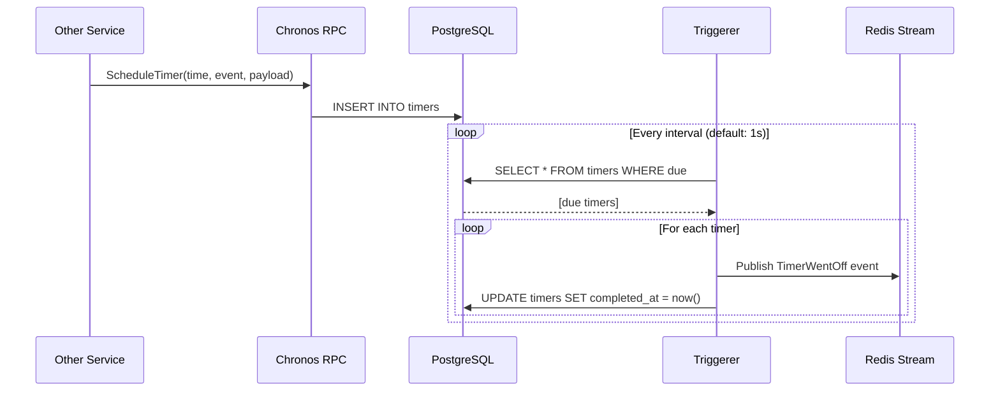

# Chronos Service

## Role & Responsibility
*   **Primary Goal**: Timer scheduling service that enables other services to schedule delayed events and asynchronous jobs.
*   **Key Functions**:
    *   **Timer Scheduling**: Accept requests to trigger events at specific future times
    *   **Timer Cancellation**: Allow scheduled events to be cancelled before they fire
    *   **Event Triggering**: Poll for due timers and publish events via Redis Streams
    *   **Health Monitoring**: Sentry cron monitor integration for reliability tracking

## Architecture & Code Map
*   **Codebase**: `anthropos-dev/chronos` (or `git@github.com:anthropos-work/chronos.git`)
*   **Language**: Go 1.24.1
*   **ORM**: [sqlc](https://sqlc.dev/) (raw SQL code generation, NOT Ent)
*   **CLI**: [Cobra](https://github.com/spf13/cobra) command framework
*   **Database**: PostgreSQL (`search_path=chronos`)
*   **Ports**: `8080` (HTTP/health), `8081` (RPC)
*   **Key Directories**:
    *   `main.go`: Entry point, delegates to Cobra command
    *   `cmd/root.go`: Main application logic (servers, triggerer initialization)
    *   `internal/rpcsrv/`: **RPC Server Implementation**
        *   `rpcsrv.go`: `ScheduleTimer`, `CancelScheduledTimer` handlers
    *   `internal/triggerer/`: **Timer Execution Engine**
        *   `triggerer.go`: Polling loop, event publishing
    *   `internal/database/`: **Data Access Layer**
        *   `schema.sql`: Table definition (source of truth)
        *   `queries/`: SQL query definitions for sqlc
        *   `repository/`: Generated sqlc code

## Data Model

Chronos uses a simple single-table design for timer storage:

```sql
-- internal/database/schema.sql
CREATE TABLE timers (
    id uuid DEFAULT gen_random_uuid() PRIMARY KEY,
    created_at timestamp with time zone NOT NULL DEFAULT now(),
    scheduled_at timestamp with time zone NOT NULL,
    completed_at timestamp with time zone,      -- NULL = pending
    cancelled_at timestamp with time zone,      -- NULL = not cancelled
    scheduled_by text NOT NULL,                 -- Originating service
    event text NOT NULL,                        -- Event type identifier
    payload json                                -- Event-specific data
);

-- Unique constraint: same event can't be scheduled twice at same time by same service
CREATE UNIQUE INDEX "timers_unique_scheduled_event" ON "timers" ("scheduled_at", "scheduled_by", "event");
```

**Timer States**:
| State | Condition |
|-------|-----------|
| Pending | `completed_at IS NULL AND cancelled_at IS NULL AND scheduled_at > now()` |
| Due | `completed_at IS NULL AND cancelled_at IS NULL AND scheduled_at <= now()` |
| Completed | `completed_at IS NOT NULL` |
| Cancelled | `cancelled_at IS NOT NULL` |

## Interface Discovery

### RPC API

**Service**: `ChronosService` (Connect RPC)

**Operations** (`internal/rpcsrv/rpcsrv.go`):

```go
// Schedule a timer to fire at a specific time
ScheduleTimer(ctx, req *chronosv1.ScheduleTimerRequest) (*chronosv1.ScheduleTimerResponse, error)
// Request fields:
//   - scheduled_at: When the timer should fire (timestamp)
//   - scheduled_by: Identifier of the calling service
//   - event: Event type name (e.g., "simulation_timeout")
//   - payload: JSON payload to include in the event

// Cancel a previously scheduled timer
CancelScheduledTimer(ctx, req *chronosv1.CancelScheduledTimerRequest) (*chronosv1.CancelScheduledTimerResponse, error)
// Request fields:
//   - id: UUID of the timer to cancel
```

### Published Events

When a timer fires, Chronos publishes a `TimerWentOff` event to Redis Streams:

```protobuf
// From proto/events/v1
message Event {
  oneof payload {
    chronosv1.EventTimerWentOff timer_went_off = ...;
  }
}

message EventTimerWentOff {
  string id = 1;              // Timer UUID
  string scheduled_by = 2;    // Original scheduler
  Timestamp scheduled_at = 3; // When it was scheduled for
  string event = 4;           // Event type
  bytes payload = 5;          // Original payload
}
```

**Consumers**: Any service subscribed to the Chronos Redis Stream can react to timer events.

### Dependencies

*   **Upstream Consumers**:
    *   **Jobsimulation**: Schedules simulation timeouts, deadline reminders
    *   Any service needing delayed/scheduled events
*   **Downstream Dependencies**:
    *   **PostgreSQL**: Timer persistence
    *   **Redis**: Event publishing via Redis Streams

## Triggerer Component

The Triggerer is the core execution engine that makes timers fire:



**Key Behaviors** (`internal/triggerer/triggerer.go`):
- **Polling Interval**: Configurable via `--interval` flag (default: 1 second)
- **Timeout**: Each run has a 3-second timeout to prevent blocking
- **Transaction Safety**: Fetches and marks complete within a single transaction
- **Error Handling**: Failed timers remain pending, logged for retry
- **Health Monitoring**: Sends heartbeat to Sentry cron monitor every minute

## Local Development

### 1. Running Standalone
*   **Prerequisites**:
    *   PostgreSQL running with `chronos` schema
    *   Redis available for pub/sub
    *   Environment variables: `DB_CONNECTION`, `REDIS_ADDR`
*   **Setup**:
    ```bash
    cd anthropos-dev/chronos
    # Apply database schema (using atlas)
    atlas migrate apply --env local
    ```
*   **Run**:
    ```bash
    # Default interval (1 second)
    go run .

    # Custom interval
    go run . --interval 5s
    ```

### 2. Running in Docker
*   **Service Name**: `chronos`
*   **Command**:
    ```bash
    cd platform
    docker compose up -d chronos
    ```

### 3. Testing
```bash
cd anthropos-dev/chronos
go test ./...
```

## Environment Variables

| Variable | Description | Example |
|----------|-------------|---------|
| `PORT` | HTTP server port | `8080` |
| `RPC_PORT` | RPC server port | `8081` |
| `DB_CONNECTION` | PostgreSQL connection string | `postgres://...?search_path=chronos` |
| `REDIS_ADDR` | Redis server address | `localhost:6379` |
| `REDIS_STREAMS_INDEX` | Redis DB index for streams | `2` |
| `SENTRY_DSN` | Sentry error tracking | `https://...@sentry.io/...` |

## CLI Flags

| Flag | Short | Description | Default |
|------|-------|-------------|---------|
| `--server` | `-s` | RPC server address | `http://localhost:8081` |
| `--interval` | `-i` | Triggerer polling interval | `1s` |

## Usage Example

**Scheduling a simulation timeout** (from Jobsimulation service):

```go
// Schedule a timeout 30 minutes from now
resp, err := chronosClient.ScheduleTimer(ctx, connect.NewRequest(&chronosv1.ScheduleTimerRequest{
    ScheduledAt: timestamppb.New(time.Now().Add(30 * time.Minute)),
    ScheduledBy: "jobsimulation",
    Event:       "simulation_timeout",
    Payload:     []byte(`{"session_id": "abc-123"}`),
}))
timerId := resp.Msg.Id

// Later, if user completes early, cancel the timeout
_, err = chronosClient.CancelScheduledTimer(ctx, connect.NewRequest(&chronosv1.CancelScheduledTimerRequest{
    Id: timerId,
}))
```

**Handling the event** (in subscriber service):

```go
// In your pubsub subscriber handler
func (s *Service) handleTimerEvent(event *eventsv1.Event) error {
    timerEvent := event.GetTimerWentOff()
    if timerEvent.Event == "simulation_timeout" {
        var payload struct{ SessionID string `json:"session_id"` }
        json.Unmarshal(timerEvent.Payload, &payload)
        // Handle the timeout...
    }
    return nil
}
```
