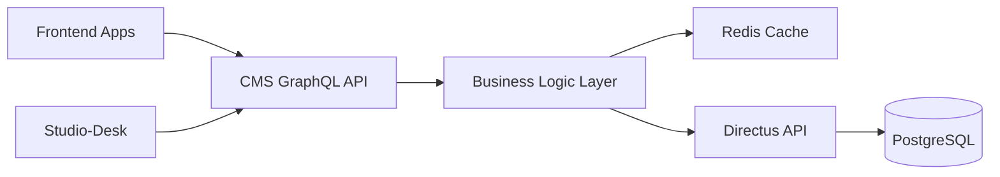

# CMS Service

## Role & Responsibility
*   **Primary Goal**: Manages content delivery for the platform, acting as a **smart proxy/adapter** on top of Directus (Headless CMS).
*   **Key Functions**:
    *   **Content API**: Exposes a **GraphQL API** for frontend apps and Studio-Desk to query content (Simulations, Skills, Skill Paths, Studio entities)
    *   **Directus Proxy**: Adds business logic, caching, and platform-specific features on top of Directus
    *   **Studio Entity Management**: Manages `StudioDocument` and `StudioTask` for content creation workflows
    *   **RPC Server**: Serves internal requests from other backend services (Backend, JobSim, Skillpath)

## Architecture & Code Map
*   **Codebase**: `cms` (Local directory).
*   **Language**: Go.
*   **Database**: PostgreSQL (via `ent`). Connects to Directus.
*   **Key Directories**:
    *   `internal/graph`: **GraphQL Implementation** (using `gqlgen`)
    *   `internal/graph/schemas/`: **GraphQL Definitions** (`*.graphqls`) - The API contract!
        *   `studio.graphqls`: Studio entity schemas (StudioDocument, StudioTask)
        *   `simulations.graphqls`: Job simulation schemas
        *   `skills.graphqls`: Skill and skill path schemas
    *   `internal/rpcsrv`: RPC server for inter-service communication
    *   `internal/directus`: Directus client and integration logic
    *   `internal/studio`: Studio-specific business logic (StudioManager)
    *   `ent/schema/`: Database entity definitions
        *   `studioDocument.go`: Studio blueprint entity
        *   `studioTask.go`: Generation task entity
    *   `cmd/`: Application entry point

## Directus Integration Pattern

The CMS service acts as a **proxy/adapter** between applications and Directus:



**Why this pattern?**
- **Business Logic**: Add platform-specific rules and validation
- **Caching**: Reduce load on Directus with Redis caching
- **Abstraction**: Hide Directus implementation details from clients
- **Migration Path**: Easier to replace CMS backend in the future

## Studio Entity Management

The CMS service manages **Studio-specific entities** for content creation:

### StudioDocument
- **Purpose**: Stores simulation blueprints created in Studio-Desk
- **Schema**: `ent/schema/studioDocument.go`
- **Fields**: Blueprint data, metadata, associations with simulations
- **GraphQL**: Exposed via `studio.graphqls`

### StudioTask
- **Purpose**: Tracks generation tasks in Studio-Room pipeline
- **Schema**: `ent/schema/studioTask.go`
- **Fields**: Task status, progress, generation parameters
- **Status Enum**: `ent/enum/studio_status.go`

**Workflow**:
1. Studio-Desk creates `StudioDocument` (blueprint)
2. User triggers generation → creates `StudioTask`
3. Studio-Room processes task → updates status
4. CMS stores final generated content → links to simulation

## Interface Discovery
*   **How to find the API**:
    *   **GraphQL Playground**: Run CMS service and visit GraphQL endpoint (typically `:8090/graphql`)
    *   **Schema Files**: Check `internal/graph/schemas/*.graphqls`
    *   **RPC**: Check `internal/rpcsrv` for inter-service APIs
*   **Dependencies**:
    *   **Upstream Consumers**:
        *   Next Web App (GraphQL queries)
        *   Studio-Desk (GraphQL for studio entities)
        *   Backend, Jobsimulation, Skillpath (RPC calls)
    *   **Downstream Dependencies**:
        *   **Directus** (Content storage)
        *   **PostgreSQL** (Direct DB access for some queries)

## Local Development (The "How-To")

### 1. Running Standalone
*   **Prerequisites**:
    *   Access to Directus (URL/Token in `.env`).
    *   Postgres/Redis.
*   **Setup**:
    ```bash
    make setup  # Installs ent, atlas, gqlgen
    make gen    # Regenerates GraphQL resolvers & Ent code
    ```
*   **Run**:
    ```bash
    go run main.go
    ```

### 2. Running in Docker
*   **Service Name**: `cms`
*   **Command**:
    ```bash
    cd platform
    docker compose up -d cms
    ```
