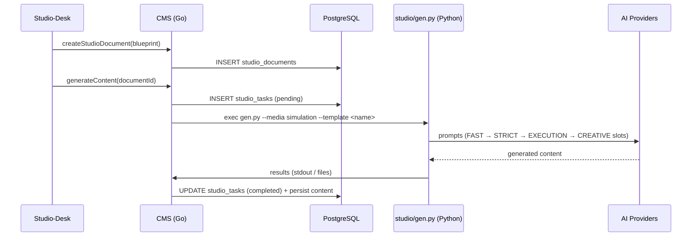

# CMS Service

## Role & Responsibility

The CMS service is the **content layer of the platform** — it owns the authored, versioned, published **CONTENT / DEFINITIONS** and serves them to everyone else. It does three things:

1. **Serves content** to the rest of the platform via GraphQL Federation and internal RPC — **skill paths** (title, description, cover/video, curators a.k.a. "Meet the Experts", library categories, **chapters → steps**, the job-simulation steps inside a chapter, skills-to-verify, settings, versioning — the `skill_paths` Directus collection), **job-simulation blueprints** (the `simulations` collection + `sequences`, roles, tasks, validation criteria), and the **content library** (`library_categories`, `library_macro_categories`, `resource`) — all proxied through Directus with Anthropos-specific business logic on top.
2. **Owns the Studio data model** — `StudioDocument` (simulation blueprints), `StudioTask` (generation jobs), and related entities for the content-authoring workflow.
3. **Runs the AI generation pipeline** in-process. The Python project `anthropos-studio-room` is cloned into `cms/studio/` and baked into the cms Docker image. The Go service dispatches generation work; the Python code executes it against OpenAI / Anthropic / Mistral.

This last point is the structural shift: **studio-room is no longer a standalone deployable**. It lives inside the cms container and runs as a subprocess invoked by the Go service.

> [!IMPORTANT]
> **CMS owns content; the like-named runtime services own state.** Do not conflate the **`skillpath`** service with skill-path content, or the **`jobsimulation`** service with simulation content. Those are **runtime/session engines** that hold *no* content and reference CMS artifacts **by ID**:
> - **[`skillpath`](./skillpath.md)** tracks per-user progression *state* (`SkillPathSession → ChapterSession → StepSession`, progress %); it fetches the skill-path *structure* it tracks against from this CMS service over Connect-RPC (`CMS_RPC_ADDR`).
> - **[`jobsimulation`](./jobsimulation.md)** runs the interactive simulation *session*; it fetches the simulation *definition* it runs from this CMS service over Connect-RPC (`cms.GetSimulation`) — it has no `DIRECTUS_BASE_ADDR` of its own, so all its content reads go *through* CMS.
>
> So **content = CMS/Directus; the like-named service = the state machine over that content.** This split is the source of a recurring naming confusion — see the [Service Taxonomy](../architecture/service_taxonomy.md) and [Architecture Overview](../architecture/architecture_overview.md) content-vs-runtime callouts.

> **Demo/dev set-dressing (v1.2 → v1.5 "prop room"):** the **public** content templates (the `directus` schema of the prod app DB — `private = false AND tenant_id IS NULL AND status = 'published'`) are captured read-only by the snapshot mechanism, then served from a **per-stack Directus**. The collection-schema gap that once forced live-prod reads is **closed**: M21 captures + auto-provisions the content-model structure (DDL + serve rows), M22 boots a per-stack Directus as a compose service (offset port, torn down with the stack), and **M23 re-points `cms`'s `DIRECTUS_BASE_ADDR` at that local instance** (`http://directus:8055`, the in-network service, #M23-D1) so a `--local-content` stack (demo default; dev opt-in) serves its **own** captured catalog — no live-prod read. The **asset plane stays on prod**: `DIRECTUS_PUBLIC_BASE_ADDR` keeps pointing at `content.anthropos.work`, so browser images load real `<...>/assets/<uuid>` URLs (the data-plane-local / asset-plane-prod split; the captured `directus_files` refs resolve those uuids). A **non-`--local-content`** stack still reads the public content **live from prod** (a demo does so **anonymously**, the prod token stripped — the documented prod-read fallback) — see [`corpus/ops/snapshot-spec.md`](../ops/snapshot-spec.md) (the M10 content surface + the M23 cutover). The app-Postgres `cms.studio_*` tables (`StudioDocument` / `StudioTask`) are **100% customer data** and are never captured (the tenant firewall).

## Architecture & Code Map

* **Codebase**: `cms` (Local directory; repo `git@github.com:anthropos-work/cms.git`)
* **Language**: Go 1.25 (primary) + Python 3.11 (studio-room)
* **Database**: PostgreSQL `cms` schema (via Ent)
* **Ports**: 8090 (GraphQL/HTTP), 8091 (Connect-RPC)
* **Docker image**: Two-stage build — Go binary built in `golang:1.25-bookworm`, copied into a `python:3.11-slim` final stage along with `cms/studio/` and its `pip install -r studio/requirements.txt`. The Go binary is the entrypoint; it shells out to Python when a generation task fires.

### Key directories

```
cmd/                       Service entrypoints
internal/
  graph/                   GraphQL layer (gqlgen)
    schemas/*.graphqls     API contract — simulation.graphqls, skills.graphqls, studio.graphqls
    *.resolvers.go         Hand-written resolvers
    model/models_gen.go    Auto-generated (DO NOT EDIT)
  directus/                Directus client + collection queries
  rpcsrv/                  Connect-RPC server (port 8091)
  auth/                    Authn middleware
  event/                   Watermill event handling
  worker/                  Background workers (Redis Streams consumers)
  studio/                  Studio data-model business logic (StudioManager)
  library/                 Content library
  exporter/                Content export
  importer/                Content import
  aivideo/                 AI video processing (HeyGen integration)
  similarity/              Similarity/matching algorithms
ent/                       Ent schema + generated code
studio/                    Python AI generation pipeline (cloned via `make init-studio`)
  gen.py                   Pipeline entrypoint
  postgen.py               Post-generation steps
  templates/               Generation templates
  agents/                  Agent definitions
  requirements.txt         openai, anthropic, mistralai, rich, pyyaml, python-docx, requests, jinja2, pytest, pytest-asyncio (see studio/requirements.txt)
terraform/                 IaC
```

> Note: local proto development requires the developer to create their own (uncommitted) `go.work` linking `../proto`; it is not committed to the repo.

## Studio Generation Pipeline

The Studio entities and the Python pipeline are tightly coupled. The flow:



### Studio entities

* **StudioDocument** (`ent/schema/studioDocument.go`): the blueprint a Studio-Desk user authored
* **StudioTask** (`ent/schema/studioTask.go`): a generation job — status, progress, params

## Directus integration

CMS acts as a proxy + business-logic layer over Directus:

```
Frontend / Studio-Desk → CMS GraphQL → Business Logic → Redis Cache → Directus API → PostgreSQL
```

Why this pattern: business rules and validation live in CMS, caching reduces Directus load, and the abstraction makes it easier to swap the storage backend later.

## Interface Discovery

* **GraphQL**: schemas at `internal/graph/schemas/*.graphqls`. GraphQL API served at `:8090/query`; Apollo Sandbox playground at `:8090/` when running locally. (There is also a Directus webhook receiver at `:8090/webhooks/`.)
* **RPC**: `internal/rpcsrv` — used by Backend, Jobsimulation, Skillpath via `CMS_RPC_ADDR=http://cms:8091`.
* **Federation**: CMS is one of the 5 subgraphs federated by Cosmo Router (`backend`, `skiller`, `jobsimulation`, `cms`, `skillpath`).

### Upstream consumers
* Next Web App (GraphQL)
* Studio-Desk (GraphQL for studio entities)
* Backend, Jobsimulation, Skillpath (RPC + Redis Streams)

### Downstream dependencies
* Directus (content storage)
* PostgreSQL (Ent ORM, `cms` schema)
* Redis (cache, Watermill streams)
* AI providers (Anthropic, OpenAI, Mistral — used by `cms/studio/` Python pipeline)

## Local Development

### First-time setup

The Python studio submodule must be cloned **before** any docker build, otherwise `make up` fails with `"/studio": not found`:

```bash
cd cms
make init-studio   # clones anthropos-studio-room into cms/studio/
make setup         # installs ent, atlas, gqlgen
make gen           # regenerates GraphQL resolvers + Ent code
```

### Run in Docker (with the rest of the platform)

```bash
cd platform
make up                  # graphql profile — includes cms
# or just cms:
make up PROFILE=cms
```

### Run natively (single service)

```bash
cd platform
make dev S=cms           # stops the docker container for cms
cd ../cms
go run .
```

For Python pipeline development:

```bash
cd cms/studio
pip install -r requirements.txt
python gen.py --media simulation --template <name>
```

> Note: when the Go service runs in development mode it auto-provisions a venv at `studio/studio-venv`, runs `pip3 install -r studio/requirements.txt`, and invokes `python3 studio/gen.py ...` / `studio/postgen.py` from the cms repo root via `bash -c` (paths are `studio/...`, not from inside `studio/`). For standalone Python work, use a venv to match the service's behavior.

### Sync the studio submodule

When `anthropos-studio-room` upstream changes:

```bash
cd cms
make update-studio       # cd studio && git pull
```

## Testing

```bash
go test ./...            # Go tests
cd studio && pytest      # Python tests (requires `pip install -r requirements.txt`)
```

## Related Documentation

* [Skillpath](./skillpath.md) — the runtime/session service that tracks progress against CMS-owned skill-path content (the content-vs-runtime split)
* [Jobsimulation](./jobsimulation.md) — the runtime service that *runs* simulations defined as CMS content
* [AI Architecture](../architecture/ai_architecture.md) — model routing, generation slots
* [Service Taxonomy](../architecture/service_taxonomy.md) — orchestration profile + the content-vs-runtime callout
* [Dependency Map](../architecture/dependency_map.md) — RPC and event-stream relationships
