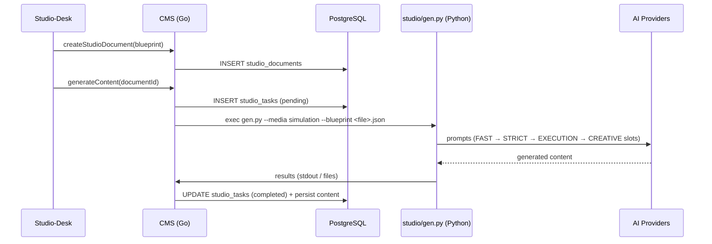

# CMS Service

> ## ⚠️ Merged into `app` — no longer a standalone service
>
> As of **cms-in-app v8.0** (`app` **v1.360.0**, July 2026), the standalone `cms` Go microservice has been
> **merged into the `app` monolith** (the service the platform calls "backend"). CMS no longer runs as a
> separate service **in production**. Its subgraph is gone from the supergraph, and its ECS service is
> **scaled to zero, not deleted** — `cms/terraform/main.tf:39` `service_desired_count = 0` — and this is
> the one M810 row whose **terraform module block** has not moved: do not read jobsimulation's teardown
> onto it (`6092c6d2` destroyed that module's service block outright).
> **⚠️ But cms HAS taken an M810 step since, and the corpus's "it has not moved" was becoming stale:**
> `6efa1d5` (merged `f38c0c4`, 2026-08-04) **deleted** `.github/workflows/build-production.yml` under the
> subject *"the cms ECR repository is decommissioned (M810)"*, its body stating that M810 *"deletes
> `module "cms_euwest1"` from the platform's `services.tf`, which destroys the ECS service and the
> production-cms ECR repository"* — the workflow went because it *"would try to push an image into a
> registry that no longer exists."* **So the two measured facts in this repo point opposite ways** (a
> module block that still declares the service; a CI commit asserting the registry is already gone), and
> the deletion itself lands in `infrastructure`, **which has never been in any clone set we have.**
> **Do not assert either way** — see the scope note below, and the fenced map, which states the same limit. It was the **fourth** engine consolidated into `app`, after
> [skiller](./skiller.md), [skillpath](./skillpath.md) and [jobsimulation](./jobsimulation.md) — **not the
> last.** The v9.0 program (2026-08-04) then folded [`storage`](./storage.md),
> [`messenger`](./messenger.md) and [`customerio-sync`](./customerio-sync.md), and platform `838d907`
> (merged `0c91421`, 2026-08-05) deleted all three containers the next day. See the fenced map,
> [`platform-migration-status.md`](../architecture/platform-migration-status.md).
>
> **✅ The husk is GONE locally, and M809 has landed (re-measured at platform `0c91421`).**
> There is no `cms` compose service, no `cms` entry in `repos.yml` (4 entries: app, sentinel,
> next-web-app, studio-desk) and no `cms` profile. Nor is there a `CMS_RPC_ADDR` any more: M809
> re-pointed it at `http://backend:8083` on the `messenger` block, and `838d907` deleted that block —
> **compose now sets zero `*_RPC_ADDR` values**, and the cms domain is reached in-process.
> *(Until `2adcf71` all of the above was false, and this banner said so; the M809 re-point is what
> changed it.)* **Scope note: this is the LOCAL compose topology only.** Whether production's
> `module.cms_euwest1` rollback path has also been torn down (**M810**) was not measured here — do not
> read the local removal as the production one. See
> [`platform-migration-status.md`](../architecture/platform-migration-status.md).
>
> **The Directus content edge stays external.** The merge moved the *Go service*; the authored content still
> lives in Directus at `content.anthropos.work`, which `app` reads over HTTP.
>
> Where everything went:
>
> * **Domain** — `app/internal/cms/` (directus, similarity, studio, library, importer/exporter, aivideo,
>   contentread, jobsimimport, rpcsrv, worker, …), wired from `app/internal/cms/wiring.go`.
> * **Data** — `similarities`, `similarity_categories`, `similarity_features`, `similarity_skills`,
>   `studio_documents`, `studio_tasks` were re-created in the **`public` schema** by
>   `app/terraform/migrations/20260724132049_cms_data_model.sql`, with the **same table names**. The old `cms`
>   DB schema is **legacy — no longer authoritative**.
> * **RPC** — `CMSService` is served on `app`'s single RPC mux, and **nothing outside the process
>   reaches it**. `messenger` was the last caller; `CMS_RPC_ADDR` was `http://backend:8083` at
>   `0dab54d`, set on messenger's block alone, and `838d907` deleted that block — so the variable is
>   set by no compose file today.
>   **The M809 re-point had already landed** and there was no husk container left to reach either — `cms` is
>   not among the **five** services compose declares at platform `0c91421` (**seven** effective, once
>   `include: common.yml` adds the `postgresql`/`redis` floor). (`http://cms:8091`, still quoted around this
>   corpus, was true at `2adcf71`.) `http://backend.internal.anthropos:8081` in production.
>   `app`'s own source comment at `app/main.go:1205-1211` (@ `b948604` v1.366.0) still calls the in-app
>   edge *"additive + DORMANT … until the **M809** re-point"* — **that comment is stale in `app`**, and
>   there is no compose value left to grade it against. `app` itself makes **no** outbound cms RPC.
> * **GraphQL** — the cms subgraph was folded into `app`'s `backend` subgraph. That single commit,
>   `graphql-wundergraph@915da06` (2026-07-29), deleted **both** `schemas/cms.graphqls` **and**
>   `schemas/jobsimulation.graphqls`, taking the supergraph from **3 subgraphs to 1** — not 2 to 1. (The
>   jobsimulation subgraph outlived jobsim-in-app and was removed here; the ladder before it was 5 → 4 at
>   `749dc86` → 3 at `7c17e63`.) Public (unauthenticated) library content queries are preserved — see app
>   v1.360.2/v1.360.3.
> * **Events** — `app` owns the `CMS_STREAM` subscriber. The folded similarity re-index + Studio handlers are
>   merged onto app's **existing** CMS subscriber via `.AddHandler(...)`; they act on disjoint rows, so they
>   compose. Directus webhooks land on `POST /api/webhook/directus`, which now **fails closed** without
>   `DIRECTUS_WEBHOOK_SECRET` (the standalone webhook was unauthenticated).
> * **Caching** — the Directus item cache still lives in its own Redis DB, `REDIS_CMS_CACHE_INDEX` (5).
> * **Studio** — the Python `anthropos-studio-room` project is now pulled into the **`app`** image via the CI
>   `additional_repo` mechanism (app v1.360.1), the same way `cms` used to do it.
> * **Infrastructure** — **this repo's own module block has not moved**, and that is all that can be said
>   from here: `cms/terraform/main.tf:39` still reads `service_desired_count = 0` in an otherwise-whole
>   191-line module, so the image and task definition stay declared *in this repo* and a revert of *this
>   file* is a one-line change plus an apply. Jobsimulation's ECS service was destroyed outright at
>   `6092c6d2`, and generalising that to `cms` is exactly the mistake
>   [`platform-migration-status.md`](../architecture/platform-migration-status.md) fences.
>   **⚠️ Do NOT extend "the module block has not moved" to "the rollback path is intact".** `6efa1d5`
>   (merged `f38c0c4`, 2026-08-04) deleted this repo's build-production workflow under the subject *"the cms
>   ECR repository is decommissioned (M810)"*, because it *"would try to push an image into a registry that
>   no longer exists"* — so the two measured facts in this repo point opposite ways. Whether
>   `infrastructure/terraform/production/services.tf` still declares `module.cms_euwest1` is **not visible to
>   this corpus** — the `infrastructure` repo has never been in the clone set — and it is now not visible
>   *with evidence on both sides*, which is the honest state: report both, assert neither.
> * **Repo** — the `cms` git repo still exists but is **frozen/legacy**; make changes in `app`.
>
> For current documentation of this domain, see [Backend (`app`)](./backend.md).

## Role & Responsibility

The CMS service is the **content layer of the platform** — it owns the authored, versioned, published **CONTENT / DEFINITIONS** and serves them to everyone else. It does three things:

1. **Serves content** to the rest of the platform via GraphQL Federation and internal RPC — **skill paths** (title, description, cover/video, curators a.k.a. "Meet the Experts", library categories, **chapters → steps**, the job-simulation steps inside a chapter, skills-to-verify, settings, versioning — the `skill_paths` Directus collection), **job-simulation blueprints** (the `simulations` collection + `sequences`, roles, tasks, validation criteria), and the **content library** (`library_categories`, `library_macro_categories`, `resource`) — all proxied through Directus with Anthropos-specific business logic on top.
2. **Owns the Studio data model** — `StudioDocument` (simulation blueprints), `StudioTask` (generation jobs), and related entities for the content-authoring workflow.
3. **Runs the AI generation pipeline** in-process. The Python project `anthropos-studio-room` is pulled into the image and dispatched as a subprocess; the Go side dispatches generation work, the Python code executes it against **OpenAI, Azure OpenAI or Anthropic** — those three and no others. The provider registry is a three-entry dict: `{'openai': OpenAIProvider, 'azure': AzureProvider, 'anthropic': AnthropicProvider}` (`services/ai.py:705-708` @ `anthropos-studio-room` `aeec036` v0.51.1), and `services/ai.py:1-2` imports only `openai`/`anthropic`. **There is no Mistral path in the Python engine.** `mistralai` is declared in `requirements.txt` and imported nowhere — that declaration is the string's *only* occurrence in the whole repo. Mistral is a **Go-side, OCR-only** dependency (see the Downstream-dependencies bullet below).

This last point was the first structural shift: **studio-room is not a standalone deployable**. Since cms-in-app it rides in the **`app`** image rather than the cms one.

> [!IMPORTANT]
> **CMS owns content; the runtime engines own state.** Do not conflate the **skill-path engine** with skill-path content, or the **`jobsimulation`** service with simulation content. Those are **runtime/session engines** that hold *no* content and reference CMS artifacts **by ID**:
> - **The [skill-path engine](./skillpath.md)** (merged into `app` — "skillpath-in-app", M502→M507; formerly the standalone `skillpath` service) tracks per-user progression *state* (`SkillPathSession → ChapterSession → StepSession`, progress %); it reads the skill-path *structure* it tracks against from the **cms domain in-process** — `app/internal/skillpath/session.go:205-207` (`// cms-in-app deseam: cms is in-process`) calls `contentread.CmsContentReader.GetSkillPathDomain`. It was a `CMS_RPC_ADDR` Connect-RPC hop until both merged into `app`.
> - **[`jobsimulation`](./jobsimulation.md)** runs the interactive simulation *session*; it reads the simulation *definition* it runs from the cms domain **in-process** (it was a `cms.GetSimulation` Connect-RPC hop until both merged into `app`) — it has no `DIRECTUS_BASE_ADDR` of its own, so all its content reads go *through* CMS.
>
> So **content = CMS/Directus; the like-named service = the state machine over that content.** This split is the source of a recurring naming confusion — see the [Service Taxonomy](../architecture/service_taxonomy.md) and [Architecture Overview](../architecture/architecture_overview.md) content-vs-runtime callouts.

> **Demo/dev set-dressing (v1.2 → v1.5 "prop room"):** the **public** content templates (the `directus` schema of the prod app DB — `private = false AND tenant_id IS NULL AND status = 'published'`) are captured read-only by the snapshot mechanism, then served from a **per-stack Directus**. The collection-schema gap that once forced live-prod reads is **closed**: M21 captures + auto-provisions the content-model structure (DDL + serve rows), M22 boots a per-stack Directus as a compose service (offset port, torn down with the stack), and **M23 re-points `DIRECTUS_BASE_ADDR` at that local instance — for `cms` AND for `backend`** (⚠️ the `cms` re-point alone is **not sufficient**: since cms-in-app, `backend` is the in-process Directus reader via `app/cms_reader_switch.go`, so a stack that re-points only `cms` still reads prod. M257x iter-24 measured that as 96 all-403 Directus lines in `backend`'s log; `DIRECTUS_DATA_CONSUMERS` now names both) (`http://directus:8055`, the in-network service, #M23-D1) so a `--local-content` stack (demo default; dev opt-in) serves its **own** captured catalog — no live-prod read. The **asset plane stays on prod**: `DIRECTUS_PUBLIC_BASE_ADDR` keeps pointing at `content.anthropos.work`, so browser images load real `<...>/assets/<uuid>` URLs (the data-plane-local / asset-plane-prod split; the captured `directus_files` refs resolve those uuids). A **non-`--local-content`** stack still reads the public content **live from prod** (a demo does so **anonymously**, the prod token stripped — the documented prod-read fallback) — see [`corpus/ops/snapshot-spec.md`](../ops/snapshot-spec.md) (the M10 content surface + the M23 cutover). The app-Postgres `cms.studio_*` tables (`StudioDocument` / `StudioTask`) are **100% customer data** and are never captured (the tenant firewall).

## Architecture & Code Map

* **Codebase**: `cms` — repo `git@github.com:anthropos-work/cms.git`. **Not cloned by `make init`**: no `repos.yml` entry since `d11a403`. Clone it by hand to read the pre-merge source; the live code is `app/internal/cms/`
* **Language**: Go 1.26 (primary — `cms/go.mod:3` `go 1.26.4`) + Python 3.11 (studio-room)
* **Database**: ~~PostgreSQL `cms` schema~~ — **`public`, via `app`'s Ent**. The `cms` schema is a legacy husk since cms-in-app v8.0; the similarity + Studio tables moved to `public`
* **Ports**: **8080 (GraphQL/HTTP), 8081 (Connect-RPC) — the binary's own defaults**, and now the only ones there are: `cms/cmd/root.go:77` `cmp.Or(os.Getenv("PORT"), "8080")` / `:78` `cmp.Or(os.Getenv("RPC_PORT"), "8081")`. The **8090 / 8091** pair quoted throughout this corpus was **compose-supplied by a service that no longer exists**: `docker-compose.yml` set `PORT=8090` (`:169`) / `RPC_PORT=8091` (`:173`) and published `8090:8090` / `8091:8091` (`:154-155`) — **at `2adcf71`**. At `0dab54d` there is no `cms` service, so nothing sets them and nothing is published; **8090/8091 are historical, not an address you can reach.** The domain's live surface is `backend`'s (`:8082/graphql/query`, RPC on `:8083`)
* **Docker image**: Two-stage build — Go binary built in `golang:1.26-bookworm` (`cms/Dockerfile:2`), copied into a `python:3.11-slim` final stage (`:23`) along with `cms/studio/` and its `pip install -r studio/requirements.txt`. The Go binary is the entrypoint; it shells out to Python when a generation task fires.

### Key directories

```
cmd/                       Service entrypoints
internal/
  graph/                   GraphQL layer (gqlgen)
    schemas/*.graphqls     API contract — simulation.graphqls, skills.graphqls, studio.graphqls
    *.resolvers.go         Hand-written resolvers
    model/models_gen.go    Auto-generated (DO NOT EDIT)
  directus/                Directus client + collection queries
  rpcsrv/                  Connect-RPC server (binds RPC_PORT — see § Ports; 8091 was compose-supplied)
  auth/                    Authn middleware
  event/                   Watermill event handling
  worker/                  Background workers (Redis Streams consumers)
  studio/                  Studio data-model business logic (StudioManager)
  library/                 Content library
  exporter/                Content export
  importer/                Content import
  aivideo/                 AI video processing (HeyGen integration)
  similarity/              Similarity/matching algorithms
ent/                       Ent schema + generated code
studio/                    Python AI generation pipeline (cloned via `make init-studio`)
  gen.py                   Pipeline entrypoint
  postgen.py               Post-generation steps
  agents/                  Agent definitions
  configs/                 Per-environment AI model slots (`{env}_config.ini`)
  services/                Provider wrappers (ai.py, …)
  knowledge/, tools/       Pipeline knowledge + helper tooling
  requirements.txt         openai, anthropic, rich, pyyaml, requests, jinja2, mistralai, pytest,
                           pytest-asyncio — the file verbatim, 9 packages. **`python-docx` is NOT among
                           them** and never was: it was listed here until v2.8 M257x, and neither
                           `cms/studio/requirements.txt` nor the in-image `app/studio/requirements.txt`
                           contains it. (The only `.docx` in the tree is a filename in an authoring
                           guideline and an asset-example README — no dependency.)
terraform/                 IaC
```

> Note: local proto development requires the developer to create their own (uncommitted) `go.work` linking `../proto`; it is not committed to the repo.

## Studio Generation Pipeline

The Studio entities and the Python pipeline are tightly coupled. The flow:


```mermaid
sequenceDiagram
    participant Desk as Studio-Desk
    participant CMS as CMS (Go)
    participant DB as PostgreSQL
    participant Studio as studio/gen.py (Python)
    participant AI as AI Providers

    Desk->>CMS: createStudioDocument(blueprint)
    CMS->>DB: INSERT studio_documents
    Desk->>CMS: generateContent(documentId)
    CMS->>DB: INSERT studio_tasks (pending)
    CMS->>Studio: exec gen.py --media simulation --blueprint <file>.json
    Studio->>AI: prompts (FAST → STRICT → EXECUTION → CREATIVE slots)
    AI-->>Studio: generated content
    Studio->>CMS: results (stdout / files)
    CMS->>DB: UPDATE studio_tasks (completed) + persist content
```

### Studio entities

* **StudioDocument** (`ent/schema/studioDocument.go`): the blueprint a Studio-Desk user authored
* **StudioTask** (`ent/schema/studioTask.go`): a generation job — status, progress, params

## Directus integration

CMS acts as a proxy + business-logic layer over Directus:

```
Frontend / Studio-Desk → CMS GraphQL → Business Logic → Redis Cache → Directus API → PostgreSQL
```

Why this pattern: business rules and validation live in CMS, caching reduces Directus load, and the abstraction makes it easier to swap the storage backend later.

## Interface Discovery

* **GraphQL**: since cms-in-app the schemas live with the rest of app's at `app/internal/web/backend/graphql/graph/schemas/*.graphqls`, served on the `backend` subgraph. The Directus webhook receiver moved to `POST /api/webhook/directus` on app's web server and **fails closed** without `DIRECTUS_WEBHOOK_SECRET` (the standalone receiver at `:8090/webhooks/` was unauthenticated).
* **RPC**: `app/internal/cms/rpcsrv` — served on app's single RPC mux, and **every caller is in-process**. `messenger` was the last external one: M809 pointed its `CMS_RPC_ADDR` at `http://backend:8083`, and `838d907` deleted the messenger service and that variable with it, so compose sets it nowhere. Production terraform still names `http://backend.internal.anthropos:8081`.
* **Federation**: **there is none left to speak of.** The cms subgraph was folded into `backend` at cms-in-app v8.0 — the **3 → 1** step, because `graphql-wundergraph@915da06` deleted `cms.graphqls` and `jobsimulation.graphqls` in the same commit. Then platform `2adcf71` (2026-07-31, PR #23 *"drop the WunderGraph router"*) **deleted the Cosmo/WunderGraph router itself** — service, `repos.yml` entry and clone. So this line's old ending, *"Cosmo Router now composes `backend` alone"*, names a component that no longer exists: **nothing composes anything.** GraphQL is served **directly by `backend`** at `:8082/graphql/query` — note the path moved with it (`/graphql` → `/graphql/query`), so a host-only re-point 404s rather than errors.

### Upstream consumers
* Next Web App (GraphQL)
* Studio-Desk (GraphQL for studio entities)
* Backend (`app`) — the skill-path engine, the jobsimulation engine and the cms domain all run **in the same
  process**, so those hops are plain function calls, **not RPC**; the Redis Streams edge has `app` on both
  ends. (**messenger** was the one remaining out-of-process consumer; M809 re-pointed its `CMS_RPC_ADDR`
  at `backend`, and `838d907` removed the messenger container and the variable. There is no husk `cms`
  container left to receive RPC either.)

### Downstream dependencies
* Directus (content storage)
* PostgreSQL (Ent ORM, **`public` schema** — the cms tables were re-created there at cms-in-app v8.0; the
  legacy `cms` schema is non-authoritative. Consistent with the **Data** bullet, :28-31 above)
* Redis (cache, Watermill streams)
* AI providers — **OpenAI / Azure OpenAI / Anthropic** for the `studio/` Python generation pipeline
  (`services/ai.py:705-708`). **Mistral is NOT one of them**: it is a Go-side, **OCR-only** dependency —
  `app/internal/cms/studio/markdownManager.go:10` imports `internal/cms/studio/mistralocr` and `:30`
  builds the client (`mistralocr.New(aiKey)` inside `NewMarkdownManager`, re-derived at `app` origin/main
  `2035f9a`; it was `:11`/`:19` and a `mistral.NewMistral(nil, MISTRAL_API_KEY)` call before the key-plumbing
  fix that stopped it reading `os.Getenv` behind the caller's back).
  Its single use is `OCRProcess` (document → markdown) on the studio attachment path
  (`studioManager.go:531` *"supported ocr content types for mistral ocr"*, `:583`, and `xlsx.go:13` — xlsx is
  rendered locally precisely because Mistral OCR rejects it). Nothing generates through it

## Local Development

### First-time setup

> **⚠️ HISTORICAL — `cd cms; make init-studio` is NOT the onboarding path any more.** Since cms-in-app v8.0
> the studio-room pipeline is pulled into the **`app`** image by CI via the `additional_repo` mechanism (app
> v1.360.1) — see the **Studio** bullet, :52-53 in the banner at the top of this doc. Work on this domain in **`app`**, not in the
> frozen `cms` repo. The block below is kept only because the legacy repo still carries these targets.

The Python studio submodule had to be cloned **before** any docker build, otherwise `make up` failed with `"/studio": not found`:

```bash
cd cms
make init-studio   # HISTORICAL — clones anthropos-studio-room into cms/studio/
make setup         # installs ent, atlas, gqlgen
make gen           # regenerates GraphQL resolvers + Ent code
```

### Run in Docker (with the rest of the platform)

```bash
cd platform
make up                  # the `core` profile — `backend` (app) serves the cms domain in-process
# There is NO cms profile and no cms container. Asking for one does NOT fail: it exits 0
# and starts postgresql, redis and sentinel — a stack with no application in it.
```

### Run natively (single service)

```bash
cd platform
make dev S=backend       # stops the backend container
cd ../app
go run .                 # the cms domain runs inside this process
```

For Python pipeline development — **in `app/studio/`, not `cms/studio/`.** `cms` has no `repos.yml` entry, so
`make init` does not clone it; the pipeline that actually ships rides in the `app` image (`additional_repo`,
app v1.360.1) and the two `requirements.txt` are byte-identical. The `cms/studio/` path below is the
historical one.

```bash
cd app/studio          # was: cms/studio
pip install -r requirements.txt
# the repo's own entry point (studio/CLAUDE.md:12-14)
python gen.py --media simulation --prompt "..." --evaluation_skills "skill1, skill2" --branch stable
# or, from a reusable blueprint JSON in the attachments directory
python gen.py --media simulation --blueprint <file>.json
```

> **⚠️ There is no `--template` flag** — and a stray one is **silently swallowed**, not rejected.
> `gen.py:484-492` registers exactly nine arguments (`-i/--interactive`, `-m/--media`, `-f/--force`,
> `--simid`, `--branch`, `--prompt`, `--annotations`, `--pipeline`, `--blueprint`), and
> `parse_argument` (`gen.py:18-28`) calls `parse_known_args` and merges the leftovers into the args
> dict. So `--template foo` parses cleanly, sets a key **nothing in the codebase reads**, and the
> command *succeeds* while generating something unrelated. The reusable unit is a **blueprint**, not
> a template — see [studio-room.md](./studio-room.md#blueprints-not-templates).

> Note: when the Go service runs in development mode it auto-provisions a venv at `studio/studio-venv`, runs `pip3 install -r studio/requirements.txt`, and invokes `python3 studio/gen.py ...` / `studio/postgen.py` from the cms repo root via `bash -c` (paths are `studio/...`, not from inside `studio/`). For standalone Python work, use a venv to match the service's behavior.

### Sync the studio submodule

**HISTORICAL — this is no longer how the shipped pipeline is refreshed.** Since cms-in-app v8.0 CI pulls
`anthropos-studio-room` into the **`app`** image via `additional_repo`; there is no manual sync step, and the
`cms` repo is not cloned by `make init`. Kept because the frozen repo still carries the target:

```bash
cd cms
make update-studio       # cd studio && git pull
```

## Testing

```bash
go test ./...            # Go tests
cd studio && pytest      # Python tests (requires `pip install -r requirements.txt`)
```

## Related Documentation

* [Skillpath](./skillpath.md) — the skill-path runtime engine (merged into `app`, M502→M507) that tracks progress against CMS-owned skill-path content (the content-vs-runtime split)
* [Jobsimulation](./jobsimulation.md) — the runtime service that *runs* simulations defined as CMS content
* [AI Architecture](../architecture/ai_architecture.md) — model routing, generation slots
* [Service Taxonomy](../architecture/service_taxonomy.md) — orchestration profile + the content-vs-runtime callout
* [Dependency Map](../architecture/dependency_map.md) — RPC and event-stream relationships
