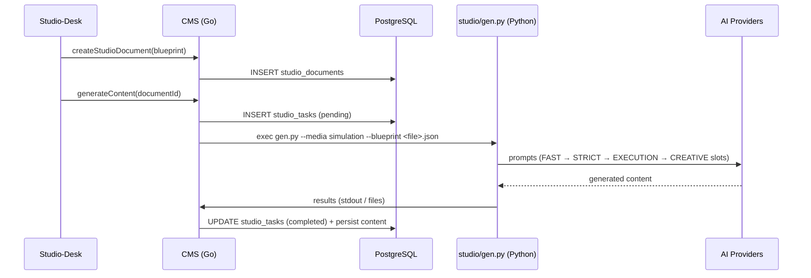

# CMS Service

> ## ⚠️ Merged into `app` — no longer a standalone service
>
> As of **cms-in-app v8.0** (`app` **v1.360.0**, July 2026), the standalone `cms` Go microservice has been
> **merged into the `app` monolith** (the service the platform calls "backend"). CMS no longer runs as a
> separate service **in production** (`cms/terraform/main.tf:39` `service_desired_count = 0`), and its
> subgraph is gone from the supergraph. It is the fourth and last engine consolidated into `app`, after
> [skiller](./skiller.md), [skillpath](./skillpath.md) and [jobsimulation](./jobsimulation.md).
>
> **⚠️ But locally the husk still starts — "merged" is not "removed from compose."**
> `docker-compose.yml:144` @ platform `2adcf71` still defines a `cms` service **in the default `graphql`
> profile**, `repos.yml:14-16` still lists the repo (marked `migrations: false # legacy`), and **messenger is
> still pointed at it** (`CMS_RPC_ADDR=http://cms:8091`) — deliberately, until the **M809** re-point
> (`app/main.go:1196-1202`: *"additive + DORMANT … until the M809 re-point"*). The state is
> **`running_but_unfederated`**; container teardown is **M810**. See
> [`platform-migration-status.md`](../architecture/platform-migration-status.md).
>
> **The Directus content edge stays external.** The merge moved the *Go service*; the authored content still
> lives in Directus at `content.anthropos.work`, which `app` reads over HTTP.
>
> Where everything went:
>
> * **Domain** — `app/internal/cms/` (directus, similarity, studio, library, importer/exporter, aivideo,
>   contentread, jobsimimport, rpcsrv, worker, …), wired from `app/internal/cms/wiring.go`.
> * **Data** — `similarities`, `similarity_categories`, `similarity_features`, `similarity_skills`,
>   `studio_documents`, `studio_tasks` were re-created in the **`public` schema** by
>   `app/terraform/migrations/20260724132049_cms_data_model.sql`, with the **same table names**. The old `cms`
>   DB schema is **legacy — no longer authoritative**.
> * **RPC** — `CMSService` is served on `app`'s single RPC mux. `messenger` reaches it at
>   `CMS_RPC_ADDR=`**`http://cms:8091`** locally — i.e. **still the husk** (`docker-compose.yml:256` @ platform
>   `2adcf71`); `http://backend.internal.anthropos:8081` in production. `app/main.go:1196-1202` says why: the
>   in-app edge is *"additive + DORMANT … until the **M809** re-point."* `app` itself makes **no** outbound
>   cms RPC.
> * **GraphQL** — the cms subgraph was folded into `app`'s `backend` subgraph. That single commit,
>   `graphql-wundergraph@915da06` (2026-07-29), deleted **both** `schemas/cms.graphqls` **and**
>   `schemas/jobsimulation.graphqls`, taking the supergraph from **3 subgraphs to 1** — not 2 to 1. (The
>   jobsimulation subgraph outlived jobsim-in-app and was removed here; the ladder before it was 5 → 4 at
>   `749dc86` → 3 at `7c17e63`.) Public (unauthenticated) library content queries are preserved — see app
>   v1.360.2/v1.360.3.
> * **Events** — `app` owns the `CMS_STREAM` subscriber. The folded similarity re-index + Studio handlers are
>   merged onto app's **existing** CMS subscriber via `.AddHandler(...)`; they act on disjoint rows, so they
>   compose. Directus webhooks land on `POST /api/webhook/directus`, which now **fails closed** without
>   `DIRECTUS_WEBHOOK_SECRET` (the standalone webhook was unauthenticated).
> * **Caching** — the Directus item cache still lives in its own Redis DB, `REDIS_CMS_CACHE_INDEX` (5).
> * **Studio** — the Python `anthropos-studio-room` project is now pulled into the **`app`** image via the CI
>   `additional_repo` mechanism (app v1.360.1), the same way `cms` used to do it.
> * **Infrastructure** — `module.cms_euwest1` is **still declared** in
>   `infrastructure/terraform/production/services.tf` as the **rollback path** and takes no traffic. Teardown
>   is **M810**.
> * **Repo** — the `cms` git repo still exists but is **frozen/legacy**; make changes in `app`.
>
> For current documentation of this domain, see [Backend (`app`)](./backend.md).

## Role & Responsibility

The CMS service is the **content layer of the platform** — it owns the authored, versioned, published **CONTENT / DEFINITIONS** and serves them to everyone else. It does three things:

1. **Serves content** to the rest of the platform via GraphQL Federation and internal RPC — **skill paths** (title, description, cover/video, curators a.k.a. "Meet the Experts", library categories, **chapters → steps**, the job-simulation steps inside a chapter, skills-to-verify, settings, versioning — the `skill_paths` Directus collection), **job-simulation blueprints** (the `simulations` collection + `sequences`, roles, tasks, validation criteria), and the **content library** (`library_categories`, `library_macro_categories`, `resource`) — all proxied through Directus with Anthropos-specific business logic on top.
2. **Owns the Studio data model** — `StudioDocument` (simulation blueprints), `StudioTask` (generation jobs), and related entities for the content-authoring workflow.
3. **Runs the AI generation pipeline** in-process. The Python project `anthropos-studio-room` is pulled into the image and dispatched as a subprocess; the Go side dispatches generation work, the Python code executes it against OpenAI / Anthropic / Mistral.

This last point was the first structural shift: **studio-room is not a standalone deployable**. Since cms-in-app it rides in the **`app`** image rather than the cms one.

> [!IMPORTANT]
> **CMS owns content; the runtime engines own state.** Do not conflate the **skill-path engine** with skill-path content, or the **`jobsimulation`** service with simulation content. Those are **runtime/session engines** that hold *no* content and reference CMS artifacts **by ID**:
> - **The [skill-path engine](./skillpath.md)** (merged into `app` — "skillpath-in-app", M502→M507; formerly the standalone `skillpath` service) tracks per-user progression *state* (`SkillPathSession → ChapterSession → StepSession`, progress %); it reads the skill-path *structure* it tracks against from the **cms domain in-process** — `app/internal/skillpath/session.go:205-207` (`// cms-in-app deseam: cms is in-process`) calls `contentread.CmsContentReader.GetSkillPathDomain`. It was a `CMS_RPC_ADDR` Connect-RPC hop until both merged into `app`.
> - **[`jobsimulation`](./jobsimulation.md)** runs the interactive simulation *session*; it reads the simulation *definition* it runs from the cms domain **in-process** (it was a `cms.GetSimulation` Connect-RPC hop until both merged into `app`) — it has no `DIRECTUS_BASE_ADDR` of its own, so all its content reads go *through* CMS.
>
> So **content = CMS/Directus; the like-named service = the state machine over that content.** This split is the source of a recurring naming confusion — see the [Service Taxonomy](../architecture/service_taxonomy.md) and [Architecture Overview](../architecture/architecture_overview.md) content-vs-runtime callouts.

> **Demo/dev set-dressing (v1.2 → v1.5 "prop room"):** the **public** content templates (the `directus` schema of the prod app DB — `private = false AND tenant_id IS NULL AND status = 'published'`) are captured read-only by the snapshot mechanism, then served from a **per-stack Directus**. The collection-schema gap that once forced live-prod reads is **closed**: M21 captures + auto-provisions the content-model structure (DDL + serve rows), M22 boots a per-stack Directus as a compose service (offset port, torn down with the stack), and **M23 re-points `DIRECTUS_BASE_ADDR` at that local instance — for `cms` AND for `backend`** (⚠️ the `cms` re-point alone is **not sufficient**: since cms-in-app, `backend` is the in-process Directus reader via `app/cms_reader_switch.go`, so a stack that re-points only `cms` still reads prod. M257x iter-24 measured that as 96 all-403 Directus lines in `backend`'s log; `DIRECTUS_DATA_CONSUMERS` now names both) (`http://directus:8055`, the in-network service, #M23-D1) so a `--local-content` stack (demo default; dev opt-in) serves its **own** captured catalog — no live-prod read. The **asset plane stays on prod**: `DIRECTUS_PUBLIC_BASE_ADDR` keeps pointing at `content.anthropos.work`, so browser images load real `<...>/assets/<uuid>` URLs (the data-plane-local / asset-plane-prod split; the captured `directus_files` refs resolve those uuids). A **non-`--local-content`** stack still reads the public content **live from prod** (a demo does so **anonymously**, the prod token stripped — the documented prod-read fallback) — see [`corpus/ops/snapshot-spec.md`](../ops/snapshot-spec.md) (the M10 content surface + the M23 cutover). The app-Postgres `cms.studio_*` tables (`StudioDocument` / `StudioTask`) are **100% customer data** and are never captured (the tenant firewall).

## Architecture & Code Map

* **Codebase**: `cms` (Local directory; repo `git@github.com:anthropos-work/cms.git`)
* **Language**: Go 1.26 (primary — `cms/go.mod:3` `go 1.26.4`) + Python 3.11 (studio-room)
* **Database**: ~~PostgreSQL `cms` schema~~ — **`public`, via `app`'s Ent**. The `cms` schema is a legacy husk since cms-in-app v8.0; the similarity + Studio tables moved to `public`
* **Ports**: 8090 (GraphQL/HTTP), 8091 (Connect-RPC)
* **Docker image**: Two-stage build — Go binary built in `golang:1.26-bookworm` (`cms/Dockerfile:2`), copied into a `python:3.11-slim` final stage (`:23`) along with `cms/studio/` and its `pip install -r studio/requirements.txt`. The Go binary is the entrypoint; it shells out to Python when a generation task fires.

### Key directories

```
cmd/                       Service entrypoints
internal/
  graph/                   GraphQL layer (gqlgen)
    schemas/*.graphqls     API contract — simulation.graphqls, skills.graphqls, studio.graphqls
    *.resolvers.go         Hand-written resolvers
    model/models_gen.go    Auto-generated (DO NOT EDIT)
  directus/                Directus client + collection queries
  rpcsrv/                  Connect-RPC server (port 8091)
  auth/                    Authn middleware
  event/                   Watermill event handling
  worker/                  Background workers (Redis Streams consumers)
  studio/                  Studio data-model business logic (StudioManager)
  library/                 Content library
  exporter/                Content export
  importer/                Content import
  aivideo/                 AI video processing (HeyGen integration)
  similarity/              Similarity/matching algorithms
ent/                       Ent schema + generated code
studio/                    Python AI generation pipeline (cloned via `make init-studio`)
  gen.py                   Pipeline entrypoint
  postgen.py               Post-generation steps
  agents/                  Agent definitions
  configs/                 Per-environment AI model slots (`{env}_config.ini`)
  services/                Provider wrappers (ai.py, …)
  knowledge/, tools/       Pipeline knowledge + helper tooling
  requirements.txt         openai, anthropic, mistralai, rich, pyyaml, python-docx, requests, jinja2, pytest, pytest-asyncio (see studio/requirements.txt)
terraform/                 IaC
```

> Note: local proto development requires the developer to create their own (uncommitted) `go.work` linking `../proto`; it is not committed to the repo.

## Studio Generation Pipeline

The Studio entities and the Python pipeline are tightly coupled. The flow:


```mermaid
sequenceDiagram
    participant Desk as Studio-Desk
    participant CMS as CMS (Go)
    participant DB as PostgreSQL
    participant Studio as studio/gen.py (Python)
    participant AI as AI Providers

    Desk->>CMS: createStudioDocument(blueprint)
    CMS->>DB: INSERT studio_documents
    Desk->>CMS: generateContent(documentId)
    CMS->>DB: INSERT studio_tasks (pending)
    CMS->>Studio: exec gen.py --media simulation --blueprint <file>.json
    Studio->>AI: prompts (FAST → STRICT → EXECUTION → CREATIVE slots)
    AI-->>Studio: generated content
    Studio->>CMS: results (stdout / files)
    CMS->>DB: UPDATE studio_tasks (completed) + persist content
```

### Studio entities

* **StudioDocument** (`ent/schema/studioDocument.go`): the blueprint a Studio-Desk user authored
* **StudioTask** (`ent/schema/studioTask.go`): a generation job — status, progress, params

## Directus integration

CMS acts as a proxy + business-logic layer over Directus:

```
Frontend / Studio-Desk → CMS GraphQL → Business Logic → Redis Cache → Directus API → PostgreSQL
```

Why this pattern: business rules and validation live in CMS, caching reduces Directus load, and the abstraction makes it easier to swap the storage backend later.

## Interface Discovery

* **GraphQL**: since cms-in-app the schemas live with the rest of app's at `app/internal/web/backend/graphql/graph/schemas/*.graphqls`, served on the `backend` subgraph. The Directus webhook receiver moved to `POST /api/webhook/directus` on app's web server and **fails closed** without `DIRECTUS_WEBHOOK_SECRET` (the standalone receiver at `:8090/webhooks/` was unauthenticated).
* **RPC**: `app/internal/cms/rpcsrv` — served on app's single RPC mux. In-repo callers reach it in-process; the one external caller left is `messenger` — which, **until M809, still calls the husk**: `CMS_RPC_ADDR=http://cms:8091` locally (`docker-compose.yml:256`), `http://backend.internal.anthropos:8081` in production.
* **Federation**: the cms subgraph was folded into `backend` at cms-in-app v8.0 — the **3 → 1** step, because `graphql-wundergraph@915da06` deleted `cms.graphqls` and `jobsimulation.graphqls` in the same commit. Cosmo Router now composes `backend` alone.

### Upstream consumers
* Next Web App (GraphQL)
* Studio-Desk (GraphQL for studio entities)
* Backend (`app`) — the skill-path engine, the jobsimulation engine and the cms domain all run **in the same
  process**, so those hops are plain function calls, **not RPC**; the Redis Streams edge has `app` on both
  ends. (The husk `cms` container does still receive real RPC — from **messenger** at
  `CMS_RPC_ADDR=http://cms:8091`, until M809.)

### Downstream dependencies
* Directus (content storage)
* PostgreSQL (Ent ORM, **`public` schema** — the cms tables were re-created there at cms-in-app v8.0; the
  legacy `cms` schema is non-authoritative. Consistent with :27 above)
* Redis (cache, Watermill streams)
* AI providers (Anthropic, OpenAI, Mistral — used by `cms/studio/` Python pipeline)

## Local Development

### First-time setup

> **⚠️ HISTORICAL — `cd cms; make init-studio` is NOT the onboarding path any more.** Since cms-in-app v8.0
> the studio-room pipeline is pulled into the **`app`** image by CI via the `additional_repo` mechanism (app
> v1.360.1) — see :37 in the banner at the top of this doc. Work on this domain in **`app`**, not in the
> frozen `cms` repo. The block below is kept only because the legacy repo still carries these targets.

The Python studio submodule had to be cloned **before** any docker build, otherwise `make up` failed with `"/studio": not found`:

```bash
cd cms
make init-studio   # HISTORICAL — clones anthropos-studio-room into cms/studio/
make setup         # installs ent, atlas, gqlgen
make gen           # regenerates GraphQL resolvers + Ent code
```

### Run in Docker (with the rest of the platform)

```bash
cd platform
make up                  # graphql profile — includes cms
# or just cms:
make up PROFILE=cms
```

### Run natively (single service)

```bash
cd platform
make dev S=backend       # stops the backend container
cd ../app
go run .                 # the cms domain runs inside this process
```

For Python pipeline development:

```bash
cd cms/studio
pip install -r requirements.txt
# the repo's own entry point (studio/CLAUDE.md:12-14)
python gen.py --media simulation --prompt "..." --evaluation_skills "skill1, skill2" --branch stable
# or, from a reusable blueprint JSON in the attachments directory
python gen.py --media simulation --blueprint <file>.json
```

> **⚠️ There is no `--template` flag** — and a stray one is **silently swallowed**, not rejected.
> `gen.py:484-492` registers exactly nine arguments (`-i/--interactive`, `-m/--media`, `-f/--force`,
> `--simid`, `--branch`, `--prompt`, `--annotations`, `--pipeline`, `--blueprint`), and
> `parse_argument` (`gen.py:18-28`) calls `parse_known_args` and merges the leftovers into the args
> dict. So `--template foo` parses cleanly, sets a key **nothing in the codebase reads**, and the
> command *succeeds* while generating something unrelated. The reusable unit is a **blueprint**, not
> a template — see [studio-room.md](./studio-room.md#blueprints-not-templates).

> Note: when the Go service runs in development mode it auto-provisions a venv at `studio/studio-venv`, runs `pip3 install -r studio/requirements.txt`, and invokes `python3 studio/gen.py ...` / `studio/postgen.py` from the cms repo root via `bash -c` (paths are `studio/...`, not from inside `studio/`). For standalone Python work, use a venv to match the service's behavior.

### Sync the studio submodule

When `anthropos-studio-room` upstream changes:

```bash
cd cms
make update-studio       # cd studio && git pull
```

## Testing

```bash
go test ./...            # Go tests
cd studio && pytest      # Python tests (requires `pip install -r requirements.txt`)
```

## Related Documentation

* [Skillpath](./skillpath.md) — the skill-path runtime engine (merged into `app`, M502→M507) that tracks progress against CMS-owned skill-path content (the content-vs-runtime split)
* [Jobsimulation](./jobsimulation.md) — the runtime service that *runs* simulations defined as CMS content
* [AI Architecture](../architecture/ai_architecture.md) — model routing, generation slots
* [Service Taxonomy](../architecture/service_taxonomy.md) — orchestration profile + the content-vs-runtime callout
* [Dependency Map](../architecture/dependency_map.md) — RPC and event-stream relationships
