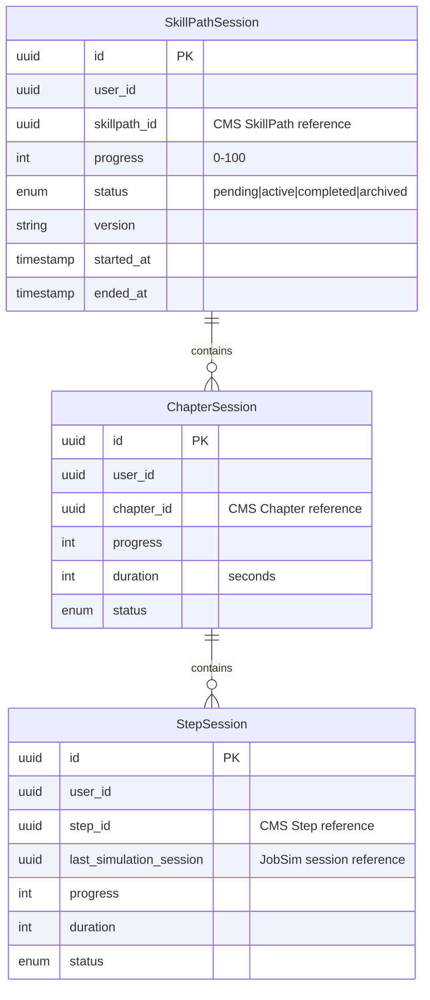
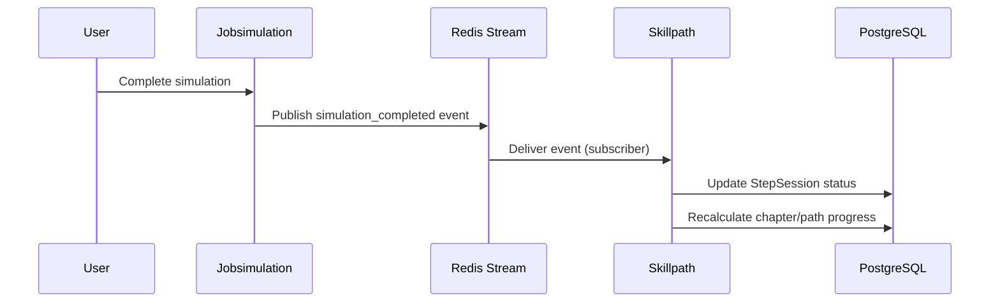

# Skillpath Service

## Role & Responsibility
*   **Primary Goal**: Manages user session state through skill progression paths, tracking progress as users complete chapters and steps within learning paths.
*   **Key Functions**:
    *   **Session Management**: Creates and manages `SkillPathSession` records that track a user's journey through a skill path
    *   **Progress Tracking**: Records completion status for chapters and individual steps within a path
    *   **Version Upgrades**: Handles migration of user sessions when skill path content is updated
    *   **Event Subscription**: Listens to Jobsimulation events to update step completion when simulations finish

## Architecture & Code Map
*   **Codebase**: `anthropos-dev/skillpath` (or `git@github.com:anthropos-work/skillpath.git`)
*   **Language**: Go 1.24.11
*   **ORM**: [Ent](https://entgo.io/) (Entity Framework)
*   **Database**: PostgreSQL (`search_path=skillpath`)
*   **Ports**: `8080` (HTTP/GraphQL), `8081` (RPC)
*   **Key Directories**:
    *   `main.go`: Application entry point, server initialization
    *   `rpc.go`: RPC server implementation (`GetSkillPathSession`)
    *   `internal/ent/schema/`: **Ent Entity Definitions** (Source of Truth)
        *   `skillpathsession.go`: Main session entity
        *   `chaptersession.go`: Chapter progress entity
        *   `stepsession.go`: Step progress entity
    *   `internal/graph/`: **GraphQL Implementation** (gqlgen)
        *   `schemas/schema.graphqls`: Type definitions
        *   `schemas/queries.graphqls`: Query operations
        *   `schemas/mutations.graphqls`: Mutation operations
    *   `internal/session/`: Session manager business logic + pub/sub handlers

## Data Model

The service uses a hierarchical session model to track user progress:



**Status Enum** (`internal/ent/enum/status.go`):
- `pending`: Session created but not started
- `active`: User currently working through content
- `completed`: All steps finished
- `archived`: Old version, superseded by upgrade

## Interface Discovery

### GraphQL API

Access the **GraphQL Playground** at `http://localhost:8080/` when running locally.

**Queries** (`internal/graph/schemas/queries.graphqls`):
```graphql
type Query {
  # Get or create a session for a user on a skill path
  getOrCreateSkillPathSession(userId: ID!, skillPathId: ID!, version: String): SkillPathSession!

  # List all active (in-progress) sessions for a user
  skillPathActiveSessions(userId: ID!): [SkillPathSession!]!

  # List all completed sessions for a user
  skillPathCompletedSessions(userId: ID!): [SkillPathSession!]!
}
```

**Mutations** (`internal/graph/schemas/mutations.graphqls`):
```graphql
type Mutation {
  # Mark a step as completed
  completeSkillPathStep(userId: ID!, skillPathSessionId: ID!, stepId: ID!): Boolean!

  # Revert step completion
  uncompleteSkillPathStep(userId: ID!, skillPathSessionId: ID!, stepId: ID!): Boolean!

  # Upgrade user's session to latest skill path version
  upgradeSkillPathSessionToLatest(userId: ID!, skillPathId: ID!): SkillPathSession!

  # Bulk upgrade all users on a skill path (admin)
  upgradeAllSkillPathSessionsToLatest(skillPathId: ID!, userId: ID!): UpgradeAllSkillPathSessionsResult!
}
```

### RPC API

**Service**: `SkillPathSessionService` (Connect RPC)

**Operations** (`rpc.go`):
```go
// GetSkillPathSession retrieves a session with chapters and steps
GetSkillPathSession(ctx, req *skillpathv1.GetSkillPathSessionRequest) (*skillpathv1.GetSkillPathSessionResponse, error)
```

### Dependencies

*   **Upstream Consumers**:
    *   GraphQL/Wundergraph (federated queries)
    *   Backend service (user journey orchestration)
*   **Downstream Dependencies**:
    *   **CMS** (RPC): Fetches skill path structure, chapters, steps
    *   **Jobsimulation** (RPC): Gets simulation session details
    *   **Sentinel** (RPC): Authorization checks
    *   **Redis**: Pub/sub for event subscription
    *   **PostgreSQL**: Session state persistence

## Event-Driven Architecture

Skillpath subscribes to the **Jobsimulation Redis Stream** to react when users complete simulations:



**Subscription Handler** (`internal/session/session.go`):
- Listens to `JOBSIMULATION_STREAM` environment variable
- Processes events via `SessionManager.JobSimulationSubscriber()`
- Updates step completion status based on simulation results

## Local Development

### 1. Running Standalone
*   **Prerequisites**:
    *   PostgreSQL running with `skillpath` schema
    *   Redis available for pub/sub
    *   CMS and Jobsimulation services running (for RPC calls)
    *   Environment variables: `DB_CONNECTION`, `REDIS_ADDR`, `CMS_RPC_ADDR`, `JOBSIMULATION_RPC_ADDR`, `CLERK_SECRET_KEY`
*   **Setup**:
    ```bash
    cd anthropos-dev/skillpath
    make setup    # Install tools (ent, atlas)
    make gen      # Generate Ent code
    atlas migrate apply --env local  # Apply migrations
    ```
*   **Run**:
    ```bash
    go run .
    ```

### 2. Running in Docker
*   **Service Name**: `skillpath`
*   **Command**:
    ```bash
    cd platform
    docker compose up -d skillpath
    ```

### 3. Testing
```bash
cd anthropos-dev/skillpath
go test ./...

# With coverage
go test -cover ./internal/session/...
```

## Environment Variables

| Variable | Description | Example |
|----------|-------------|---------|
| `PORT` | HTTP server port | `8080` |
| `RPC_PORT` | RPC server port | `8081` |
| `DB_CONNECTION` | PostgreSQL connection string | `postgres://...?search_path=skillpath` |
| `REDIS_ADDR` | Redis server address | `localhost:6379` |
| `REDIS_STREAMS_INDEX` | Redis DB index for streams | `2` |
| `CMS_RPC_ADDR` | CMS service RPC address | `http://cms:8091` |
| `JOBSIMULATION_RPC_ADDR` | Jobsimulation RPC address | `http://jobsimulation:8081` |
| `AUTHORIZATION_ADDRESS` | Sentinel service address | `http://sentinel:8081` |
| `CLERK_SECRET_KEY` | Clerk authentication key | `sk_test_...` |
| `JOBSIMULATION_STREAM` | Redis stream to subscribe | `jobsimulation` |
