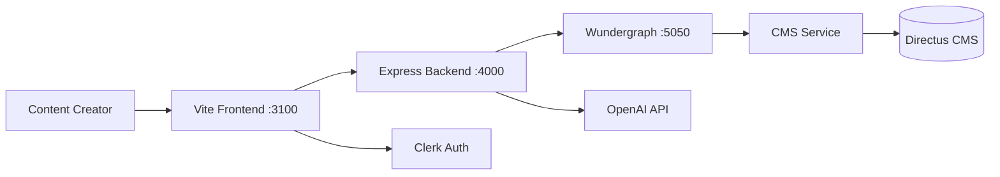

# Studio-Desk Service

## High-Level Summary (For PMs & Non-Engineers)

**Studio-Desk** is a specialized web application that empowers content creators to design job simulations and learning experiences. Think of it as a **visual design studio** where creators can:
- Build interactive job simulations step-by-step
- Use an AI copilot to brainstorm and refine content
- Manage simulation blueprints, attachments, and metadata
- Export designs for automated generation via Studio-Room

It's like a "Figma for job simulations" - a creative tool optimized for designing realistic work experiences.

## Technical Deep Dive (For Engineers)

### Service Overview

| Property | Value |
|:---------|:------|
| **Service Type** | Custom Application (Tier 2 - Studio Services) |
| **Technology Stack** | TypeScript, Vite, Express.js, React |
| **Deployment** | Standalone (not in docker-compose) |
| **Port(s)** | 3100 (frontend), 4000 (backend) |
| **Authentication** | Clerk |
| **Repository** | Local `studio/studio-desk/` |

### Architecture

Studio-Desk is a **full-stack TypeScript application** with:

1. **Frontend**: Vite + React SPA
   - Hot Module Replacement (HMR) for rapid development
   - Clerk.js for authentication
   - GraphQL client for data fetching

2. **Backend**: Express.js API server
   - Clerk middleware for route protection
   - GraphQL integration with CMS service
   - OpenAI integration for Studio Copilot
   - File upload handling



### Project Structure

```
studio-desk/
├── src/                # Backend (Express.js)
│   ├── index.ts        # Server entry point
│   ├── routes/         # API routes
│   ├── services/       # Backend services
│   └── prompts/        # AI prompt templates
├── app/                # Frontend (Vite + React)
│   ├── core/           # Core components & utilities
│   ├── designer/       # Simulation designer interface
│   ├── skills/         # Skills management UI
│   ├── services/       # Frontend services
│   ├── graphql/        # GraphQL queries/mutations
│   └── assets/         # Static assets
├── tests/              # Test suite
│   ├── frontend/       # Frontend tests
│   ├── unit/           # Backend unit tests
│   └── integration/    # API integration tests
├── dist/               # Build output
├── vite.config.ts      # Vite configuration
├── codegen.ts          # GraphQL code generation
└── package.json
```

### Key Features

#### 1. Simulation Builder
- Visual interface for designing job simulations
- Support for multiple simulation types (interviews, coding, prompt engineering)
- Document editing with rich text support
- Attachments management (files, images, documents)
- Custom criteria definition with AI assistance

#### 2. Studio Copilot (AI Assistant)
- **Models**: GPT-5.1, GPT-5.2 (experimental)
- **Modes**: 
  - Ask/Brainstorming mode
  - Complex edits mode (with patch mechanism)
- **Features**:
  - Context-aware suggestions
  - Formatted replies in markdown
  - In-place follow-up actions
  - Multi-language support (7 languages)

#### 3. Generation Workflow
1. Design blueprint in Studio-Desk
2. Export blueprint with metadata
3. Studio-Room processes blueprint via AI pipeline
4. Generated content returns to CMS/Directus

### Data Layer

#### GraphQL Integration

Studio-Desk connects to the platform's GraphQL gateway (Wundergraph) for data operations:

```typescript
// Example from app/graphql/
// Queries and mutations defined here
// Types auto-generated via graphql-codegen
```

**GraphQL Endpoint**: Configured via `VITE_GRAPHQL_ENDPOINT` (default: `http://localhost:5050/graphql`)

**Type Generation**:
```bash
npm run codegen  # Generates TypeScript types from GraphQL schema
```

Generated types are stored in `app/__generated__/` and provide type-safe GraphQL operations.

#### Studio Entities

Studio-Desk works with these primary entities (stored via CMS → Directus):

- **StudioDocument**: Simulation blueprints and designs
- **StudioTask**: Generation tasks and statuses
- **Attachments**: Files, images, documents
- **Skills**: Associated skills and competencies

### Development Setup

#### Prerequisites
- Node.js v16+
- npm v7+
- Clerk account (for authentication)
- Access to platform GraphQL endpoint (Wundergraph running)
- Access to CMS service

#### Environment Configuration

Create `.env` file:

```bash
# Server
PORT=4000
NODE_ENV=development
CLERK_SECRET_KEY=sk_test_xxxxx
CLERK_SIGN_IN_URL=http://localhost:3100/login

# Frontend
VITE_CLERK_PUBLISHABLE_KEY=pk_test_xxxxx
VITE_CLERK_SIGN_IN_URL=http://localhost:3100/login
VITE_GRAPHQL_ENDPOINT=http://localhost:5050/graphql
VITE_WEB_APP_URL=http://localhost:3000

# OpenAI (for Copilot)
OPENAI_API_KEY=sk-xxxxx
```

#### Local Development

1. **Install dependencies**:
```bash
cd studio/studio-desk
npm install
```

2. **Generate GraphQL types** (when schema changes):
```bash
npm run codegen
```

3. **Start development servers**:
```bash
npm run dev
```

This starts:
- Frontend: `http://localhost:3100` (Vite dev server)
- Backend: `http://localhost:4000` (Express API)

4. **Access the application**:
   - Development: `http://localhost:3100`
   - With full auth flow: `http://localhost:4000` (proxies to frontend)

#### Testing

```bash
# Run all tests
npm test

# Type checking
npm run type-check

# Linting
npm run lint
```

### Production Build

```bash
# Build both frontend and backend
npm run build

# Start production server
npm start
```

Serves the app from `http://localhost:4000` (backend serves frontend static files).

### Deployment

Studio-Desk uses **conventional commits** and automated releases via [Cocogitto](https://github.com/cocogitto/cocogitto):

```bash
# Create new version
cog bump --auto

# Push to trigger Docker build
git push && git push --tags
```

Docker images are built automatically on tag push. Deployment managed via infrastructure repository.

### Integration Points

#### With Core Platform
- **Authentication**: Clerk (shared with main app)
- **Data Layer**: GraphQL → CMS → Directus
- **User Sync**: Optionally sync Clerk users to local DB via Tailscale funnel

#### With Studio-Room
- Studio-Desk **creates** simulation blueprints
- Studio-Room **consumes** those blueprints to generate final content
- Communication via shared CMS/Directus storage

### Troubleshooting

**GraphQL errors**: Ensure Wundergraph is running on port 5050:
```bash
cd platform
docker compose up -d graphql
```

**Clerk authentication issues**: Verify Clerk keys in `.env` and ensure sign-in URLs match

**Copilot not working**: Check `OPENAI_API_KEY` in `.env`

### Related Documentation
- [Service Taxonomy](../architecture/service_taxonomy.md) - Studio services overview
- [Studio-Room](./studio-room.md) - AI generation pipeline
- [CMS Service](./cms.md) - Data storage backend
- [External Services](../architecture/external_services.md) - Clerk and Directus details
