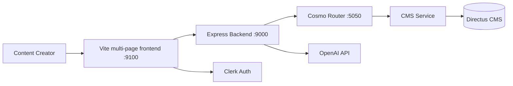

# Studio-Desk Service

## High-Level Summary (For PMs & Non-Engineers)

**Studio-Desk** is a specialized web application that empowers content creators to design job simulations and learning experiences. Think of it as a **visual design studio** where creators can:
- Build interactive job simulations step-by-step
- Use an AI copilot to brainstorm and refine content
- Manage simulation blueprints, attachments, and metadata
- Export designs for automated generation via Studio-Room

It's like a "Figma for job simulations" - a creative tool optimized for designing realistic work experiences.

## Technical Deep Dive (For Engineers)

### Service Overview

| Property | Value |
|:---------|:------|
| **Service Type** | Custom Application (Tier 2 - Studio Services) |
| **Technology Stack** | TypeScript, Vite, Express.js (vanilla TS frontend, no framework) |
| **Deployment** | Runs natively for dev (`npm run dev`), or containerized via the `studio-desk` docker-compose profile (`make up PROFILE=studio-desk`; ports 9000/9100, depends on graphql + cms) |
| **Port(s)** | 9100 (frontend), 9000 (backend) - configurable via `.env` |
| **Authentication** | Clerk |
| **Repository** | Local `studio-desk/` (sibling repo cloned by `make init`) |

### Architecture

Studio-Desk is a **full-stack TypeScript application** with:

1. **Frontend**: Vite-bundled vanilla TypeScript multi-page app (no React/Vue/Angular)
   - Hot Module Replacement (HMR) for rapid development
   - Clerk.js for authentication
   - GraphQL client for data fetching
   - Separate per-feature HTML entry points (`home.html`, `designer-sim.html`, `builder-skill-path.html`, `generation.html`, `catalog.html`, `academy.html`, `skills.html`), each loading `app/core/main.ts` which bootstraps Clerk auth + scaffold (header/sidemenu/footer) + the page module

2. **Backend**: Express.js API server
   - Clerk middleware for route protection
   - GraphQL integration with CMS service
   - Multi-provider AI integration (Azure OpenAI / OpenAI / Anthropic) for Studio Copilot
   - File upload handling



### Project Structure

```
studio-desk/
├── src/                # Backend (Express.js)
│   ├── index.ts        # Server entry point
│   ├── routes/         # API routes
│   ├── services/       # Backend services
│   └── prompts/        # AI prompt templates
├── app/                # Frontend (Vite, vanilla TS)
│   ├── core/           # Core components & utilities (main.ts bootstrap)
│   ├── designer-sim/   # Simulation designer interface
│   ├── builder-skill-path/ # Skill Path Builder
│   ├── generation/     # Generation workflow UI
│   ├── listing/        # Catalog/listing UI
│   ├── academy/        # Academy UI
│   ├── home/           # Home page
│   ├── skills/         # Skills management UI
│   ├── shared/         # Shared frontend utilities
│   ├── services/       # Frontend services
│   │   ├── graphql/    # GraphQL queries/mutations
│   │   └── __generated__/ # graphql-codegen output
│   └── assets/         # Static assets
├── tests/              # Test suite
│   ├── frontend/       # Frontend tests
│   ├── unit/           # Backend unit tests
│   ├── integration/    # API integration tests
│   ├── e2e/            # Playwright e2e tests
│   └── utils/          # test mocks/helpers
├── dist/               # Build output
├── vite.config.ts      # Vite configuration
├── codegen.ts          # GraphQL code generation
└── package.json
```

### Key Features

#### 1. Simulation Builder
- Visual interface for designing job simulations
- Support for multiple simulation types (interviews, coding, prompt engineering)
- Document editing with rich text support
- Attachments management (files, images, documents)
- Custom criteria definition with AI assistance

#### 2. Skill Path Builder

A builder for learning skill paths, served at `/builder-skill-path` (`app/builder-skill-path` module). Backed by `/api/skillpath` (the largest backend route, ~61KB) and `/api/youtube`. Integrates directly with Directus (`DIRECTUS_BASE_URL` / `DIRECTUS_TOKEN`) and uses `directus_versions` for publish/unpublish snapshot & restore (capability checked at boot via `pingSnapshotCapability`). Curates videos from a Bunny CDN library (`BUNNY_LIBRARY_ID` / `BUNNY_LIBRARY_API_KEY`) and searches YouTube via the YouTube Data API v3 (`YOUTUBE_API_KEY` / `GCLOUD_SERVICE_ACCOUNT`) through a `YouTubePicker`.

#### 3. Studio Copilot (AI Assistant)
- **Backend AI layer**: multi-provider chain (`AI_PROVIDER_CHAIN`, default `azure-openai,openai`) across Azure OpenAI / OpenAI / Anthropic with circuit-breaker failover (timed-out providers rotate to end of chain). Four model tiers (`thinking_slow`, `thinking_fast`, `fast`, `instant`); default tier configurable via `AI_DEFAULT_TIER` (`.env.example` uses `fast`; in-code fallback is `thinking_fast`). Tier defaults: OpenAI/Azure `gpt-5.2` / `gpt-5-mini` / `gpt-5-nano`; Anthropic `claude-opus-4-5` / `claude-sonnet-4-5` / `claude-haiku-4-5`.
- **Modes**: 
  - Ask/Brainstorming mode
  - Complex edits mode (with patch mechanism)
- **Features**:
  - Context-aware suggestions
  - Formatted replies in markdown
  - In-place follow-up actions
  - Multi-language support (7 languages)

#### 4. Generation Workflow
1. Design blueprint in Studio-Desk
2. Export blueprint with metadata
3. Studio-Room processes blueprint via AI pipeline
4. Generated content returns to CMS/Directus

### Data Layer

#### GraphQL Integration

Studio-Desk connects to the platform's GraphQL gateway (Cosmo Router) for data operations:

```typescript
// Example from app/services/graphql/
// Queries and mutations defined here (queries.ts, mutations.ts)
// Types auto-generated via graphql-codegen
```

**GraphQL Endpoint**: Configured via `VITE_GRAPHQL_ENDPOINT` (default: `http://localhost:5050/graphql`)

**Type Generation**:
```bash
npm run codegen  # Generates TypeScript types from GraphQL schema
```

Generated types are stored in `app/services/__generated__/` and provide type-safe GraphQL operations. GraphQL documents live in `app/services/graphql/` (`queries.ts`, `mutations.ts`).

#### Studio Entities

Studio-Desk works with these primary entities (stored via CMS → Directus):

- **StudioDocument**: Simulation blueprints and designs
- **StudioTask**: Generation tasks and statuses
- **Attachments**: Files, images, documents
- **Skills**: Associated skills and competencies

### Development Setup

#### Prerequisites
- Node.js v24+ (per `package.json` engines and `node:24-alpine` Docker base)
- npm v7+
- Clerk account (for authentication)
- Access to platform GraphQL endpoint (Cosmo Router running)
- Access to CMS service

#### Environment Configuration

Create `.env` file:

```bash
# Server (in-code fallback for PORT is 9100; set PORT=9000 to avoid a frontend/backend collision — .env required)
PORT=9000
FRONTEND_PORT=9100
NODE_ENV=development
CLERK_SECRET_KEY=sk_test_xxxxx
CLERK_SIGN_IN_URL=http://localhost:3000/login

# Frontend
VITE_CLERK_PUBLISHABLE_KEY=pk_test_xxxxx
VITE_GRAPHQL_ENDPOINT=http://localhost:5050/graphql
VITE_WEB_APP_URL=http://localhost:3000

# AI (for Copilot) — multi-provider chain
AI_PROVIDER_CHAIN=azure-openai,openai
AI_DEFAULT_TIER=fast
AI_OPENAI_API_KEY=sk-xxxxx   # or legacy OPENAI_KEY
AI_AZURE_ENDPOINT=...
AI_AZURE_KEY=...
AI_ANTHROPIC_API_KEY=sk-ant-...

# Skill Path Builder
DIRECTUS_BASE_URL=http://localhost:8055
DIRECTUS_TOKEN=...
BUNNY_LIBRARY_ID=...
BUNNY_LIBRARY_API_KEY=...
FORCE_READ_ONLY=0
YOUTUBE_API_KEY=...
GCLOUD_SERVICE_ACCOUNT=...
```

#### Local Development

1. **Install dependencies**:
```bash
cd studio-desk
npm install
```

2. **Generate GraphQL types** (when schema changes):
```bash
npm run codegen
```

3. **Start development servers**:
```bash
npm run dev
```

This starts:
- Frontend: `http://localhost:9100` (Vite dev server, configurable via `FRONTEND_PORT`)
- Backend: `http://localhost:9000` (Express API, configurable via `PORT`)

4. **Access the application**:
   - Development: `http://localhost:9100` (direct frontend access)
   - Backend API: `http://localhost:9000` (API server with `/api` routes)

#### Testing

```bash
# Run all tests (Jest runs two projects: backend + frontend)
npm test

# End-to-end (Playwright)
npm run test:e2e
npm run test:e2e:headed

# Type checking
npm run type-check

# Linting
npm run lint

# Type-check + lint combined
npm run check
```

### Production Build

```bash
# Build both frontend and backend
npm run build

# Start production server
npm start
```

Serves the app from `http://localhost:9000` (backend serves frontend static files, or configured via `PORT`).

### Deployment

Studio-Desk uses **conventional commits** and automated releases via [Cocogitto](https://github.com/cocogitto/cocogitto):

```bash
# Create new version
cog bump --auto

# Push to trigger Docker build
git push && git push --tags
```

Docker images are built automatically on tag push. Deployment managed via infrastructure repository.

### Integration Points

#### With Core Platform
- **Authentication**: Clerk (shared with main app)
- **Data Layer**: GraphQL → CMS → Directus
- **User Sync**: Optionally sync Clerk users to local DB via Tailscale funnel

#### With Studio-Room
- Studio-Desk **creates** simulation blueprints
- Studio-Room **consumes** those blueprints to generate final content
- Communication via shared CMS/Directus storage

### Troubleshooting

**GraphQL errors**: Ensure Cosmo Router (graphql) is running on port 5050:
```bash
cd platform
docker compose up -d graphql
```

**Clerk authentication issues**: Verify Clerk keys in `.env` and ensure sign-in URLs match.

**Local dev without real Clerk**: Set `MOCK_CLERK=true` (backend) and `VITE_MOCK_CLERK=true` (frontend) in `.env` to bypass Clerk auth — do not use in production. With real auth, all `/api/ai`, `/api/skillpath` and `/api/youtube` routes (and the designer/catalog/skills pages) require the Clerk user to belong to an organization AND have an org admin role (`admin` / `org:admin`); non-admin or non-org users are redirected to `WEB_APP_URL`.

**Copilot not working**: Check that `AI_PROVIDER_CHAIN` is set and the corresponding provider key(s) exist (`AI_OPENAI_API_KEY`/`OPENAI_KEY`, `AI_AZURE_KEY`, or `AI_ANTHROPIC_API_KEY`).

### Related Documentation
- [Service Taxonomy](../architecture/service_taxonomy.md) - Studio services overview
- [Studio-Room](./studio-room.md) - AI generation pipeline
- [CMS Service](./cms.md) - Data storage backend
- [External Services](../architecture/external_services.md) - Clerk and Directus details
