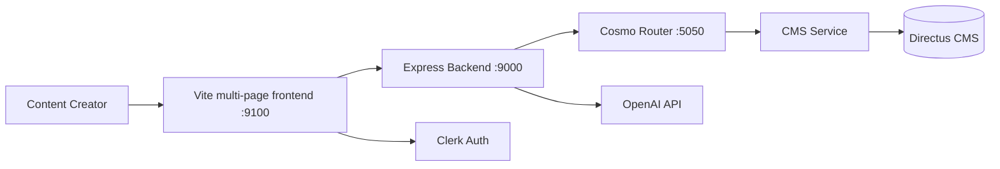

# Studio-Desk Service

## High-Level Summary (For PMs & Non-Engineers)

**Studio-Desk** is a specialized web application that empowers content creators to design job simulations and learning experiences. Think of it as a **visual design studio** where creators can:
- Build interactive job simulations step-by-step
- Use an AI copilot to brainstorm and refine content
- Manage simulation blueprints, attachments, and metadata
- Export designs for automated generation via Studio-Room

It's like a "Figma for job simulations" - a creative tool optimized for designing realistic work experiences.

## Technical Deep Dive (For Engineers)

### Service Overview

| Property | Value |
|:---------|:------|
| **Service Type** | Custom Application (Tier 2 - Studio Services) |
| **Technology Stack** | TypeScript, Vite, Express.js (vanilla TS frontend, no framework) |
| **Deployment** | Runs natively for dev (`npm run dev`), or containerized via the `studio-desk` docker-compose profile (`make up PROFILE=studio-desk`; ports 9000/9100, depends on graphql + cms) |
| **Port(s)** | 9100 (frontend), 9000 (backend) - configurable via `.env` |
| **Authentication** | Clerk |
| **Repository** | Local `studio-desk/` (sibling repo cloned by `make init`) |

### Architecture

Studio-Desk is a **full-stack TypeScript application** with:

1. **Frontend**: Vite-bundled vanilla TypeScript multi-page app (no React/Vue/Angular)
   - Hot Module Replacement (HMR) for rapid development
   - Clerk.js for authentication
   - GraphQL client for data fetching
   - Separate per-feature HTML entry points (`home.html`, `simulation-builder.html`, `sim-advanced-builder.html`, `sim-guided-builder.html`, `builder-skill-path.html`, `generation.html`, `catalog.html`, `academy.html`, `skills.html` — the prod set declared in `vite.config.ts` `rollupOptions.input`; `dev-accept.html` is dev-only), each loading `app/core/main.ts` which bootstraps Clerk auth + scaffold (header/sidemenu/footer) + the page module. **The simulation-builder family:** `simulation-builder` is the "Start Composer" (compose intent once; one seed feeds both builders) that fans out to `sim-advanced-builder` (the full designer) and `sim-guided-builder` (the interview flow); each has its own backend prompt dir under `src/prompts/`

2. **Backend**: Express.js API server
   - Clerk middleware for route protection
   - GraphQL integration with CMS service
   - Multi-provider AI integration (Azure OpenAI / OpenAI / Anthropic) for Studio Copilot
   - File upload handling


```mermaid
graph LR
    User[Content Creator] --> Frontend[Vite multi-page frontend :9100]
    Frontend --> Backend[Express Backend :9000]
    Backend --> GraphQL[Cosmo Router :5050]
    Backend --> OpenAI[OpenAI API]
    Frontend --> Clerk[Clerk Auth]
    GraphQL --> CMS[CMS Service]
    CMS --> Directus[(Directus CMS)]
```

### Project Structure

```
studio-desk/
├── src/                # Backend (Express.js)
│   ├── index.ts        # Server entry point
│   ├── routes/         # API routes
│   ├── services/       # Backend services
│   └── prompts/        # AI prompt templates
├── app/                # Frontend (Vite, vanilla TS)
│   ├── core/           # Core components & utilities (main.ts bootstrap)
│   ├── designer-sim/   # Simulation designer interface
│   ├── builder-skill-path/ # Skill Path Builder
│   ├── generation/     # Generation workflow UI
│   ├── listing/        # Catalog/listing UI
│   ├── academy/        # Academy UI
│   ├── home/           # Home page
│   ├── skills/         # Skills management UI
│   ├── shared/         # Shared frontend utilities
│   ├── services/       # Frontend services
│   │   ├── graphql/    # GraphQL queries/mutations
│   │   └── __generated__/ # graphql-codegen output
│   └── assets/         # Static assets
├── tests/              # Test suite
│   ├── frontend/       # Frontend tests
│   ├── unit/           # Backend unit tests
│   ├── integration/    # API integration tests
│   ├── e2e/            # Playwright e2e tests
│   └── utils/          # test mocks/helpers
├── dist/               # Build output
├── vite.config.ts      # Vite configuration
├── codegen.ts          # GraphQL code generation
└── package.json
```

### Key Features

#### 1. Simulation Builder
- Visual interface for designing job simulations
- Support for multiple simulation types (interviews, coding, prompt engineering)
- Document editing with rich text support
- Attachments management (files, images, documents)
- Custom criteria definition with AI assistance

#### 2. Skill Path Builder

A builder for learning skill paths, served at `/builder-skill-path` (`app/builder-skill-path` module). Backed by `/api/skillpath` (the largest backend route, ~61KB) and `/api/youtube`. Integrates directly with Directus (`DIRECTUS_BASE_URL` / `DIRECTUS_TOKEN`) and uses `directus_versions` for publish/unpublish snapshot & restore (capability checked at boot via `pingSnapshotCapability`). The skill-path **writes** (create/publish) go to Directus as a `Bearer ${DIRECTUS_TOKEN}` static token (`src/routes/skillpath.ts`). Curates videos from a Bunny CDN library (`BUNNY_LIBRARY_ID` / `BUNNY_LIBRARY_API_KEY`) and searches YouTube via the YouTube Data API v3 (`YOUTUBE_API_KEY` / `GCLOUD_SERVICE_ACCOUNT`) through a `YouTubePicker`.

> **Demo/dev set-dressing (v1.5 "prop room", M23):** on a `--local-content` stack (demo default; dev opt-in) studio-desk is pointed at the **per-stack Directus** (`DIRECTUS_BASE_URL=http://directus:8055`, the in-network compose service) with a **locally-minted static admin token** (`DIRECTUS_TOKEN=local-directus-token-<stack>`). The token is stamped on the bootstrapped admin via Directus's `ADMIN_TOKEN` bootstrap env (a Bearer-usable static token — `bootstrap/index.js:81` in the pinned `directus/directus:11.6.1`; #M23-D2), so studio-desk's skill-path **writes target the per-stack instance, never prod**. On a non-`--local-content` stack the prod token is stripped to empty (the prod-write **disarm**) and studio-desk has no local instance to write to. (The cms `PostMultipart` hardcoded-prod-upload-URL is a separate upstream **platform** bug — disarmed by the token strip, owned as a user PR; cannot be fixed without a platform edit.)

#### 3. Studio Copilot (AI Assistant)
- **Backend AI layer**: multi-provider chain (`AI_PROVIDER_CHAIN`, default `azure-openai,openai`) across Azure OpenAI / OpenAI / Anthropic with circuit-breaker failover (timed-out providers rotate to end of chain). Four model tiers (`thinking_slow`, `thinking_fast`, `fast`, `instant`); default tier configurable via `AI_DEFAULT_TIER` (`.env.example` uses `fast`; in-code fallback is `thinking_fast`). Tier defaults: OpenAI/Azure `gpt-5.2` / `gpt-5-mini` / `gpt-5-nano`; Anthropic `claude-opus-4-5` / `claude-sonnet-4-5` / `claude-haiku-4-5`.
- **Modes**: 
  - Ask/Brainstorming mode
  - Complex edits mode (with patch mechanism)
- **Features**:
  - Context-aware suggestions
  - Formatted replies in markdown
  - In-place follow-up actions
  - Multi-language support (7 languages)

#### 4. Generation Workflow
1. Design blueprint in Studio-Desk
2. Export blueprint with metadata
3. Studio-Room processes blueprint via AI pipeline
4. Generated content returns to CMS/Directus

### Data Layer

#### GraphQL Integration

Studio-Desk connects to the platform's GraphQL gateway (Cosmo Router) for data operations:

```typescript
// Example from app/services/graphql/
// Queries and mutations defined here (queries.ts, mutations.ts)
// Types auto-generated via graphql-codegen
```

**GraphQL Endpoint**: Configured via `VITE_GRAPHQL_ENDPOINT` (default: `http://localhost:5050/graphql`)

**Type Generation**:
```bash
npm run codegen  # Generates TypeScript types from GraphQL schema
```

Generated types are stored in `app/services/__generated__/` and provide type-safe GraphQL operations. GraphQL documents live in `app/services/graphql/` (`queries.ts`, `mutations.ts`).

#### Studio Entities

Studio-Desk works with these primary entities (stored via CMS → Directus):

- **StudioDocument**: Simulation blueprints and designs
- **StudioTask**: Generation tasks and statuses
- **Attachments**: Files, images, documents
- **Skills**: Associated skills and competencies

### Development Setup

#### Prerequisites
- Node.js v24+ (per `package.json` engines and `node:24-alpine` Docker base)
- npm v7+
- Clerk account (for authentication)
- Access to platform GraphQL endpoint (Cosmo Router running)
- Access to CMS service

#### Environment Configuration

Create `.env` file:

```bash
# Server (in-code fallback for PORT is 9100; set PORT=9000 to avoid a frontend/backend collision — .env required)
PORT=9000
FRONTEND_PORT=9100
NODE_ENV=development
CLERK_SECRET_KEY=sk_test_xxxxx
CLERK_SIGN_IN_URL=http://localhost:3000/login

# Frontend
VITE_CLERK_PUBLISHABLE_KEY=pk_test_xxxxx
VITE_GRAPHQL_ENDPOINT=http://localhost:5050/graphql
VITE_WEB_APP_URL=http://localhost:3000

# AI (for Copilot) — multi-provider chain
AI_PROVIDER_CHAIN=azure-openai,openai
AI_DEFAULT_TIER=fast
AI_OPENAI_API_KEY=sk-xxxxx   # or legacy OPENAI_KEY
AI_AZURE_ENDPOINT=...
AI_AZURE_KEY=...
AI_ANTHROPIC_API_KEY=sk-ant-...

# Skill Path Builder
DIRECTUS_BASE_URL=http://localhost:8055
DIRECTUS_TOKEN=...
BUNNY_LIBRARY_ID=...
BUNNY_LIBRARY_API_KEY=...
FORCE_READ_ONLY=0
YOUTUBE_API_KEY=...
GCLOUD_SERVICE_ACCOUNT=...
```

#### Local Development

1. **Install dependencies**:
```bash
cd studio-desk
npm install
```

2. **Generate GraphQL types** (when schema changes):
```bash
npm run codegen
```

3. **Start development servers**:
```bash
npm run dev
```

This starts:
- Frontend: `http://localhost:9100` (Vite dev server, configurable via `FRONTEND_PORT`)
- Backend: `http://localhost:9000` (Express API, configurable via `PORT`)

4. **Access the application**:
   - Development: `http://localhost:9100` (direct frontend access)
   - Backend API: `http://localhost:9000` (API server with `/api` routes)

#### Testing

```bash
# Run all tests (Jest runs two projects: backend + frontend)
npm test

# End-to-end (Playwright)
npm run test:e2e
npm run test:e2e:headed

# Type checking
npm run type-check

# Linting
npm run lint

# Type-check + lint combined
npm run check
```

### Production Build

```bash
# Build both frontend and backend
npm run build

# Start production server
npm start
```

Serves the app from `http://localhost:9000` (backend serves frontend static files, or configured via `PORT`).

### Deployment

Studio-Desk uses **conventional commits** and automated releases via [Cocogitto](https://github.com/cocogitto/cocogitto):

```bash
# Create new version
cog bump --auto

# Push to trigger Docker build
git push && git push --tags
```

Docker images are built automatically on tag push. Deployment managed via infrastructure repository.

### Integration Points

#### With Core Platform
- **Authentication**: Clerk (shared with main app)
- **Data Layer**: GraphQL → CMS → Directus
- **User Sync**: Optionally sync Clerk users to local DB via Tailscale funnel

#### With Studio-Room
- Studio-Desk **creates** simulation blueprints
- Studio-Room **consumes** those blueprints to generate final content
- Communication via shared CMS/Directus storage

### Troubleshooting

**GraphQL errors**: Ensure Cosmo Router (graphql) is running on port 5050:
```bash
cd platform
docker compose up -d graphql
```

**Clerk authentication issues**: Verify Clerk keys in `.env` and ensure sign-in URLs match.

**Local dev without real Clerk**: Set `MOCK_CLERK=true` (backend) and `VITE_MOCK_CLERK=true` (frontend) in `.env` to bypass Clerk auth — do not use in production. With real auth, all `/api/ai`, `/api/skillpath` and `/api/youtube` routes (and the builder/catalog/skills pages) require the Clerk user to belong to an organization AND hold a **Studio-eligible role**. The gate (`checkEnterpriseAndAdmin`, `src/index.ts`) reads `STUDIO_ACCESS_ROLES = ['admin', 'org:admin', 'content_creator', 'org:content_creator']` — so **content creators, not only org admins**, pass; both the bare and `org:`-prefixed key forms are accepted. Non-eligible or non-org users are redirected to `WEB_APP_URL`.

**Copilot not working**: Check that `AI_PROVIDER_CHAIN` is set and the corresponding provider key(s) exist (`AI_OPENAI_API_KEY`/`OPENAI_KEY`, `AI_AZURE_KEY`, or `AI_ANTHROPIC_API_KEY`).

### In a demo — the prod-eject fix + the "Back to Cockpit" item (v2.7 "july jitter" M249)

> _Authored here in M249; the studio spec docs are reconciled in the M247-tail._

Studio-Desk's scaffold hardcoded the production app host `https://app.anthropos.work` in **three** places —
the header **logo** link (`app/core/scaffold/pageWrapper.js`), the user-menu **"Back"** control and the
**logout** redirect (`app/core/scaffold/userProfile.js`). In a **demo**, clicking any of them **ejected the
presenter to production** (the studio prod-eject). M249 rewrites all three to read **this stack's app**
(`import.meta.env.VITE_WEB_APP_URL` — the same value `config.WEBAPP_URL` reads, already baked at the offset by
the demo build — with the original prod host kept as the `|| …` fallback, so the change is behaviour-identical
off-demo). The same lane **adds** a fail-closed **"Back to Cockpit"** item to the user menu, reading
`import.meta.env.VITE_COCKPIT_URL` (the per-stack presenter cockpit at `7700+OFFSET`).

These are the **FIRST-EVER studio-desk SOURCE demo-patches** — `studio-desk-back-to-cockpit` (chained with
`studio-desk-logout-url` on `userProfile.js`) + `studio-desk-logo-url` — image-baked into the demo's studio
image by a **net-new `build_frontend_studio_desk` patch ladder + patch-set fingerprint**. They touch only the
demo's ephemeral, gitignored clone; the canonical repo is never edited. `VITE_COCKPIT_URL` rides a
`.env.production.local` overlay (it is not a declared Dockerfile ARG — #M249-D3). Full mechanism:
[`demopatch-spec.md` §8 (additive-UI injection)](../ops/demo/demopatch-spec.md) and
[`frontend-tier.md`](../ops/demo/frontend-tier.md).

### Demo AI wiring — the container reads its OWN clone `.env` (v2.7 "july jitter" M252)

> _Authored here in M252 (docs lane C)._

**PM view.** In a demo, the studio's AI copilot / builder GENERATE returned a **500 on `POST /api/ai/completion`**
— the studio backend held **no AI-provider key**. M252 fixes it with one wire: the demo studio container now
**also reads studio-desk's own clone `.env`**, which carries the studio's AI-provider keys. The **auth model is
unchanged** — the demo studio stays the **Clerkenstein-authenticated hero** (a logged-in org-admin hero passes
the studio's `checkEnterpriseAndAdmin` gate); M252 touches **only** the AI-provider wiring.

**Engineer view — the base-compose root cause.** studio-desk is a **base-compose** service (declared in the
platform `docker-compose.yml`), so in a demo it inherits **only `platform/.env`** — the single centralized
platform env, which carries **no AI-provider keys** (those live in the studio-desk clone's own `.env`, per
Environment Configuration above). So the containerised backend booted with an empty provider chain and 500'd the
first `/api/ai/completion`.

**The fix (M252) — `env_file` only.** The studio-desk overlay in `stack-injection/gen_injected_override.py`
(`frontend_lines()`) now emits an **existence-guarded `env_file: ["<abs>/studio-desk/.env"]`** on the studio
service (the studio-desk clone is a sibling of `platform/`). That layers the clone's `.env` on top of the
inherited `platform/.env`, mounting the clone's own **`AI_OPENAI_API_KEY` + `AI_ANTHROPIC_API_KEY`** into the
container. **Compose precedence is preserved:** the explicit `environment:` block still wins (the Clerkenstein
`CLERK_*`, the stripped `DIRECTUS_TOKEN=""`, `NODE_ENV=production`), and `env_file` lists **concatenate** so the
clone's keys win over `platform/.env` — additive, not a clobber. **No provider-chain pin is needed:**
`aiService.getCompletion` loops **every** configured provider within one request, so even though `platform/.env`'s
azure is tried first (the legacy fallback), it fast-fails on its non-studio key and falls through to the clone's
real openai key in the **same** request — the `env_file` alone makes the builder work.

**Auth is unchanged — Clerkenstein, NOT `MOCK_CLERK`.** The M252 fix is deliberately **`env_file` only**: it adds
**no `MOCK_CLERK`** line. The demo studio authenticates through **Clerkenstein** exactly like every Go service —
under prod `NODE_ENV`, `clerkMiddleware()` 302s an *unauthenticated* browser into the fake-FAPI
`/v1/client/handshake` (a `__clerk_handshake` token verified **networklessly** via `CLERK_JWT_KEY`, the RS256
public key), then `requireAuth` + `checkEnterpriseAndAdmin` (which reads the fake-BAPI
`getOrganizationMembershipList` and requires an admin/content_creator org membership — the manager hero
qualifies). So a **logged-in org-admin hero reaches the studio**; a raw *unauthenticated* `curl` 302ing to
`/login` is that middleware behaving exactly as designed, **not** an unreachable studio. Adding `MOCK_CLERK=true`
would **regress** the "actual logged-in hero" demo to the legacy bypass and **fail** the pinned regression tests
(`stack-injection/gen_injected_override.py`'s `test_studio_desk_env_clerkenstein_no_mock_and_offset_sign_in` /
`test_studio_desk_block_shape_single_port_clerkenstein_wired`, which assert there is **no** `MOCK_CLERK` line in
the studio-desk block) — the auth model already worked; M252 only fixes the AI-provider wiring. The
Clerkenstein-authenticated studio surface is documented in
[`frontend-tier.md`](../ops/demo/frontend-tier.md) (the studio-desk block).

**DNA / verify.** The studio AI keys are already **DNA genes** — `studio-desk/AI_OPENAI_API_KEY` +
`AI_ANTHROPIC_API_KEY`, **required · standard** (warn, not waived; see
[`secrets-spec.md`](../ops/secrets-spec.md)). The `stack-secrets` DNA is **source-vs-DNA only** (no container
inspection). The new **container-side** proof — a **demo-aware, non-fatal, values-blind** assertion that the
studio-desk **container** actually carries a provider key — lives in the live-verify layer
(`stack-verify/live/autoverify.sh`), mirroring its existing directus `DB_CONNECTION_STRING` container check.

### Related Documentation
- [Service Taxonomy](../architecture/service_taxonomy.md) - Studio services overview
- [Studio-Room](./studio-room.md) - AI generation pipeline
- [CMS Service](./cms.md) - Data storage backend
- [External Services](../architecture/external_services.md) - Clerk and Directus details
- [demopatch-spec §8](../ops/demo/demopatch-spec.md) - the studio-desk source patches (additive-UI injection)
