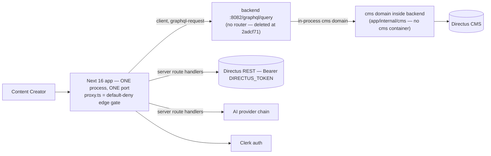

# Studio-Desk Service

## High-Level Summary (For PMs & Non-Engineers)

**Studio-Desk** is a specialized web application that empowers content creators to design job simulations and learning experiences. Think of it as a **visual design studio** where creators can:
- Build interactive job simulations step-by-step
- Use an AI copilot to brainstorm and refine content
- Manage simulation blueprints, attachments, and metadata
- Export designs for automated generation via Studio-Room

It's like a "Figma for job simulations" - a creative tool optimized for designing realistic work experiences.

## Technical Deep Dive (For Engineers)

> **⚠️ THIS DOCUMENT WAS REBUILT (2026-08-17) FOR THE NEXT MIGRATION, AND ALMOST NOTHING TECHNICAL
> SURVIVED.** studio-desk was a **vanilla-TS Vite MPA in front of an Express API**, two processes on
> two ports (9100 / 9000). It is now a **single Next.js 16 / React 19 process** with its API as route
> handlers in the same runtime, `output: 'standalone'`, one port.
>
> **⚠️ AND IT IS ON `main` NOW — merged 2026-08-23, PR #123, merge commit `2ddf2ee3`, 874 commits /
> 2,175 files.** This block used to end *"until it merges, `main` is still the old shape — so state
> which ref you mean"*. There is no longer a two-ref disagreement to state: `main` **IS** the migrated
> shape, `vite.config.ts` is gone from it and `next.config.ts` is there. The pre-merge branch tip was
> `release/3.2-full-frame` @ `411a3c15`, kept here only as provenance — do not send anyone to it, it
> is now BEHIND main. Everything below is measured against the migrated tree, which is to say against
> `main`.
>
> The claims this file used to make that are now **false**, listed once so a reader who half-remembers
> them stops: two ports · `VITE_*` env names · `npm run dev` / `npm start` / `npm run build` ·
> `dist/index.js` + `dist/public` + `dist/prompts` · `src/` · `vite.config.ts` · per-feature `*.html`
> entry points · `app/core/main.ts` bootstrap · a browser-side `canAccess()` auth gate ·
> `MOCK_CLERK` / `VITE_MOCK_CLERK` · Jest · the `/api/youtube` route.

### Service Overview

| Property | Value |
|:---------|:------|
| **Service Type** | Custom Application (Tier 2 - Studio Services) |
| **Technology Stack** | **Next.js 16 (App Router) + React 19 + TypeScript**, Node **≥ 24**. CSS Modules, Zustand (client state), TanStack Query (server state), `graphql-request`, MDX for academy guides. **No Vite, no Express, no second process.** |
| **Deployment** | **One container, one port.** `output: 'standalone'` (`next.config.ts:39`) → a multi-stage image whose runtime stage is `node:24-alpine` + `CMD ["node","server.js"]`, `EXPOSE 80`. **Measured 119.6 MB** (cold build 50 s on an arm64 Mac) — against **1.35 GB** for the pre-migration image after rext's M258 prune pass, so ~11× smaller. Terraform agrees on port 80 (`terraform/locals.tf:7`). |
| **Port(s)** | **ONE.** Container `PORT=80` by default, but the platform compose sets `PORT=9000` and Next's standalone server reads `process.env.PORT`, so a stack reaches it on **`9000 + N*OFFSET`**. Native dev server is **`9200`** (`package.json`, `next dev --port 9200`). **`9100` is dead** — it was the Vite dev port and never existed in the container, before or after. |
| **Authentication** | Clerk via **`@clerk/nextjs`** alone (`@clerk/clerk-js` and `@clerk/express` are gone). The gate is **edge middleware** at `proxy.ts`. |
| **Repository** | `studio-desk` (sibling repo cloned by `make init`; `repos.yml` `type: node-npm`) |

> **⚠️ `docker-compose.yml` in the platform repo has NOT been updated for this migration, and the
> failure is silent.** It passes `VITE_CLERK_PUBLISHABLE_KEY` / `VITE_GRAPHQL_ENDPOINT` /
> `VITE_ENVIRONMENT` as build args (`:96-98`); the migrated Dockerfile declares only `NEXT_PUBLIC_*`
> (`Dockerfile.dev:26-31`). Docker **accepts an undeclared build-arg without warning**, and a
> *declared-but-unpassed* ARG bakes **empty**. Measured end to end: the image **builds (rc=0)**,
> **starts**, reports **healthy**, and returns **HTTP 500 on every page**. The intersection of what
> compose passes and what the Dockerfile declares is `{VERSION}` — one of six.
>
> Rosetta does not edit the platform repo. Both stack paths inject the correct args instead — the
> demo path from its own rext-owned Dockerfile + `up-injected.sh`, the dev path from an
> rext-generated compose override (`stack-core/gen_override.py`) — see *Local Development* below.
>
> ⚠️ **The dev half of that was OPT-IN until 2026-08-23 and is now unconditional**, and the difference
> mattered the moment the migration merged. The override's studio-desk arm used to be gated on
> `--studio-src`: correct while the migrated tree lived on a branch (the default clone was the Vite
> app, which the base compose's `VITE_*` args served correctly), and *broken the instant `main`
> became the migrated tree* — a bare `dev-stack up N --profile all` then built the new app with the
> old args and produced exactly the healthy-and-500ing image described above. Getting correct build
> args is not a feature you opt into; `--studio-src` now means only what its name says, *build from a
> different tree*.

### Architecture

**One application.** `proxy.ts` (repo ROOT — Next 16's rename of `middleware.ts`; a copy under
`app/` is silently ignored and fails OPEN) gates every request and is **default-deny**. Only
`/api/health-check` is public, plus — dev-only — `/api/dev/login-as` and `/dev/accept`.

The auth gate **moved from the browser to the edge**, and that is the architectural change with the
widest blast radius. The old tree booted the page, instantiated Clerk, loaded the app, then asked
`canAccess()` — so an unauthorized user had already fetched and rendered everything before being
redirected. Now an unauthorized request never reaches a route. Two consequences worth stating:

- studio-desk **no longer calls the clerk-js FAPI** `GET /v1/me/organization_memberships`. It uses the
  server-side BAPI `getOrganizationMembershipList` (`proxy.ts:81-84`). The Clerkenstein route added
  for the old client path is no longer on studio-desk's critical path.
- The **empty-body / `.page-skeleton` first-paint model is gone.** `AppShell.tsx` server-renders the
  chrome; there is no `PageWrapper`, no three-blocking-`await` boot, and the skeleton CSS was deleted
  deliberately. The first-paint demo-patches that existed to fix that are moot (see *In a demo*).


```mermaid
graph LR
    User[Content Creator] --> Next["Next 16 app — ONE process, ONE port<br/>proxy.ts = default-deny edge gate"]
    Next -->|client, graphql-request| GraphQL["backend :8082/graphql/query<br/>(no router — deleted at 2adcf71)"]
    Next -->|server route handlers| DirectusREST[(Directus REST — Bearer DIRECTUS_TOKEN)]
    Next -->|server route handlers| AI[AI provider chain]
    Next --> Clerk[Clerk auth]
    GraphQL -->|in-process cms domain| CMS["cms domain inside backend<br/>(app/internal/cms — no cms container)"]
    CMS --> Directus[(Directus CMS)]
```

**GraphQL is 100% client-side** (`app/_lib/graphqlClient.ts` is `'use client'`); there is no
server-side GraphQL call and no GraphQL proxy. The **skill-path BFF is the opposite** — entirely
server-side route handlers talking to **Directus over REST**. Do not conflate the two data paths.

### Project Structure

```
studio-desk/
├── proxy.ts            # the edge auth gate (repo ROOT — not app/, not middleware.ts)
├── next.config.ts      # output:'standalone' + outputFileTracingIncludes for prompts/
├── codegen.ts          # reads the COMMITTED SDL; codegen.schema.ts refreshes that SDL
├── graphql/schema.graphql   # the committed SDL snapshot codegen reads (offline, no router)
├── prompts/            # 59 AI prompt templates, read at RUNTIME via fs (hence the tracing block)
├── public/             # served at the root: assets/, fontawesome/, avatars
├── app/
│   ├── (authed)/       # 13 page.tsx: home, catalog, skills, generation, academy, academy/[slug],
│   │                   #   simulation-builder, sim-advanced-builder, sim-guided-builder,
│   │                   #   builder-skill-path, boot, dev/accept
│   ├── api/            # 22 route.ts / 27 handlers: health-check, dev/login-as,
│   │                   #   ai/{completion,transcribe,triage}, skillpath/** (17)
│   │   ├── _ai/        #   provider chain + promptService
│   │   └── _lib/       #   text extraction, dev-login gate
│   ├── _shell/         # AppShell, Header, UserProfile, AppMenu, SearchDialog…
│   ├── _lib/           # graphqlClient, studioAccess, e2eAuth, serverAuth, externalUrls
│   ├── _components/ _l12n/ _mdx/ _providers/ _state/ _styles/
│   ├── services/       # graphql/ documents + __generated__/ (COMMITTED codegen output)
│   └── public/l12n/    # 7 dictionaries: de en es fr it ja nl
├── tests/next/         # vitest + RTL + Playwright (tests/next/e2e). ~6,900 tests
└── tools/              # kb-validate, bite-matrix, test-margin
```

⚠️ `prompts/` and `graphql/schema.graphql` are reached by **configuration, not by an import**, so no
import-graph check can see them and moving either fails only in a container.

### Key Features

Unchanged in intent — Simulation Builder (Start Composer → advanced / guided), **Skill Path Builder**,
Studio Copilot, and the generation workflow. What moved is where they live: each is a route segment
under `app/(authed)/` with its API as route handlers under `app/api/`.

**Skill Path Builder** is still the largest surface and still the one with real write power: 17
`/api/skillpath/*` handlers backed by **Directus REST** with a static admin token
(`DIRECTUS_BASE_URL` / `DIRECTUS_TOKEN`, `app/api/skillpath/_lib/directus.ts:45-49`), plus Bunny CDN
(`BUNNY_LIBRARY_ID` / `BUNNY_LIBRARY_API_KEY`). It uses `directus_versions` for publish/unpublish
snapshot & restore, and **probes that capability at BOOT** — a fact with a safety consequence, below.

> **⚠️ `/api/youtube` WAS DELETED** at the v3.2 close. `YOUTUBE_API_KEY` survives in `.env.example`
> with **no reader**. `GCLOUD_SERVICE_ACCOUNT` was removed from both `.env.example` and terraform.

### Data Layer

**GraphQL endpoint**: `NEXT_PUBLIC_GRAPHQL_ENDPOINT`, default **`http://localhost:8082/graphql/query`** —
`backend` directly. **Note the PATH moved with the host** (`/graphql` → `/graphql/query`), so a
host-only re-point 404s rather than refuses. *(The migration branch shipped a `:5050` default —
the deleted Cosmo router — because it forked before `main`'s `8f86d701` (#115); corrected 2026-08-17.)*

**Type generation**: `npm run codegen` reads the **committed** SDL at `graphql/schema.graphql`, so it
runs **offline and in CI with nothing up**. Output lands in `app/services/__generated__/` and is
**committed too**. To refresh the SDL from a live backend:
`GRAPHQL_SCHEMA_FOR_GEN=http://localhost:8082/graphql/query npm run codegen:schema`.

**No local datastore** — unchanged and still true. No DB driver, no `DATABASE_URL`. Persistence is
remote over HTTP: skill-path content → Directus; user studio preferences → the platform GraphQL API.

### Development Setup

#### Prerequisites
- **Node ≥ 24** (`engines`, `.nvmrc`, `node:24-alpine`, CI `setup-node 24`)
- A running `backend` on `8082 + N*OFFSET` for GraphQL (there is no router)
- Clerk keys — see the warning below

#### Environment Configuration

`.env.example` is the source of truth and contains **zero** `VITE_*` assignments. The split that
matters:

**BUILD-time** (inlined into the client bundle by `next build`; setting these on a running container
does **nothing**, and they are the Dockerfile's `ARG`s):

```bash
NEXT_PUBLIC_CLERK_PUBLISHABLE_KEY=pk_test_xxxxx
NEXT_PUBLIC_GRAPHQL_ENDPOINT=http://localhost:8082/graphql/query
NEXT_PUBLIC_CLERK_SIGN_IN_URL=http://localhost:3000/login
NEXT_PUBLIC_WEB_APP_URL=http://localhost:3000
NEXT_PUBLIC_ENVIRONMENT=development
# optional, both default to their production host (app/_lib/externalUrls.ts):
#   NEXT_PUBLIC_HIRING_APP_URL, NEXT_PUBLIC_DIRECTUS_ADMIN_URL
```

**RUNTIME** (read by node at request time):

```bash
CLERK_SECRET_KEY=sk_test_xxxxx     # REQUIRED — absent = 500 on every gated route
PORT=9200                          # container default 80; compose sets 9000
DEV_LOGIN_DEFAULT_EMAIL=           # dev-only sign-in helper
AI_PROVIDER_CHAIN=azure-openai,openai
AI_DEFAULT_TIER=fast
AI_OPENAI_API_KEY= / AI_AZURE_KEY= / AI_ANTHROPIC_API_KEY=
DIRECTUS_BASE_URL= / DIRECTUS_TOKEN= / FORCE_READ_ONLY=false
BUNNY_LIBRARY_ID= / BUNNY_LIBRARY_API_KEY=
```

> **⚠️ THE SILENT-FAILURE TRAP — read before debugging anything about this service.**
> `/api/health-check` is **public by design** (it is in `proxy.ts`'s `isPublicRoute`, because a
> healthcheck has no session and would otherwise redirect to sign-in and fail forever). That means it
> **cannot witness** either of the two ways this service is normally broken. Measured, both directions:
>
> | Fault | Symptom on every page | `/api/health-check` | Docker `HEALTHCHECK` |
> |---|---|---|---|
> | `CLERK_SECRET_KEY` absent at **runtime** | 500 `Missing secretKey` | **200** | **healthy** |
> | `NEXT_PUBLIC_CLERK_PUBLISHABLE_KEY` empty/invalid at **build** | 500 `Publishable key not valid` | **200** | **healthy** |
>
> **Never grade studio-desk on the health route alone.** Assert on a gated route: unauthenticated it
> must **307 to the sign-in URL**, not 500.

#### Local Development

```bash
cd stack-dev/studio-desk        # or a feature worktree
cp .env.example .env
npm ci
npm run dev:next                # next dev (Turbopack) on :9200 — ready in ~223 ms, hot reload
```

**On a Rosetta dev stack, use the tooling instead** — it wires the stack's own offset ports, injects
secrets from `platform/.env` without copying them to disk, and disarms production writes:

```bash
# NATIVE + hot reload (the authoring loop). N=0 is the main dev stack.
.agentspace/rosetta-extensions/dev-stack/studio-desk-dev.sh 0
.agentspace/rosetta-extensions/dev-stack/studio-desk-dev.sh 2 --src <worktree>   # run a BRANCH on dev-2
.agentspace/rosetta-extensions/dev-stack/studio-desk-dev.sh 0 --print            # resolve wiring, run nothing

# CONTAINERISED (parity; a stack you can hand to someone else)
dev-stack up N --profile all --studio-src <tree>
```

> **⚠️ NO DEV PATH STARTS STUDIO-DESK BY DEFAULT.** It lives in `profiles: [studio-desk, all]`, and
> both `make up` (`PROFILE ?= core`) and `dev-stack up N` (derived → `core`) exclude it.
> **`make up PROFILE=studio-desk` exits 1** — the profile selects `studio-desk` but not the `backend`
> it `depends_on`. Use `PROFILE=all`.

> **⚠️ THE PROD-WRITE HAZARD, and the disarm.** The skill-path BFF calls Directus with a **static
> admin token at BOOT** — starting the dev server against a stale `.env` immediately logs
> `[skillpath] Snapshot capability MISSING`, i.e. it has already called out. On a stack without
> `--local-content`, `platform/.env`'s `DIRECTUS_BASE_ADDR` is **`content.anthropos.work`** and
> `DIRECTUS_TOKEN` is a real write-capable token, so a dev studio can create, publish and archive
> **production** content. `studio-desk-dev.sh` strips the token and forces `FORCE_READ_ONLY=true`
> whenever no per-stack Directus is listening. If you wire this by hand, do the same.

**Signing in without fighting Google/2FA** (dev only, `NODE_ENV !== 'production'`):
`http://localhost:<port>/api/dev/login-as?email=you@anthropos.work` mints a Clerk sign-in token and
exchanges it for a **real session as that real user**. Set `DEV_LOGIN_DEFAULT_EMAIL` for the bare URL.
*(`MOCK_CLERK` / `VITE_MOCK_CLERK` are gone — nothing reads either name. The e2e path is the
`e2e_persona` cookie + `NEXT_PUBLIC_E2E_AUTH`, `app/_lib/e2eAuth.ts`.)*

**Studio access** is unchanged in policy: `STUDIO_ACCESS_ROLES = ['admin', 'org:admin',
'content_creator', 'org:content_creator']` (`app/_lib/studioAccess.ts`) — content creators, not only
org admins; both bare and `org:`-prefixed forms accepted. A signed-in user without a Studio role is
redirected to `NEXT_PUBLIC_WEB_APP_URL`.

#### Testing

```bash
npm run test:next          # vitest — ~6,900 tests across ~320 files
npm run test:e2e:next      # Playwright (playwright.next.config.ts) — persona-cookie auth
npm run check              # type-check + type-check:tests + lint:ci  (what CI gates on)
npm run docs               # kb-validate over knowledge/ — BLOCKS in CI
```

*(There is no Jest, no `npm test`, no `npm run test:e2e`. All three were deleted with the legacy tree.)*

### Production Build

```bash
npm run build:next     # next build -> .next/standalone
npm run start:next     # next start   (the CONTAINER runs `node server.js` instead)
```

The image copies three things into the runner: `.next/standalone`, `.next/static`, and `public/`.
**The last two are not optional** — `output: 'standalone'` does not emit them, nothing *imports* a
public asset so tracing cannot find them, and an image missing `public/` renders every FontAwesome
glyph as a 0 px blank while the container reports healthy. `Dockerfile` and `Dockerfile.dev` are
deliberately identical but for an npm cache mount, pinned by `tests/next/tools/standaloneOutput.test.ts`.

### Deployment

Conventional commits + Cocogitto (`cog bump --auto`), image built on tag push, deployed via the
infrastructure repo. CI passes `NEXT_PUBLIC_*` build args (`.github/workflows/build-production.yml:79-83`),
which is the consumer that **was** re-pointed at the new names — unlike the platform compose.

### Integration Points

#### With Core Platform
- **Authentication**: Clerk (shared with main app)
- **Data Layer**: GraphQL → the cms domain → Directus
- **No local datastore — studio-desk has no database of any kind.** `package.json` declares no DB
  driver (no `pg`/`postgres`/`prisma`/`sqlite`/`mysql`/`mongo`/`knex`/`drizzle`/`typeorm`/`sequelize`),
  and nothing in `src/` reads a `DATABASE_URL` or opens a pool/client. All persistence is remote over
  HTTP: skill-path content goes to **Directus** (`DIRECTUS_BASE_URL` / `DIRECTUS_TOKEN`,
  `src/routes/skillpath.ts`), and per-user studio preferences (including the recoverable draft window in
  `app/services/studioDB.js` — a facade, not a datastore) round-trip through the platform **GraphQL** API
  via `GET_USER_STUDIO_PREFERENCES` / `SET_USER_STUDIO_PREFERENCES`. There is no Clerk-user sync job.
  (The repo's only Tailscale-funnel mention is `app/core/main.ts:105` — the public ingest URL of the
  self-hosted **GlitchTip** Sentry endpoint. Error telemetry, unrelated to users or data.)

#### With Studio-Room
- Studio-Desk **creates** simulation blueprints
- Studio-Room **consumes** those blueprints to generate final content
- Communication via shared CMS/Directus storage

### Troubleshooting

**GraphQL errors**: Ensure **`backend`** is up on port 8082 (there is no router service locally any more):
```bash
cd platform
docker compose up -d backend   # NOT `graphql` — that service no longer exists (platform `2adcf71`);
                              # studio-desk talks to backend at :8082/graphql/query
```

**Every page returns HTTP 500 but the container is "healthy"**: this is the single most likely fault,
and it has exactly two causes — a missing **runtime** `CLERK_SECRET_KEY`, or an empty/invalid
**build-time** `NEXT_PUBLIC_CLERK_PUBLISHABLE_KEY`. See the trap table in *Environment Configuration*.
The second one **cannot be fixed on a running container** (Next inlines it); rebuild with the arg.
Check the container's logs for `Missing secretKey` vs `Publishable key not valid` — they name which.

**Clerk authentication issues**: Verify Clerk keys in `.env` and ensure sign-in URLs match. On a
Rosetta stack, `platform/.env` is the single source — provision it with **`/stack-secrets`**.

**Local dev without real Clerk**: use the dev-login helper
(`/api/dev/login-as?email=…`), which mints a real Clerk session — **not** `MOCK_CLERK`.

> **⚠️ `MOCK_CLERK` / `VITE_MOCK_CLERK` NO LONGER EXIST — nothing reads either name**, and the suites
> that set them were deleted with the Express server. The automated-test path is the `e2e_persona`
> cookie plus `NEXT_PUBLIC_E2E_AUTH=1` (`app/_lib/e2eAuth.ts`), which is double-gated on
> `NODE_ENV !== 'production'` so it cannot arm in a production build.

Authorization itself is unchanged in policy but has **moved to the edge**: the gate is `proxy.ts`, not
`checkEnterpriseAndAdmin` in `src/index.ts` (that file is deleted). It is **default-deny** — every
route except `/api/health-check` (and, in dev, `/api/dev/login-as` + `/dev/accept`) requires an
authenticated caller holding a Studio role. `STUDIO_ACCESS_ROLES = ['admin', 'org:admin',
'content_creator', 'org:content_creator']` (`app/_lib/studioAccess.ts`), so **content creators, not
only org admins**, pass; both bare and `org:`-prefixed forms are accepted. A signed-in user without a
Studio role is redirected to `NEXT_PUBLIC_WEB_APP_URL`; a signed-out one to
`NEXT_PUBLIC_CLERK_SIGN_IN_URL`.

**Copilot not working**: Check that `AI_PROVIDER_CHAIN` is set and the corresponding provider key(s) exist (`AI_OPENAI_API_KEY`/`OPENAI_KEY`, `AI_AZURE_KEY`, or `AI_ANTHROPIC_API_KEY`).

### In a demo — the prod-eject fix + the "Back to Cockpit" item (v2.7 "july jitter" M249)

> **⚠️ ALL FIVE studio-desk DEMO-PATCHES ARE DEAD AGAINST THE MIGRATED TREE, AND THE PROD-EJECT THEY
> FIXED CAME BACK.** They are sha-pinned to `app/core/main.ts`, `app/core/scaffold/userProfile.js` and
> `app/core/scaffold/pageWrapper.js` — `app/core/` **does not exist** after the migration. They do not
> "drift": `demopatch` classifies the target as *absent* and **refuses at G2** (non-fatal), so the
> image bakes unpatched and the log records a REFUSED line. The three URL literals reappeared verbatim
> in React (`_shell/UserProfile.tsx`, `_shell/Header.tsx`, `home/QuickActions.tsx`,
> `_components/SimCard/onAction.ts`), and `import.meta.env` — which every one of these patches read —
> resolves nowhere in a Next build.
>
> **The fix was re-landed IN SOURCE rather than re-pinned as patches** (2026-08-17): `app/_lib/externalUrls.ts`
> owns every off-Studio origin as `NEXT_PUBLIC_* || <prod host>`. Off a stack the value is byte-identical
> to the literal it replaced, so nothing changes in production or in CI; on a `dev-N`/`demo-N` the
> operator stays inside the stack. This is **strictly better than the patch approach**, because the
> patches only ever ran on a *demo* — a `dev-N` stack ejected to production either way.
>
> Still outstanding: the **"Back to Cockpit"** item was *additive UI*, not a URL swap, so it has no
> source equivalent yet. `NEXT_PUBLIC_COCKPIT_URL` would be the shape.
>
> _Authored here in M249; the studio spec docs are reconciled in the M247-tail. Kept below because the
> mechanism is still the reference example of additive-UI injection._

Studio-Desk's scaffold hardcoded the production app host `https://app.anthropos.work` in **three** places —
the header **logo** link (`app/core/scaffold/pageWrapper.js`), the user-menu **"Back"** control and the
**logout** redirect (`app/core/scaffold/userProfile.js`). In a **demo**, clicking any of them **ejected the
presenter to production** (the studio prod-eject). M249 rewrites all three to read **this stack's app**
(`import.meta.env.VITE_WEB_APP_URL` — the same value `config.WEBAPP_URL` reads, already baked at the offset by
the demo build — with the original prod host kept as the `|| …` fallback, so the change is behaviour-identical
off-demo). The same lane **adds** a fail-closed **"Back to Cockpit"** item to the user menu, reading
`import.meta.env.VITE_COCKPIT_URL` (the per-stack presenter cockpit at `7700+OFFSET`).

These are the **FIRST-EVER studio-desk SOURCE demo-patches** — `studio-desk-back-to-cockpit` (chained with
`studio-desk-logout-url` on `userProfile.js`) + `studio-desk-logo-url` — image-baked into the demo's studio
image by a **net-new `build_frontend_studio_desk` patch ladder + patch-set fingerprint**. They touch only the
demo's ephemeral, gitignored clone; the canonical repo is never edited. `VITE_COCKPIT_URL` rides a
`.env.production.local` overlay (it is not a declared Dockerfile ARG — #M249-D3). Full mechanism:
[`demopatch-spec.md` §8 (additive-UI injection)](../ops/demo/demopatch-spec.md) and
[`frontend-tier.md`](../ops/demo/frontend-tier.md).

### Demo AI wiring — the container reads its OWN clone `.env` (v2.7 "july jitter" M252)

> _Authored here in M252 (docs lane C)._

**PM view.** In a demo, the studio's AI copilot / builder GENERATE returned a **500 on `POST /api/ai/completion`**
— the studio backend held **no AI-provider key**. M252 fixes it with one wire: the demo studio container now
**also reads studio-desk's own clone `.env`**, which carries the studio's AI-provider keys. The **auth model is
unchanged** — the demo studio stays the **Clerkenstein-authenticated hero** (a logged-in org-admin hero passes
the studio's `checkEnterpriseAndAdmin` gate); M252 touches **only** the AI-provider wiring.

**Engineer view — the base-compose root cause.** studio-desk is a **base-compose** service (declared in the
platform `docker-compose.yml`), so in a demo it inherits **only `platform/.env`** — the single centralized
platform env, which carries **no AI-provider keys** (those live in the studio-desk clone's own `.env`, per
Environment Configuration above). So the containerised backend booted with an empty provider chain and 500'd the
first `/api/ai/completion`.

**The fix (M252) — `env_file` only.** The studio-desk overlay in `stack-injection/gen_injected_override.py`
(`frontend_lines()`) now emits an **existence-guarded `env_file: ["<abs>/studio-desk/.env"]`** on the studio
service (the studio-desk clone is a sibling of `platform/`). That layers the clone's `.env` on top of the
inherited `platform/.env`, mounting the clone's own **`AI_OPENAI_API_KEY` + `AI_ANTHROPIC_API_KEY`** into the
container. **Compose precedence is preserved:** the explicit `environment:` block still wins (the Clerkenstein
`CLERK_*`, the stripped `DIRECTUS_TOKEN=""`, `NODE_ENV=production`), and `env_file` lists **concatenate** so the
clone's keys win over `platform/.env` — additive, not a clobber. **No provider-chain pin is needed:**
`aiService.getCompletion` loops **every** configured provider within one request, so even though `platform/.env`'s
azure is tried first (the legacy fallback), it fast-fails on its non-studio key and falls through to the clone's
real openai key in the **same** request — the `env_file` alone makes the builder work.

**Auth is unchanged — Clerkenstein, NOT `MOCK_CLERK`.** The M252 fix is deliberately **`env_file` only**: it adds
**no `MOCK_CLERK`** line. The demo studio authenticates through **Clerkenstein** exactly like every Go service —
under prod `NODE_ENV`, `clerkMiddleware()` 302s an *unauthenticated* browser into the fake-FAPI
`/v1/client/handshake` (a `__clerk_handshake` token verified **networklessly** via `CLERK_JWT_KEY`, the RS256
public key), then `requireAuth` + `checkEnterpriseAndAdmin` (which reads the fake-BAPI
`getOrganizationMembershipList` and requires an admin/content_creator org membership — the manager hero
qualifies). So a **logged-in org-admin hero reaches the studio**; a raw *unauthenticated* `curl` 302ing to
`/login` is that middleware behaving exactly as designed, **not** an unreachable studio. Adding `MOCK_CLERK=true`
would **regress** the "actual logged-in hero" demo to the legacy bypass and **fail** the pinned regression tests
(`stack-injection/gen_injected_override.py`'s `test_studio_desk_env_clerkenstein_no_mock_and_offset_sign_in` /
`test_studio_desk_block_shape_single_port_clerkenstein_wired`, which assert there is **no** `MOCK_CLERK` line in
the studio-desk block) — the auth model already worked; M252 only fixes the AI-provider wiring. The
Clerkenstein-authenticated studio surface is documented in
[`frontend-tier.md`](../ops/demo/frontend-tier.md) (the studio-desk block).

**DNA / verify.** The studio AI keys are already **DNA genes** — `studio-desk/AI_OPENAI_API_KEY` +
`AI_ANTHROPIC_API_KEY`, **required · standard** (warn, not waived; see
[`secrets-spec.md`](../ops/secrets-spec.md)). The `stack-secrets` DNA is **source-vs-DNA only** (no container
inspection). The new **container-side** proof — a **demo-aware, non-fatal, values-blind** assertion that the
studio-desk **container** actually carries a provider key — lives in the live-verify layer
(`stack-verify/live/autoverify.sh`), mirroring its existing directus `DB_CONNECTION_STRING` container check.

### The MPA / empty-body boot model — and the demo first-paint reorder (v2.7 "july jitter" M253)

> **⚠️ SUPERSEDED BY THE MIGRATION — the model this section describes no longer exists.** There is no
> empty `<body>`, no `core/main.ts`, no `PageWrapper`, and no three-blocking-`await` boot:
> `AppShell.tsx` **server-renders** the chrome, so the shell is in the first HTML response. The
> `.page-skeleton` / `.skeleton-header` / `.skeleton-sidemenu` CSS was **deleted deliberately**, which
> means `studio-desk-shell-first-paint` has nothing to inject and the `run-studio-fcp.sh` gate can
> never observe a skeleton — it would assert `reachedShell === true` against a page that never has one.
> The `canAccess` FAPI leg is gone too: the gate is server-side in `proxy.ts` and uses the **BAPI**.
>
> The measured numbers below (skeleton-visible p95 4669 ms → 817 ms) are **historical**: they describe
> the pre-migration SPA. A fresh first-paint budget has not been measured against the Next tree.
> Retained because the *reasoning* — paint ordering vs render speed, and "code-splitting does not fix a
> runtime-await cost" — is the transferable part.

studio-desk is **not** an SSR React app. It is an **empty-body multi-page app** (one HTML entry per feature —
`home.html`, the builders, `catalog.html`, …), and **every page's `<body>` starts empty**. `core/main.ts`
(imported by each page's entry) builds the **entire visible shell** — the header, the sidemenu, the content
frame — inside `new PageWrapper()`. Crucially, `PageWrapper` runs **only after three sequential blocking
`await`s** in `initializeApp()`:

```
preloadCriticalCSS()            // L97 — injects the .page-skeleton CSS (classes only, no DOM)
  → Sentry.init / posthog.init  // (production-gated / non-localhost-gated)
  → await clerk.load()          // ~140 ms vs Clerkenstein (NOT its 10 s timeout)
  → await l12nService.init()    // ~12 ms
  → await userService.canAccess()  // ~3.9 s on the demo — a Clerk FAPI 404 → 3-attempt retry ladder
  → new PageWrapper()           // L206 — builds the skeleton DOM + the real shell, only NOW
```

So the multi-second blank a presenter saw on a demo was **not** a slow render — it was **paint ordering**: the
shell is built *behind* the awaits, and the dominant await (`canAccess`) 404s and burns ~3.9 s retrying. **This
is NOT a dev-vs-prod build issue** (the demo already serves a production build) and **code-splitting does not
fix it** (the cost is the runtime awaits, not the bundle size).

**The M253 fix (demo only, zero platform edits):** two sha-pinned demopatches on the M249
`build_frontend_studio_desk` ladder —

- **`studio-desk-shell-first-paint`** injects the `.page-skeleton` DOM (header + sidemenu + content)
  **synchronously right after `preloadCriticalCSS()`**, *before* any await, so the dark shell paints from
  **CSS+DOM with zero network**. It is **auth-independent** (it paints before `canAccess`), and **de-dups
  automatically**: `PageWrapper#init` wipes `document.body.innerHTML` and rebuilds its own skeleton, so the
  early shell is seamlessly replaced — no double skeleton.
- **`studio-desk-no-thirdparty`** no-ops `Sentry.init` + `posthog.init` on the demo host (no reachable
  GlitchTip / no PostHog project on a Clerk-free demo).

Result on demo-2 (local laptop): **skeleton-visible p95 4669 ms → 817 ms** (5/5 cold loads, gate < 1000 ms).
Measured by the net-new `rext stack-verify/e2e/run-studio-fcp.sh`. Full budget + per-leg model:
[`latency-budget.md` §"studio-desk first-paint budget"](../ops/demo/latency-budget.md); the patch mechanism:
[`demopatch-spec.md` §5](../ops/demo/demopatch-spec.md).

**And the `canAccess` 404 itself — fixed at the source (`fix/studio`, 2026-07-27).** M253 painted the shell
*over* the 4 s wait; it did not remove it, and the skeleton gate was **blind** to the remaining 4.8 s
time-to-usable gap. The 404 was never GraphQL: `canAccess()` calls
`clerk.user.getOrganizationMemberships()`, so **clerk-js** requests the Clerk **FAPI** route
`GET /v1/me/organization_memberships` — which **Clerkenstein had never registered** (only the BAPI's
server-side `/v1/users/{userID}/organization_memberships` existed). Serving it in the paginated envelope
clerk-js destructures cuts the `canAccess` leg **4049 → 38 ms** and browser FCP **6936 → 2152 ms** (billion,
tailnet, `dan-manager`, cold). Note this also makes the client gate **enforce** instead of failing open
(`catch → return true`) — no reachable outcome changes, because the **server-side** `checkEnterpriseAndAdmin`
already 303s non-admin seats to the web app first. Detail + the measured table:
[`latency-budget.md` §"Time-to-usable"](../ops/demo/latency-budget.md); the route:
[`clerkenstein.md`](clerkenstein.md).

### Related Documentation
- [Service Taxonomy](../architecture/service_taxonomy.md) - Studio services overview
- [Studio-Room](./studio-room.md) - AI generation pipeline
- [CMS](./cms.md) - the content layer, merged into `backend` as `app/internal/cms`
- [External Services](../architecture/external_services.md) - Clerk and Directus details
- [demopatch-spec §8](../ops/demo/demopatch-spec.md) - the studio-desk source patches (additive-UI injection)
