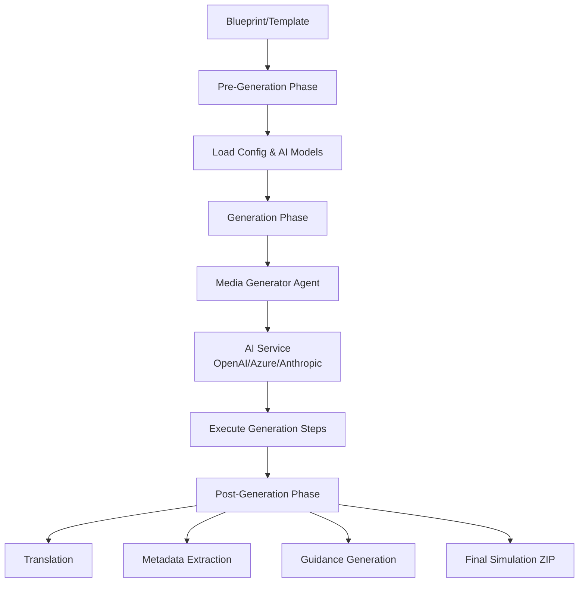

# Studio-Room Service

## High-Level Summary (For PMs & Non-Engineers)

**Studio-Room** is an AI-powered content generation engine that transforms simulation blueprints into fully-realized interactive experiences. Think of it as the **manufacturing floor** where designs from Studio-Desk become actual products.

**What it does**:
- Takes a simulation blueprint (created in Studio-Desk)
- Uses advanced AI models (GPT, Claude) to generate realistic content
- Produces complete job simulations with dialogue, scenarios, and assessments
- Handles translation, metadata, and quality control automatically

It's completely automated - you provide a template or blueprint, and Studio-Room orchestrates the entire generation pipeline.

## Technical Deep Dive (For Engineers)

### Service Overview

| Property | Value |
|:---------|:------|
| **Service Type** | Custom Application (Tier 2 - Studio Services) |
| **Technology Stack** | Python 3.x, asyncio |
| **Deployment** | Standalone CLI/pipeline (on-demand execution) |
| **AI Providers** | OpenAI, Azure OpenAI, Anthropic |
| **Repository** | Local `studio/studio-room/` |

### Architecture

Studio-Room is a **Python-based asynchronous generation pipeline** with a modular agent system:



### Project Structure

```
studio-room/
├── gen.py              # Main generation script
├── postgen.py          # Post-generation pipeline
├── console.py          # CLI output formatting
├── format.py           # File formatting utilities
├── agents/             # Media generator agents
│   ├── simulation.py   # Simulation generator
│   ├── article.py      # Article generator
│   └── role.py         # Role generator
├── services/           # Core services
│   └── ai.py           # AI service abstraction
├── templates/          # Generation templates
├── configs/            # Environment configs
│   ├── local_config.ini
│   └── production_config.ini
├── tools/              # Utility scripts
├── workspace/          # Generation workspace
├── worklog/            # Generation state files
├── postgen/            # Post-processed output
└── published/          # Final published files
```

### Generation Pipeline

#### Phase 1: Pre-Generation

1. **Configuration Loading**:
   - Read environment-specific config (`configs/{environment}_config.ini`)
   - Load AI model configurations (stable vs experimental branch)
   - Load generation template

2. **State Management**:
   - Check for existing generation state (resume support)
   - Initialize or restore generation context
   - Create workspace directories

3. **AI Setup**:
   - Initialize AI services (OpenAI, Azure, Anthropic)
   - Configure model parameters (temperature, max tokens, thinking mode)
   - Set up usage tracking

#### Phase 2: AI Generation

The generation is orchestrated by **media-specific generator agents** (e.g., `SimulationGenerator`). Each agent defines a sequence of **execution steps**:

```python
# Example step from agents/simulation.py
@gen_instruction(
    phase="content",
    title="Generate Dialogue",
    brief="Creating realistic job conversations",
    exec_mode=GenMode.CREATIVE  # Uses creative AI model
)
async def generate_dialogue(engine, render, request):
    # Step implementation
    # - Uses AI service
    # - Updates request state
    # - Renders progress
    pass
```

**Generation Modes**:
- `GenMode.CREATIVE`: For content requiring creativity (dialogue, scenarios)
- `GenMode.ANALYTICAL`: For structured content (assessments, metadata)

**Features**:
- **Async execution**: Steps run asynchronously for performance
- **Retry mechanism**: Auto-retry failed steps (configurable `max_retries`)
- **State persistence**: Save progress after each step (resume on failure)
- **Usage tracking**: Monitor AI token usage and costs

#### Phase 3: Post-Generation

Post-generation is modularized with multiple targets:

```bash
python postgen.py --simid <id> --target translation,metadata,guidance
```

**Post-Generation Targets**:

| Target | Purpose | Output |
|:-------|:--------|:-------|
| `translation` | Translate to multiple languages | Localized versions |
| `metadata` | Extract structured metadata | JSON metadata file |
| `guidance` | Generate instructor guidance | Guidance documents |
| `packaging` | Create final ZIP bundle | Publishable artifact |

All targets can run independently or in pipeline mode.

### Command-Line Interface

#### Main Generation

```bash
python gen.py [OPTIONS]

Options:
  -m, --media TYPE          Media type (simulation, article, role)
  -t, --template NAME       Template name (from templates/)
  --simid ID                Simulation ID (auto-generated if not provided)
  --branch BRANCH           stable or experimental AI models
  -f, --force               Force regeneration from scratch
  -i, --interactive         Enable interactive mode
  --pipeline PIPELINE       Generation pipeline (default: linear)
  --prompt TEXT             Custom prompt text
  --annotations JSON        Custom annotations
  --postgen TARGETS         Comma-separated post-gen targets
```

#### Examples

**Generate simulation from template**:
```bash
python gen.py --media simulation --template customer_service
```

**Force regeneration with experimental models**:
```bash
python gen.py --media simulation --template interview --branch experimental --force
```

**Custom prompt with specific post-gen targets**:
```bash
python gen.py \
  --media simulation \
  --prompt "Create a software engineering interview" \
  --postgen "translation,metadata" \
  --branch stable
```

### AI Service Configuration

AI models are configured per generation mode in `configs/{env}_config.ini`:

```ini
[SERVICES]
# Format: service, model, thinking_mode
creative_ai_stable_model = openai, gpt-4o, none
creative_ai_experimental_model = openai, gpt-5.1, extended
analytical_ai_stable_model = anthropic, claude-3-opus, none
analytical_ai_experimental_model = openai, gpt-5.2, extended

# API Keys (or set via env vars)
openai_api_key = ${OPENAI_API_KEY}
openai_endpoint = https://api.openai.com/v1
anthropic_api_key = ${ANTHROPIC_API_KEY}
azure_api_key = ${AZURE_API_KEY}
azure_endpoint = ${AZURE_ENDPOINT}

max_tokens = 4096
```

**Thinking Modes**:
- `none`: Standard generation
- `extended`: Enable chain-of-thought reasoning (for supported models)

### Templates

Templates define preset configurations for common simulation types:

```
templates/
├── simulations/
│   ├── customer_service.json
│   ├── software_interview.json
│   └── sales_pitch.json
├── articles/
│   └── technical_guide.json
└── roles/
    └── product_manager.json
```

**Template Structure**:
```json
{
  "type": "Job Interview",
  "domain": "Software Engineering",
  "difficulty": "intermediate",
  "duration_minutes": 45,
  "parameters": {
    "num_rounds": 3,
    "focus_areas": ["algorithms", "system design"]
  }
}
```

### State Management & Resume

Generation state is saved to `worklog/{simid}.json` after each step:

```json
{
  "simid": "uuid-here",
  "executed_step": 5,
  "media": "simulation",
  "type": "Job Interview",
  "usage": {
    "total_tokens": 12580,
    "total_cost": 0.52
  }
}
```

**Resume generation**:
```bash
# Automatically resumes from last completed step
python gen.py --simid <uuid>

# Force restart
python gen.py --simid <uuid> --force
```

### Development Setup

#### Prerequisites
- Python 3.8+
- AI API keys (OpenAI, Anthropic, or Azure)

#### Installation

```bash
cd studio/studio-room
pip install -r requirements.txt
```

**Requirements**:
```
openai>=1.0.0
anthropic>=0.18.0
aiohttp
asyncio
```

#### Configuration

1. **Set environment**:
```bash
export ENVIRONMENT=local  # or production
```

2. **Configure AI services** in `configs/local_config.ini`

3. **Set API keys** (via environment or config):
```bash
export OPENAI_API_KEY=sk-xxxxx
export ANTHROPIC_API_KEY=sk-ant-xxxxx
```

#### Testing

```bash
# Test generation with simple template
python gen.py --media simulation --template default --branch stable

# Check console output for step-by-step progress
# Verify output in workspace/, postgen/, published/
```

### Integration Points

#### With Studio-Desk
- **Input**: Blueprints created in Studio-Desk (via CMS/Directus)
- **Output**: Generated content stored back to CMS/Directus
- **Workflow**: Desk designs → Room generates → CMS stores

#### With CMS Service
- Fetch simulation blueprints via GraphQL/REST
- Store generated content and metadata
- Update task status during generation

### Output Structure

**Generated artifacts**:

```
workspace/{simid}/           # Working directory
├── simulation.json          # Core simulation data
├── dialogue.json            # Generated conversations
├── scenarios.json           # Simulation scenarios
└── attachments/             # Generated files

postgen/{simid}/             # Post-processed
├── simulation_bundle.zip    # Final package
├── metadata.json            # Extracted metadata
├── translations/            # Localized versions
│   ├── en.json
│   ├── es.json
│   └── fr.json
└── guidance.md              # Instructor guidance

published/{simid}/           # Ready for deployment
└── simulation_final.zip
```

### Monitoring & Debugging

**Usage Tracking**:
```python
from services.ai import usage

# Automatic tracking per step
usage.checkpoint()  # Save current usage
report = usage.get_report()  # Get usage statistics
```

**Console Output**:
```bash
# Formatted progress output with:
# - Current phase and step
# - AI model being used
# - Token usage and costs
# - Success/error status
```

**Error Handling**:
- Automatic retry on transient failures
- State persistence allows manual resume
- Detailed error logging to console

### Performance Optimization

**Async Execution**:
- Generation steps run asynchronously where possible
- Parallel API calls for independent tasks
- Efficient token usage via batching

**Caching**:
- Template caching for repeated generations
- AI response caching (future enhancement)

### Related Documentation
- [Service Taxonomy](../architecture/service_taxonomy.md) - Studio services overview
- [Studio-Desk](./studio-desk.md) - Design tool that creates blueprints
- [CMS Service](./cms.md) - Content storage integration
- [External Services](../architecture/external_services.md) - AI provider details
