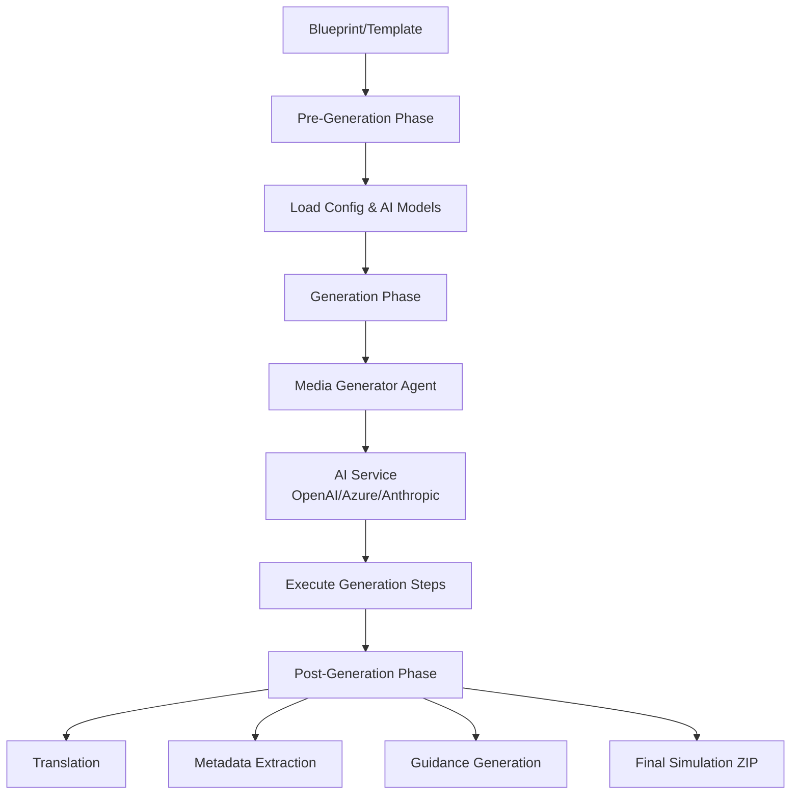

# Studio-Room Service

## High-Level Summary (For PMs & Non-Engineers)

**Studio-Room** is an AI-powered content generation engine that transforms simulation blueprints into fully-realized interactive experiences. Think of it as the **manufacturing floor** where designs from Studio-Desk become actual products.

**What it does**:
- Takes a simulation blueprint (created in Studio-Desk)
- Uses advanced AI models (GPT, Claude) to generate realistic content
- Produces complete job simulations with dialogue, scenarios, and assessments
- Handles translation, metadata, and quality control automatically

It's completely automated - you provide a template or blueprint, and Studio-Room orchestrates the entire generation pipeline.

Studio-Room does not run as its own deployment. It is embedded inside the **CMS container** (at `cms/studio/`) and is triggered by a CMS Asynq task rather than run directly by users — the CMS service shells out to it as a subprocess when a generation job is enqueued.

## Technical Deep Dive (For Engineers)

### Service Overview

| Property | Value |
|:---------|:------|
| **Service Type** | Custom Application (Tier 2 - Studio Services) |
| **Technology Stack** | Python 3.x, asyncio |
| **Deployment** | Embedded in the CMS container (`cms/studio/`) — invoked synchronously as a Python subprocess (`python3 studio/gen.py`) by the CMS Asynq worker (StudioQueue, concurrency 3); not a standalone deployment |
| **AI Providers** | OpenAI, Azure OpenAI, Anthropic |
| **Repository** | Cloned into the CMS repo at `cms/studio/` (repo: `anthropos-studio-room`) |

### Architecture

Studio-Room is a **Python-based asynchronous generation pipeline** with a modular agent system:



### Project Structure

```
studio-room/
├── gen.py              # Main generation script
├── postgen.py          # Post-generation pipeline
├── console.py          # CLI output formatting
├── format.py           # File formatting utilities
├── errors.py           # Error types
├── cert.py             # Certificate / signing helpers
├── agents/             # Media generator agents
│   └── simulation/     # Simulation generator package
│       ├── prep.py
│       ├── story.py
│       ├── assets.py
│       ├── export.py
│       ├── guidelines.py
│       ├── model.py
│       ├── postgen/
│       └── validation/
├── services/           # Core services
│   ├── ai.py           # AI service abstraction
│   ├── taxonomy.py     # Skills taxonomy client
│   └── usage_trace.py  # AI usage / cost tracking
├── configs/            # Environment configs
│   ├── local_config.ini
│   └── production_config.ini
├── benchmark/          # Benchmark suites
├── knowledge/          # Knowledge / reference data
└── workspace/          # Generation workspace
    ├── attachments/    # Input/blueprint files
    ├── trace/          # Generation state files (worklog_path)
    ├── postgen/        # Post-processed output
    └── published/      # Final published files
```

### Generation Pipeline

#### Phase 1: Pre-Generation

1. **Configuration Loading**:
   - Read environment-specific config (`configs/{environment}_config.ini`)
   - Load AI model configurations (stable vs experimental branch)
   - Load generation template

2. **State Management**:
   - Check for existing generation state (resume support)
   - Initialize or restore generation context
   - Create workspace directories

3. **AI Setup**:
   - Initialize AI services (OpenAI, Azure, Anthropic)
   - Configure model parameters (temperature, max tokens, thinking mode)
   - Set up usage tracking

#### Phase 2: AI Generation

The generation is orchestrated by **media-specific generator agents** (e.g., `SimulationGenerator`). Each agent defines a sequence of **execution steps**:

```python
# Example step from agents/simulation/
@generation_step(
    phase="content",
    title="Generate Cast",
    brief="Creating realistic job conversations",
    exec_mode=GenMode.EXECUTION  # Selects the AI model for this step
)
async def generate_cast(engine, log, request):
    # Step implementation
    # - Uses AI service
    # - Updates request state
    # - Logs progress
    pass
```

The `@generation_step(...)` decorator attaches a `gen_instruction` metadata dict to the function. Steps may be sync or async — `gen.py` awaits the result if it is awaitable.

**Generation Modes** (`GenMode` enum):
- `GenMode.FAST`: Lightweight / low-latency steps
- `GenMode.STRICT`: Tightly-constrained, deterministic output
- `GenMode.EXECUTION`: Default mode (`DEFAULT = EXECUTION`)
- `GenMode.CREATIVE`: For content requiring creativity (dialogue, scenarios)
- `GenMode.REASONING`: For steps that benefit from deeper reasoning

**Features**:
- **Async execution**: Steps run asynchronously for performance
- **Retry mechanism**: Auto-retry failed steps (configurable `max_retries`)
- **State persistence**: Save progress after each step (resume on failure)
- **Usage tracking**: Monitor AI token usage and costs

#### Phase 3: Post-Generation

Post-generation is modularized with multiple targets:

```bash
python postgen.py --media simulation --simid <id> --target guidance,metadata,translation --branch stable
```

`--media`, `--simid`, and `--target` are all required for `postgen.py`.

**Post-Generation Targets**:

| Target | Purpose | Output |
|:-------|:--------|:-------|
| `guidance` | Generate instructor guidance | Guidance documents |
| `metadata` | Extract structured metadata | JSON metadata file |
| `translation` | Translate to multiple languages | Localized versions |
| `toolkit` | Build the simulation toolkit | Toolkit artifacts |

A `testing` phase module also exists. ZIP packaging/export is **not** a selectable post-gen target — it is performed by the exporter (the `export` step in the simulation agent).

All targets can run independently or in pipeline mode.

### Command-Line Interface

#### Main Generation

```bash
python gen.py [OPTIONS]

Options:
  -m, --media TYPE          Media type (simulation; article is registered but secondary)
  -t, --template NAME       Template name
  --simid ID                Simulation ID (auto-generated if not provided)
  --branch BRANCH           stable or experimental AI models
  -f, --force               Force regeneration from scratch
  -i, --interactive         Enable interactive mode
  --pipeline PIPELINE       Generation pipeline (default: linear)
  --prompt TEXT             Custom prompt text
  --annotations JSON        Custom annotations
  --blueprint FILE          JSON blueprint file in workspace/attachments/
                            (mutually exclusive with content params like --prompt/--annotations)
  --evaluation_skills "a, b"  Pass-through content parameter (consumed by prep)
```

#### Examples

**Generate simulation from template**:
```bash
python gen.py --media simulation --template customer_service
```

**Force regeneration with experimental models**:
```bash
python gen.py --media simulation --template interview --branch experimental --force
```

**Custom prompt generation**:
```bash
python gen.py \
  --media simulation \
  --prompt "Create a software engineering interview" \
  --branch stable
```

### AI Service Configuration

AI models are configured per generation mode in `configs/{env}_config.ini`. Each model key follows the pattern `{MODE}_AI_{BRANCH}_MODEL = service, model, thinking`:

```ini
[SERVICES]
# Format: {MODE}_AI_{BRANCH}_MODEL = service, model, thinking
FAST_AI_STABLE_MODEL = azure, gpt-5-mini, none
EXECUTION_AI_STABLE_MODEL = azure, gpt-5.4, none
CREATIVE_AI_STABLE_MODEL = azure, gpt-5.4, low
REASONING_AI_STABLE_MODEL = azure, gpt-5.4, medium

# API keys + endpoints (literal values, or override via matching env vars)
AZURE_API_KEY = <literal-key>
AZURE_ENDPOINT = <endpoint-url>
OPENAI_API_KEY = <literal-key>
ANTHROPIC_API_KEY = <literal-key>

max_tokens = 4096
```

API keys can be set EITHER as literal values in `configs/{env}_config.ini` under `[SERVICES]` (key names `AZURE_API_KEY` / `OPENAI_API_KEY` / `ANTHROPIC_API_KEY`, plus matching `*_ENDPOINT`), OR via the matching environment variables (`AZURE_API_KEY`, `OPENAI_API_KEY`, `ANTHROPIC_API_KEY`, `*_ENDPOINT`). When the env var is set, it overrides the INI value at load time (`gen.py` `load_services_settings`). `configparser` does **not** expand `${VAR}` from the OS environment, so the override is handled in code rather than via interpolation. Note `configs/local_*` and `configs/test_*` are gitignored — never commit real keys to tracked configs.

**Thinking Modes** (only for supported models):
- `none`
- `low`
- `medium`
- `high`

### Templates

Templates define preset configurations for common simulation types. (There is no standalone top-level `templates/` directory in the repo.)

**Template Structure**:
```json
{
  "type": "Job Interview",
  "domain": "Software Engineering",
  "difficulty": "intermediate",
  "duration_minutes": 45,
  "parameters": {
    "num_rounds": 3,
    "focus_areas": ["algorithms", "system design"]
  }
}
```

### State Management & Resume

Generation state is checkpointed after each step to the configured `worklog_path` (set to `workspace/trace/` in the shipped configs; the in-code fallback is a literal `worklog/` only if unset). State is written as two files per sim:

- `{simid}_pre_generation.json` — the original request
- `{simid}_task_state.json` — the public task state

plus a per-run `{simid}_usage.json` usage trace.

**Resume generation**:
```bash
# Re-run with the same --simid to resume from the last completed step
python gen.py --simid <uuid>

# Force restart from scratch
python gen.py --simid <uuid> --force
```

### Development Setup

#### Prerequisites
- Python 3.9+ (runtime image when embedded in CMS: `python:3.11-slim`)
- AI API keys (OpenAI, Anthropic, or Azure)

#### Installation

```bash
cd studio/studio-room
pip install -r requirements.txt
```

**Requirements** (unpinned in `requirements.txt`):
```
openai          # AI provider
anthropic       # AI provider
mistralai       # AI provider
rich            # console output
pyyaml
requests        # taxonomy client
jinja2          # templating
pytest          # tests
pytest-asyncio  # tests
```
(`asyncio` is part of the standard library; no `aiohttp` dependency.)

#### Configuration

1. **Set environment**:
```bash
export ENVIRONMENT=local  # or production
```

2. **Configure AI services** in `configs/local_config.ini`

3. **Set API keys** (via environment or config):
```bash
export OPENAI_API_KEY=sk-xxxxx
export ANTHROPIC_API_KEY=sk-ant-xxxxx
```

#### Testing

```bash
# Test generation with simple template
python gen.py --media simulation --template default --branch stable

# Check console output for step-by-step progress
# Verify output in workspace/, postgen/, published/
```

### Integration Points

Orchestration is performed by the **CMS Go code**, not by studio-room itself. studio-room makes no GraphQL or Directus calls; its only outbound API call is to the skills taxonomy service (`api.anthropos.work`) via `services/taxonomy.py`.

#### With CMS Service
The CMS service drives the full lifecycle:
1. Receives a GraphQL mutation requesting generation
2. Enqueues an Asynq task and fetches the input documents
3. Invokes `gen.py` as a subprocess (output written to `workspace/published/`)
4. Reads the resulting ZIP and imports it into Directus

#### With Studio-Desk
- **Input**: Blueprints created in Studio-Desk, passed in by CMS
- **Output**: Generated content imported into Directus by CMS
- **Workflow**: Desk designs → CMS enqueues → Room generates → CMS imports into Directus

### Output Structure

**Generated artifacts**:

```
workspace/{simid}/           # Working directory
├── simulation.json          # Core simulation data
├── dialogue.json            # Generated conversations
├── scenarios.json           # Simulation scenarios
└── attachments/             # Generated files

postgen/{simid}/             # Post-processed
├── simulation_bundle.zip    # Final package
├── metadata.json            # Extracted metadata
├── translations/            # Localized versions
│   ├── en.json
│   ├── es.json
│   └── fr.json
└── guidance.md              # Instructor guidance

published/{simid}/           # Ready for deployment
└── simulation_final.zip
```

### Monitoring & Debugging

**Usage Tracking**:
```python
from services.ai import usage

# Automatic tracking per step
usage.checkpoint()  # Save current usage
report = usage.get_report()  # Get usage statistics
```

**Console Output**:
```bash
# Formatted progress output with:
# - Current phase and step
# - AI model being used
# - Token usage and costs
# - Success/error status
```

**Error Handling**:
- Automatic retry on transient failures
- State persistence allows manual resume
- Detailed error logging to console

### Performance Optimization

**Async Execution**:
- Generation steps run asynchronously where possible
- Parallel API calls for independent tasks
- Efficient token usage via batching

**Caching**:
- Template caching for repeated generations
- AI response caching (future enhancement)

### Related Documentation
- [Service Taxonomy](../architecture/service_taxonomy.md) - Studio services overview
- [Studio-Desk](./studio-desk.md) - Design tool that creates blueprints
- [CMS Service](./cms.md) - Content storage integration
- [External Services](../architecture/external_services.md) - AI provider details
