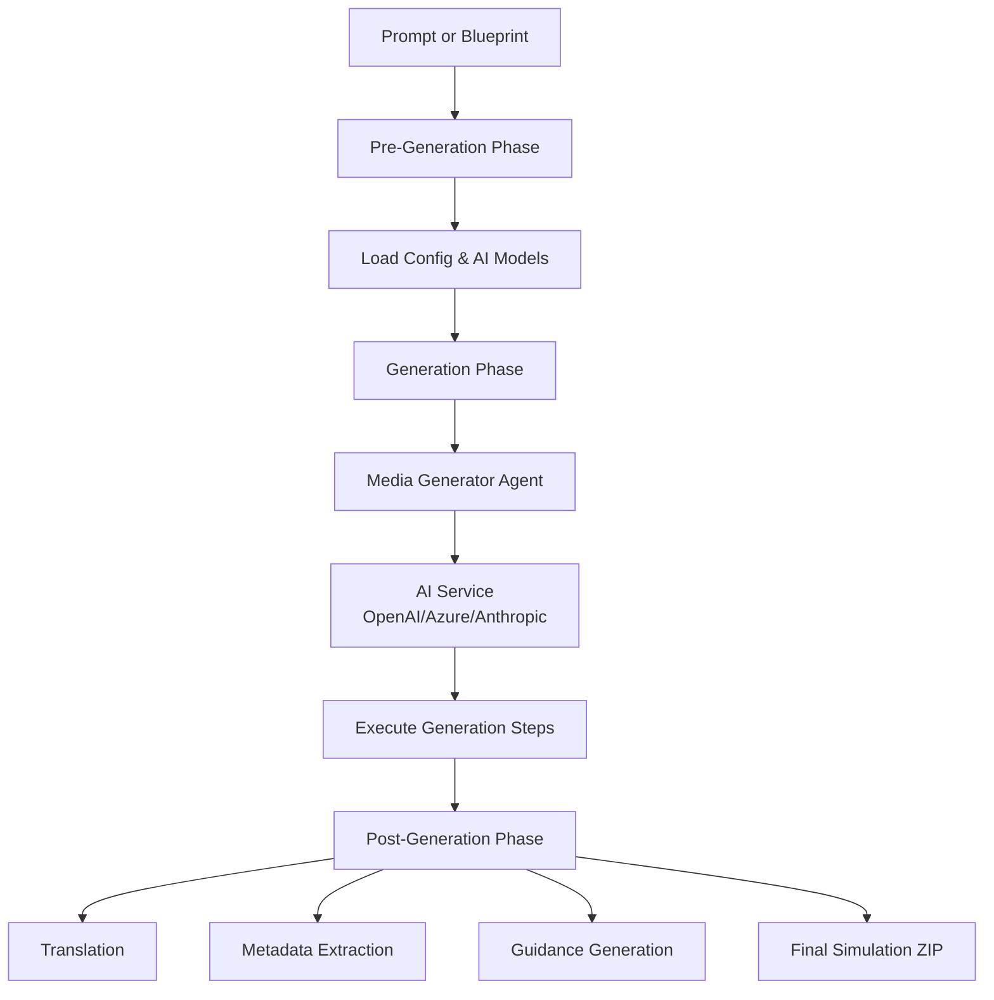

# Studio-Room Service

> ## ⚠️ Merged into `app` — not a standalone deployment
>
> Since **cms-in-app v8.0** (`app` **v1.360.1**) the `anthropos-studio-room` Python pipeline is **pulled
> into the `app` (backend) container image by CI** (`additional_repo`) and orchestrated from
> `app/internal/cms/studio/`, which spawns it as a subprocess on an Asynq task. It is **not** a service,
> **not** a container, and **not** in `repos.yml` — before the merge it rode inside the `cms` container at
> `cms/studio/`. Note the repo is named `anthropos-studio-room`, not `studio-room`.
> See [platform-migration-status.md](../architecture/platform-migration-status.md) for the authoritative
> per-service state.

## High-Level Summary (For PMs & Non-Engineers)

**Studio-Room** is an AI-powered content generation engine that transforms simulation blueprints into fully-realized interactive experiences. Think of it as the **manufacturing floor** where designs from Studio-Desk become actual products.

**What it does**:
- Takes a simulation blueprint (created in Studio-Desk)
- Uses advanced AI models (GPT, Claude) to generate realistic content
- Produces complete job simulations with dialogue, scenarios, and assessments
- Handles translation, metadata, and quality control automatically

It's completely automated - you provide a prompt or a blueprint, and Studio-Room orchestrates the entire generation pipeline.

Studio-Room does not run as its own deployment. Since **cms-in-app v8.0** it is embedded inside the **`app` (backend) container** — pulled into the image by CI (`additional_repo`, app v1.360.1) — and is triggered by an Asynq task rather than run directly by users; the Go side shells out to it as a subprocess when a generation job is enqueued. Before the merge it rode in the cms container at `cms/studio/`.

## Technical Deep Dive (For Engineers)

### Service Overview

| Property | Value |
|:---------|:------|
| **Service Type** | Custom Application (Tier 2 - Studio Services) |
| **Technology Stack** | Python 3.x, asyncio |
| **Deployment** | Embedded in the **`app` (backend)** container since cms-in-app — invoked synchronously as a Python subprocess (`python3 studio/gen.py`) by the **cms domain's** Asynq worker *inside `app`* on the `studio` queue (worker `Concurrency: 5` shared across all queues; the `studio` queue has asynq priority weight 3 vs the `ai_video` queue's 7 — scheduling priorities, not concurrency limits); not a standalone deployment |
| **AI Providers** | OpenAI, Azure OpenAI, Anthropic |
| **Repository** | `anthropos-studio-room`, pulled into the **`app`** image by CI (was cloned into the cms repo at `cms/studio/` before cms-in-app) |

### Architecture

Studio-Room is a **Python-based asynchronous generation pipeline** with a modular agent system:


```mermaid
graph TD
    Input[Prompt or Blueprint] --> PreGen[Pre-Generation Phase]
    PreGen --> LoadConfig[Load Config & AI Models]
    LoadConfig --> GenPhase[Generation Phase]
    GenPhase --> Agent[Media Generator Agent]
    Agent --> AI[AI Service<br/>OpenAI/Azure/Anthropic]
    AI --> Steps[Execute Generation Steps]
    Steps --> PostGen[Post-Generation Phase]
    PostGen --> Translation[Translation]
    PostGen --> Metadata[Metadata Extraction]
    PostGen --> Guidance[Guidance Generation]
    PostGen --> Output[Final Simulation ZIP]
```

### Project Structure

```
studio-room/
├── gen.py              # Main generation script
├── postgen.py          # Post-generation pipeline
├── console.py          # CLI output formatting
├── format.py           # File formatting utilities
├── errors.py           # Error types
├── cert.py             # Certificate / signing helpers
├── agents/             # Media generator agents
│   └── simulation/     # Simulation generator package
│       ├── prep.py
│       ├── story.py
│       ├── assets.py
│       ├── export.py
│       ├── guidelines.py
│       ├── model.py
│       ├── postgen/
│       └── validation/
├── services/           # Core services
│   ├── ai.py           # AI service abstraction
│   ├── taxonomy.py     # Skills taxonomy client
│   └── usage_trace.py  # AI usage / cost tracking
├── configs/            # Environment configs — `configs/{ENVIRONMENT}_config.ini`
│   ├── config_template.ini      # the template to copy for a new environment
│   ├── development_config.ini
│   └── production_config.ini    # (configs/local_* and configs/test_* are gitignored)
├── benchmark/          # Benchmark suites
├── knowledge/          # Knowledge / reference data
└── workspace/          # Generation workspace
    ├── attachments/    # Input/blueprint files
    ├── trace/          # Generation state files (worklog_path)
    ├── postgen/        # Post-processed output
    └── published/      # Final published files
```

### Generation Pipeline

#### Phase 1: Pre-Generation

1. **Configuration Loading**:
   - Read environment-specific config (`configs/{environment}_config.ini`)
   - Load AI model configurations (stable vs experimental branch)
   - Load the per-media request settings (`[SIMULATIONS]` etc.) and merge the CLI args over them
     (`setup_generation_request`, `gen.py:273-282`); in `--blueprint` mode the blueprint JSON is loaded
     from `workspace/attachments/` and merged over a whitelist of execution controls instead

2. **State Management**:
   - Check for existing generation state (resume support)
   - Initialize or restore generation context
   - Create workspace directories

3. **AI Setup**:
   - Initialize AI services (OpenAI, Azure, Anthropic)
   - Configure model parameters (temperature, max tokens, thinking mode)
   - Set up usage tracking

#### Phase 2: AI Generation

The generation is orchestrated by **media-specific generator agents** (e.g., `SimulationGenerator`). Each agent defines a sequence of **execution steps**:

```python
# Example step from agents/simulation/
@generation_step(
    phase="content",
    title="Generate Cast",
    brief="Creating realistic job conversations",
    exec_mode=GenMode.EXECUTION  # Selects the AI model for this step
)
async def generate_cast(engine, log, request):
    # Step implementation
    # - Uses AI service
    # - Updates request state
    # - Logs progress
    pass
```

The `@generation_step(...)` decorator attaches a `gen_instruction` metadata dict to the function. Steps may be sync or async — `gen.py` awaits the result if it is awaitable.

**Generation Modes** (`GenMode` enum):
- `GenMode.FAST`: Lightweight / low-latency steps
- `GenMode.STRICT`: Tightly-constrained, deterministic output
- `GenMode.EXECUTION`: Default mode (`DEFAULT = EXECUTION`)
- `GenMode.CREATIVE`: For content requiring creativity (dialogue, scenarios)
- `GenMode.REASONING`: For steps that benefit from deeper reasoning

**Features**:
- **Async execution**: Steps run asynchronously for performance
- **Retry mechanism**: Auto-retry failed steps (configurable `max_retries`)
- **State persistence**: Save progress after each step (resume on failure)
- **Usage tracking**: Monitor AI token usage and costs

#### Phase 3: Post-Generation

Post-generation is modularized with multiple targets:

```bash
python postgen.py --media simulation --simid <id> --target guidance,metadata,translation --branch stable
```

`--media`, `--simid`, and `--target` are all required for `postgen.py`.

**Post-Generation Targets**:

| Target | Purpose | Contributes |
|:-------|:--------|:------------|
| `guidance` | Generate the player-guidance layer | the guidance content of the exported bundle |
| `metadata` | Extract structured metadata | the metadata fields of the exported bundle |
| `translation` | Translate to multiple languages | `internal_localization.json` inside the bundle |
| `toolkit` | Build the simulation toolkit | the toolkit content of the exported bundle |

Each target mutates the shared in-memory content model rather than writing its own file — everything is
folded into the **one** exported ZIP (see [Output Structure](#output-structure) below). A `testing` phase
module also exists. ZIP packaging/export is **not** a selectable post-gen target — it is performed by the
exporter (the `export` step in the simulation agent).

All targets can run independently or in pipeline mode.

### Command-Line Interface

#### Main Generation

`gen.py` registers **exactly nine** arguments (`gen.py:484-492`) — the full, authoritative list:

```bash
python gen.py [OPTIONS]

Options:
  -i, --interactive         Enable interactive mode (default: off)
  -m, --media TYPE          Media class (default: simulation; article/role are secondary)
  -f, --force               Force regeneration from scratch (dest: forced)
  --simid ID                Simulation ID (auto-generated if not provided)
  --branch {stable,experimental}   Which AI-model set to use (default: stable)
  --prompt TEXT             Custom prompt text
  --annotations JSON        Custom annotations (default: "{}")
  --pipeline PIPELINE       Generation pipeline (default: linear)
  --blueprint FILE          JSON blueprint file in workspace/attachments/
                            (mutually exclusive with content params like --prompt/--annotations)
```

> **⚠️ There is no `-t` / `--template` flag — and a stray one is silently swallowed, not rejected.**
> `parse_argument` (`gen.py:18-28`) calls `parse_known_args` and folds every *unrecognised* `--key value`
> pair into the request dict. That is the deliberate mechanism behind pass-through content parameters like
> **`--evaluation_skills "a, b"`** (consumed downstream by prep) — but it also means `--template foo`
> parses cleanly, sets a `template` key **nothing in the codebase ever reads** (grep: zero consumers),
> and generates something unrelated to what you asked for. **Worse than a hard failure: the command
> succeeds.** The one place it *is* caught is `--blueprint` mode, where
> `validate_blueprint_exclusivity` (`gen.py:241-271`) rejects any non-whitelisted arg carrying a value —
> `--blueprint x.json --template foo` fails loudly with *"Cannot combine --blueprint with content
> parameters: --template"*. Everywhere else it is swallowed.
>
> `template` lives on only as a **legacy blueprint field**: `translate_legacy_blueprint`
> (`gen.py:205-238`) pops it from a loaded blueprint with a deprecation warning, and back-fills
> `max_tasks`/`duration` defaults for exactly three legacy names — `micro challenge`,
> `scenario challenge`, `collaborative challenge`. Anything else (including `customer_service`,
> `interview`, `default`) warns *"is ignored; asset type is now inferred from task interactions"* — asset
> type is derived from the task interactions, never from a template name.

#### Examples

The repo's own `CLAUDE.md:12-14` gives the real entry point:

```bash
python gen.py --media simulation --prompt "..." --evaluation_skills "skill1, skill2" --branch stable
```

**Generate a simulation from a prompt**:
```bash
python gen.py \
  --media simulation \
  --prompt "Create a software engineering interview" \
  --evaluation_skills "system design, debugging" \
  --branch stable
```

**Generate from a blueprint file** (in `workspace/attachments/`):
```bash
python gen.py --media simulation --blueprint my_blueprint.json --branch stable
```

**Force regeneration with experimental models**:
```bash
python gen.py --media simulation --simid <uuid> --branch experimental --force
```

### AI Service Configuration

AI models are configured per generation mode in `configs/{env}_config.ini`. Each model key follows the pattern `{MODE}_AI_{BRANCH}_MODEL = service, model, thinking`:

```ini
[DEFAULT]
max_tokens = 4000          # shipped value in all three tracked configs

[SERVICES]
# Format: {MODE}_AI_{BRANCH}_MODEL = service, model, thinking
FAST_AI_STABLE_MODEL = azure, gpt-5-mini, none
STRICT_AI_STABLE_MODEL = azure, gpt-5-mini, none
EXECUTION_AI_STABLE_MODEL = azure, gpt-5.4, none
CREATIVE_AI_STABLE_MODEL = azure, gpt-5.4, low
REASONING_AI_STABLE_MODEL = azure, gpt-5.4, medium
# …plus a matching *_AI_EXPERIMENTAL_MODEL row per mode (--branch experimental)

# API keys + endpoints (literal values, or override via matching env vars)
AZURE_API_KEY = <literal-key>
AZURE_ENDPOINT = <endpoint-url>
OPENAI_API_KEY = <literal-key>
ANTHROPIC_API_KEY = <literal-key>
```

API keys can be set EITHER as literal values in `configs/{env}_config.ini` under `[SERVICES]` (key names `AZURE_API_KEY` / `OPENAI_API_KEY` / `ANTHROPIC_API_KEY`, plus matching `*_ENDPOINT`), OR via the matching environment variables (`AZURE_API_KEY`, `OPENAI_API_KEY`, `ANTHROPIC_API_KEY`, `*_ENDPOINT`). When the env var is set, it overrides the INI value at load time (`gen.py` `load_services_settings`). `configparser` does **not** expand `${VAR}` from the OS environment, so the override is handled in code rather than via interpolation. Note `configs/local_*` and `configs/test_*` are gitignored — never commit real keys to tracked configs.

**Thinking Modes** (only for supported models):
- `none`
- `low`
- `medium`
- `high`

### Blueprints (not "templates")

There is **no template system** — no `--template` flag (see the CLI warning above), and no top-level
`templates/` directory. The reusable unit is a **blueprint**: a flat JSON file dropped in
`workspace/attachments/` and named with `--blueprint <file.json>`. It carries **all** content parameters,
which is why `validate_blueprint_exclusivity` (`gen.py:241-271`) refuses to combine it with any content
flag — only execution controls (`media`, `forced`, `interactive`, `branch`, `pipeline`, and the four
`*_path` overrides) may ride alongside.

**Blueprint structure** (real keys, from `tests/e2e/blueprints/technical.json`):
```json
{
  "media": "simulation",
  "duration": "45",
  "mode": "training",
  "category": "df6dc644-d4f4-4cf9-bf55-d279139f4776",
  "prompt": "A critical bug is crashing a key React page in production …",
  "language": "english",
  "branch-roleplay": "stable",
  "tags": "usr:marco-galletti, org:acme, tt:coding",
  "annotations": { "actors": [ { "name": "Player", "jobTitle": "Frontend Software Engineer" } ] },
  "evaluation_skills": "Defect Impact Analysis [K-DEFIMP-4AE2],Debugging [K-DEBUGG-BC02]",
  "skill": "Defect Impact Analysis [K-DEFIMP-4AE2],Debugging [K-DEBUGG-BC02]",
  "title": "Frontend Software Engineer: Critical React bugfix",
  "short_description": "Fix React page crash blocking checkout flow.",
  "salt": "0329",
  "simid": "9a054022-1476-476c-9642-70afe9c27c07"
}
```

Worked examples live in the repo: `tests/e2e/blueprints/` (b2b, business, technical, none_chat,
none_voice) and `knowledge/development/asset-examples/blueprints/` (one per legacy asset shape — code /
micro / scenario).

### State Management & Resume

Generation state is checkpointed after each step to the configured `worklog_path` (set to `workspace/trace/` in the shipped configs; the in-code fallback is a literal `worklog/` only if unset). State is written as two files per sim:

- `{simid}_pre_generation.json` — the original request
- `{simid}_task_state.json` — the public task state

plus a per-run `{simid}_usage.json` usage trace.

**Resume generation**:
```bash
# Re-run with the same --simid to resume from the last completed step
python gen.py --simid <uuid>

# Force restart from scratch
python gen.py --simid <uuid> --force
```

### Development Setup

#### Prerequisites
- Python 3.9+ (runtime image when embedded in the `app` container: `python:3.11-slim`; it was the cms container before cms-in-app)
- AI API keys (OpenAI, Anthropic, or Azure)

#### Installation

```bash
# studio-room's root IS app/studio/ — it holds gen.py, requirements.txt, agents/, services/.
# There is no studio/studio-room path. The Go side invokes `studio/gen.py` from the app repo
# root (app/internal/cms/studio/studioManager.go:119), against the managed venv at
# `studio/studio-venv` (studioManager.go:94-96).
cd app/studio
pip install -r requirements.txt
```

**Requirements** (unpinned in `requirements.txt`):
```
openai          # AI provider
anthropic       # AI provider
mistralai       # DECLARED BUT IMPORTED NOWHERE — see below
rich            # console output
pyyaml
requests        # taxonomy client
jinja2          # templating
pytest          # tests
pytest-asyncio  # tests
```
(`asyncio` is part of the standard library; no `aiohttp` dependency.)

> **⚠️ `mistralai` is a declared dependency with no code behind it** (measured M257x iter-86 @
> `anthropos-studio-room` `aeec036`). `grep -rni mistral` over the whole repo returns **exactly one
> hit — this `requirements.txt` line**. The provider registry at `services/ai.py:705-708` is
> `{'openai', 'azure', 'anthropic'}`, and `ai.py`'s imports are `openai` and `anthropic` only. **The
> Python pipeline has no Mistral path.** Mistral in this platform is **Go-side and OCR-only**
> (`app/internal/cms/studio/markdownManager.go` → `OCRProcess`). The line was previously annotated
> *"# AI provider"* here, which is how the Python-side Mistral claim propagated into
> `service_taxonomy.md` and `dependency_map.md`.

#### Configuration

1. **Set environment**:
```bash
export ENVIRONMENT=local  # or production
```

2. **Configure AI services** in `configs/local_config.ini` — copy `configs/config_template.ini` to create
   it (`configs/local_*` is gitignored; `ENVIRONMENT` defaults to `local`)

3. **Set API keys** (via environment or config):
```bash
export OPENAI_API_KEY=sk-xxxxx
export ANTHROPIC_API_KEY=sk-ant-xxxxx
```

#### Testing

```bash
# Smoke-test a generation from one of the checked-in blueprints
cp tests/e2e/blueprints/technical.json workspace/attachments/
python gen.py --media simulation --blueprint technical.json --branch stable

# Check console output for step-by-step progress
# Verify output in workspace/trace/, workspace/postgen/, workspace/published/
```

### Integration Points

Orchestration is performed by the **CMS Go code**, not by studio-room itself. studio-room makes no GraphQL or Directus calls. Its outbound calls are to the **AI providers** — `services/ai.py` instantiates OpenAI / AzureOpenAI / Anthropic clients (`:1-2, 383, 530, 664`) — plus the skills taxonomy service (`api.anthropos.work`) via `services/taxonomy.py`.

#### With the cms domain
The **cms domain inside `app`** (`app/internal/cms/studio/`) drives the full lifecycle — there has been no
standalone `cms` service since cms-in-app, and no `cms` compose service at all since platform `d11a403`:
1. Receives a GraphQL mutation requesting generation
2. Enqueues an Asynq task and fetches the input documents
3. Invokes `gen.py` as a subprocess (output written to `workspace/published/`)
4. Reads the resulting ZIP and imports it into Directus

#### With Studio-Desk
- **Input**: Blueprints created in Studio-Desk, passed in by CMS
- **Output**: Generated content imported into Directus by CMS
- **Workflow**: Desk designs → CMS enqueues → Room generates → CMS imports into Directus

### Output Structure

**Generated artifacts**. The layout is **flat — there is no per-`{simid}` output directory.** The four
`work_paths` come straight from the config's `attachments_path` / `worklog_path` / `postgen_path` /
`published_path` (`gen.py:450-456`; shipped values below), and the deliverable is a **zip in each of
`postgen/` and `published/`** (`agents/simulation/postgen/exporter.py:518-519`):

```
workspace/
├── attachments/                     # INPUT: blueprint JSON + source files
├── trace/                           # per-sim state (worklog_path)
│   ├── {simid}_pre_generation.json  # the original request
│   ├── {simid}_task_state.json      # the public task state (resume point)
│   └── {simid}_usage.json           # per-run AI usage/cost trace
├── postgen/
│   └── {simid}_simulation.zip       # post-processed bundle
└── published/
    └── {simid}_simulation.zip       # final package — what CMS reads and imports into Directus
```

`simulation.json` is real, but it lives **inside** the zip, not on disk beside it: the exporter unpacks the
postgen zip into a scratch `published/{simid}_simulation/` dir, writes `simulation.json` +
`internal_localization.json` into it (preserving any `collaborative_*` / `asset_*` JSON already in the
bundle), re-archives it, and then `rmtree`s the scratch dir (`exporter.py:513-550`). The post-gen targets
work the same way — guidance, metadata and translation mutate the in-memory content model and are folded
into that one bundle; **none of them drops its own file**. So there is no `dialogue.json`,
`scenarios.json`, `simulation_bundle.zip`, `guidance.md` or `translations/` directory anywhere on disk.
Note the zip is named for the content's `source_id` when it has one, falling back to the sim id.

### Monitoring & Debugging

**Usage Tracking**:
```python
from services.ai import usage

# Automatic tracking per step
usage.checkpoint()  # Save current usage
report = usage.get_report()  # Get usage statistics
```

**Console Output**:
```bash
# Formatted progress output with:
# - Current phase and step
# - AI model being used
# - Token usage and costs
# - Success/error status
```

**Error Handling**:
- Automatic retry on transient failures
- State persistence allows manual resume
- Detailed error logging to console

### Performance Optimization

**Async Execution**:
- Generation steps run asynchronously where possible
- Parallel API calls for independent tasks
- Efficient token usage via batching

**Caching**: there is **no template cache and no AI-response cache**. The only cache in the pipeline is a
per-run, in-memory taxonomy lookup memo (`agents/simulation/model.py:59,467-469` — skill-id →
`TaxonomyService.get_skill_by_id`), which avoids re-hitting the taxonomy API for a repeated skill within a
single generation. Re-running work is avoided by **resume**, not caching: the checkpointed
`{simid}_task_state.json` lets a re-run with the same `--simid` skip completed steps.

### Related Documentation
- [Service Taxonomy](../architecture/service_taxonomy.md) - Studio services overview
- [Studio-Desk](./studio-desk.md) - Design tool that creates blueprints
- [CMS](./cms.md) — the content domain (inside `app`) that orchestrates this pipeline
- [External Services](../architecture/external_services.md) - AI provider details
